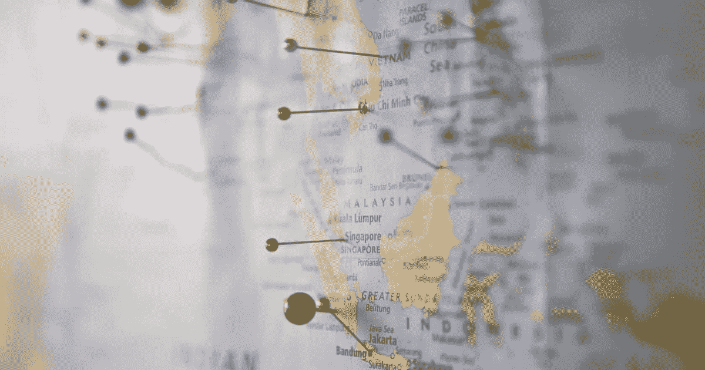

# 如何从第三方脚本中调用 Alpine.js 方法

> 原文：<https://javascript.plainenglish.io/calling-alpine-js-methods-from-third-party-scripts-70068815659f?source=collection_archive---------14----------------------->

## *我们如何让阿尔卑斯山的网页理解谷歌地图事件。*



Photo by [Z](https://unsplash.com/@dead____artist?utm_source=unsplash&utm_medium=referral&utm_content=creditCopyText) on [Unsplash](https://unsplash.com/@dead____artist?utm_source=unsplash&utm_medium=referral&utm_content=creditCopyText)

最近，当在 Alpine.js 支持的页面上实现谷歌地图时，我们遇到了一个小挑战。要点:

*   地图标记数据加载在 Alpine.js 存储中
*   谷歌地图不在 Alpine.js 的范围内，所以**在加载后不能直接调用 Alpine 方法**

我们不可能在谷歌地图上显示这些地图标记。

冲浪后，[这条线](https://github.com/alpinejs/alpine/discussions/517)给出了一个提示。让我们通过实际的代码来建立基础。

*谷歌地图相关代码:*

```
<div class="container">
 <div id="google-map" style="height: 600px;"></div>
</div>...<script async src="[https://maps.googleapis.com/maps/api/js?key=APIKEY&callback=renderMap](https://maps.googleapis.com/maps/api/js?key=APIKEY&callback=renderMap)"></script><script>
 var googleMapObject;function renderMap() {
  googleMapObject = new google.maps.Map(document.getElementById("google-map"), {
   // Map config
  });
 }
</script>
```

*这是 Alpine.js 的设置代码:*

```
<script defer src="[https://unpkg.com/alpinejs@3.x.x/dist/cdn.min.js](https://unpkg.com/alpinejs@3.x.x/dist/cdn.min.js)"></script><script>
 document.addEventListener('alpine:init', () => {
  Alpine.store('app', {
   mapMarkers: [
    // Pre-loaded markers data
   ]
  });
 });
</script>
```

# 解决办法

*事件*前来救援。您可以从谷歌地图对象中激发一个自定义的 Javascript 窗口事件，并让 Alpine 听它。让我们看看代码:

```
<script>
 function renderMap() {
  // initialize map codevar mapLoadedEvent = new Event('map-loaded');
  window.dispatchEvent(mapLoadedEvent);
 }
</script>
```

首先，一旦谷歌地图被加载，我们就启动名为`map-loaded`的定制 JS 事件。

```
<div class="container" x-data [@map](http://twitter.com/map)-loaded.window="$store.app.addAllMarkers()">
 <div id="google-map" style="height: 600px;"></div>
</div>
```

该 HTML 代码监听该事件，并调用 *addAllMarkers* Alpine 方法。这样，我们的谷歌地图就可以调用 Alpine.js 方法来显示地图标记。

最后，我们的高山方法可以完成其余的工作。

```
<script>
 var googleMapObject;document.addEventListener('alpine:init', () => {
  Alpine.store('app', {
   mapMarkers: [
    // Pre-loaded markers data
   ],addAllMarkers() {
    this.mapMarkers.forEach(function (mapMarker) {
     new google.maps.Marker({
      // Map marker config
     });
    });
   },
  });
 });
</script>
```

我们这样做是为了谷歌地图，但是您也可以使用自定义 Javascript 窗口事件对任何其他第三方 JS 库进行同样的操作。

> *需要注意的是* `*CustomEvent*` *不同于`*Event*` *的普通 JS。查看* [*本*](https://stackoverflow.com/a/40795249/3113599) *Stackoverflow 答案获取详细信息。**

干杯！

*原为发表于*[*https://blog . freshbits . in*](https://blog.freshbits.in/calling-alpinejs-methods-from-third-party-scripts)*。*

*更多内容请看*[***plain English . io***](https://plainenglish.io/)*。报名参加我们的* [***免费周报***](http://newsletter.plainenglish.io/) *。关注我们关于*[***Twitter***](https://twitter.com/inPlainEngHQ)*和*[***LinkedIn***](https://www.linkedin.com/company/inplainenglish/)*。加入我们的* [***社区不和谐***](https://discord.gg/GtDtUAvyhW) *。*