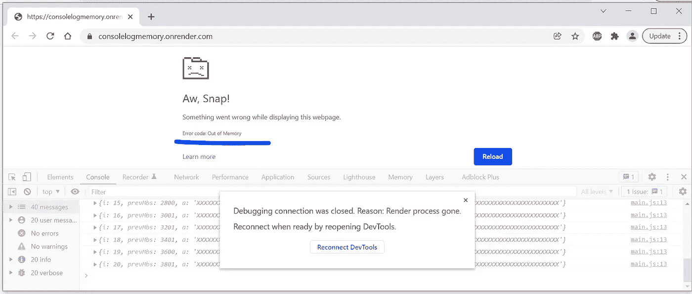
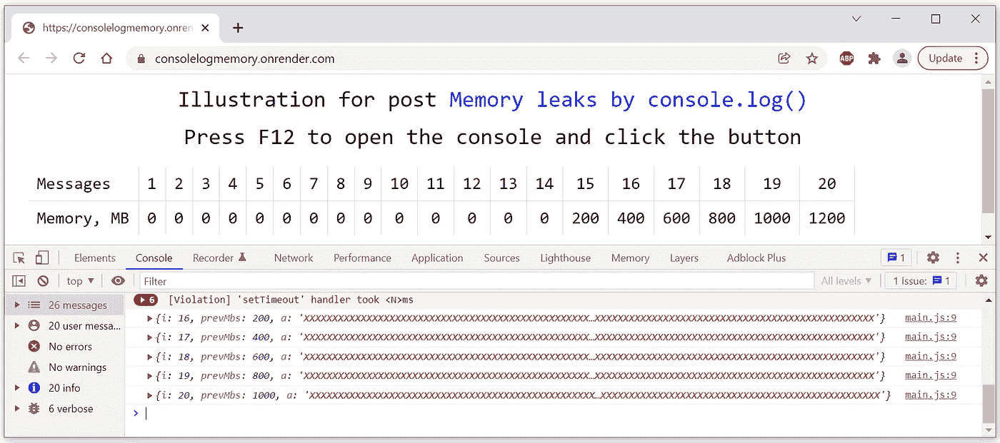

# console.log()会导致内存泄漏吗？如何用 console.log()让浏览器崩溃？

> 原文：<https://javascript.plainenglish.io/can-console-log-cause-memory-leaks-how-to-make-a-browser-crash-with-console-log-b94e4d248ed8?source=collection_archive---------2----------------------->

## 您真的必须在生产中禁用 console.log()吗？


有调试器。但是对于一些开发人员来说，在应用程序日志中更容易看到完整的图片。不知何故，人们认为服务器端保存日志是没问题的，但是在客户端看到详细的日志是不常见的。为什么？在许多抽象的原因中，有一种观点认为`console.log()`导致了内存泄漏。让我们试着让一个浏览器因为几次调用`console.log()`而耗尽内存。

## 由于 console.log()内存泄漏，浏览器可能会崩溃

当按下按钮时，我的示例脚本开始打印对象，每个对象包含一个 2 亿字符长的字符串。每个新创建的字符串会占用额外的 200 MB 内存。创建的字符串不被任何变量引用，它们只作为`console.log()`的参数存在:

```
const MB = 1_000_000;runBtn.onclick = () => {
  runBtn.remove();
  addString();
}async function addString(prevMbs=0,i=1) {
  **console.log({ i, prevMbs, a: 'X'.repeat(200 * MB) });**
  const memory = await performance.measureUserAgentSpecificMemory();
  const mbs = Math.floor(memory.bytes / MB);
  outputDiv.insertAdjacentHTML('beforeend',
    `<div class='data'><div>${i}</div><div>${mbs}</div></div>`);setTimeout(() => addString(mbs,++i), 1000);
}
```

[我使用精确内存 API 测量已用内存。](https://medium.com/geekculture/how-to-determine-exactly-and-quickly-the-total-memory-used-by-a-web-page-d54cc3d90b46)在不用于开发的浏览器中应该很慢。

`measureUserAgentSpecificMemory()`垃圾收集后立即测量内存。默认情况下，`measureUserAgentSpecificMemory()`只有在 20 秒内没有发生时才会触发垃圾收集。如果你用命令行标志启动 Chrome

```
--enable-blink-features="ForceEagerMeasureMemory"
```

`measureUserAgentSpecificMemory()`将强制垃圾收集并立即返回结果。

`runBtn`和`outputDiv`是按钮和 div 的 id。[通常不需要用](https://medium.com/codex/a-popular-dispensable-method-b04598b2e608) `[document.getElementById()](https://medium.com/codex/a-popular-dispensable-method-b04598b2e608)`污染代码。

如果你愿意，你可以在你的电脑上执行示例页面[https://consolelogmemory.onrender.com/](https://consolelogmemory.onrender.com/)，但是正如我上面解释的，每次内存测量可能需要 20 秒


点击按钮*运行*后，按钮消失，递归`addString()`启动。创建 14 个字符串后，打开控制台的页面如下所示:


在我的普通计算机上，当大约 4 GB 的内存被填满并且创建了第 21 个字符串时，浏览器崩溃并显示*内存不足*消息:



所以，很容易证明`console.log()`可能会导致内存泄漏。

## 通常，console.log()不会导致内存泄漏

如果我重新加载同一个页面【https://consolelogmemory.onrender.com/[但是不打开控制台，当我点击按钮后内存泄漏不会发生](https://consolelogmemory.onrender.com/)


如果我打开控制台，带有巨大字符串的未被任何变量引用的对象将无法作为垃圾被收集。在下面的截图中，在 14 个对象被打印到控制台后，我按下了 F12:



如果我关闭控制台，新对象停止在浏览器内存中累积，但是那些滞留在内存中的对象不能作为垃圾收集。在下面的截图中，我在打印了 10 个对象后按了 F12，然后在打印了第 18 个对象后关闭了控制台:


# 结论

`console.log()`导致内存泄漏，但仅在控制台打开时。通常用户不会打开控制台。因此，将任何巨大的对象打印到控制台是完全安全的。关闭的控制台不会阻止它们作为垃圾被收集。

源代码可以从 https://github.com/marianc000/consoleLogMemory[下载](https://github.com/marianc000/consoleLogMemory)

*更多内容看* [***说白了就是 io***](http://plainenglish.io/) *。报名参加我们的* [***免费周报***](http://newsletter.plainenglish.io/) *。在我们的* [***社区获得独家访问写作机会和建议***](https://discord.gg/GtDtUAvyhW) *。*