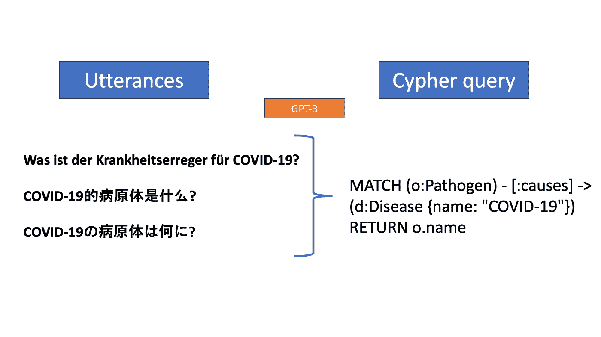
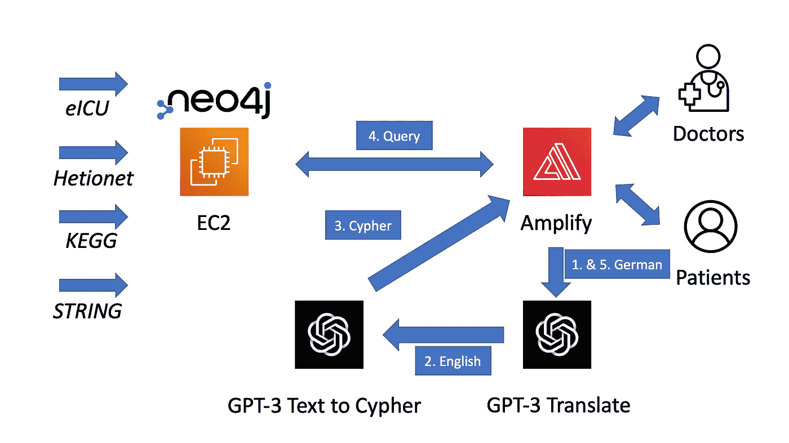
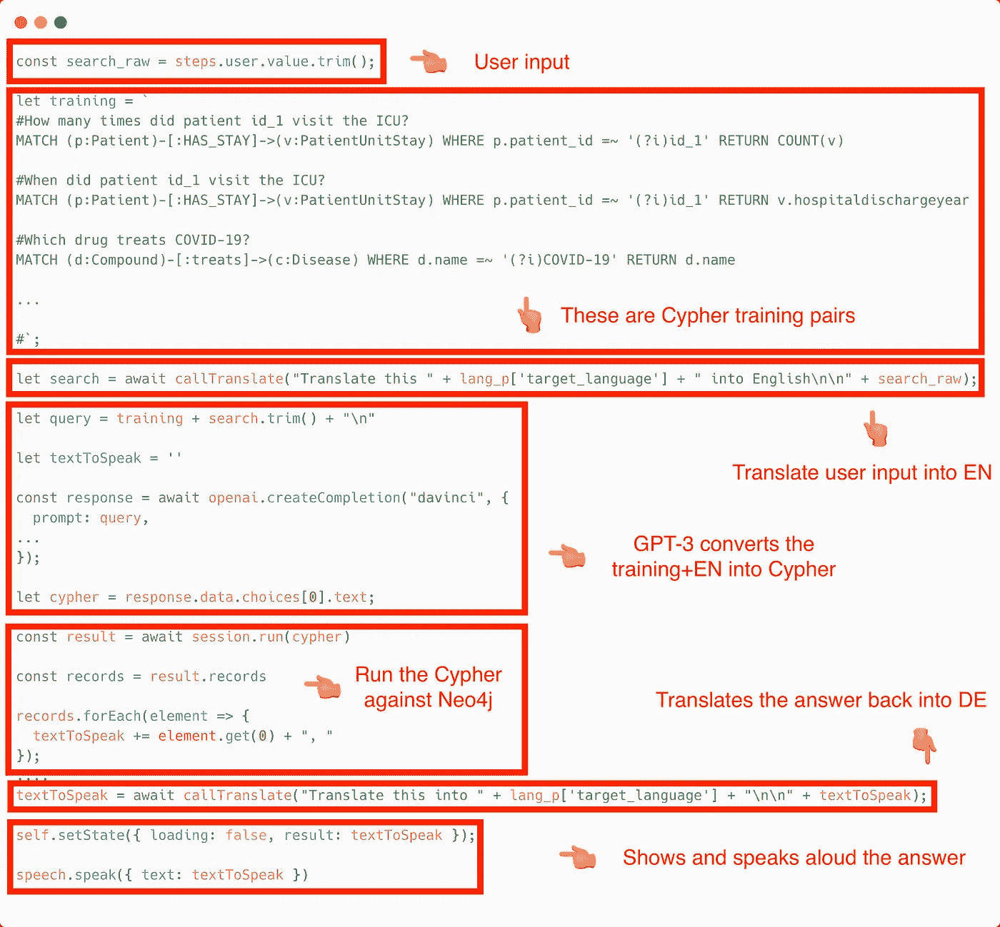
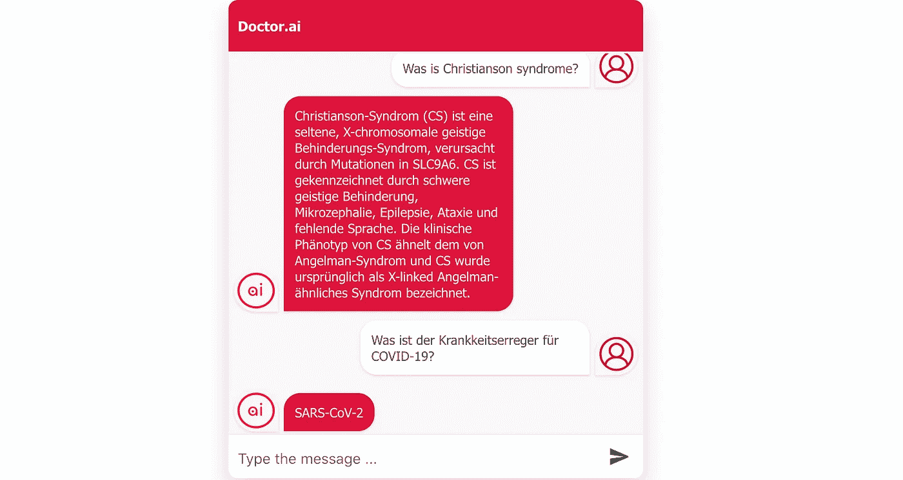
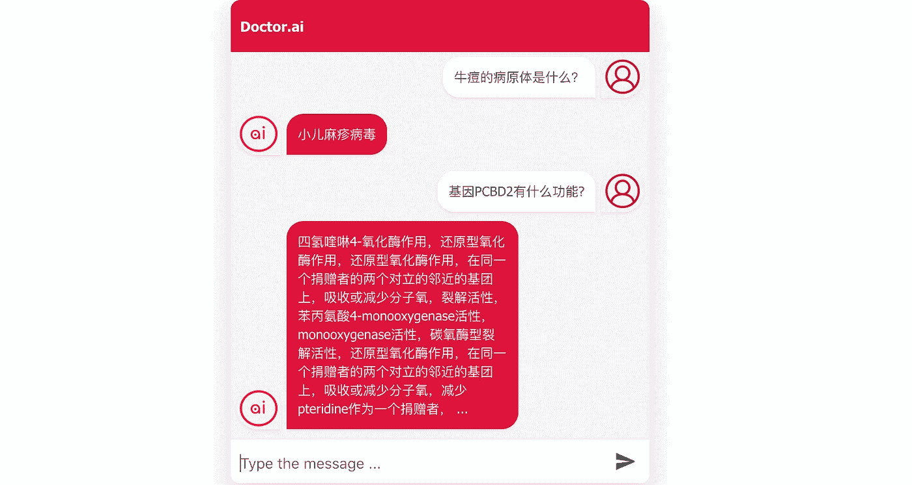
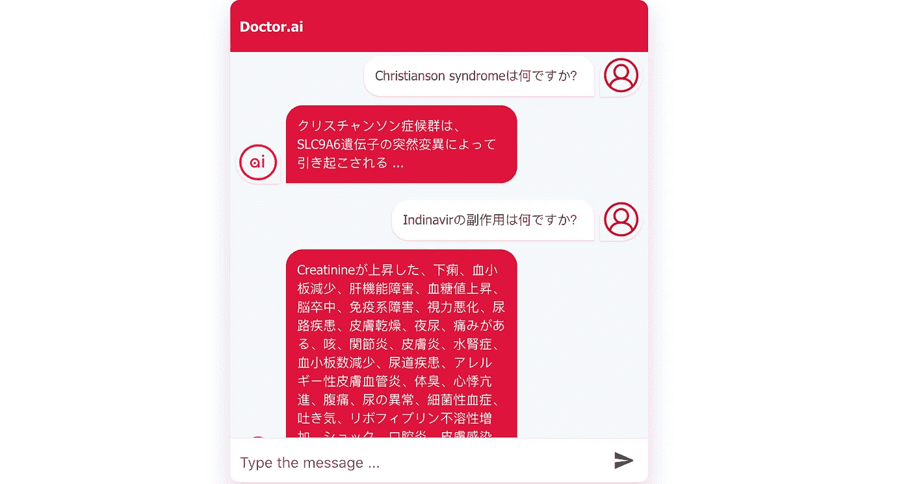
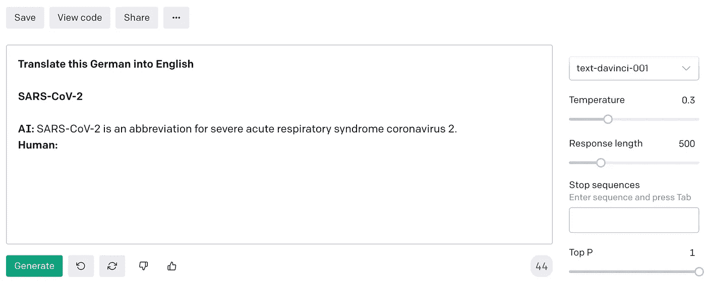

# Can Doctor.ai understand German, Chinese and Japanese? GPT-3 Answers: Ja, 一点点 and できます!

> 原文：<https://javascript.plainenglish.io/can-doctor-ai-understand-german-chinese-and-japanese-gpt-3-answers-ja-%E5%8F%AF%E4%BB%A5-and-%E3%81%84%E3%81%84%E3%82%88-b63b10d67bf4?source=collection_archive---------9----------------------->

## 用 GPT 3 制作多语言聊天机器人

Photo by [Jan Antonin Kolar](https://unsplash.com/@jankolar?utm_source=unsplash&utm_medium=referral&utm_content=creditCopyText) on [Unsplash](https://unsplash.com/s/photos/german?utm_source=unsplash&utm_medium=referral&utm_content=creditCopyText)

在我之前的文章[*【GPT-3 for doctor . ai*](https://medium.com/p/1396d1cd6fa5)中，我已经展示了 GPT-3 使我们能够仅使用英语来导航 Neo4j 知识图。在引擎盖下，它将英语问题转换为 Neo4j 的 Cypher 查询，我们使用这些查询从数据库中获得答案。但是 GPT 3 号能做的远不止这些。让我们试着把它变成德国人、中国人和日本人的聊天机器人！

Figure 1\. GPT-3 makes Doctor.ai multilingual. Image by the author.

您需要一个 GPT-3 帐户、Doctor.ai Neo4j 后端和 React 前端来进行此演示。你可以按照我上一篇文章中第 1 和第 2 节的说明来设置它们。在这里，我将演示德语的过程**，德语是歌德和瓦格纳的语言。可以通过在 Amplify 中设置`REACT_APP_LANGUAGE`环境变量来改变 Doctor.ai 的主要语言。我的代码目前支持德语、中文和日语，主要是因为我可以判断它们的输出质量。您可以在我的 Github 资源库中找到源代码，如下所示:**

 [## GitHub-dgg 32/doctor ai _ ui _ gp T3 _ german

### 这是 Doctor.ai 的 React 前端应用程序，我们自豪地提交给新加坡医疗保健 ai 数据大会和博览会…

github.com](https://github.com/dgg32/doctorai_ui_gpt3_german) 

OpenAI 提供 18 美元的初始积分。这对这个项目来说应该绰绰有余了。请继续关注您的“免费试用”进度条，因为大量令牌的生成可以快速增加您的使用量。

# 1.建筑

要从德语文本中生成密码查询，我可以想到两种可能的途径。第一个是给 GPT-3 足够多的“`German question:Cypher`”对来训练它的德语到 Cypher 的能力。在第二条路线中，我们使用 GPT-3 将德语问题翻译成英语，然后第二次使用 GPT-3 从这些英语翻译以及我们之前的“`English question:Cypher`”训练对(这些对在之前的文章中定义)中生成密码查询。

第一条路线有利有弊。一方面，德语到 Cypher 的直接转换不需要明确的英语翻译。[代码少意味着 bug 少](https://blog.codinghorror.com/the-best-code-is-no-code-at-all/)。但另一方面，这意味着我们需要为每一种新语言准备一个新的训练数据集。对于一些罕见的语言来说，这可能会成为一个问题。它减少了 JavaScript 应用程序中的代码，但需要更多的训练数据。开发人员必须有很高的语言技能来实现这一点。回报是聊天机器人更高的语言准确性。

我选择了第二条路线。是的，它有一个额外的翻译层。但是由于 GPT-3，增加的代码很少。这种方法也使得添加其他新语言变得容易。这个项目是建立在我们上一个项目的基础上的。它只是在前端增加了一个 GPT-3 翻译功能。然后，英文文本将用于生成一个密码查询，如我的[上一篇文章](https://medium.com/p/1396d1cd6fa5)的第 3 节所述。同一个 GPT-3 翻译函数最终将知识图中的答案翻译回目标语言(图 2)。

Figure 2\. The architecture of the multilingual Doctor.ai. Image by the author.

# 2.用 GPT-3 翻译

翻译功能的 JavaScript 代码可以直接从 GPT 3 游戏场获得。`instruction`变量带有类似“将德语翻译成英语”的值。它指示 GPT-3 将`raw_text`翻译成目标语言。我把它包装成一个 React 函数组件，以便代码重用。

Code 1\. The callTranslate function.

# 3.前端

前端代码与上一个项目非常相似。这里我需要调用上一节中的`callTranslate`函数来进行双语翻译。然后，我将英语问题添加到训练数据中，并发送给 GPT-3。结果应该是一个密码查询。该查询将用于从 Doctor.ai 的知识图中获取答案。最后，`callTranslate`将英语答案翻译回目标语言。

Figure 3\. Excerpts from Doctor.ai’s frontend. Image by the author.

# 4.考考德国博士. ai

按照我上一篇文章[中描述的步骤设置放大器前端。在 Amplify 设置期间，添加一个环境参数`REACT_APP_LANGUAGE`，其值为“德国”、“中国”或“日本”。](https://medium.com/p/1396d1cd6fa5)

现在我们来问艾医生一些德语问题。我问艾医生，什么是克里斯汀生综合征，什么是新冠肺炎的病原体。注意，我打错了一个字:“Krankkeitserreger”应该是“Krankheitserreger”。但是 GPT 3 号还是拿到了。艾博士从 KEGG 那里拿到了测试结果，并把它翻译成了德语。

Figure 4\. German conversation in Doctor.ai. Image by the author.

德国人的回答看起来还算可以，虽然不完美。例如，“综合征”的性别是中性的，翻译应该是“ist **ein** selten **es，** X 染色体 **es** …综合征”，而单词“phnotyp”是阳性的，句子应该是“**Der**klinische phnotyp”。但是让我们承认，即使对于有经验的人来说，德语的名词性也很难。幸运的是，名词性别的错误很少引起误解。

现在让我们说中文:

Figure 5\. Chinese conversation in Doctor.ai. Image by the author.

Here I asked what is the pathogen for cowpox and what is the function of a gene called PCBD2\. The answers from Doctor.ai/GPT-3 were not good. First, it asserted wrongfully that a nonexistent virus called 小儿麻疹病毒 (“infantile measles virus”) is the causal pathogen of cowpox. The correct answer should be 牛痘病毒 (Cowpox virus). It also erroneously translated 牛痘 (cowpox) into “smallpox” under the hood. The functional description of PCBD2 was hardly understandable.

最后问了 dr . ai 两个简单的日语问题。

Figure 6\. Japanese conversation in Doctor.ai. Image by the author.

I first asked what is Christianson syndrome (Christianson syndromeは何ですか？). The answer from GPT-3 is quite short. After some debugging, it is clear to me that the English answer was OK but then GPT-3 had difficulty in translating it back into Japanese. It hit the `max_tokens` limit prematurely for some unknown reason. The second question is about the side effects of Indinavir (Indinavirの副作用は何ですか？). The answer was a list of nouns and the translation was OK. But there is room for improvement. For example, creatinine could have been translated as クレアチニン.

# 结论

在我做实验的过程中，我突然想到，dr . ai 经常给我空洞的答案。因为 Doctor.ai 的知识图是围绕英语控制的词汇建立的，所以如果其他语言的医学术语翻译错误，并且与英语术语不匹配，Cypher 查询就会失败。这就是为什么我在上面的日文和中文对话中使用英文医学术语，以避免翻译错误。我还发现 GPT-3 有时会即兴创作。例如，当我指示它将“新型冠状病毒”或“克里斯蒂安森综合症”翻译成德语时，它给出了我数据库之外的疾病描述(图 7)。

Figure 7\. GPT-3 improvises. Image by the author.

GPT-3 使得实现新语言变得非常简单。但是要知道，它的语言技能因语言而异。德国的对话很好，而中国的对话是一场灾难。它可以容忍德语中的错别字。生成的德语文本中的名词性别问题只是一个次要问题。用户应该还是能看懂答案的。但是中国人的回答要么是事实不正确，要么是荒谬的。最后，正如你在日语对话中看到的，GPT 3 号有时表现得很奇怪。我们需要进一步测试 Doctor.ai，看看我们如何改进它。我也鼓励你使用我的代码，用其他语言做实验。请回来告诉我你的结果。

# 执照

[*Hetionet*](https://github.com/hetio/hetionet) *发布为* [*CC0*](https://creativecommons.org/publicdomain/zero/1.0/) *。* [*STRING 在“4.0 知识共享”许可下*](https://string-db.org/cgi/access) *免费提供，而* [*学术用户可以免费使用 KEGG 网站*](https://www.kegg.jp/kegg/legal.html) *。*

 [## 加入媒介与我的介绍链接-黄思兴

### 作为一个媒体会员，你的会员费的一部分会给你阅读的作家，你可以完全接触到每一个故事…

dgg32.medium.com](https://dgg32.medium.com/membership) 

*更多内容请看*[***plain English . io***](https://plainenglish.io/)*。报名参加我们的* [***免费周报***](http://newsletter.plainenglish.io/) *。关注我们关于*[***Twitter***](https://twitter.com/inPlainEngHQ)*和*[***LinkedIn***](https://www.linkedin.com/company/inplainenglish/)*。加入我们的* [***社区不和谐***](https://discord.gg/GtDtUAvyhW) *。*