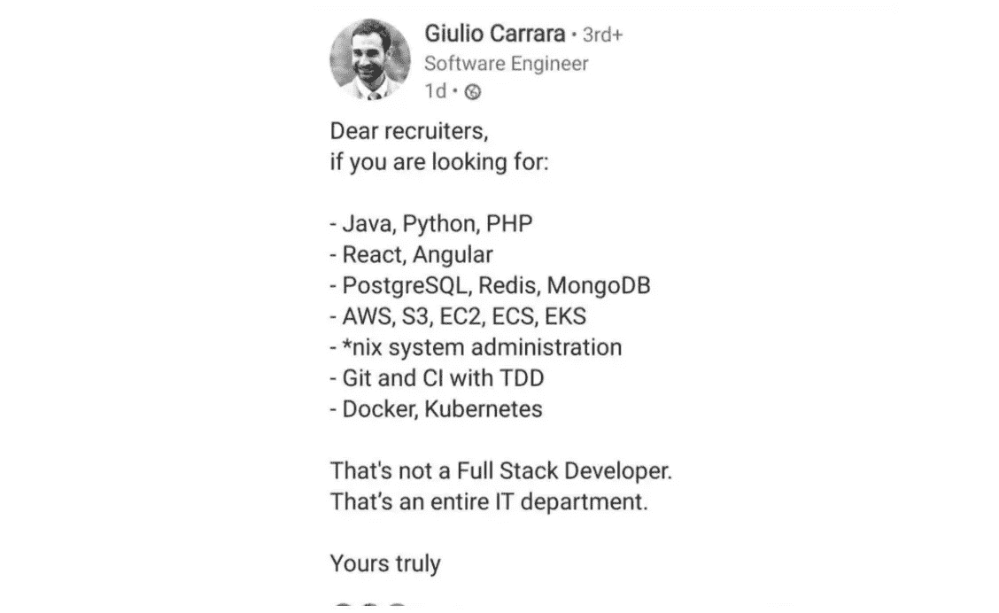

# 有人能真正成为资深全栈 Web 开发者吗？

> 原文：<https://javascript.plainenglish.io/can-someone-truly-become-a-senior-full-stack-web-developer-f5c605b2eb24?source=collection_archive---------10----------------------->

## **如何知道自己确实是资深全栈 web 开发者？**

Photo by [Nubelson Fernandes](https://unsplash.com/@nublson?utm_source=medium&utm_medium=referral) on [Unsplash](https://unsplash.com?utm_source=medium&utm_medium=referral)

最近，我写了一个关于几个高级开发人员的故事，他们在被我工作的一家公司聘用后不久就被解雇了。

 [## 软件工程师如何被炒，快。

### 我以自由职业者的身份为一家中型公司工作，我们必须通过雇佣新的软件工程师来扩大我们的团队。但他们都被解雇后不久…](/how-to-get-fired-as-a-software-engineer-fast-e99e6fe0d908) 

令人惊讶的是，许多人对这个故事做出了反应，并有不同的看法。一些人发现公司应该帮助他们的员工，而不是解雇他们。一些人批评“高级”开发人员的定义。还有人认为，“资深”只是开发商某一年龄的人才有资格。其他人只是同意你不应该对你的经历撒谎。

这就是为什么我认为我应该写另一个故事，分享我对这件事的看法。

我们中的许多人可能在几年前就开始学习 HTML、CSS、PHP，也许还有 JavaScript。这些编程语言和技术经过了多年的发展。几年前流行的东西今天可能已经过时了。这就是为什么在这个领域需要不断的学习和奉献。

假设你已经学习了编程的基础，有了扎实的 JavaScript 基础，并且这些年来获得了如此多的经验，以至于你认为自己有资格成为一名高级 web 开发人员。**你怎么知道你确实是一个人？**

是因为你做了 X 年的 JavaScript 开发者吗？例如，这是否使你成为一名高级 PHP 开发人员？

假设你一直与 React 合作，并认为自己是一名高级前端开发人员。这是让你成为 Angular 还是 Vue 的学长？

我希望你能看到困境。

对于“老年人”的含义，并没有一个标准的、公认的定义。在定义高级全栈 web 开发人员时，这甚至是一个更重要的问题。

# 等等，有些当事人好像知道定义…

## 你们

你是真正能够判断你是否真的有资格成为高年级全筹码玩家的人之一。这是基于你的感觉，也可能是基于你和其他开发者的比较。但这可能是不准确的判断，而且通常是主观的。

## 你的队友

根据你的态度、技能和知识，你的开发伙伴可能会根据他们自己的定义来评价你。这也可能是一个不准确的判断。

## 招聘公司

特定公司的招聘人员对高级全栈 web 开发人员有一个定义。他们是在高级职位的工作机会中创造和定义所需技能/技术的人。

但是，并不是每个公司都有确切的定义！

如果你在特定技术领域有 10 年以上的经验，一些公司会让你有资格成为高管(例如 Angular & Node.js)。其他人会根据你以前的经验给你这个头衔。其他人会根据你在公司的资历来评定这个头衔(内部晋升)。

可悲的是，由于缺乏合格的 web 开发人员，一些其他公司绝望地降低了他们的期望，并将头衔“交给”不合格的开发人员。我已经在多家公司看到了这种情况，这很伤人。但这是另一个故事的主题。

其他人，尤其是初创公司，有时会寻求过多的技能，因为他们真的没有钱支付每个领域的特定专家。

可以想象，这个定义无处不在，而且每个当事人的定义都不一样。

所有这些不同的定义都不一定是错误的。每一方都确信他们有正确的定义。

Joke aside.

# 那么，你真的能成为一名资深的全栈 Web 开发者吗？

就看你怎么定义“高级全栈”web 开发者了。在确定之前，您还需要定义“高级前端”和“高级后端”这两个术语。这完全是视角的问题。

我认为无论是前端开发还是后端开发，真正成为一名资深者是可能的，但很难，也很少见(基于我的定义)。

你可以认为自己是一个全栈开发人员，因为你可以从前端到后端高效地构建和部署完整的应用程序，而且你一直在这么做。但这是否意味着你在这两方面都是高年级学生？我不这么认为。我肯定你更倾向于前端或后端，而且你在这两方面都不太熟练。或者也许你是；我有什么资格评判？

我可以肯定的一点是，在这个行业，你永远不会停止学习。如果你认为你什么都做了，那你就大错特错了。

如果你足够幸运，即使你还不具备所需的技能和/或态度，一些公司也会聘用你为高管。但是如果你认为你有，确保你继续**尽可能多地学习**，**按时交付**，**做出积极的改变**。

> ⚠️成为高级软件工程师并不意味着你已经登上了顶峰。

有好的和坏的“高级”开发人员，明智地选择你想雇佣的和/或你想成为的。

我很想听听你对此的看法。你同意吗？或者你有不同的看法？在评论中分享你的想法/经历吧！

 [## 我们选择 React & TypeScript 不是因为它们简单，而是因为它们很难。

### 打破 React + TypeScript“感知”的复杂性对于那些怀疑或犹豫使用…

medium.com](https://medium.com/next-generation-web/we-choose-react-typescript-not-because-theyre-easy-but-because-they-re-hard-d198a04b2bc6)  [## 软件工程师如何被炒，快。

### 我以自由职业者的身份为一家中型公司工作，我们必须通过雇佣新的软件工程师来扩大我们的团队。但是…

javascript.plainenglish.io](/how-to-get-fired-as-a-software-engineer-fast-e99e6fe0d908) 

*更多内容请看*[***plain English . io***](https://plainenglish.io/)*。报名参加我们的* [***免费周报***](http://newsletter.plainenglish.io/) *。关注我们关于*[***Twitter***](https://twitter.com/inPlainEngHQ)**和*[***LinkedIn***](https://www.linkedin.com/company/inplainenglish/)*。查看我们的* [***社区不和谐***](https://discord.gg/GtDtUAvyhW) *加入我们的* [***人才集体***](https://inplainenglish.pallet.com/talent/welcome) *。**