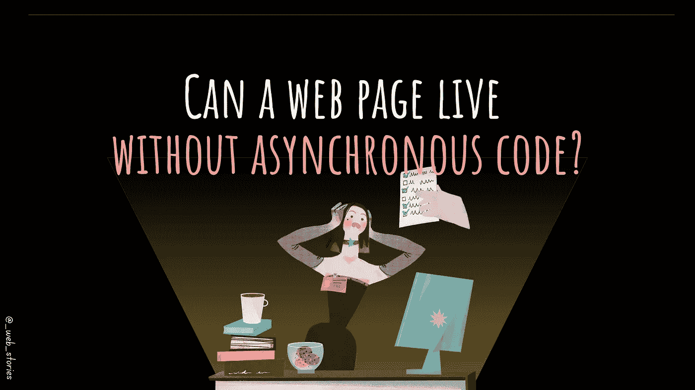
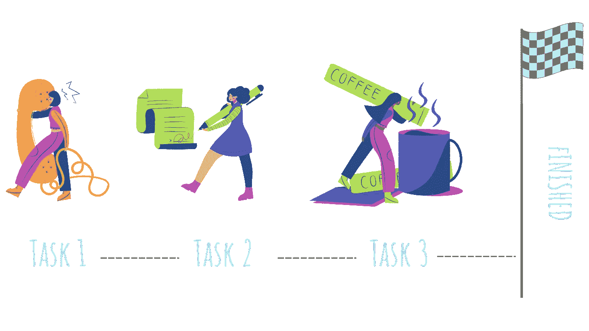
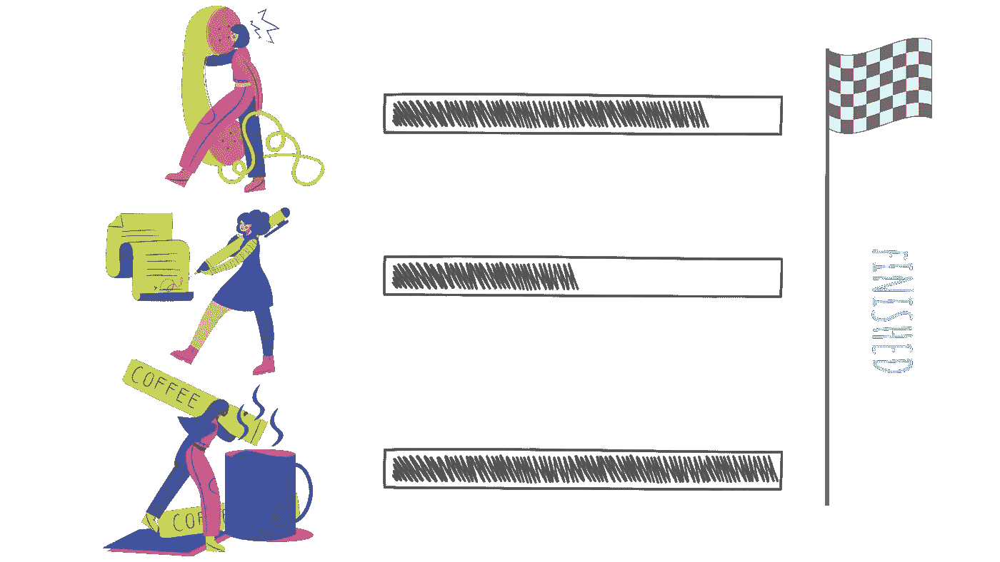

# 没有异步代码，Web 还能生存吗？

> 原文：<https://javascript.plainenglish.io/can-the-web-live-without-asynchronous-code-7f61fe2e862e?source=collection_archive---------15----------------------->

## JavaScript 的真相！

By FAM

## 你好。👋

新篇章新台阶 [***2022 网络计划***](https://medium.com/geekculture/2022-web-program-is-launched-f38a3280af1a?source=your_stories_page----------------------------------------) 。我对这一章非常兴奋，因为 JavaScript 真的很有趣。您可以操作页面并使其具有交互性。

它让网页活了起来。

现在，在学习 JS 之前，你绝对需要学习什么是异步代码。这真的是 web 开发中的基础知识。

## 同步与异步

同步可以翻译成“*”、“ ***【此刻】*** ”、“ ***【逐个任务】*** ”。*

> *Synchronos 任务一个接一个完成。*

**

*By FAM*

## *然而*

*异步代码可能会持续很长时间。你不要等到一项任务完成后再继续下一项。*

> *异步任务是独立完成的。*

**

*By FAM*

# *异步代码在每个网页中都非常重要！*

*想知道为什么吗？嗯，这确实令人困惑:为什么要并行启动事物并继续下去？一个任务接一个任务地做事更简单(同步代码)。使异步成为网页中必须的东西是 ***用户体验*** 。*

*同步意味着一件事——当你点击一个按钮时，在按钮任务被处理和完成之前，你不能做任何其他事情。整个程序处于冻结模式，完全专注于该任务。你能想象在看 YouTube 视频的时候什么都不能做直到做完吗？那会让你的经历很糟糕。*

> *一个网页离不开异步代码。*

*我选择用异步代码主题来打开 JS 章节，因为许多人认为 JavaScript 是使 web 页面具有交互性所需要的全部。根本不是真的。*

*使网页具有交互性的是异步代码。为了能够让你的代码异步，你需要两件事:*

> *事件循环+ JavaScript(单线程)=多线程错觉*

*单线程:指一只手在某一时刻使用/做一件事。是啊！JavaScript 不能同时做多件事！*

## *想深入了解吗？*

* [## JavaScript 中什么是事件循环？

### JavaScript 多线程背后的秘密。

javascript.plainenglish.io](/what-is-event-loop-in-javascript-917ca464808e) 

代码将在下一篇文章中介绍。您需要首先理解同步和异步概念之间的区别，以便能够对其进行编码。* 

*今天到此为止，再见！🙋*

*如果您有任何问题或反馈，请点击评论或通过 LinkedIn 联系我— **我洗耳恭听！***

*[**想请我喝杯咖啡吗？☕️**](https://www.buymeacoffee.com/fatimaamzil)*

> *让我们为 2022 年打造一个更好的‘我们’！*

## *了解有关 2022 年网络快车计划的更多信息:*

*我- [网络常识](https://medium.com/geekculture/2022-web-program-chapter-n-1-is-done-499fb0707220?source=your_stories_page----------------------------------------)*

*[II-网页框架:HTML](https://famzil.medium.com/your-html-essentials-69d9b2349355?source=your_stories_page----------------------------------------)*

*[III-网页样式:CSS](https://medium.com/geekculture/recap-of-the-css-chapter-ae388d51e564?source=your_stories_page----------------------------------------)*

## *IV- Web 交互:JavaScript*

> ***异步代码***

*   *这*
*   *变量*
*   *范围和吊装*
*   *经营者*
*   *关闭*
*   *…*

* [## 2022 网络计划启动！

### 改变来自心态和习惯

medium.com](https://medium.com/geekculture/2022-web-program-is-launched-f38a3280af1a) 

与想成为 web 开发人员的人分享该程序！这将有助于保持进步，并在旅途中互相帮助。

> 如果你喜欢我的文章， [**订阅**](https://famzil.medium.com/subscribe) 获取我的最新。如果你自己喜欢体验媒介，可以考虑通过[**注册**](https://famzil.medium.com/membership) 会员来支持我和其他成千上万的作家。它每个月只需要 5 美元，它支持我们，作家，你也有机会用你的作品赚钱。当然，你可以随时取消会员资格。通过注册[这个链接](https://famzil.medium.com/membership)，你将直接用你的一部分费用来支持我，不会花你更多的钱。如果你这样做了，万分感谢！

让我们在 [**上**取得联系****](https://medium.com/@famzil/)**[**Linkedin**](https://www.linkedin.com/in/fatima-amzil-9031ba95/)**[**脸书**](https://www.facebook.com/The-Front-End-World)**[**insta gram**](https://www.instagram.com/the_frontend_world/)**[**YouTube**](https://www.youtube.com/channel/UCaxr-f9r6P1u7Y7SKFHi12g)**或**********

****** [## 通过我的推荐链接——FAM 加入 Medium

### 作为一个媒体会员，你的会员费的一部分会给你阅读的作家，你可以完全接触到每一个故事…

famzil.medium.com](https://famzil.medium.com/membership) 

*更多内容看* [***说白了就是***](https://plainenglish.io/) *。报名参加我们的* [***免费周报***](http://newsletter.plainenglish.io/) *。关注我们关于*[***Twitter***](https://twitter.com/inPlainEngHQ)*和*[***LinkedIn***](https://www.linkedin.com/company/inplainenglish/)*。加入我们的* [***社区不和谐***](https://discord.gg/GtDtUAvyhW) *。********