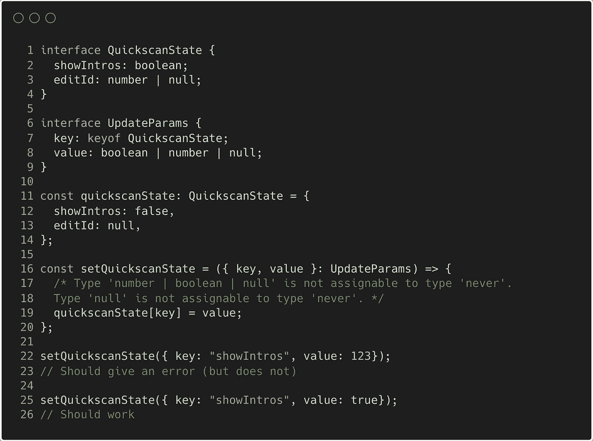
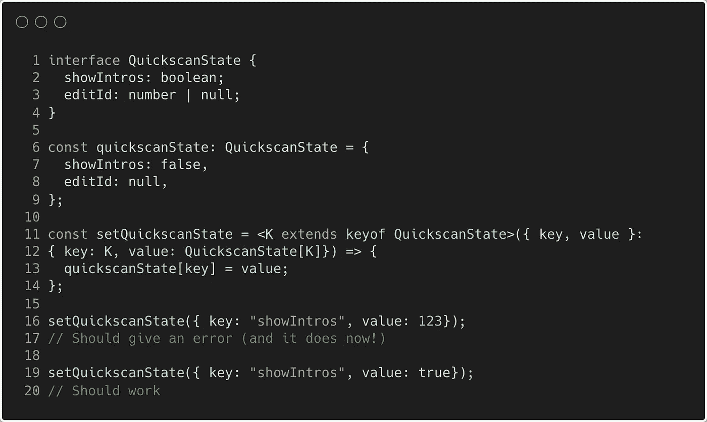
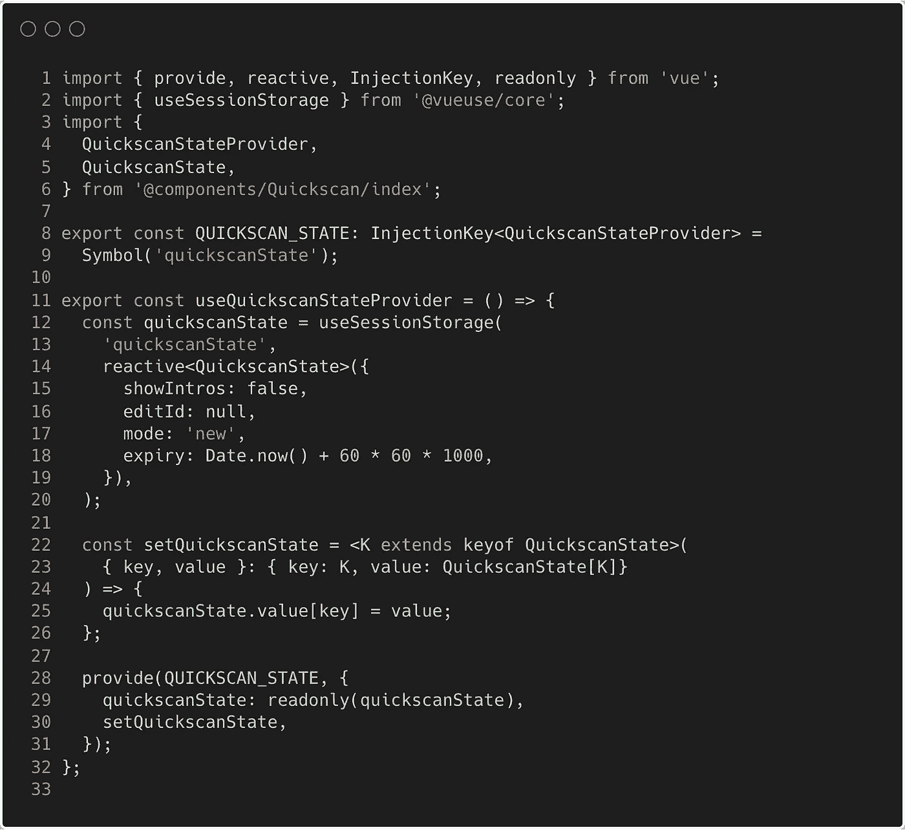
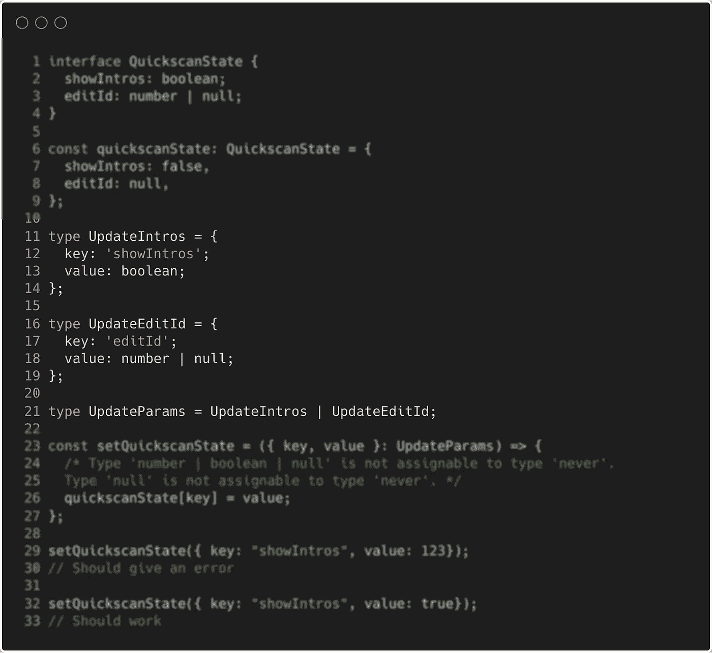

# 你能解决这个现实生活中的打字难题吗？

> 原文：<https://javascript.plainenglish.io/can-you-solve-this-real-life-typescript-challenge-41246effdb20?source=collection_archive---------10----------------------->

## 可能正是你喜欢的类型。

让我先说我喜欢 TypeScript，它帮助我捕捉错误并使代码更可预测。也就是说，正确地输入代码可能是一个挑战。学习和集成 TypeScript 就像坐过山车一样。我可以肯定地说，这就是我的情况。

如果你想尝试解决这个问题而不做进一步解释，你可以查看这个[打字稿游戏链接](https://www.typescriptlang.org/play?#code/JYOwLgpgTgZghgYwgAgIoFdgINYGcFwgDKYckyA3gFDLK4AWA9gO4CS4UjuAXMgEaNGAGwiEA3DWQQAJsDCtpvEOgC2faMgA+yZUKESAvlSqhIsRCgCqAB2lkIABThQ4K3JUnYIAT15fvjDBomDj4hCT2ErQAbnBC6BC8AsKiIFo6qupQ6br6VEZUCIwguGDIAI4heATEpJC8GFjV4XUoALwetAws7GCcPMjwQrgQADSSMnIKSuh64wYShcWldBBgjaE1EeQdABQUyP6jyLHxKAa8NnaQTi5uAJTIbQB8ncgA9ABUyAAq3tYoADkyjUGm0yREhBysyEgOQwHcIEYZTguFwwAA5iA4HwRMgwIx8f8gSAINFoICAHSSP4A5DAmFwhE6ZHIVHorE4vEEol04FkimU5Cfd6SSpNMK1ewAbX8AF0nic4glDIsRusqpLthB9ocfLwAETdNgcLgG46nBK8ACMACYAMwGe4Sd7vZBEJizaTIDHAclstLQThQYzqjbNKWQXX+Q3G3r9c1Ks68PoJJ0ut0exhe5DMRhQbBAA)。

**背景信息**
我正在创建一个' *Quickscan* '，这只是一个有很多功能的表单。为了跟踪全局 Quickscan 设置，我创建了一个带有一段只读状态的提供者。为了更新状态对象，我们创建了一个简单的函数。孤立地看(并剥离)，它看起来像这样:

**问题
为什么？因为该值可以是一个'*布尔值、数字或空值*'(第 8 行)，我们给它分配一个数字。这也解释了第 19 行的问题(参见第 17 行注释中的 TS 错误)。当更新状态对象类型时，脚本不知道键/值组合是否与 *QuickscanState* 接口匹配。**

我们希望 TypeScript 理解的是，当键等于“showIntros”时，值类型是 boolean。当键等于“editId”时，值类型为数字或 null。或者，更具体地说，当我们更新对象时，我们想知道基于键的值的类型。

在我们深入研究解决方案之前，您可以尝试解决这个 [TypeScript Playground 链接](https://www.typescriptlang.org/play?#code/JYOwLgpgTgZghgYwgAgIoFdgINYGcFwgDKYckyA3gFDLK4AWA9gO4CS4UjuAXMgEaNGAGwiEA3DWQQAJsDCtpvEOgC2faMgA+yZUKESAvlSqhIsRCgCqAB2lkIABThQ4K3JUnYIAT15fvjDBomDj4hCT2ErQAbnBC6BC8AsKiIFo6qupQ6br6VEZUCIwguGDIAI4heATEpJC8GFjV4XUoALwetAws7GCcPMjwQrgQADSSMnIKSuh64wYShcWldBBgjaE1EeQdABQUyP6jyLHxKAa8NnaQTi5uAJTIbQB8ncgA9ABUyAAq3tYoADkyjUGm0yREhBysyEgOQwHcIEYZTguFwwAA5iA4HwRMgwIx8f8gSAINFoICAHSSP4A5DAmFwhE6ZHIVHorE4vEEol04FkimU5Cfd6SSpNMK1ewAbX8AF0nic4glDIsRusqpLthB9ocfLwAETdNgcLgG46nBK8ACMACYAMwGe4Sd7vZBEJizaTIDHAclstLQThQYzqjbNKWQXX+Q3G3r9c1Ks68PoJJ0ut0exhe5DMRhQbBAA)中的问题。

.

.

提示:胜利的泛型！

.

.

.

**解决方案**

这解决了我们所有的问题。在第 11 行，我们定义了一个泛型' *K* ，它扩展了 QuickscanState 的*键。在这种情况下， *K* 要么是‘show intros’要么是‘EditId’。然后我们为函数参数定义类型，键就是简单的 *K* 并且值是我们的 *QuickscanState* *接口*中的任何值。简单而有效，经得起未来考验。*

如果你还想继续玩下去:
> [打印游戏链接到问题](https://www.typescriptlang.org/play?#code/JYOwLgpgTgZghgYwgAgIoFdgINYGcFwgDKYckyA3gFDLK4AWA9gO4CS4UjuAXMgEaNGAGwiEA3DWQQAJsDCtpvEOgC2faMgA+yZUKESAvlSqhIsRCgCqAB2lkIABThQ4K3JUnYIAT15fvjDBomDj4hCT2ErQAbnBC6BC8AsKiIFo6qupQ6br6VEZUCIwguGDIAI4heATEpJC8GFjV4XUoALwetAws7GCcPMjwQrgQADSSMnIKSuh64wYShcWldBBgjaE1EeQdABQUyP6jyLHxKAa8NnaQTi5uAJTIbQB8ncgA9ABUyAAq3tYoADkyjUGm0yREhBysyEgOQwHcIEYZTguFwwAA5iA4HwRMgwIx8f8gSAINFoICAHSSP4A5DAmFwhE6ZHIVHorE4vEEol04FkimU5Cfd6SSpNMK1ewAbX8AF0nic4glDIsRusqpLthB9ocfLwAETdNgcLgG46nBK8ACMACYAMwGe4Sd7vZBEJizaTIDHAclstLQThQYzqjbNKWQXX+Q3G3r9c1Ks68PoJJ0ut0exhe5DMRhQbBAA)
> [打印游戏链接到解决方案](https://www.typescriptlang.org/play?#code/JYOwLgpgTgZghgYwgAgIoFdgINYGcFwgDKYckyA3gFDLK4AWA9gO4CS4UjuAXMgEaNGAGwiEA3DWQQAJsDCtpvEOgC2faMgA+yZUKESAvlSoJGIXGGQBHTDnyESZCLwxY8BYqXIBeSpIYs7GCcPMjwQrgQADSSMnIKSuh6MQYSJmYWdBBgrnYejj7IADwA0lIAHpAg0rjI2BAAnowwaLbuDl4QAHwAFBR1jVHIAG5wQugoBrz99Q28JUOj486tbvaeTgDaJQC6BgCUyN5dfrQ2a-mdm7M7RyNjE4ZpkTlt6wUQfQNzyABEAWwOFxfosHisAIwAJgAzAcJAB6eHIIhMJLSZAAc2AwxQhCkUE4UGML1y7Q2kC+s14-yYgOCwNBy14wQmcKoiORqKE6OYjCg2CAA)

**红利 1:vue . js 中的真实实现** 万一你对项目的真实实现很好奇，就是这个:

**好处 2:初始解决方案思路** 当我遇到这个问题时，我的第一个想法是创建两个案例，这样 TypeScript 可以强制其中一个，就像这样:

这确实捕获了第 29 行的错误，但没有修复第 26 行的 TypeScript 错误，因为被设置的值仍然可以是“boolean”、“number”或“null”。这是因为 TypeScript 合并了这两种类型。这种解决方案也不是面向未来的，当我们向对象添加属性时，我们还必须为它创建一个类型。这让我觉得解决方案应该更通用，这让我想到了实际的通用解决方案。

我很想看看你是否提出了不同的解决方案！我希望你能在这个问题上容忍我，如果你想看到更多现实生活中的问题，请告诉我。感谢您的阅读，祝您愉快:)

*更多内容请看*[***plain English . io***](https://plainenglish.io/)*。报名参加我们的* [***免费周报***](http://newsletter.plainenglish.io/) *。关注我们关于*[***Twitter***](https://twitter.com/inPlainEngHQ)*和*[***LinkedIn***](https://www.linkedin.com/company/inplainenglish/)*。加入我们的* [***社区不和谐***](https://discord.gg/GtDtUAvyhW) *。*