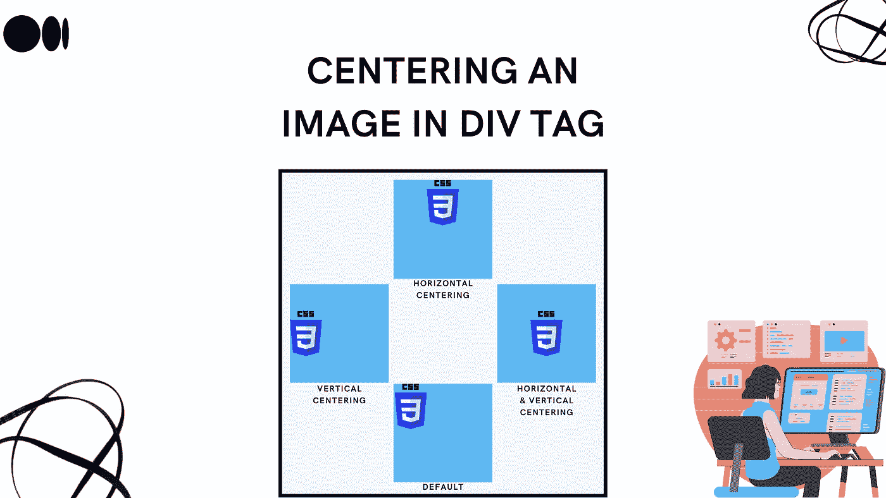
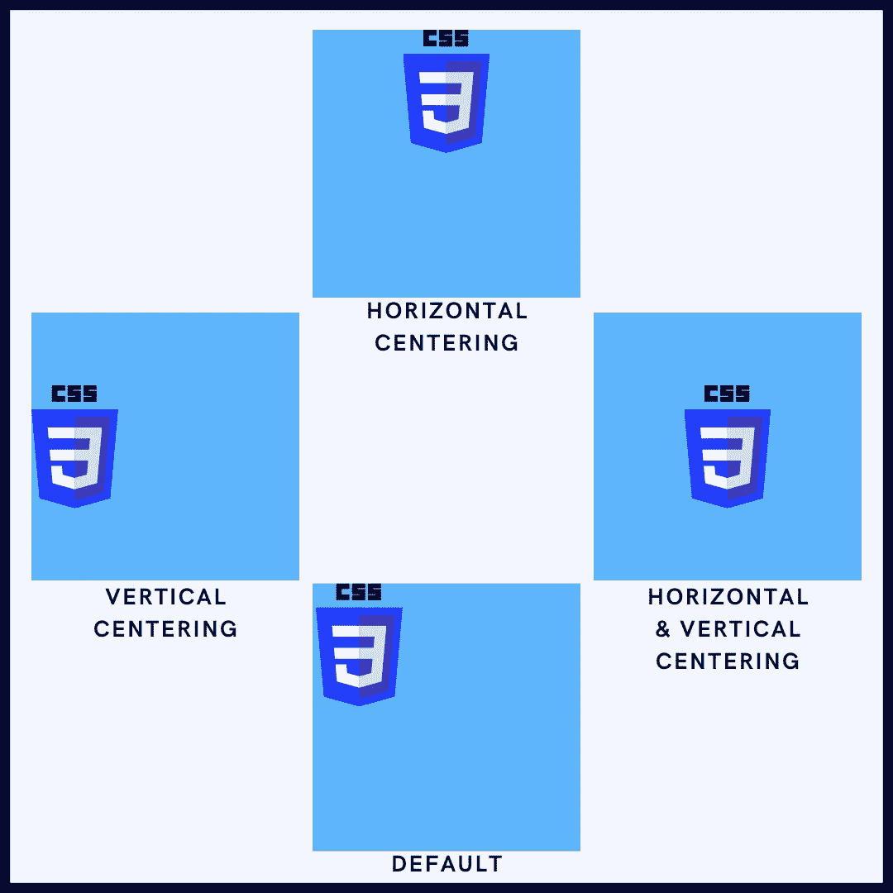
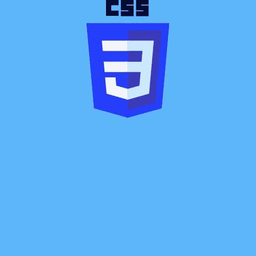
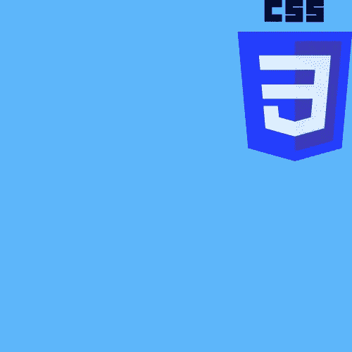
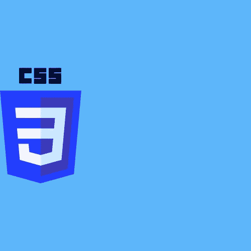

# Div 组件中的中心元素

> 原文：<https://javascript.plainenglish.io/center-element-in-a-div-component-5cc90931f47c?source=collection_archive---------11----------------------->



将 div 容器中的元素居中有时会变得很棘手。当你做一个网页的前端时，知道到底什么是可行的，而不是每次都进行实验，这是非常重要的。

# 如何使用 CSS 居中 div？

现在，将元素居中不仅仅意味着将 div 组件居中。通过定心，我将专注于

1.  水平居中
2.  垂直居中
3.  水平和垂直居中(组件的中心)



默认情况下，网页内容从屏幕的左上角开始，从左向右移动。

让我们从在 div 组件中水平居中放置图像开始。之后，我们将垂直居中图像，然后一起居中图像。

# 将 div 中的图像水平居中



## 使用文本对齐将 Div 中的图像水平居中

假设您有一个 div，您可以按以下方式在其中插入图片:

```
<div class="container">
    
</div>
```

现在，我将应用 CSS 样式，使图像变得可见。您可以看到，现在图像处于默认位置。

```
.container {
    width: 200px;
    height: 200px;
    background-color: #0a0a23;
}
.container img {
    width: 100px;
}
```

我们通常使用文本对齐方法来居中文本。但是，我们也可以在容器内的图像上使用它。

```
.container {
    width: 200px;
    height: 200px;
    background-color: #0a0a23;
    text-align: center;
}

.container img {
    width: 100px;
}
```

只有当我们在容器中而不是在图像中使用这个值时，这个方法才有效。

## 使用自动边距将 div 中的图像水平居中

另一种可以用来在 div 容器中将图像水平居中的方法是 margin 属性的值为 auto。

在这个方法中，元素将占据指定的宽度，空白空间将在左边距和右边距之间平均分割。我们将对图像而不是容器应用该属性。当然啦！在此之前，我们需要指定图像的宽度，以便 margin 属性能够平均分割空白空间。

我们需要记住的另一件事是，margin 属性不适用于内联级别的元素。这里我们的图像是内联的，所以我们将通过将 display 属性设置为 block 来将其转换为 block 元素。

```
.container {
    width: 200px;
    height: 200px;
    background-color: #0a0a23;
}

.container img {
    width: 100px;
    margin: auto;
    display: block;
}
```

## 使用位置和变换属性将图像在 div 中水平居中

这种方法可能很棘手，但我们会一步一步来，以免犯任何错误。首先，我们将设置 position 属性，然后设置 transform 属性。

所以现在你需要首先设置容器的位置为相对位置，图像位置为绝对位置。通过这样做，你可以左，右，上，下移动图像。

但现在我们只想向左移动 50%或向右移动 50%。现在它将看起来像下面的图像。



正如你所看到的，它仍然没有完全放在中心。这是因为我们还没有指定 transform 属性，我们将把它的值设置为 translateX。

```
.container {
    width: 200px;
    height: 200px;
    background-color: #0a0a23;
    position: relative;
}

.container img {
    width: 100px;
    height: 100px;
    position: absolute;
    left: 50%;
    transform: translateX(-50%);
}
```

## 使用 display-flex 将图像在 div 中水平居中

如你所见，使用位置和变换属性可能是一项单调乏味的任务。CSS flexbox 让响应式布局变得更加容易。我们还可以通过利用值为 flex 的 display 属性，使用它将图像水平定位在容器的中间。

光靠这个是不行的，你需要明确你想要你的形象的位置在哪里。它可以是中间的、左边的和右边的:

```
.container {
    width: 200px;
    height: 200px;
    background-color: #0a0a23;
    display: flex;
    justify-content: center;
}

.container img {
    width: 100px;
    height: 100px;
}
```

让我们看看如何在 div 中垂直居中图片。稍后，我们将看看如何在 div 中水平和垂直居中图像，创建一个完美的中心。

# 将 div 中的图像垂直居中



## 使用 display-flex 垂直居中显示 div 中的图像

以前，我们使用 display-flex 方法水平居中。我们将使用类似的方法。

这一次，您将不需要使用 justify-content 属性。请改用 align-items 属性。

```
.container {
    width: 200px;
    height: 200px;
    background-color: #0a0a23;
    display: flex;
    align-items: center;
}

.container img {
    width: 100px;
    height: 100px;
}
```

要使此方法有效，请确保您指定了容器的高度。以便您可以计算 div 组件的中心。

## 使用 position 和 transform 属性使图像在 div 中垂直居中

你将做一些类似于你已经做的水平居中的事情。

这一次，你不会使用左或右，但顶部和底部，以确保中心垂直。由于我们需要垂直移动图像，我们将使用 transition 属性值作为 translateY。

```
.container {
    width: 200px;
    height: 200px;
    background-color: #0a0a23;
    position: relative;
}

.container img {
    width: 100px;
    height: 100px;
    position: absolute;
    top: 50%;
    transform: translateY(-50%);
}
```

# 使图像在 div 中居中


## 使用 display-flex 在 div 中居中显示图像

为了使图像垂直和水平居中，可以使用 display-flex 属性。

为此，将 justify-content 和 align-items 属性设置为值中心。

```
.container {
    width: 200px;
    height: 200px;
    background-color: #0a0a23;
    display: flex;
    justify-content: center;
    align-items: center;
}

.container img {
    width: 100px;
    height: 100px;
}
```

## 使用位置和变换属性使图像在 div 中居中

你一定从前面的方法中得到了一个想法，我们结合了从水平和垂直居中中学到的属性。这也是你现在要做的。

```
.container {
    width: 200px;
    height: 200px;
    background-color: #0a0a23;
    position: relative;
}

.container img {
    width: 100px;
    height: 100px;
    position: absolute;
    top: 50%;
    left: 50%;
    transform: translateX(-50%) translateY(-50%);
}
```

还可以通过使用 translate(X，Y)来组合 translateX 和 translateY。

```
.container {
    width: 200px;
    height: 200px;
    background-color: #0a0a23;
    position: relative;
}

.container img {
    width: 100px;
    height: 100px;
    position: absolute;
    top: 50%;
    left: 50%;
    transform: translate(-50%, -50%);
}
```

# 最后一个音符

在本教程中，您已经学习了如何在 div 中将图像垂直居中、水平居中或两者都居中。

当将图像居中时，你会经常选择 Flexbox 方法，而不是使用复杂的定位方法，这可能会扭曲你的网站。

我希望你喜欢这个博客。喜欢，分享，评论我的博客，给我一些写更多博客的新想法。

*更多内容请看*[***plain English . io***](https://plainenglish.io/)*。报名参加我们的* [***免费周报***](http://newsletter.plainenglish.io/) *。关注我们关于*[***Twitter***](https://twitter.com/inPlainEngHQ)[***LinkedIn***](https://www.linkedin.com/company/inplainenglish/)*[***YouTube***](https://www.youtube.com/channel/UCtipWUghju290NWcn8jhyAw)***，以及****[***不和***](https://discord.gg/GtDtUAvyhW) *对成长黑客感兴趣？检查* [***电路***](https://circuit.ooo/) ***。*****