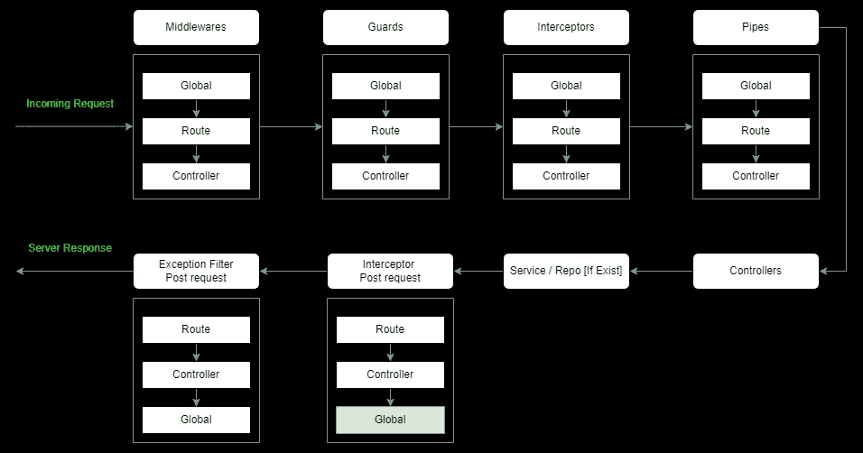

# NestJS 中的集中式错误处理

> 原文：<https://javascript.plainenglish.io/centralized-error-handling-in-nest-js-b230d5912a09?source=collection_archive---------0----------------------->

## 关于如何处理 NestJS 应用程序中所有错误的指南。

> 背景——我有一个需求，我需要在一个地方捕获所有错误，记录它们(如果我们需要记录这样的错误)，增加错误度量(Prometheus 和 prom——grafana dashboard 的客户端)。
> 
> 存在的问题——我们使用通用的 nestjs 模式传递来自控制器->服务->存储库的数据。因为所有的代码块都被 try-catch 块包围着，所以非常需要我们在每个模块中注入[度量服务&日志服务]。然后调用一个通用函数来执行所有必要的检查和进一步的操作

解决方案——我们通过使用 NestJs 拦截器找到了解决方案，该拦截器可以捕捉异常+错误，而异常过滤器只捕捉和响应异常。现在，一旦被注入，我们就在任何需要的地方移除我们的 try catch 块，现在几乎 90%的模块都没有这些块了。

在拦截器中，我们注入了度量服务和日志服务，这将负责这两个操作。我们可以转换错误，并通过包含一些属性将其作为通用消息回复给用户。

为了更好地理解这个流程，让我们看一下 nestjs 应用程序中的请求-响应生命周期

Complete Application Flow

最上面的块由请求生命周期组成。下半部分包含处理和响应。如果整个应用程序出现任何问题，它将总是通过{拦截器 Post 请求}传递，这就是我们可以利用的。

拦截器的一个例子可以在

 [## nest-email-OTP/app . interceptor . ts at c 6 a 982 E3 a 93 C1 a 370 C3 c 48957 bae8e 6904 dcdc 16…

### 此文件包含双向 Unicode 文本，其解释或编译可能与下面显示的不同…

github.com](https://github.com/akshay271703/nest-email-otp/blob/c6a982e3a93c1a370c3c48957bae8e6904dcdc16/src/utilities/interceptors/app.interceptor.ts) 

本文是从我以前的一个小项目扩展而来的，该项目使用基于 OTP 的用户注册。我现在已经用 Nest Js / TypeScript 创建了项目。邮寄是通过 AWS SES 完成的。链接可以在下面找到。

 [## 使用 Node.js 创建一个基于 OTP 的用户注册

### 这篇文章是关于创建一个 OTP 风格的用户注册系统。我将把路线图分成几个部分，以便您…

javascript.plainenglish.io](/create-otp-based-user-sign-up-using-node-js-cc4defc54123) 

拦截器使用的简要总结—

每当我的应用程序抛出一个错误，它就会被这个拦截器捕获，然后

*   我检查这是什么类型的错误。在我的案例中，它曾经是—

[1]数据库错误—我可以使用 TypeORMError 的 instanceof 来检查

[2]应用程序错误—我可以通过实例 f HttpException 再次检查该错误

[3]未确定。你可以改进这个过滤器，但是为了简单起见，我只添加了几个。

*   我可以通过转换并附加到原始错误消息中，抛出一个简单的用户友好的错误细节。
*   我可以在这里执行日志记录，并限制我需要记录的错误类型。
*   我可以在本模块中处理我的指标。

*更多内容请看*[***plain English . io***](https://plainenglish.io/)*。报名参加我们的* [***免费周报***](http://newsletter.plainenglish.io/) *。关注我们关于*[***Twitter***](https://twitter.com/inPlainEngHQ)[***LinkedIn***](https://www.linkedin.com/company/inplainenglish/)*[***YouTube***](https://www.youtube.com/channel/UCtipWUghju290NWcn8jhyAw)*[***不和***](https://discord.gg/GtDtUAvyhW) *。对增长黑客感兴趣？检查* [***电路***](https://circuit.ooo/) *。***