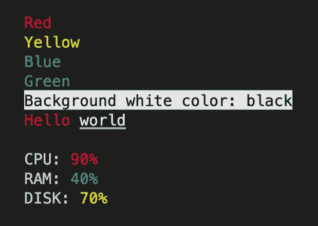

# 如何使用粉笔给 JavaScript 日志着色

> 原文：<https://javascript.plainenglish.io/chalk-colorize-javascript-logs-7e6fdbf98aec?source=collection_archive---------7----------------------->

## 在本文中，我们将探索如何为您的终端日志着色，并使用 Chalk 创建一个用于 Node.js 应用程序的颜色主题。

在这篇文章中，我们将探索如何给你的终端日志着色，并用粉笔创建一个颜色主题用于你的应用程序。

# 什么是粉笔

Chalk 是一个终端字符串样式工具，可以在 JavaScript 应用程序中使用。

Chalk 是**最依赖的** npm 软件包之一，目前有 83466 个其他软件包在使用它。

使用粉笔的优点:

*   Chalk 是一个非常易于使用和可定制的日志库。
*   Chalk 使开发人员能够创建丰富多彩的命令行输出。
*   提高不同类型日志的质量。粉笔提供了许多不同用途的颜色选项，比如红色代表错误，绿色代表成功信息。

现在，让我们开始用 Chalk 实现我们的应用程序，看看用例。

# 安装粉笔

现在让我们将 Chalk 模块安装到我们的项目中，并直接导入使用它。

我们将安装包含以下内容的粉笔包:

```
// npm 
npm install chalk
// yarn 
yarn add chalk
```

在我们安装完 Chalk 库之后，我们可以导入它以在我们的应用程序中使用。

**index.js**

```
import chalk from 'chalk';console.log(chalk.red('Red'))console.log(chalk.yellow('Yellow'))console.log(chalk.blue('Blue'))console.log(chalk.green('Green'))// Multiple stylesconsole.log(chalk.black(chalk.bgWhite('Background white color: black')))// Combine styles
console.log(chalk.red('Hello', chalk.underline.white('world')));console.log(`
  CPU: ${chalk.red('90%')}
  RAM: ${chalk.green('40%')}
  DISK: ${chalk.yellow('70%')}
`);
```

代码的输出如下所示。



正如你所看到的，我们现在有非常丰富多彩的日志！🌈

# 用粉笔创作主题

让我们为以下目的创建一些模板:

错误= >红色

成功= >绿色

信息= >黄色

警告= >橙色

```
import chalk from 'chalk';const error = chalk.bold.red;
const info = chalk.yellow;
const success = chalk.green;
const warning = chalk.hex('#FFA500'); // Orange colorconsole.log(error('Error!'));
console.log(info('Info!'))
console.log(success('Success!'))
console.log(warning('Warning!'));
```

这段代码的结果如下:


我们可以在应用程序中使用这些模板，用于变量名中解释的目的。

使用彩色日志将使您能够比常规日志更快地识别问题和成功消息，这将提高开发速度。

这就是在 Node.js 中使用 Chalk 模块的全部内容。它使日志更加丰富多彩，更容易识别。

我希望在您阅读完这篇文章后，能够开始在 Node.js 应用程序中使用 Chalk 模块。🙂

您可以从[**GitHub**](https://github.com/hadnazzar/nodejs-chalk-example)**:**访问该项目

[](https://github.com/hadnazzar/nodejs-chalk-example) [## GitHub-hadnazzar/nodejs-chalk-示例

### 此时您不能执行该操作。您已使用另一个标签页或窗口登录。您已在另一个选项卡中注销，或者…

github.com](https://github.com/hadnazzar/nodejs-chalk-example) 

*如果你觉得这篇文章很有帮助，你可以通过使用我的推荐链接注册一个* [***中级会员来访问类似的文章***](https://melihyumak.medium.com/membership) *。*

***关注我上*** [**推特**](https://twitter.com/hadnazzar)

[](https://www.youtube.com/c/TechnologyandSoftware)

Subscribe for more on [**Youtube**](https://www.youtube.com/c/TechnologyandSoftware?sub_confirmation=1)

# 编码快乐！

梅利赫

*更多内容请看*[***plain English . io***](https://plainenglish.io/)*。报名参加我们的* [***免费周报***](http://newsletter.plainenglish.io/) *。关注我们关于*[***Twitter***](https://twitter.com/inPlainEngHQ)*和*[***LinkedIn***](https://www.linkedin.com/company/inplainenglish/)*。查看我们的* [***社区不和谐***](https://discord.gg/GtDtUAvyhW) *加入我们的* [***人才集体***](https://inplainenglish.pallet.com/talent/welcome) *。*