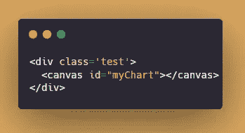
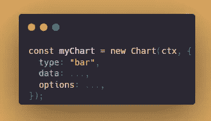
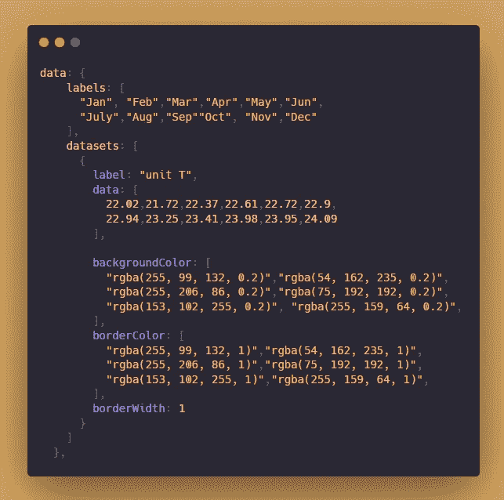
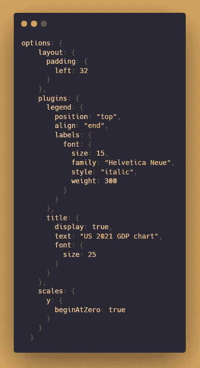

# 如何用 Chart.js 快速创建自定义图表

> 原文：<https://javascript.plainenglish.io/chart-js-create-customized-charts-fast-aefa0d685aad?source=collection_archive---------10----------------------->

## 使用 Chart.js 轻松创建自定义图表的指南


当今是一个大数据世界，各种各样的数据都需要审查和分析。该插件可以将数据转换成漂亮的图表，如折线图、条形图、气泡图、饼图、极区图、雷达图等。此外，还可以通过选项轻松定制细节。对于设计者和开发者来说，这是一个有用的工具。

[**官方网站**](https://www.chartjs.org/)

基本演示试用

**第一步:**

导入 chart.js 文件

```
<script src="https://cdn.jsdelivr.net/npm/chart.js"></script>
```

**第二步:**

HTML —图表将出现在画布中。



**第三步:**

JavaScript —自定义图表的数据和布局。

选择图表的 DOM。


用`new Chart()`启动图书馆。



**类型**可以是条形图、折线图、气泡图、圆环图、饼图、雷达图、散点图、极线图。



data

**标签**是条形标签的数组。

**数据集**包括标签、条形数据、背景色、边框颜色和边框宽度。



options

布局是图表的布局设置。

**插件**包括图表标签位置、字体大小等。还有定制的大标题。使用 y 轴或 x 轴自定义刻度。

更多详情，请查看此处的[文档](https://www.chartjs.org/docs/latest/):

## **我的演示:**

👉关注我，了解更多有用的 web 开发内容！爱 sharing🥰

*更多内容看* [***说白了就是***](https://plainenglish.io/) *。报名参加我们的* [***免费每周简讯***](http://newsletter.plainenglish.io/) *。关注我们* [***推特***](https://twitter.com/inPlainEngHQ) *和*[***LinkedIn***](https://www.linkedin.com/company/inplainenglish/)*。加入我们的* [***社区不和谐***](https://discord.gg/GtDtUAvyhW) *。*