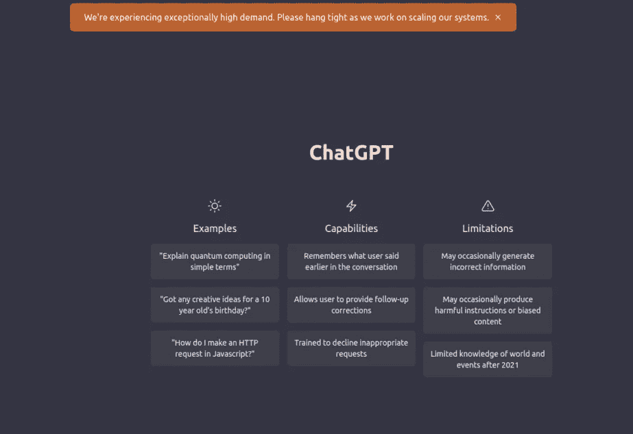
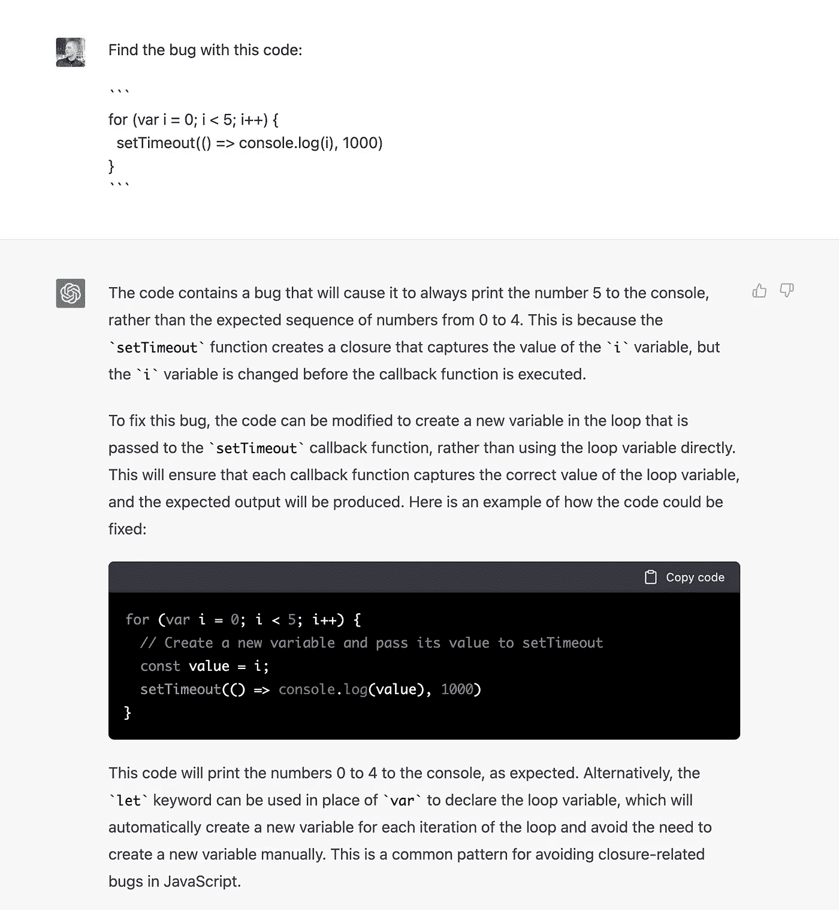
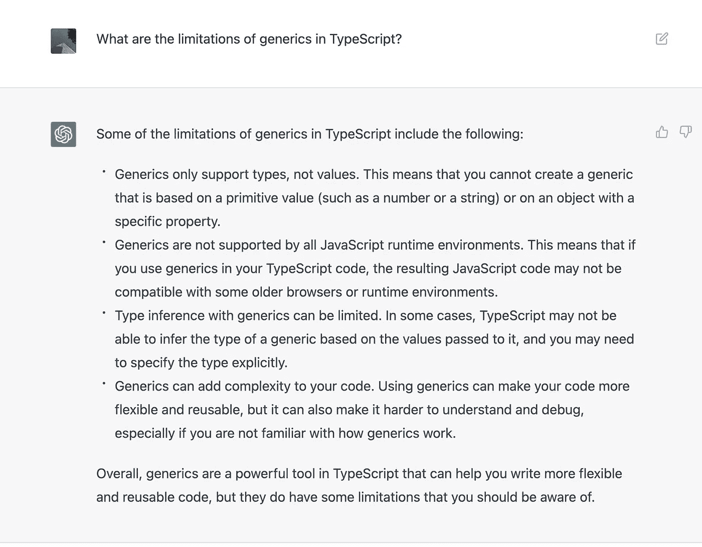
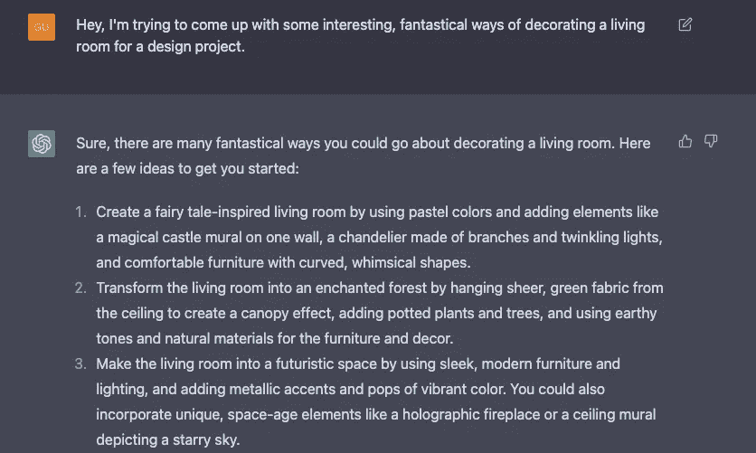
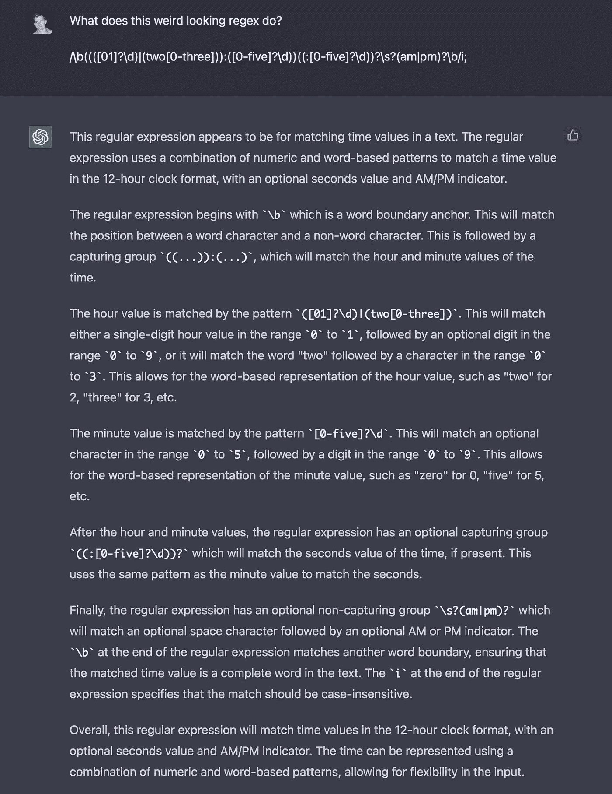

# ChatGPT:写作的未来及其对作家的意义

> 原文：<https://javascript.plainenglish.io/chatgpt-is-this-the-end-of-the-content-writers-career-let-s-find-out-cbbaf4f4376?source=collection_archive---------2----------------------->

Photo by [Agnieszka Kowalczyk](https://unsplash.com/@dubai_love_story?utm_source=medium&utm_medium=referral) on [Unsplash](https://unsplash.com?utm_source=medium&utm_medium=referral)

人工智能 **(AI)** 是指开发能够执行通常需要人类智能完成的任务的计算机系统，例如**学习**、**解决问题**、**决策**。

人工智能有可能彻底改变许多行业，并已经开始在诸如**医疗**、**金融**和**交通**等领域产生重大影响。

有许多不同的工具和技术用于开发人工智能，包括机器学习算法，自然语言处理(NLP)系统和机器人技术。

这些工具允许创建智能系统，这些系统可以分析和解释数据，对输入做出响应，并从经验中学习。

在本文中，我们来讨论一个这样的工具，它在过去几天成为了互联网上的头条新闻。

在本文中，让我们了解到目前为止我们所知道的关于这个工具的一切。

# 什么是 ChatGPT

ChatGPT 是 OpenAI 开发的前沿自然语言处理(NLP)工具。

它是流行的 **GPT-3** 语言模型的一种变体，已经在人类对话的大规模数据集上进行训练，能够对文本输入产生**类似人类的反应**。

ChatGPT 的一个关键特征是它的**能力** **理解和响应上下文**。这意味着当你与 ChatGPT 进行对话时，它会记住之前说过的话，并使用这些信息来生成更相关和连贯的响应。

这允许更自然和流畅的对话，并使 ChatGPT 成为广泛应用的强大工具。

# ChatGPT 是谁开发的？

ChatGPT 由专注于人工智能开发的领先研究机构 OpenAI 开发。

OpenAI 以其在语言处理和其他人工智能技术方面的工作而闻名，并开发了许多受欢迎的工具和模型，包括 **GPT-3** ，ChatGPT 正是基于此。

OpenAI 的目标是推进人工智能领域，开发可以帮助改善世界的技术。

# ChatGPT 的不同应用

ChatGPT 是一个多功能的自然语言处理(NLP)工具，有许多潜在的应用。ChatGPT 的一些可能应用包括:

*   **创意写作:** ChatGPT 可以提供建议和提示，帮助作者克服写作障碍，产生想法。
*   医疗保健: ChatGPT 可以用来帮助医生和护士，为他们提供关于病人的实时信息，如他们的病史、当前症状和潜在的诊断。
*   **教育:**通过提供即时反馈和个性化回复，ChatGPT 可以帮助改善学生的学习体验。
*   **研究:**它可以通过向研究人员提供实时信息和建议来帮助他们提出假设和设计实验。
*   **客户服务:** ChatGPT 可以用来驱动聊天机器人，为客户的查询提供即时响应，减少等待时间，提高客户满意度。
*   翻译:ChatGPT 可以用来将文本从一种语言翻译成另一种语言，提供即时准确的翻译。
*   **讲故事:** ChatGPT 可以根据用户的输入，通过建议对话和情节转折来帮助创建引人入胜的故事。
*   **个人助理:** ChatGPT 可以用来增强虚拟助理的能力，帮助完成诸如日程安排、发送提醒和提供信息等任务。

这些只是 ChatGPT 许多潜在应用的几个例子。随着 NLP 技术的不断进步，ChatGPT 和其他类似的工具很可能会在广泛的行业和环境中使用。

# 如何访问 ChatGPT？

现在 ChatGPT 正处于研究阶段，可以免费使用。你可以访问这个[链接](https://openai.com/blog/chatgpt/)，登录你的 OpenAI 账号就可以开始使用了。

有时您可能会看到这个屏幕，因为他们的负载很高。但是你应该能在等待一段时间之后使用它。

ChatGPT high demand error screenshot

# ChatGPT 生成的内容示例

在过去的几天里，每个人都被 ChatGPT 的结果吓坏了。以下是一些例子:

1.  **ChatGPT 在一段代码中发现 bug 并解释它**

ChatGPT finding a bug in a code

**2。ChatGPT 返回比 Google 更好的结果**

ChatGPT returning limitations of generics in TypeScript

**3。ChatGPT 为一个设计项目提供不同的客厅装饰方式**

ChatGPT showing ways of decorating a living room

**4。ChatGPT 解释了一个没有任何上下文的复杂正则表达式**

ChatGPT explains a complex regex without any context

在过去的几天里，互联网上充满了这样的例子。在接下来的几天和几周内，我们将了解更多关于 ChatGPT 的力量。

# ChatGPT 能代替人类的工作吗？

ChatGPT 或其他先进的人工智能系统有可能被用来执行一些目前由人类完成的任务。

然而，ChatGPT 或其他任何人工智能系统都不太可能完全取代人类工人。

人工智能系统旨在协助完成某些任务，但它们无法复制人类拥有的全部能力和技能。

此外，人工智能在工作场所的使用提出了许多需要解决的道德和社会问题。

# ChatGPT 能取代创作型作家吗？

虽然 ChatGPT 是一个强大的文本生成工具，但它无法取代有创造力的作者。

虽然 ChatGPT 可以提供建议和提示来帮助作者克服写作障碍并产生想法，但它无法独自创建原创内容。

生成创意和原创内容的能力是人类独有的技能，在可预见的未来，人工智能不太可能完全复制这种能力。

此外，即使 ChatGPT 能够生成原创内容，它也缺乏真正创造性写作所必需的人类经验和视角。

创造性的写作往往反映了作者的思想、感受和情绪，人工智能很难复制这种深度和复杂性。

因此，虽然 ChatGPT 可以成为作家的一个有价值的工具，但它不能取代他们。

它可以帮助写作过程，但最终，是人类作家必须把他们独特的视角和创造力带到作品中。

# ChatGPT 的未来计划

与任何尖端技术一样，很难确定地预测 ChatGPT 的未来计划。

然而，鉴于 ChatGPT 令人印象深刻的能力及其广泛应用的潜力，OpenAI 和其他组织很可能会继续投资于其开发并探索使用它的新方法。

ChatGPT 未来发展的一个可能方向是提高对语境的理解和反应能力。

随着 NLP 技术的不断进步，ChatGPT 和其他类似的工具可能会更好地理解人类对话的细微差别，并生成更相关和连贯的响应。

ChatGPT 的另一个潜在关注领域是将其应用扩展到基于文本的通信之外。例如，ChatGPT 可以用于生成语音响应，允许与人工智能进行更自然和直观的交互。

总的来说，ChatGPT 的未来是充满希望和令人兴奋的。

随着 NLP 技术的不断发展，ChatGPT 和其他类似的工具可能会变得更加强大，并在未来几年得到广泛应用。

# 结论

总之，ChatGPT 是一个尖端的自然语言处理(NLP)工具，有可能彻底改变许多行业。

它理解和响应上下文的能力使它成为客户服务、教育和创造性写作等应用的宝贵资产。随着 NLP 技术的不断进步，ChatGPT 和其他类似的工具对于企业和个人来说将变得越来越重要。

虽然 ChatGPT 不能完全取代人类作家，但它可以帮助写作过程，并提供有价值的见解和建议。

总的来说，ChatGPT 是一个强大的多功能工具，有可能极大地增强我们与语言交互的方式。

## 进一步阅读

 [## 如何使用最小特权原则自动化 AWS IAM 最佳实践

### 云是一项神奇的技术，可用于构建可扩展的应用程序，轻松提供对弹性计算的访问…

简明英语. io](https://plainenglish.io/blog/how-to-automate-aws-iam-best-practices-using-the-principle-of-least-privilege)  [## 2023 年内容营销清单|重新定位并重复以取得成功

### 展望新的一年，回顾和更新我们的内容营销策略非常重要，以确保它们…

电路. ooo](https://circuit.ooo/blog/2023-content-marketing-checklist) 

*更多内容请看*[***plain English . io***](https://plainenglish.io/)*。报名参加我们的* [***免费周报***](http://newsletter.plainenglish.io/) *。关注我们关于*[***Twitter***](https://twitter.com/inPlainEngHQ)[***LinkedIn***](https://www.linkedin.com/company/inplainenglish/)*[***YouTube***](https://www.youtube.com/channel/UCtipWUghju290NWcn8jhyAw)*[***不和***](https://discord.gg/GtDtUAvyhW) ***。*****

*****对缩放您的软件启动感兴趣*** *？检查* [***电路***](https://circuit.ooo?utm=publication-post-cta) *。***