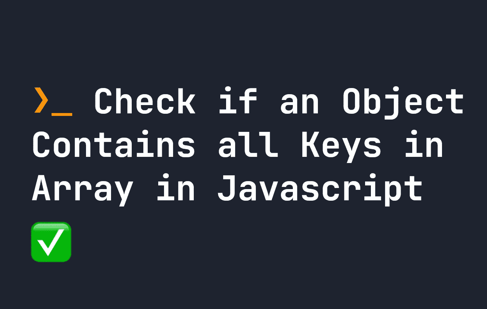

# 在 JavaScript 中检查对象是否包含数组中的所有键

> 原文：<https://javascript.plainenglish.io/check-if-an-object-contains-all-keys-in-array-in-javascript-e7f7056a5d35?source=collection_archive---------12----------------------->

## 关于如何在 JavaScript 中检查一个对象在数组中是否有一组特定的键的指南。



有时在 JavaScript 中，我们需要一个对象来符合一组特定的键。这可以通过 [TypeScript](https://fjolt.com/category/typescript) 中的类型强制来实现，但是如果我们想在键不存在的情况下做某些事情，那么我们必须采取不同的方法。

例如，假设我们从一个数组中接收下面的对象，其中`firstName`、`lastName`和`age`都是我们想要完成的操作所需要的。例如:

```
let obj = {
    firstName: Jack,
    lastName: Doe,
    age: 123
}console.log(`${obj.firstName} ${obj.lastName} is ${obj.age}`);
```

如果我们在`obj`中从一个数组接收数据，我们可以相信这些属性会被提供，但是如果 API 发生变化，我们可能会面临问题。API 的开发者可能决定移除`age`或任何其他属性，或者可能将`firstName`重命名为`first_name`。在**最佳**场景中，这将导致键变得未定义。在最坏的情况下，它可能会导致一个错误，使我们的应用程序崩溃。

为了避免这种情况，我们可以检查对象是否有我们**需要的键**。

# 如何检查对象是否包含数组中的所有键

这个问题的解决方法用`every()`。`every()`是一个数组方法，检查数组中的每个元素，并对它们执行逻辑检查。如果都返回 true，那么`every()`方法返回 true。

要检查一个对象是否包含了一个数组中的所有键，我们只需对一个包含了我们想要检查的所有键的数组使用`every()`。这样，我们可以从逻辑上检查每个元素是否存在，如果不存在，则执行其他操作，防止我们遇到任何错误:

```
let requiredKeys = [ 'firstName', 'lastName', 'age' ]
let obj = {
    firstName: Jack,
    lastName: Doe,
    age: 123
}let checkAllKeys = requiredKeys.every((i) => obj.hasOwnProperty(i));if(checkAllKeys) {
    console.log(`${obj.firstName} ${obj.lastName} is ${obj.age}`);
}
else {
    console.log('The API does not have all the keys required. Please check API and configuration')
}
```

这里我们创建了一个**必需键** — `firstName`、`lastName`和`age`的数组。然后我们使用`every()`遍历数组中的每一项。在`every()`中，我们运行一个函数——在这里，`i`是正在循环的当前项目。如果`obj`具有属性`i`，那么`every()`将为该特定项目返回 true。

如果每一项都返回真，那么`every`总体返回真。否则，它将返回 false。因此，如果`checkAllKeys`为真，我们可以确定它拥有我们需要的所有密钥。否则，我们可以做些别的事情——比如 console.log 错误。

*更多内容看* [***说白了。报名参加我们的***](https://plainenglish.io/) **[***免费周报***](http://newsletter.plainenglish.io/) *。关注我们关于*[***Twitter***](https://twitter.com/inPlainEngHQ)*和*[***LinkedIn***](https://www.linkedin.com/company/inplainenglish/)*。加入我们的* [***社区***](https://discord.gg/GtDtUAvyhW) *。***