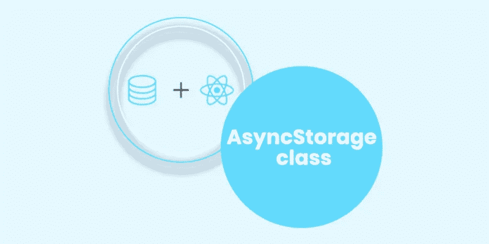
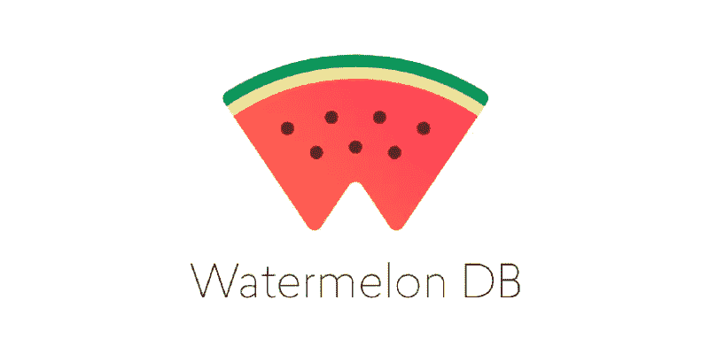

# 为 React 本地应用选择合适的数据库

> 原文：<https://javascript.plainenglish.io/choose-perfect-database-while-developing-a-react-native-app-f51c247d5d9d?source=collection_archive---------5----------------------->

大多数组织和开发者都依靠 React Native 来开发高性能的移动应用。一个 React 原生开发者在构建不同的应用时面临很多挑战。为了以正确的方式处理这种情况，有必要选择正确的技术堆栈，包括 React Native 的正确数据库，这对开发人员来说可能很困难。

我们可能都在一些博客或文章中遇到过 [React Native](https://xongolab.medium.com/why-choose-react-native-for-app-development-top-reasons-e229bc7282ec) ，因为它已经成为一个受公司欢迎的平台，这些公司希望在短时间内以低成本创建一流的应用程序。React Native 已经证明了自己是业内最受欢迎和使用率最高的应用程序开发平台之一。通过 React Native，您可以在更短的时间内构建高性能的应用程序。

## W**帽子是土著的反应？**

React Native 由**社交媒体巨头【脸书】**于 2015 年开发，是一个众所周知的用于创建原生 Android 和 iOS 移动应用的框架。与前几年相比，对 React 原生移动应用程序的需求有所增加，预计未来还会继续增加。

React 原生应用可用于 Android 和 iOS 平台，因此您可以使用单一代码库为这两种平台创建应用。

因为它得到了脸书的支持，所以它有一个庞大的支持者网络，并且已经证明是一个可靠的商业框架。

## ***选择数据库开发 React 原生 App 需要考虑的事情***

在选择数据库时应该考虑几件事情，但是这里有一些事情是你在选择时应该记住的。

*   选择一个可以轻松部署的数据库至关重要。
*   当一个应用程序变得流行时，开发人员的工作量就增加了，因为数据量以巨大的规模增长，必须以某种方式进行管理。用户会进行大量的查询，很难向他们提供准确的信息。因此，理解各种本地数据库使用的并发机制变得至关重要。
*   如果数据维护不当，应用程序崩溃的可能性就会增加。另一方面，大多数数据库会定期清理缓存，确保有足够的 RAM 来完美地执行应用程序。
*   如今，用户希望他们的应用程序在离线模式下或互联网连接不可用时工作。现在有必要包括一个数据库，当用户再次连接到互联网时，该数据库允许数据同步。
*   根据分析，大多数应用程序中的数据要么以 JSON 格式保存，要么以键值保存。因此，选择一个能够管理复杂数据结构的数据库至关重要。

一个可靠的 React 原生应用程序开发公司可以更好地指导你，或者你甚至可以雇佣 React 原生开发者，但质量将是你可能不得不妥协的因素。所以这取决于你。

# ***能让你的应用工作更流畅更快速的最佳数据库列表***

## 领域

开源的、面向对象的库比关系数据库执行得更快，这是最大的优势。该领域还支持离线和实时应用程序的复杂数据类型。Realm 数据库也可以针对 iOS、Android 和 Javascript 进行定制。这个本地数据库自带搜索引擎，不需要任何与对象相关的映射或键值存储。领域数据库对象可以根据其能力访问许多线程或源。

realm 是使用最广泛的本地数据库之一，因为它支持大量数据并确保高质量的应用程序开发。

***境界的好处***

*   领域同步服务是后台服务，可以安全地记录和保存用户交互和服务请求。当这个小工具连接到互联网时，它向服务器发送数据并执行任务，而不会干扰用户的体验。
*   对于那些希望构建一个离线优先的应用程序开发框架的人来说，realm 是一个完美的选择。
*   Realm 根据移动平台使用各种加密方法，这使其与众不同。

## SQLite

另一个用于创建 React 原生应用程序的重要且有用的数据库是 SQLite，它被世界上许多 React 原生开发人员所使用。创建它是为了提供对本地存储的访问。

SQLite 是一个轻量级的库，只需要几个步骤就可以启动。SQLite 可以很容易地集成到移动应用程序中，用于直接的数据库评估。

***SQLite 的好处***

*   该数据库是 ACID 兼容的，这意味着它遵循几乎所有的 SQL 标准。
*   你可以在 SQLite 的帮助下在应用中启用离线持久化。
*   SQLite 在通过 SQLite 在跨平台数据库文件中保存数据方面起着至关重要的作用。

## 重火力点

谷歌拥有的 Firebase 数据库是一个 NoSQL 本地数据库。如果你的移动应用更侧重于离线数据更新和同步，Firebase 是最佳选择。它可以轻松处理基于 MVC 的高数据需求 React Native 项目。

它有许多性能跟踪工具，可以帮助确定复杂应用程序的问题。如果需要的话，Firebase 可以从谷歌的服务器上删除数据。

***Firebase 的好处***

*   使用 Firebase 的最大好处是实时数据可以同时在所有设备间同步。当应用程序由于缺乏互联网连接而意外离线时，这一点尤为重要。
*   Firebase 让开发人员可以自由地创建具有持久离线特性的高性能实时应用。这包括指定用户的在线或离线状态，并在用户失去网络连接时保留时间戳。
*   任何应用程序都可以用 Firebase 轻松实现。

## PouchDB

PouchDB 是一个开源的 javascript 库数据库，它以 JSON 格式保存数据，并允许您使用简单的 JavaScript API 来创建、读取、更新、删除和查询对象。在 React 本机框架上，API 可以通过一个调用来使用。

PouchDB 是与 PouchDB 配对的最稳定的服务器端数据库，因为它是利用 CouchDB 协议和存储机制设计的。如果我们谈论兼容性，那么 PouchDB 与 MongoDB、PostgreSQL 和 MySQL 等服务器端数据库兼容。

***PouchDB*的好处**

*   PouchDB 不会出现数据冲突问题，因为它可以跨多个用户同步，就像 Firebase 一样。但是，如果您使用本地库，您将无法在几个客户端之间同步特定于操作系统的数据。
*   通过 PouchDB 的复制功能，可以将本地存储与服务器分离，尽管两个副本是同时更新的。它甚至可以确保数据在更新时的安全性。
*   保护应用程序的本地数据是一项挑战，但使用 PouchDB 比使用大多数开源数据库要容易得多。

## 异步存储类数据库

它是另一个最重要的本地数据库，有助于在存储系统中存储数据。AsyncStorage 类允许您在应用程序重启后保存数据。

异步存储(一个类)存储被视为字符串的对象。在存储之前，所有的值都应该被反序列化，在检索之后，它们应该被分散化。另一方面，序列化需要时间来减缓进程。如果您正在处理大量数据，您应该避免使用 AsyncStorage 类。

***异步存储的好处***

*   AsyncStorage 是保存和存储数据的一种很好的方法，因为它是异步的，并且它使用键值系统来存储和检索数据。
*   当您使用某个应用程序然后关闭它时，该应用程序的状态会在您下次打开它时被重置。AsyncStorage 的一个关键优势是，它允许您直接在设备上存储数据。人们可以随时访问它。

## 西瓜 DB

西瓜数据库的目标是让 React 原生数据库更加高效。因为它构建在 SQLite 之上，所以它提供了卓越的数据库性能。几分钟之内，西瓜 DB 就可以管理上千条记录。

西瓜数据库旨在帮助您构建专注于现实世界功能的具有挑战性的应用程序。它还可以很好地处理低端设备的数据。

***西瓜 DB 的好处***

*   通过同步引擎，您可以创建离线优先系统。
*   静态和动态的打字。
*   数据可以很容易地插入到组件中。
*   当数据库更新时，UI 会自动重新呈现。

## 瓦塞恩

Vasern 是一个开源数据库，用于轻量级和快速的本地应用开发。它也是最好和最常用的数据库之一。

Vasern API 用于本地和在线存储和同步。Vasern 的架构和结构受到了大量开源数据库的启发。

**的好处*的好处*的好处**

*   这是一个运行速度很快的数据库。
*   端到端数据库同步易于使用。
*   Vasern 是一个功能强大的开源数据库。
*   React 原生应用的性能是主要关注点。

## ***结论***

开发人员在使用数据库创建 React 原生应用时，应该了解大量的后端工具。另一方面，React 本地后端数据库应该根据项目类型和其他需求来选择。

因此，在为 React Native 选择数据库之前，列出要考虑的事项变得至关重要。我们在该领域拥有多年的经验，因此我们可以帮助您选择最佳的数据库来开发高性能的 React 原生应用程序，并成功推出您的移动应用程序。

*更多内容看* [***说白了。报名参加我们的***](http://plainenglish.io/) **[***免费周报***](http://newsletter.plainenglish.io/) *。在我们的* [***社区不和谐***](https://discord.gg/GtDtUAvyhW) *获得独家获取写作机会和建议。***