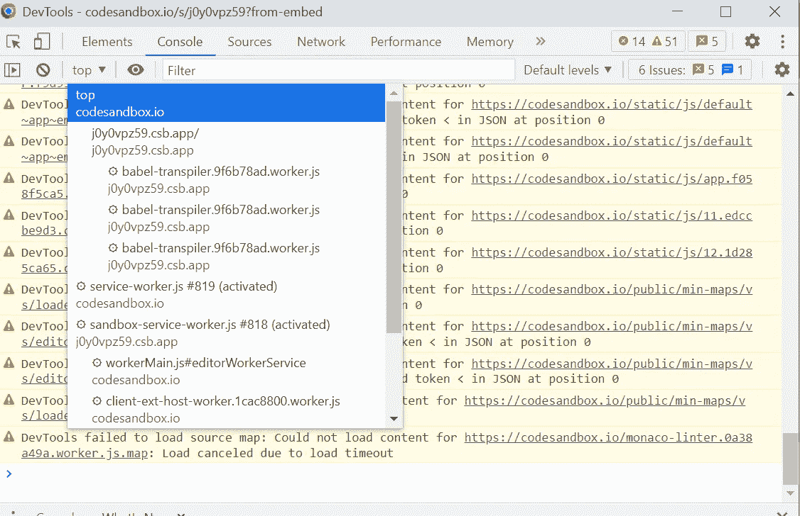
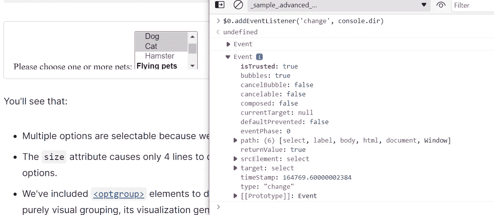
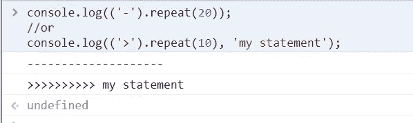
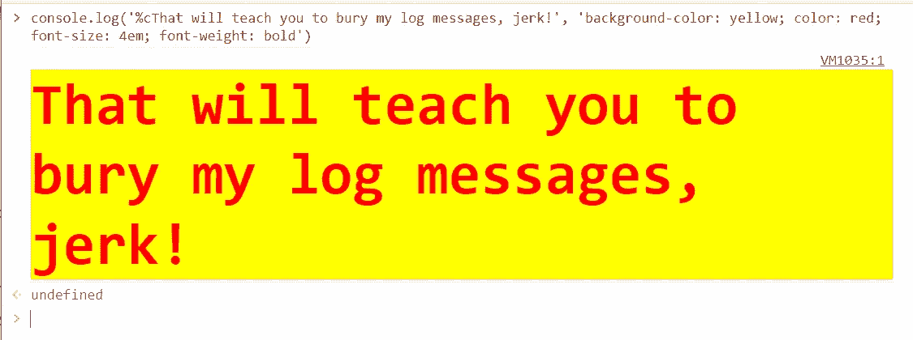
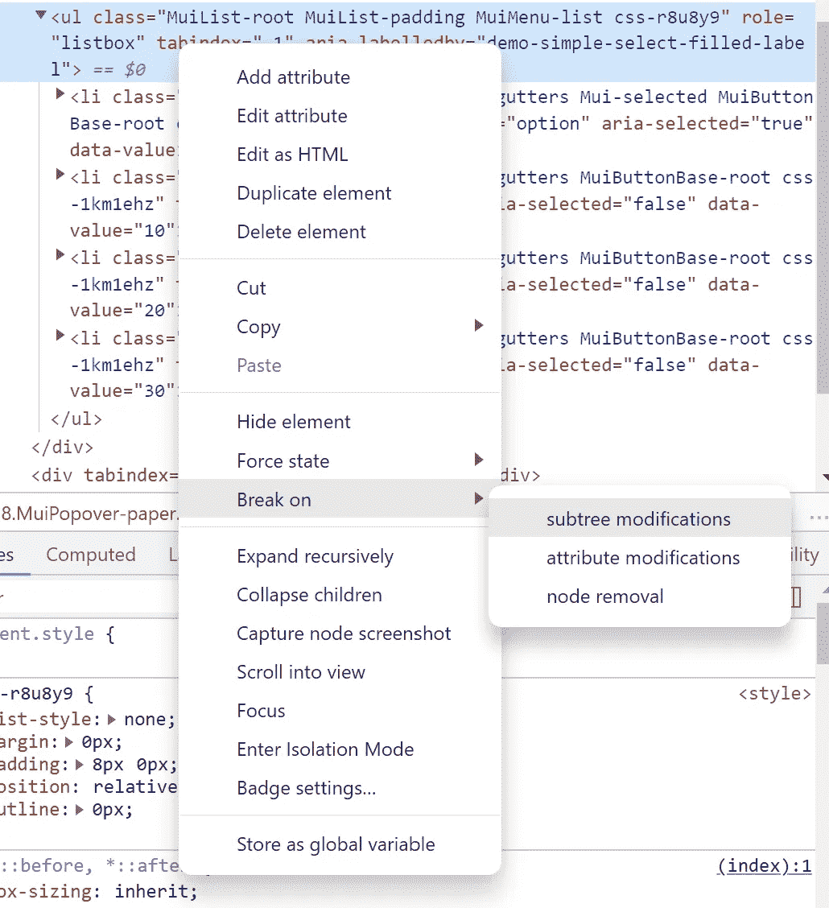
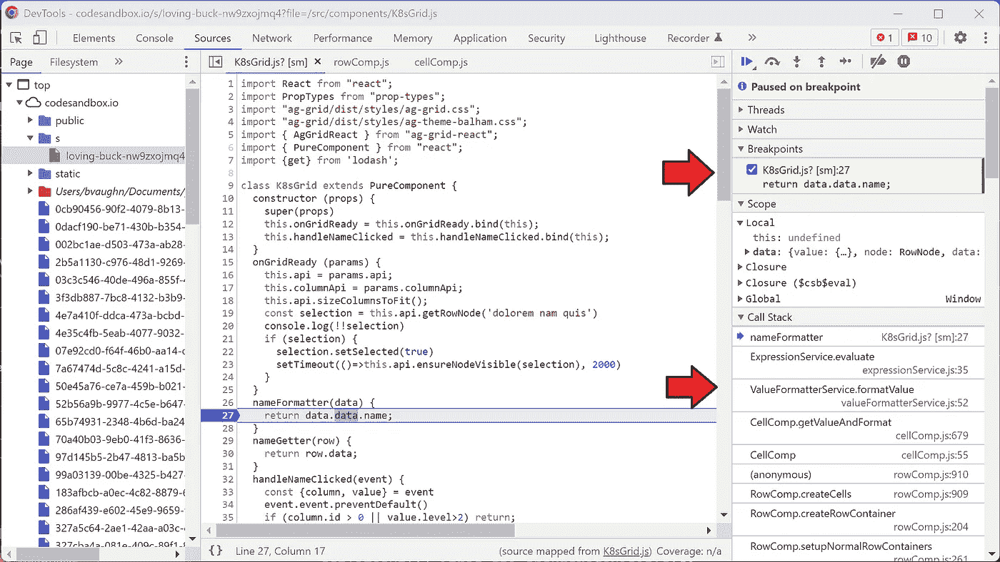

# 让你看起来更专业的 Chrome 开发者工具技巧

> 原文：<https://javascript.plainenglish.io/chrome-developer-tool-tricks-to-make-you-look-pro-d7b2dd4296b2?source=collection_archive---------7----------------------->

## 因为你会的(这就是开发工具的用途)


Author’s dog performing her favorite trick

大多数有资历的 JavaScript 开发人员在了解页面/应用程序时都有“锦囊妙计”。这就是为什么有这么多“Chrome 开发工具技巧”的帖子。这是我的。

# 使用控制台探索 OPC(其他人的代码)

我们真的很幸运，在 2022 年，我们有像 CodePen、JsFiddle、CodeSandbox、Plunker 这样的网站，可能还有我遗漏的 5 到 10 个其他网站，让你找到工作代码的例子。一些图书馆网站，比如 lodash docs，就有这种内置功能。

许多这样的网站使用 iframes，这使得弄清楚如何获得实际运行的代码变得困难。当然，您可以添加一个免费的 console.log 语句并在控制台中单击行号，但是您也可以只选择您感兴趣的上下文。



但是有时候你需要一些因为这样或那样的原因很难找到例子的东西。

例如，我曾经需要查看当用户选择了多个选项时，选择中的变更事件是什么样子的。关于这一点的[官方文件](https://developer.mozilla.org/en-US/docs/Web/API/HTMLElement/change_event)不够详细，我无法仅从文件中猜测。所以我在 MDN 找到了[的一个例子，我可以用](https://developer.mozilla.org/en-US/docs/Web/HTML/Element/select#advanced_select_with_multiple_features) [$0 技巧](https://developer.chrome.com/docs/devtools/console/utilities/#recent-many)来询问。我还可以通过将 event.target 输出到 [console.table](https://developer.chrome.com/docs/devtools/console/api/#table) 来节省一些挖掘时间，但是我的代码不会如此简洁。



# 让您自己的日志语句更加清晰可见

我相信我们都有在团队中工作的经历，在团队中有一个人签入代码，但代码中仍然有许多日志语句。没有吗？也许只是我。

## 简单的版本

我喜欢做一个分离器，就像

```
console.log((‘-’).repeat(20));
//or
console.log((‘>’).repeat(10), ‘my statement’);
```



这个方法还有一个好处，就是当您的代码在测试中的命令行中运行时也可以工作。

## 复杂的版本

如果你仍然找不到你的语句，是的，你可以使用 [group 方法](https://developer.chrome.com/docs/devtools/console/api/#group)，但是这依赖于确保你的执行路径在某个地方通过 group end 语句，谁想要那个麻烦。此外，如果你今天感觉消极被动，你甚至*不得不*添加更多代码来在一个开发人员不断签入的语句中找到你的日志语句，这还不够令人讨厌。

在那样的日子里，你想做的是[格式化你的日志陈述](https://developer.chrome.com/docs/devtools/console/format-style/)，让它们真正脱颖而出。



包括这个网站在内的许多网站都使用这样的技巧在开发者工具中显示复活节彩蛋。我的朋友 Ben Nadel 写了一整篇关于这个特性的文章，如果你想知道你能做到什么程度，我鼓励你去看看。

# 掌握瞬态

我发现自己不止一次遇到这种情况，我想在一个对象上调试 CSS，当我移动鼠标或点击任何东西时，这个对象就会消失。我还遇到过 React 路由信息在完全不同的后端项目中的情况，所以我甚至不知道应该设置什么路由。当然，当 React 遇到无效路线时，它的重定向速度比人眼看不到的要快。

这两种情况的解决方案是通过设置一个 [DOM 断点](https://developer.chrome.com/docs/devtools/javascript/breakpoints/#dom)来欺骗浏览器在 DOM 树开始改变时暂停执行。



# 导航函数范围和调用堆栈

在调用带有断点的函数之前，您是否曾经想看看变量是什么？您可以使用“调用堆栈”面板返回到调用该函数的位置，以及调用该函数的位置，等等。您还可以使用“闭包”面板来查看包含当前函数的函数中的变量。



# 阅读各类手册

我不可能把我所知道的使用开发工具的所有技巧都告诉你，而且有很多我不知道或者必须查找才能使用它们。因此，您最好的办法是阅读手册，挖掘您自己的宝藏(专业提示:关于诊断内存泄漏和其他性能问题的章节非常有价值)。

正如我前面提到的，也有很多其他人分享他们自己的开发工具技巧的帖子，但是我懒得去找它们，也懒得在这里链接它们。但是如果你已经写了一个或者你有一个最喜欢的，如果你能花一点时间在这里的评论中推广它，我会很高兴。

*更多内容请看*[***plain English . io***](https://plainenglish.io/)*。报名参加我们的* [***免费周报***](http://newsletter.plainenglish.io/) *。关注我们关于*[***Twitter***](https://twitter.com/inPlainEngHQ)*和*[***LinkedIn***](https://www.linkedin.com/company/inplainenglish/)*。查看我们的* [***社区不和谐***](https://discord.gg/GtDtUAvyhW) *加入我们的* [***人才集体***](https://inplainenglish.pallet.com/talent/welcome) *。*