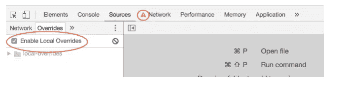
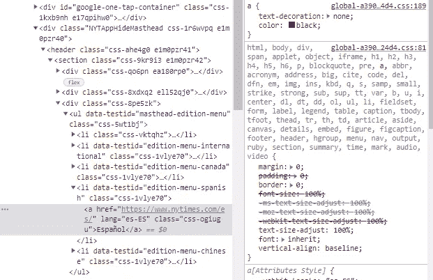
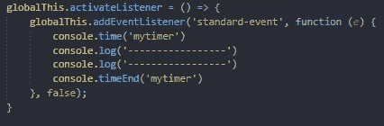
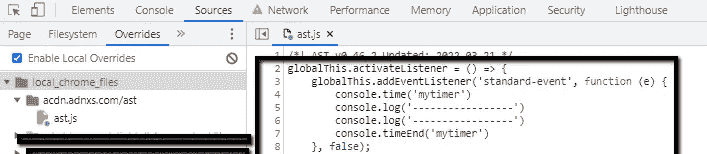
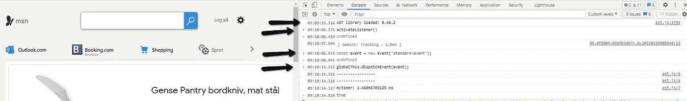
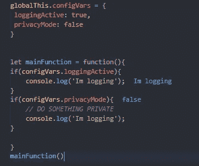

# 本地覆盖:Chrome 最好的调试功能

> 原文：<https://javascript.plainenglish.io/chromes-best-debugging-feature-301de685a616?source=collection_archive---------3----------------------->

## 可以说这取决于你正在寻找的 bug 的类型，但是最近，我发现自己重新发现了这个特性的巧妙之处

Chrome DevTools

本地覆盖不是 Chrome DevTools 中的新功能，但它经常被忽略，其威力可能是未知的。据我所知，它自 [Chrome 版本 65](https://developer.chrome.com/blog/new-in-devtools-65/) (2018)以来就一直存在，但许多人可能没有发现或听说过它，因为它不是 Chrome DevTools 中的“明星”之一。

Local Overrides placement in Chrome DevTools

## 简短描述

本地覆盖功能只是让您覆盖任何站点上的外部 JavaScript 和 CSS，并在重新加载时保持这些更改。
更详细一点的描述是，Chrome 要求获得许可才能将文件保存到你电脑上的文件夹中。每当 Chromes 获取任何保存的文件时，都会提供本地副本，而不是来自服务器的副本。让我们看一些用例。

## 更改 CSS

我相信很多 web 开发者都尝试过打开 Chrome 控制台，更改一些 CSS 属性，看看某个 bug 是否与该属性有关。通常，您可以快速更改许多值，并最终得到所需的输出。而是能够始终如一地复制输出，而且复制得最多。如果 CSS 来自您自己的应用程序托管的文件，您可以简单地在您的本地主机上更改它，这个特性将没有任何用处。然而，如果 CSS 来自外部资源，这就是这些特性开始显示威力的地方。

让我们举一个来自[nytimes.com](https://www.nytimes.com/)的简单例子:

Screenshot of [nytimes](https://www.nytimes.com/)

现在让我们假设这是一个错误，所有的 achor 标签不是黑色的，大小为 16。通过对 DevTools 的检查，我们发现特定的 CSS 设置在来自网站的 CSS 文件中:

Achor tag with it’s CSS

现在，我可以更改该文件中的属性，每次重新加载网站时，我都会得到自己的本地版本。现在 CSS 不是最明显的用例，因为 CSS 可以在运行时在浏览器中更改，这意味着在大多数情况下确定哪个 CSS 导致了错误非常简单。接下来的两个用例更好地展示了这个特性的威力。

## 调试外部库

作为一个非平凡网站的 web 开发人员，您几乎肯定会引入一些第三方库。这可以是一些分析，一个 CMP，广告脚本，动画助手，图表库等。

现在与 CSS 相比，你不能改变已经在你的页面上执行的代码。您可以运行一个正常的调试会话来找出某个 bug 可能发生在哪里。但是因为这不是你的库，你没有办法改变他们的代码。直到本地覆盖！

假设你认为一个第三方库有一个错误，或者你只是好奇想知道一些内部是如何工作的。为了便于讨论，让我们假设您想要一个第三方库来实现某个方法或接口。

在下面的例子中，我们希望 ast.js(包含在[msn.com/da-dk](https://www.msn.com/da-dk)中)实现激活事件监听器的方法:

A dummy method we want/think the library should implement

为了“证明”这个方法在正确的环境中(而不仅仅是在我的本地 IDE 中)能够正常工作，我将在 ast.js 文件中“实现”它。

My function inserted with local override

现在，我可以重新加载站点，就好像 ast.js 已经本机实现了该方法一样，以查看它在这个特定的站点上是如何工作的。

Here the inserted function is tested

现在，当您确定该函数工作正常(至少对您来说)时，您可以选择将代码发送给库的维护人员，希望他们能确切地看到您想要什么特性，甚至知道他们如何实现它。这对库开发人员来说是一个很大的帮助，但是它也帮助你思考你想要的特性应该如何工作的细节。

## 调试您自己的库

这个用例在我自己的工作中特别有用。案例是，我们向数百个(甚至数千个)网站提供一个脚本。从他们的角度来看，这使我们成为第三方库。我们的脚本有一组配置变量和一个对这些变量做出反应的核心“引擎”。

该库的一个简单示例如下所示

Some dummy library to prove my point

由于 real library 在数千个站点中实现，我们有一个更大的部署/标签管理系统来部署对“mainFunction”和“configVars”的更改。

由于“configVars”对象有许多组合，“mainFunction”可以执行许多许多不同的路径，这并不总是容易弄清楚的。因此，有时需要测试一组“配置变量”,而不需要将它们实际部署到现场。最坏的情况是，该配置可能会产生不良影响。
这就是本地覆盖可以帮助我们的地方。
现在，我可以在正确的环境中简单地测试所有不同的组合。当我确信配置可以工作时，我就可以进行实际的部署，这样站点的所有用户都可以从新配置中受益。

*更多内容请看*[***plain English . io***](https://plainenglish.io/)*。报名参加我们的* [***免费周报***](http://newsletter.plainenglish.io/) *。关注我们关于*[***Twitter***](https://twitter.com/inPlainEngHQ)*和*[***LinkedIn***](https://www.linkedin.com/company/inplainenglish/)*。加入我们的* [***社区不和谐***](https://discord.gg/GtDtUAvyhW) *。*