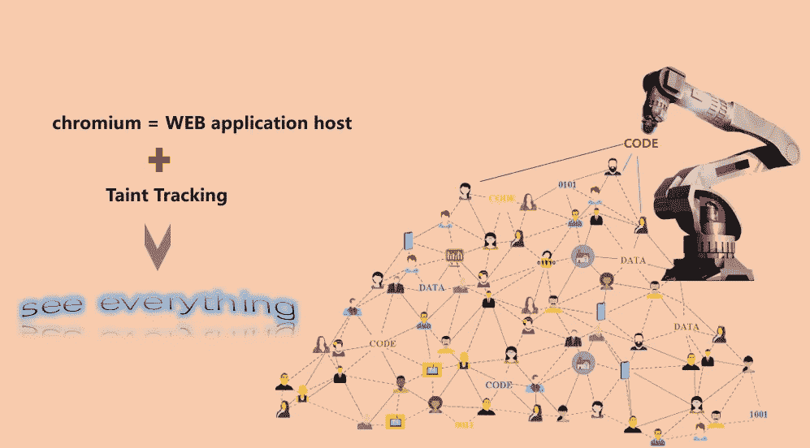

# 铬动力污点追踪

> 原文：<https://javascript.plainenglish.io/chromium-powered-taint-tracking-21922692da91?source=collection_archive---------9----------------------->

在这一章中，我将讨论 Chromium 驱动的污点跟踪。我修改了 V8 和 bink，以提供一种方式来观察给定流程中从变量`x`到变量`y`的信息传输，即污点跟踪。

# **1。特色**

*   跟踪数据从出生到死亡，以及它参与的所有操作。
*   跟踪 JS APIs 和 DOM APIs、调用者、参数和返回。
*   跟踪控制流，什么数据与控制流相关，以及数据如何影响控制流的方向。
*   跟踪数据流，哪些数据与数据流相关，以及数据如何影响数据流的方向。
*   跟踪可能影响控制流方向的 API。
*   跟踪可能影响数据流方向的 API。
*   跟踪 JavaScript 和 DOM 树之间的交互。

# **2。挂钩 V8**

基本原理是信息流技术。信息论语境中的信息流是在给定过程中，信息从变量 x 到变量 y 的传递。所以我将这项技术嵌入到铬合金中。因为它是 web 应用程序的运行时环境，无论你想知道什么行为，你都能看到！

## 2.1 跟踪字节码中的行为

V8 是用 C++语言和面向对象方法实现的。HeapObject 是 V8 中堆管理对象的基类。我们在 HeapObject 中添加了一个指针成员来存储对象的行为。当创建一个对象时，我们记录这个对象的生产者。当对象参与计算时，我们更新它的行为。例如，当一个对象被传入一个函数时(在 V8 中，一个函数也是一个 HeapObject 对象)，我们更新函数的行为来记录这个函数是对象的消费者。我们还将更新这个对象的行为来记录它的转换。

## **2.2 跟踪机器代码中的行为**

解释器和 JIT 是 V8 中两个不同的执行单元。解释器是用 OOP 设计的，所以我们可以直接操作 HeapObjcet 的指针成员来跟踪、更新和传播行为。但在 JIT 模式下，V8 使用推测性优化技术，删除无用信息，我们的行为也被删除。为了确保行为可用，我们重写了 JIT 的近 2000 个内置函数(这是 V8 的术语，内部方法)。

## **2.3 在 GC 中维护行为**

最初，我没有将行为存储在 HeapObject 中，而是单独存储。这样我们就需要保持行为的生命周期与 owner 对象一致，在 V8 GC 收集 owner 的时候也要释放它的行为。有这样一个困难:当两个或多个所有者对象引用同一个行为，并且在一个对象被 V8 收集后，我们不能立即释放该行为，因为另一个对象仍在引用该行为，我们必须遍历 V8 堆，并确保在该行为被释放前没有引用。

因此，我在 HeapObject 类中创建了一个新的成员变量来存储行为，这样行为就和 V8 的其他内部对象一样，由 V8 GC 管理，不需要额外的关注。

# **3。挂钩闪烁**

我对 Blink 做了和 V8 几乎一样的修改。以下是我们为 Blink 增加的重要功能。

## **3.1 反馈**

反馈是 web 应用程序在 Blink 中运行时产生的行为。在 Blink 中收集行为，然后反馈给 V8 跟踪引擎，所以它被称为反馈。简单来说:V8 中收集的行为叫 trace，Blink 中收集的行为叫 feedback。

## **3.2 令牌解析器**

当 V8 的一个 HeapObject 进入 Blink 时，很可能会改变 DOM，所以 Blink 会重新渲染 DOM 树。Token Parser 会删除或忽略 HeapObject 携带的行为，所以我们重写了 Token Parser 的大部分内容，以确保 V8 的 trace 和 Blink 的反馈能够正确交互。

## **3.3 V8 和闪烁之间的传输行为**

Blink 和 V8 都使用弱/强引用机制，因此我们还必须确保反馈和跟踪之间的引用关系与它们的所有者相同。Blink 使用包装器类来管理自身和 V8 之间的引用，因此我们重写了包装器类，以确保包装器可以在 Blink 与 V8 交互期间管理反馈和跟踪的生命周期。

# **4。成就**

## **4.1 为 DOM-XSS 生成漏洞**

一般来说，利用依赖于上下文。这意味着当攻击者想要进行 DOM-XSS 时，他需要知道什么是输入，以及输入如何在接收器中流动。最后，他需要打破水槽周围的语法。我的工具得到的行为包含了描述从输入到接收的数据传播的所有必要信息。因此，我们使用抽象语法树 FSM 来生成可以正确触发 XSS 的漏洞。我已经通过工具向 SRC 提交了一些 bug。

## **4.2 Web app 行为分析**

我们知道嵌入 Chrome 的应用非常普遍，我的工具可以帮助应用所有者捕捉他们的应用行为。有了这些行为，你就可以知道哪里是耗时的，比如为什么你的记忆经常保持在高临界状态。因此，您可以优化您的应用程序以获得更好的用户体验，并且还可以发现应用程序中的逻辑问题。

好了，这部分就到此为止了。下次再见，保重！

如果你有任何问题，请联系我。**微信** : qq9123013 **邮箱**:[v8blink@outlook.com](mailto:v8blink@outlook.com)

*更多内容看* [***说白了。报名参加我们的***](https://plainenglish.io/) **[***免费周报***](http://newsletter.plainenglish.io/) *。关注我们关于* [***推特***](https://twitter.com/inPlainEngHQ) ，[***LinkedIn***](https://www.linkedin.com/company/inplainenglish/)*，*[***YouTube***](https://www.youtube.com/channel/UCtipWUghju290NWcn8jhyAw)*，以及* [***不和***](https://discord.gg/GtDtUAvyhW) *。对增长黑客感兴趣？检查* [***电路***](https://circuit.ooo/) *。***