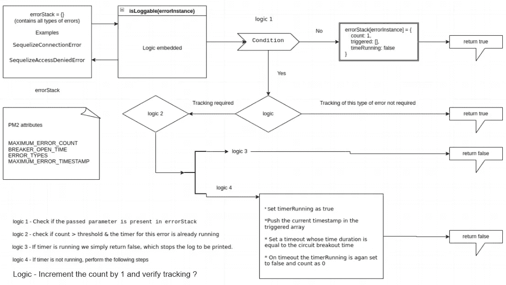

# Node.js 微服务的断路器实施及示例

> 原文：<https://javascript.plainenglish.io/circuit-breaker-implementation-for-node-js-microservices-with-example-fc226098aa86?source=collection_archive---------14----------------------->

## 演示自定义解决方案控制，并使用断路器思想实现更好的日志记录解决方案。

Photo by [Mitchell Luo](https://unsplash.com/@mitchel3uo?utm_source=medium&utm_medium=referral) on [Unsplash](https://unsplash.com?utm_source=medium&utm_medium=referral)

大家好，今天我将展示一个定制的解决方案控件，并有一个使用断路器思想的更好的日志记录解决方案。

## **第一件事第一件事**

什么是断路器？

软件设计中的断路器是根据其在电气工程中的对等物命名的，在电气工程中，它充当设计用于停止电路中电流流动的开关。它被用作保护电路免受过载或短路的安全措施。

这个断路器的一个用例是避免污染或滥发我们的监控日志。想象一下，在每个失败的请求之后，一次又一次地打印相同的错误。为了避免这种事情，断路器的定制解决方案非常有帮助。

这是一篇很好的文章，可以多读一些。

 [## Node.js 弹性概念:断路器| AppSignal 博客

### 在 2009 年，Node.js 为前端开发人员打开了一扇大门，让他们不用…

blog.appsignal.com](https://blog.appsignal.com/2020/07/22/nodejs-resiliency-concepts-the-circuit-breaker.html) 

# 改进日志记录机制的需求是什么？

我所知道的在工业中实现的一个非常实际的例子是关于监视日志。假设你的应用程序有数百个可能失败的模块/函数/控制器/承诺(在 CS 中一切都可能失败),它们最终会在控制台中丢失错误。现在想象一下，刷新浏览器将打印日志，现在数百名用户使用您的应用程序面临问题，那么您的日志记录和监控可能会严重失败，跟踪问题非常困难。为了克服这个因素，您需要一种机制，在给定阈值之后停止打印相同类型的错误。

在我的上一篇文章中，我介绍了 pino logger 和集中式日志记录机制。使用这种方法可以很容易地扩展这个实现。

实现逻辑。您可以通过下面的链接了解更多信息:

 [## 使用 Pino 为 Node.js 创建行业标准记录器

### 使用 Pino 为 Node.js 创建行业标准记录器的指南。

javascript.plainenglish.io](/create-industry-standard-logger-for-node-js-using-pino-4819d6b22bc3) 

我们将该错误的一个实例传递给一个集中的日志记录函数，并根据上面所附的图片判断是真还是假。

我们保留一个 errorStack 全局变量来跟踪各种错误。跟踪 errorStack 的逻辑可以在以下步骤中定义。

检查传递的参数是否包含在 errorStack 中。

如果没有，则添加一个对象，其关键字与通过 3 个属性传递的错误类型相同:

`count` -该错误发生的次数

`timerRunning` -跟踪该错误的状态已达到阈值。如果出现的错误超过了 pm2 文件中定义的阈值，则该值为真。

`triggered` -包含时间戳的数组，在该数组中，特定错误已超出允许的可记录限制。

如果此错误类型已经存在于 errorStack 中，则增加 count 属性。

如果我们不想跟踪它，只需返回 true，这允许打印这个错误任意次。

如果我们想要阻止日志记录，请检查最近增加的值是否超过了允许的限制。

如果否，则返回 true，这将允许打印日志。

如果是，则检查该错误的计时器是否已经在运行。

如果计时器正在运行，我们只需返回 false，这将停止打印日志。

如果计时器没有运行。

将计时器运行设置为真。

将当前时间戳推入被触发的数组。

设置一个超时，其持续时间等于电路中断时间。

超时时，计时器运行再次设置为假，计数为 0，这仅仅意味着该错误可以再次被打印。

返回 false。

为了更好地理解逻辑和实用视图，我创建了一个 GitHub 存储库，您可以在其中使用 config.js 文件中的不同选项。该解决方案具有高度的可伸缩性，可以根据传递给它的配置进行调整。

 [## GitHub-akshay 271703/nodejs-circuit-breaker:避免污染/垃圾邮件的可扩展解决方案…

### const log view = { print config:BOOLEAN，printErrorStack: BOOLEAN，errorStackTimer:INTEGER(in MS)} const…

github.com](https://github.com/akshay271703/nodejs-circuit-breaker) 

这是一个代码繁重的教程，需要绝对的可视化表示来理解逻辑。一旦 GitHub 存储库被克隆并启动，您就可以立即理解配置对象的逻辑和行为方式。我希望我已经说得很清楚了，当涉及到遵循微体系结构行为或分布式系统的大/中型应用程序时，绝对需要这样的机制。

*更多内容尽在* [***说白了. io***](http://plainenglish.io/) *。报名参加我们的* [***免费周报***](http://newsletter.plainenglish.io/) *。在我们的* [***社区获得独家访问写作机会和建议***](https://discord.gg/GtDtUAvyhW) *。*