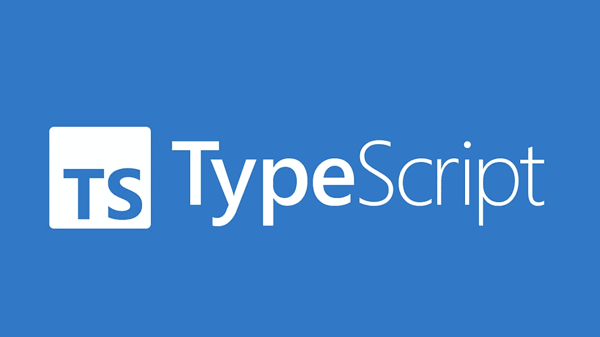

# 清除类型脚本中的代码

> 原文：<https://javascript.plainenglish.io/clean-code-in-typescript-a183d43f3bf0?source=collection_archive---------0----------------------->



# 介绍

上周我[写了一篇关于打字稿中代码味道的文章，](https://medium.com/bitsrc/what-are-code-smells-and-how-clean-code-can-help-typescript-version-990697a87f46)这篇文章受到了很多关注和好评。所以我想很多人想知道更多关于代码味道的一般知识，更具体地说是 TypeScript。

记住，代码有味道或者代码不好并不意味着代码不可用。但是作为一名程序员，我认为我们应该生产可重用的、可读的、可重构的软件。

我不会重复上一篇文章中的错误，如果你没有看过，请检查一下

# 不要添加不必要的上下文

如果你的类/类型/对象名告诉你一些事情，不要在你的变量名中重复。

应该避免:

```
type Car = {
  carMake: string;
  carModel: string;
  carColor: string;
}

function print(car: Car): void {
  console.log(`${car.carMake} ${car.carModel} (${car.carColor})`);
}
```

请改为这样做:

```
type Car = {
  make: string;
  model: string;
  color: string;
}

function print(car: Car): void {
  console.log(`${car.make} ${car.model} (${car.color})`);
}
```

# 使用枚举

枚举可以帮助你记录代码的意图。例如，当我们关心的是不同的值，而不是这些值的精确值时。

应该避免:

```
const GENRE = {
  ROMANTIC: 'romantic',
  DRAMA: 'drama',
  COMEDY: 'comedy',
  DOCUMENTARY: 'documentary',
}

projector.configureFilm(GENRE.COMEDY);

class Projector {
  // declaration of Projector
  configureFilm(genre) {
    switch (genre) {
      case GENRE.ROMANTIC:
        // some logic to be executed 
    }
  }
}
```

请改为这样做:

```
enum GENRE {
  ROMANTIC,
  DRAMA,
  COMEDY,
  DOCUMENTARY,
}

projector.configureFilm(GENRE.COMEDY);

class Projector {
  // declaration of Projector
  configureFilm(genre) {
    switch (genre) {
      case GENRE.ROMANTIC:
        // some logic to be executed 
    }
  }
```

# 函数名应该说明它们是做什么的

应该避免:

```
function addToDate(date: Date, month: number): Date {
  // ...
}

const date = new Date();

// It's hard to tell from the function name what is added
addToDate(date, 1);
```

请改为这样做:

```
function addMonthToDate(date: Date, month: number): Date {
  // ...
}

const date = new Date();
addMonthToDate(date, 1);
```

# 比起命令式编程，更喜欢函数式编程

应该避免:

```
const contributions = [
  {
    name: 'Uncle Bobby',
    linesOfCode: 500
  }, {
    name: 'Suzie Q',
    linesOfCode: 1500
  }, {
    name: 'Jimmy Gosling',
    linesOfCode: 150
  }, {
    name: 'Gracie Hopper',
    linesOfCode: 1000
  }
];

let totalOutput = 0;

for (let i = 0; i < contributions.length; i++) {
  totalOutput += contributions[i].linesOfCode;
}
```

请改为这样做:

```
const contributions = [
  {
    name: 'Uncle Bobby',
    linesOfCode: 500
  }, {
    name: 'Suzie Q',
    linesOfCode: 1500
  }, {
    name: 'Jimmy Gosling',
    linesOfCode: 150
  }, {
    name: 'Gracie Hopper',
    linesOfCode: 1000
  }
];

const totalOutput = contributions
  .reduce((totalLines, output) => totalLines + output.linesOfCode, 0);
```

# 避免消极条件句

应该避免:

```
function isEmailNotUsed(email: string): boolean {
  // ...
}

if (isEmailNotUsed(email)) {
  // ...
}
```

请改为这样做:

```
function isEmailUsed(email: string): boolean {
  // ...
}

if (!isEmailUsed(email)) {
  // ...
}
```

# 偏好不变性

应该避免:

```
interface Config {
  host: string;
  port: string;
  db: string;
}
```

请改为这样做:

```
interface Config {
  readonly host: string;
  readonly port: string;
  readonly db: string;
}
```

# 类型与接口

当您可能需要并集或交集时，请使用类型。想要`extends`或者`implements`的时候用一个接口。没有严格的规则，但是，使用一个适合你的。

应该避免:

```
interface EmailConfig {
  // ...
}

interface DbConfig {
  // ...
}

interface Config {
  // ...
}

//...

type Shape = {
  // ...
}
```

请改为这样做:

```
type EmailConfig = {
  // ...
}

type DbConfig = {
  // ...
}

type Config  = EmailConfig | DbConfig;

// ...

interface Shape {
  // ...
}

class Circle implements Shape {
  // ...
}

class Square implements Shape {
  // ...
}
```

# 每个测试一个概念

测试还应遵循*单一责任原则*。每个单元测试只做一个断言。

应该避免:

```
import { assert } from 'chai';

describe('AwesomeDate', () => {
  it('handles date boundaries', () => {
    let date: AwesomeDate;

    date = new AwesomeDate('1/1/2015');
    assert.equal('1/31/2015', date.addDays(30));

    date = new AwesomeDate('2/1/2016');
    assert.equal('2/29/2016', date.addDays(28));

    date = new AwesomeDate('2/1/2015');
    assert.equal('3/1/2015', date.addDays(28));
  });
});
```

请改为这样做:

```
import { assert } from 'chai';

describe('AwesomeDate', () => {
  it('handles 30-day months', () => {
    const date = new AwesomeDate('1/1/2015');
    assert.equal('1/31/2015', date.addDays(30));
  });

  it('handles leap year', () => {
    const date = new AwesomeDate('2/1/2016');
    assert.equal('2/29/2016', date.addDays(28));
  });

  it('handles non-leap year', () => {
    const date = new AwesomeDate('2/1/2015');
    assert.equal('3/1/2015', date.addDays(28));
  });
});
```

# 结论

关于干净代码有很多东西要说，一篇文章是不够的。但是如果你想要更详细的信息，请查看我的参考资料。

# 遗言

虽然我的内容对每个人都是免费的，但是如果你觉得这篇文章有帮助，[你可以在这里给我买杯咖啡](https://www.buymeacoffee.com/kylele19)

*更多内容请看*[***plain English . io***](https://plainenglish.io/)*。报名参加我们的* [***免费周报***](http://newsletter.plainenglish.io/) *。关注我们关于*[***Twitter***](https://twitter.com/inPlainEngHQ)[***LinkedIn***](https://www.linkedin.com/company/inplainenglish/)*[***YouTube***](https://www.youtube.com/channel/UCtipWUghju290NWcn8jhyAw)*[***不和***](https://discord.gg/GtDtUAvyhW) *。对增长黑客感兴趣？检查* [***电路***](https://circuit.ooo/) *。***

# **进一步阅读**

**[](/typescript-made-easy-a-guide-to-your-first-type-safe-app-with-next-js-wundergraph-and-prisma-e197a59e2b30) [## 轻松编写类型脚本:使用 Next.js、WunderGraph 和 Prisma 编写第一个类型安全应用程序的指南

### 是时候抛开恐惧，学习 TypeScript 了。让我们给你第一次“发现！”瞬间通过建立一个完整的…

javascript.plainenglish.io](/typescript-made-easy-a-guide-to-your-first-type-safe-app-with-next-js-wundergraph-and-prisma-e197a59e2b30)**