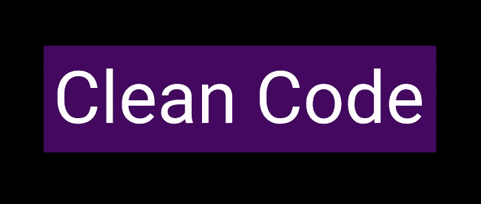
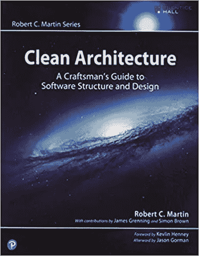

# 干净的代码:保持代码干净的技巧

> 原文：<https://javascript.plainenglish.io/clean-code-tips-to-keep-your-code-clean-bb8a0ff8f5c3?source=collection_archive---------5----------------------->

## 遵循这些提示来保持代码的整洁。

今天我们将谈论一个我非常喜欢的主题，这是罗伯特·c·马丁的畅销书《干净的代码》,更为人所知的是《鲍勃叔叔》,这本书是编程领域的经典。在其中，我学到了关于一些实践以及如何尽可能保持我们的软件健康的宝贵经验，这些经验补充了[坚实的](https://thexcodes.com/os-principios-do-solid-e-como-criar-softwares-mais-robustos/)原则。

**需要注意的是，这篇文章只是本书内容的概述，我强烈建议你阅读。**

## 什么是干净代码

在他的书中，Bob 叔叔报告说，凭借他多年的经验，他意识到软件开发中最大的问题是代码的维护。因此，一个生来就写得不好却能工作的代码，在将来会引起问题并产生损失。

也就是说，Clean Code 不是一个设计伙伴，而是一种开发哲学，它的目标是用简单的技术使代码更容易编写和阅读，最终使代码更容易理解。

## 但是如何使用干净的代码呢？

程序员的大部分工作是维护和阅读代码，这比从头开始开发代码要花费更多的时间。这也是程序员生产力的关键所在，在他的书《Bob 叔叔》中写道“阅读和编写代码的比例是 10 比 1”。这意味着程序员花在阅读上的时间比编写新东西的时间要多。

在这种背景下，干净的代码恰恰适用于新的开发和现有代码的维护，以防止代码被推荐很长时间，使其难以维护，在这些情况下，最好扔掉它，重新开始。然后继续处理错误的代码。

## 干净代码一般规则

我在《干净的代码》一书中列出了一些好的实践，它们将帮助你拥有一个干净的代码。

**抓紧约定**

坚持你或你的团队为一个项目设定的惯例是至关重要的。因为有这么多的变量名和模式，所以函数、参数、枚举器、类和方法对于项目的进行非常重要！大写或者有没有前缀都无所谓，保持默认就好。

但是设定标准的重要一点是，它应该是准确的，直接表达你的主要思想，不要害怕有大的名字。有好的描述总比花时间去理解要好。

**童子军规则**

也许你听过这句话“当你离开的时候，保持营地比你来的时候更干净”。这同样适用于我们的代码，每当你完成你的修改，确保你离开时比发现时更好。

**解决问题**

总是试图明确地解决问题，而不是肤浅地解决它。我们知道，在日复一日的忙碌中，我们往往不会以应该解决问题的方式来解决问题，这通常会导致返工。

永远试着找出真正的问题，并尽一切努力最终解决它。

**只评论必要的事情**

随着不断的代码维护，注释最终会被留下，这样，它们就不能描述代码中实际正在做的事情。

因此，这条原则规定可以进行注释，但前提是注释是必要的，并且注释与代码一起被审查。

**吻**

这个概念我在其他地方见过，但在这个上下文中，它完全有效，它说保持愚蠢的简单或“保持愚蠢的简单”。这是一个很好的方法，试着从一切都应该变得简单而不是试图把事情复杂化的原则出发来看待问题的解决。

**错误处理**

我们知道在开发中事情可能会出错，但是当它们出错时，我们有责任确保程序继续做它需要做的事情。所以处理好异常是这个过程中非常重要的一部分。

**清洁测试**

开发过程的一部分是测试，这是一个非常重要的步骤，代码只有在通过测试正确验证后才能被认为是干净的，而且必须是干净的。

对此有一些规则，它们是:

*   快速—它必须很快，并且可以根据需要执行多次。
*   独立—必须独立，以避免发生故障时产生连锁反应。
*   可重复—重复测试和不同的环境。
*   自我验证—用正确和错误的答案进行测试，以避免歧义。
*   及时——它们必须遵循准时原则，最好写在代码本身之前。

**其他要点**

拥有干净的代码还有其他重要的几点，它们是:

*   保持高水平的配置数据；
*   用多态性代替 IFs
*   使用 Async 作为后缀；
*   避免尚未定义的不必要的设置；
*   使用依赖注入；

**结论**

干净的代码是一个非常重要的概念，在考虑敏捷开发方法时更是如此。干净的代码原则解决了我们在大多数项目中遇到的许多问题，与坚实的原则一起，它成为任何想把它带到下一个级别的程序员的强制性要求。

我希望这篇文章对你有用，如果你喜欢它，请与你的朋友分享，不要忘记访问[博客](https://www.thexcodes.com)上的其他内容。

参考资料:

*   [https://www . Amazon . com . br/Clean-Architecture-Craftsmans-Software-Structure/](https://www.amazon.com.br/Clean-Architecture-Craftsmans-Software-Structure/dp/0134494164/ref=asc_df_0134494164/?tag=googleshopp00-20&linkCode=df0&hvadid=379726160779&hvpos=&hvnetw=g&hvrand=10041415539402918052&hvpone=&hvptwo=&hvqmt=&hvdev=c&hvdvcmdl=&hvlocint=&hvlocphy=1001566&hvtargid=pla-423658477418&psc=1)
*   【https://en.wikipedia.org/wiki/SOLID 号

*更多内容看* [***说白了就是***](http://plainenglish.io/) *。报名参加我们的* [***免费周报***](http://newsletter.plainenglish.io/) *。在我们的* [***社区获得独家访问写作机会和建议***](https://discord.gg/GtDtUAvyhW) *。*