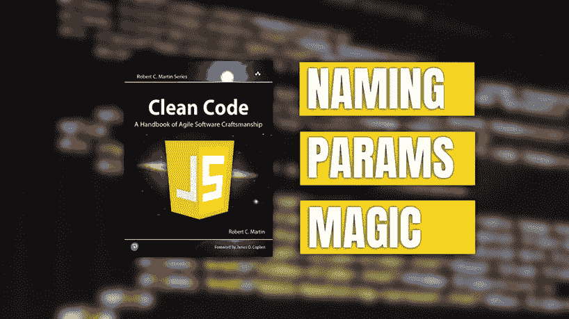
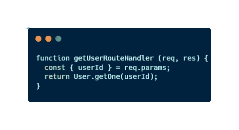
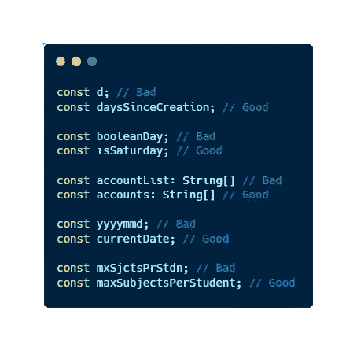
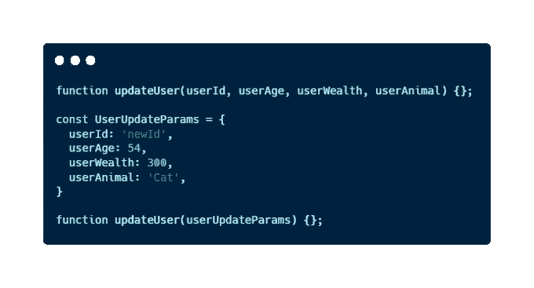
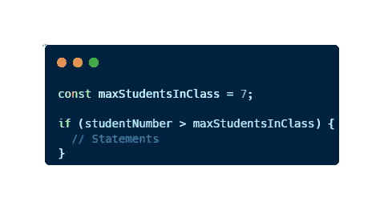

# 使用 JavaScript 示例清理代码的 3 个最有用的实践

> 原文：<https://javascript.plainenglish.io/clean-codes-3-most-useful-practices-using-javascript-examples-e80721ad3d4?source=collection_archive---------5----------------------->

## 用 20%的努力提高 80%的代码质量。



当我在第一次科技面试中被拒绝时，我决定我将 [**表现得如此出色，以至于他们无法忽视我**](https://amzn.to/3BJzMuJ) **。我做的事情之一就是阅读**干净代码**。在这本书里，我找到了让我的代码更专业的大部分代码习惯(考虑到我还是个初级开发人员)。**

你可能还会傻傻地读一本教你如何写好代码的书。*“我有能力用我的代码解决任何问题”*，你现在可能会这么想，但是让我来发现你丑陋的事实…

> 解决问题只是发展的第一部分。

是的，我从前两次面试被拒中吸取了这个教训。每个人都可以解决问题，但不是每个人都能写出其他开发人员能理解的可读、高效和可维护的代码。

出于这个原因，如果我们想提高开发人员的能力，在像 **Clean Code** 这样的书中找到好的实践是很重要的。

# 什么是干净代码？

[**是罗伯特·马丁**](https://amzn.to/3UfGeRn)******写的一本书，书中提出了干净代码哲学。这一理念将干净的代码定义为:******

> ******易于理解、易于更改和易于维护的代码。******

******在这本书里，我们可以找到一套**易于理解和修改**的代码编写原则。******

****的确，我们编写了将由计算机执行的代码。然而，我们是人，我们必须**与团队中的其他人**合作来创建一个大的软件。事实上，我们并不开发供计算机使用的代码，因为即使我们写了意大利面条式的代码，计算机也会理解它，**我们为其他人类写代码**。****

********

****An example of Clean Code using JavaScript****

****为人类编写代码并不容易。当我们开始开发时，我们认为一段好的代码将是真正复杂的，并使用只有我们才能理解的算法来解决问题。但事实上，高级工程师就是这样做的，简单的代码比复杂的代码更好。****

> ****"仅仅让代码工作是不够的."罗伯特·马丁****

****因此，如果我们想提高开发人员的水平，我们必须**获得好的实践**并且**开始编写干净的代码**。****

****如果你想知道更多关于如何改进你的代码，在这篇文章中你会发现**非常有趣的原则**:****

****[](https://medium.com/codex/solid-principles-explained-with-really-simple-real-life-examples-ac8e849d7a78) [## 坚实的原则:解释了非常简单的现实生活中的例子

### 今天就发现每个开发人员都应该知道的设计原则。它们在质量上改进你的代码并且…

medium.com](https://medium.com/codex/solid-principles-explained-with-really-simple-real-life-examples-ac8e849d7a78) 

从这本书里，我可以提炼出许多好的实践和面对面向对象编程的新方法。尽管如此，我还是要和你分享 3 个简单的方法，通过最小的努力来提高你的代码质量。

# 1.正确命名变量

在编码中，我们有一个概念叫做**变量**。使用变量，我们可以用名字代替内存地址。为什么？因为**的名字很容易使用**，内存地址也没有。同样，有了名字，我们可以获得更多关于这个变量内容的信息，而不是一个内存地址。

为此，重要的是我们不要浪费这个机会，不要恶名昭彰。因为使用一个不好的名字就像使用一个内存地址来命名一个变量:一些不可能理解和不可读的东西。

为了正确命名我们的变量，我们必须记住一些建议:

*   一个名字应该告诉你**为什么**存在，**做什么**，以及**如何**使用。
*   尝试**避免虚假信息**(如果你使用强类型语言，你不需要在变量名中包含类型)。
*   使用**易发音的**名称。
*   使用**可搜索的**名称。
*   在你的代码中保持一致。如果你总是用 is 来开始一个布尔变量的名字，尽量保持一致性。

你已经有些怀疑了吗？让我们来看一些好的和不好的命名的例子:

## JavaScript 示例



Examples of naming using JavaScript

# 2.保持参数数量最少

参数使得阅读和理解函数变得更加困难。参数越多，我们的函数就越难控制它。从测试的角度来看，它们更难(如果你不理解这一点[查看我的关于 JavaScript 示例单元测试的文章](https://medium.com/javascript-in-plain-english/an-easy-and-general-approach-to-unit-tests-using-javascript-examples-1a29ba58c948))，这意味着我们正在失去对它们的控制。

作为一般规则，我们应该将我们的方法保持在 3 个或更少的参数。我认为这有时会很复杂，但是如果我们必须在函数中加入更多的参数，可能有两个原因:

1.  我们必须**将这个方法分成不同的函数**。有可能我们的职能不符合 [*单责*](https://medium.com/codex/solid-principles-explained-with-really-simple-real-life-examples-ac8e849d7a78) 原则。
2.  我们必须使用数组、对象、类等结构封装我们的参数。

让我给你一个例子，在这个例子中，为了编写一个更简洁的代码，我们必须将我们的参数封装在一个新的对象中。我鼓励您看看这个例子，并发现可读性是如何提高的。

## JavaScript 示例



An example of parameter reduction using JavaScript

如果您想了解 JavaScript 如何工作的更多信息，请不要忘记查看以下文章:

[](/5-useful-javascript-one-liners-for-totally-beginners-56e678d9a314) [## 5 个对初学者有用的 JavaScript 一行程序

### 在短短几分钟内，您将能够减少您必须编写的代码行数，并提高您的…

javascript.plainenglish.io](/5-useful-javascript-one-liners-for-totally-beginners-56e678d9a314) [](/what-is-javascript-5-basic-features-that-define-this-amazing-language-9e12d273da8) [## JavaScript 是什么？定义这种神奇语言的 5 个基本特征

### 如果你想成为一名 JavaScript 开发者，你需要知道的 5 个基本特性。

javascript.plainenglish.io](/what-is-javascript-5-basic-features-that-define-this-amazing-language-9e12d273da8) 

# 3.避免魔法常数

这是我在书中读到的一个教训，但当我开始后端开发工作时，我明白了这一点。

什么是**幻常数**？魔法常数可以定义为突然出现在代码中的**数**。举例来说，如果我们写下类似…

```
isLegalAge = user.age > 18; 
```

18 是神奇的常数。

在这种情况下，我们很容易理解为什么代码中有 18。但请看另一个例子:

```
if (studentNumber > 7) {
  // Statements
}
```

7 是什么？为什么我们可以用 10 代替 7？

这是一个神奇常数的完美例子，也是为什么**在我们的项目**中使用它是个坏主意。

当我们像上面的例子一样不断地使用它时，我们**降低了代码的可读性**和可维护性**。当我们编码时，我们完全知道我们在做什么和为什么。然而，当时间流逝**时，我们将不知道为什么我们在代码**中放了一个 7。**

出于这个原因，最好使用一个**常量**(另一个好的做法是将常量外部化，以便在我们的代码中重用它们)，并正确命名**和**的含义**。此外，使用常数允许我们在代码的许多地方使用它。**

**让我们看看上面的代码如何改变避免魔术常数。**

## **JavaScript 示例**

****

**Avoiding magic constants using JavaScript**

**现在，一目了然，我们完全可以理解，如果学生人数超过一个班级的最大人数，就会发生一些事情。我们可以在需要的时候改变这个数字。**

# **最后的想法**

**即使你刚开始进入软件开发领域，或者你正在用它赚钱，**你想写质量代码**。你想成为一名能够编写**可读**、**可理解**、**可扩展**和可维护代码的开发人员。因此，你必须知道如何编写干净的代码。**

**《干净的代码》是一本非常广泛的书，在里面你会发现很多细节和更多的**好的实践**。然而，我已经和你分享了**的三个习惯**，我认为**可以通过**付出 20%的努力**(遵循帕累托法则)来提高你的代码**，至少 80%的质量。**

**我希望这些技巧对你有用，它们对你的帮助就像帮助我提高开发能力一样多。**

***你读过干净的代码吗？你知道另一个可以大大提高代码质量的最小实践吗？***

# **结论👋**

**谢谢大家！非常感谢您阅读这篇文章。如果你想了解更多关于技术和发展的知识，别忘了**跟我来**。我很想知道你对此的看法，所以不要花花公子**写在评论里**，我会读给你听。**

**如果这篇文章已经帮你记住了，你可以**为它鼓掌**分享给你的战友。**

# **关于作者🤓**

**嗨！很高兴见到你！我是耶稣·拉加雷斯。目前，我是一名后端软件工程师，我将在加的斯大学完成我的计算机科学学位。**

**我的两大爱好是**技术**和**交流**，所以我会抓住一切机会谈论或撰写关于技术的文章。我喜欢把复杂的概念转换成每个人都能理解的简单概念。**

# **想要连接吗？📲**

**📸[**Instagram**](https://instagram.com/jesuslagares_)**|**💼[**LinkedIn**](https://www.linkedin.com/in/jesus-lagares/)**|**📹[**Youtube**](https://www.youtube.com/c/Jes%C3%BAsLagares)**|**🐦 [**推特**](https://twitter.com/jesuslagares_)**

**📩**jesuslagaresgalan@gmail.com****

**谢谢！❣️**

***更多内容请看*[***plain English . io***](https://plainenglish.io/)*。报名参加我们的* [***免费周报***](http://newsletter.plainenglish.io/) *。关注我们关于*[***Twitter***](https://twitter.com/inPlainEngHQ)[***LinkedIn***](https://www.linkedin.com/company/inplainenglish/)*[***YouTube***](https://www.youtube.com/channel/UCtipWUghju290NWcn8jhyAw)*[***不和***](https://discord.gg/GtDtUAvyhW) *。对增长黑客感兴趣？检查* [***电路***](https://circuit.ooo/) *。*********