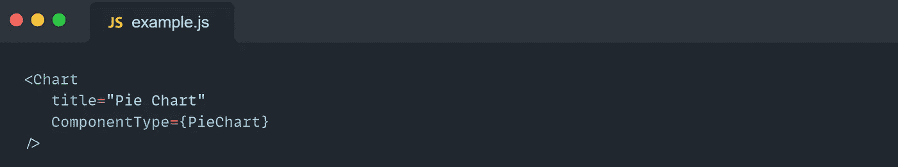

# 清理您的 React 代码

> 原文：<https://javascript.plainenglish.io/clean-up-your-react-code-63992a82d8e7?source=collection_archive---------0----------------------->

## 第 2 部分:清理 React 代码。

> 下一次你写一行代码的时候，记住你是一个作者，是为那些会评判你努力的读者而写的。~干净的代码(罗伯特·c·马丁)

## **道具类型**

JavaScript 是一种动态类型语言。动态类型语言在运行项目时检查类型。这种性质既有利于为您的代码提供灵活性，同时也会使您的代码容易出错。

> “随着应用程序的增长，你可以通过类型检查发现很多错误。对于某些应用程序，您可以使用 JavaScript 扩展，如 [Flow](https://flow.org/) 或 [TypeScript](https://www.typescriptlang.org/) 来检查整个应用程序的类型。但即使你不使用这些，React 也有一些内置的类型检查功能。”~ reactjs.org

有了 prop 类型，我们可以使我们的组件(类和函数组件)定义良好——通过表达组件期望接收的 prop 及其类型(验证规则)。

让我们来看一个例子。假设我们有一个“输入”组件:

很好，只要看看代码，我们就知道“输入”组件有什么属性，这些属性是必需的还是可选的，以及可选属性的默认值。

现在，如果我们在没有设置的情况下使用“输入”组件，例如“类型”属性，我们将在浏览器控制台中收到警告(由于性能原因，仅在开发模式下)。

为了用 PropTypes 进行类型检查并使用它的不同工具，我们必须安装[*prop-types 库*](https://www.npmjs.com/package/prop-types) (从 React v15.5 开始)。

## **构图**

React 有一个声明式编程方法。在本文的第一部分中，我们讨论了不变性和纯函数。

组合是函数式编程的另一个重要概念。

让我们看一个简单的函数示例:

因此，我们创建了两个小的、可测试的纯函数。我们可以单独使用这些函数，也可以将它们组合在一起创建一个新函数。

现在，让我们深入一个组件通信的例子。
假设，我们在应用程序中有“日期选择器”和“表格”可重用组件。并且需要创建一个“用户列表”组件，并按出生日期过滤用户。

因此，我们可以简单地将这些“Table”和“DatePicker”组件添加到 render 方法中。

因此，通过遵循组合范例，我们有了干净的、小的、可测试的组件，我们可以将这些组件组合在一起，并创建可维护的、可读的、复杂的应用程序。

## **最佳实践**

*   ***片段***React 组件不能返回多个元素而不将它们包装到父元素中。

用 React。片段，我们避免将子元素包装到不必要的 div 元素中。

为什么返回多个元素会出错？

JSX 不是 HTML，它把文件转换成 JavaScript。
当我们试图返回多个元素时，意味着我们试图在 JavaScript 中返回多个函数。

*   ***字符串道具***去掉字符串文字道具周围的花括号。

*   ***布尔道具***JSX 有布尔道具的简写。

所以我们不需要写我们的 prop 等于 true。

*   ***引号***对 JSX 属性使用双引号，但对 JavaScript 字符串使用单引号。

> “为什么？常规的 HTML 属性通常也使用双引号而不是单引号，所以 JSX 属性反映了这一约定~ Airbnb React/JSX 风格指南

*   ***组件作为道具***如果你传递一个组件作为道具值就使用 PascalCase。

*   ***析构***
    不使用点符号来访问对象的多个属性，而是使用对象析构。

> “为什么？析构使您不必为这些属性创建临时引用，也不必重复访问对象。重复的对象访问会产生更多的重复代码，需要更多的阅读，并产生更多的出错机会。”~ Airbnb React/JSX 风格指南

[清理你的 React 代码(第一部分)](/clean-up-your-react-js-code-fd6dc54dcde)

*作者 Mariam Kochumian* 。

*更多内容请看*[***plain English . io***](https://plainenglish.io/)*。报名参加我们的* [***免费周报***](http://newsletter.plainenglish.io/) *。关注我们关于*[***Twitter***](https://twitter.com/inPlainEngHQ)*和*[***LinkedIn***](https://www.linkedin.com/company/inplainenglish/)*。加入我们的* [***社区不和谐***](https://discord.gg/GtDtUAvyhW) *。*