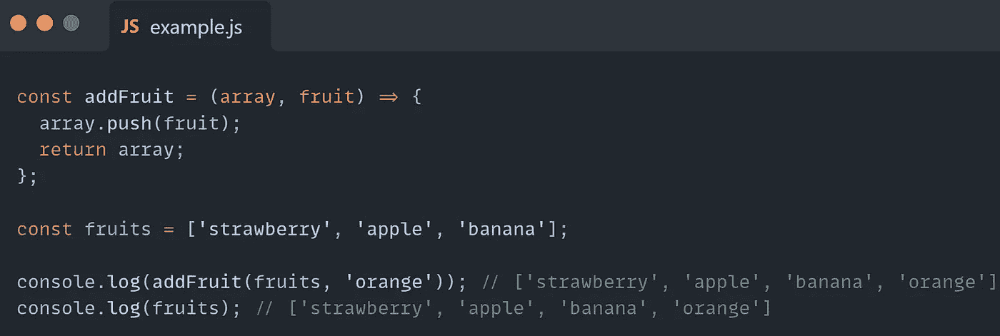
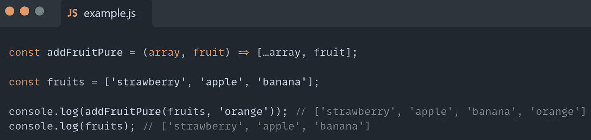
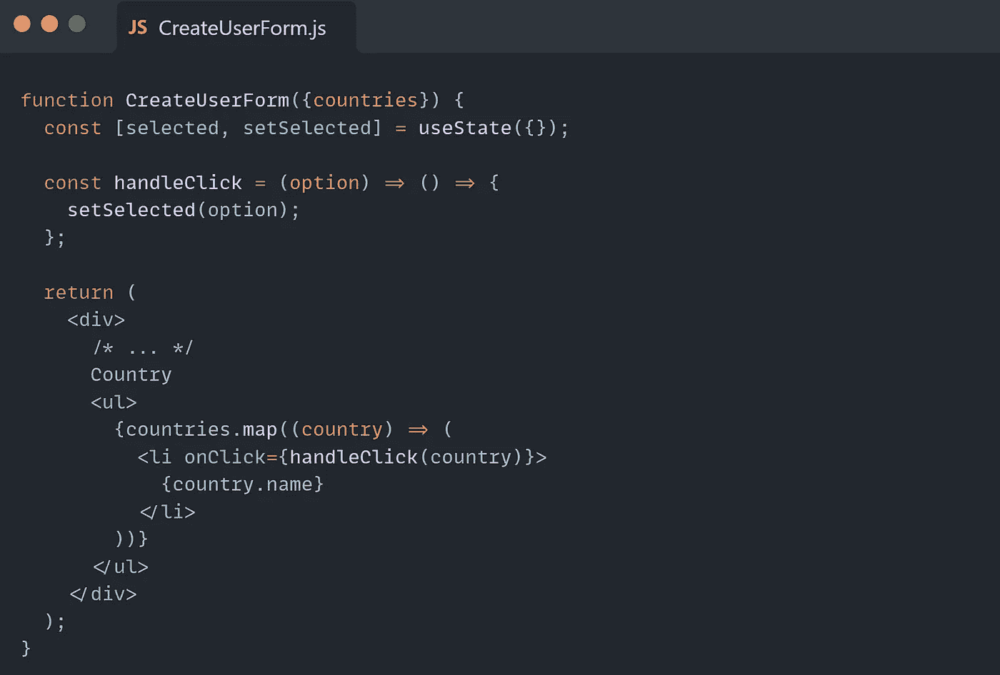
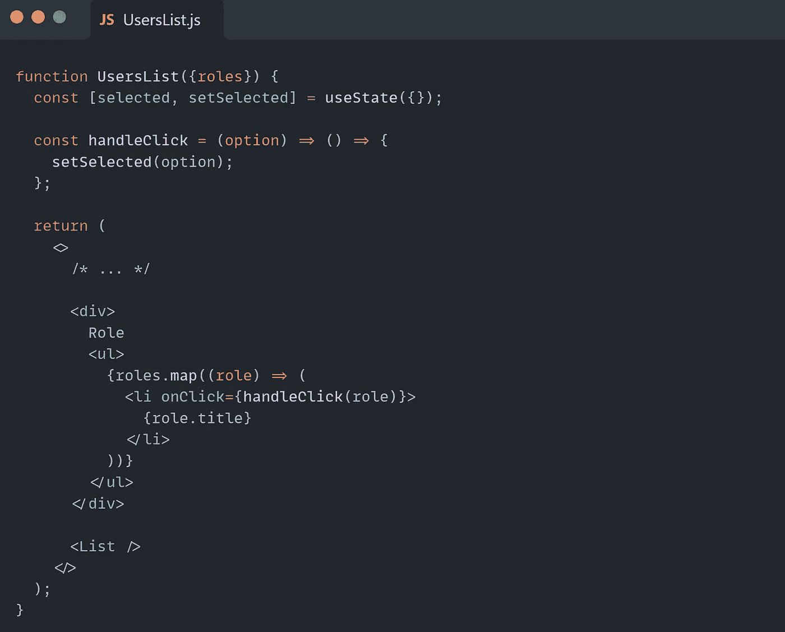
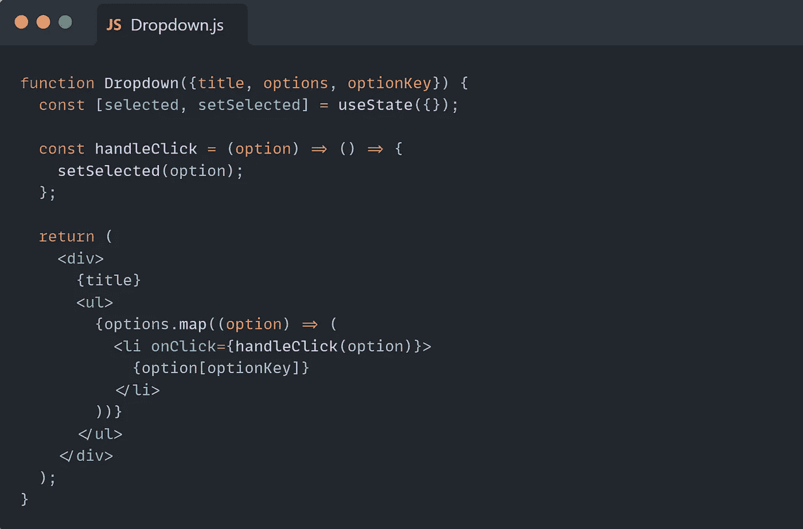
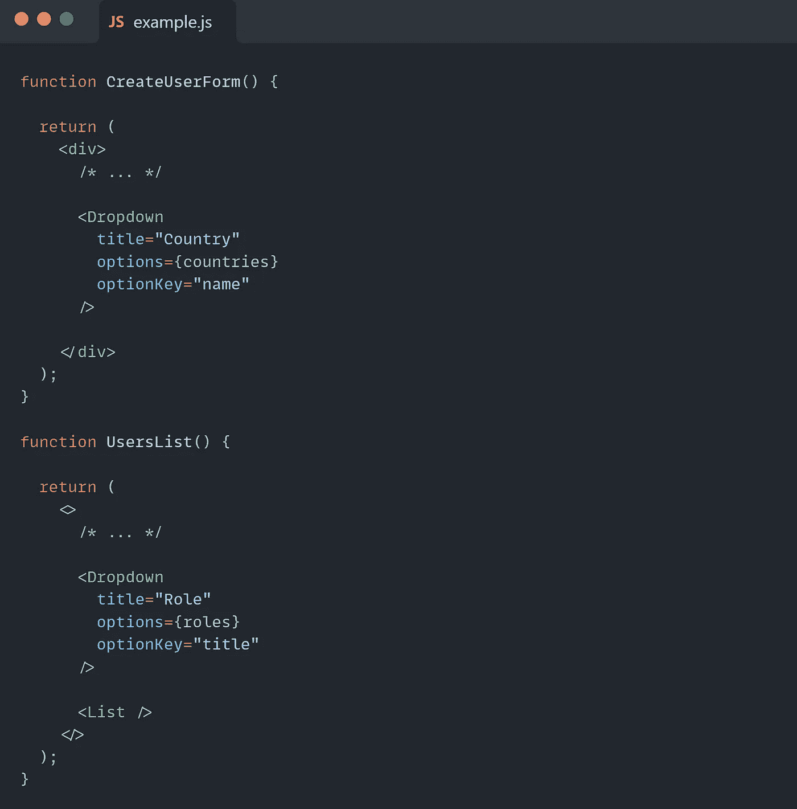
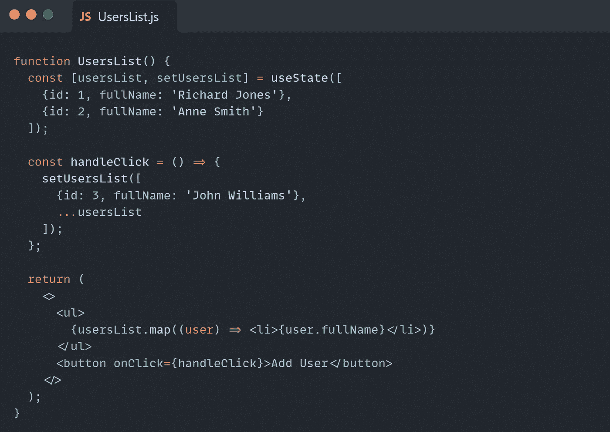
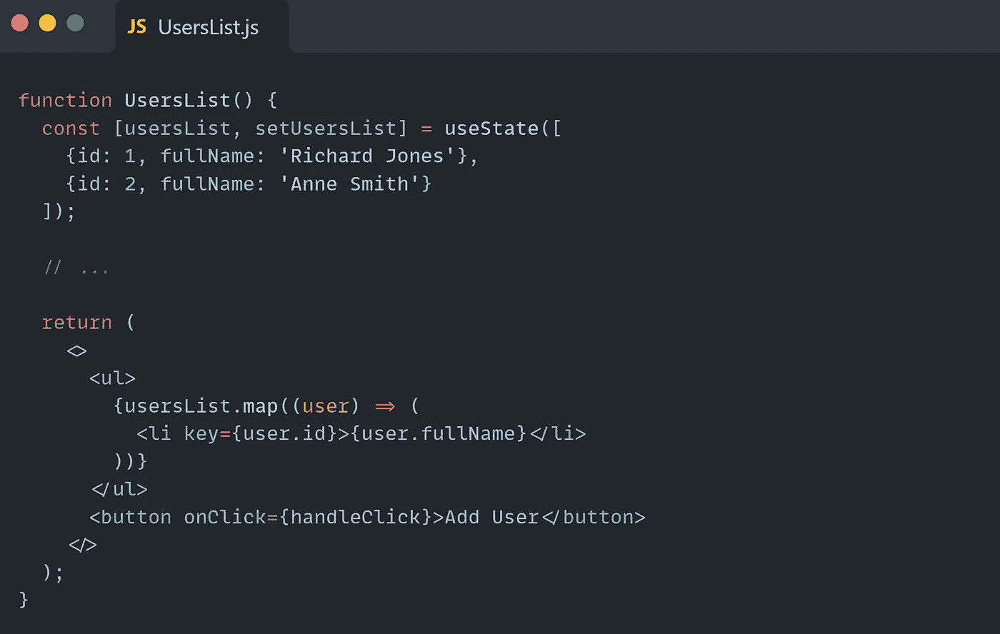
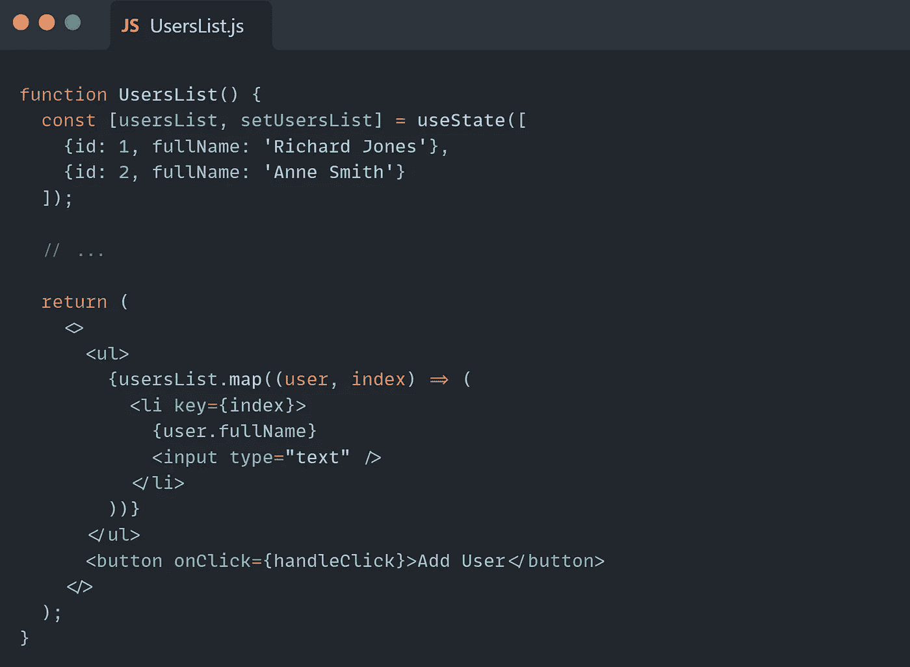
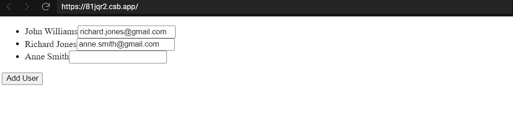

# 清理您的 React 代码

> 原文：<https://javascript.plainenglish.io/clean-up-your-react-js-code-fd6dc54dcde?source=collection_archive---------1----------------------->


> “即使你只是为自己写代码，没有任何其他人以任何方式使用它的可能性，如果你写了清晰的代码，你未来的自己也会感谢你。”~在 JavaScript 中清理代码(詹姆斯·帕多尔西)

## **不变性**

React 有一个声明式编程方法。因此，为了清理我们的代码，理解声明式编程的含义并遵循函数式编程风格是很重要的。

不变性是什么意思？

基本上，不可变值是不能改变的值。因此，我们需要创建一个新的副本并返回它，而不是改变原始数据的值。这种处理值的方式被称为不变性。

让我们看一个简单的例子:



函数的作用是改变给定数组的值。

我们需要将函数更改如下:



“addFruitPure”函数在不影响原始数组的情况下返回一个新数组。

将输入值视为不可变的函数调用**纯函数**。
纯函数没有副作用，如果我们调用这个函数两次，我们会得到相同的结果。

这些概念经常被用到，尤其是当你使用像 Redux 这样的库的时候。

## **让你的代码保持干燥**

> “不要重复你自己(DRY)是软件开发的一个原则，旨在减少软件模式的重复，用抽象代替它。”
> ~维基百科

复制代码通常会导致问题和意想不到的结果，因为它会影响代码的可维护性，并使调试变得非常困难。

React 可以帮助我们避免重复使用可重用组件的代码。

我们来深入一个例子。假设我们有一个“创建用户”表单，要创建一个用户，我们必须从下拉框中选择一个国家，我们的应用程序中还有一个“用户列表”组件，我们可以按角色过滤用户。



在 render 方法中，我们循环遍历各个国家，并将每个选项映射到一个

*   元素中。

我们再次循环角色，为每个角色显示标题而不是名字。

让我们更详细地看看这些组件:

它们都有一个标题——国家和角色、所选选项的状态以及在 onClick 事件触发时触发的 handleClick 函数。

区别在于 UsersList 中的选项值是 title(role.title)而不是 name(country.name)。

所以我们组件的主要需求是显示下拉列表的标题，映射选项列表和处理 onClick 事件。



“Dropdown”组件接收属性，显示标题，并遍历集合。

我们现在可以重写我们的组件:



太好了，现在我们可以在应用程序中多次使用“下拉”组件，只需传递正确的道具即可。也许有一个新的需求来改变下拉菜单的样式或实现额外的功能，我们可以在一个点上进行更改，所有使用它的组件都会知道修改。

## **不要忘记钥匙**

React 有不同的技术来优化组件的呈现。

> "关键字帮助 React 识别哪些项目已被更改、添加或删除。应该给数组内部的元素赋予键，以给元素一个稳定的标识。~ reactjs.org

因此，使用 key 属性有助于避免应用程序中不必要的重新呈现。

让我们深入研究代码:



上面的简单组件显示了一个用户列表和“添加用户”按钮，该按钮将新用户作为第一个元素插入到列表中，导致组件的新呈现。

如果我们运行代码，我们会看到(在浏览器 DevTools 中)React 不仅添加新元素，还会改变以前用户的值，并在列表末尾添加一个新项目(因为 React 会计算出元素与第一次呈现时不同)。

幸运的是，React 为开发人员提供了一个提高组件渲染性能的工具。

现在，我们可以更改渲染方法并在每个元素上添加关键属性:



如果我们再次运行代码，我们将看到组件的行为是相同的。然而，如果我们打开浏览器 DevTools，我们会发现一些不同的东西——React 不会改变以前元素的值，因为它知道哪个元素是新的，哪个元素必须更新。

最后但同样重要的是，如果项目从未被重新排序，您可以将项目的索引作为键传递。

让我们再次创建“用户列表”组件，但以如下方式更改呈现方法:



我们添加了一个输入框，为每个用户写一封电子邮件。

运行代码，写完电子邮件后，让我们单击按钮，将新用户添加到列表的开头。

我们将得到一个意外的行为，如下面的屏幕截图所示:



用户的全名将下移，而输入字段的值不会改变。这是因为 React 认为我们更改了前两个用户的值(因为 0 和 1 键值)并添加了一个索引为 2 的新元素。

## **诚信通**

ESLint 是一个开源的 JavaScript 林挺实用程序。它可以帮助我们避免语法错误，在我们输入代码时检查代码的正确性，并最终实施通用的编码风格指南，这在有许多开发人员的大型团队中非常重要。

ESlint 是高度可配置和可扩展的。

首先，我们必须安装 ESLint，如下所示:

```
npm i eslint
```

安装 ESlint 之后，我们可以使用。项目根文件夹中的 eslintrc 文件:

【https://github.com/MariamKochumian/eslintConfig 

我们使用“规则”键来添加一些规则。有三个级别的规则:

*   关闭或 0:规则被禁用
*   warn 或 1:该规则是一个警告。
*   错误或 2:规则抛出一个错误。

在 ESlint 配置之后，我们可以添加带有 [*Husky*](https://typicode.github.io/husky/#/) 和 [*lint-staged*](https://github.com/okonet/lint-staged#readme) 的 Git 预提交钩子。

[清理 React 代码(第二部分)](https://medium.com/javascript-in-plain-english/clean-up-your-react-code-63992a82d8e7)

*作者 Mariam Kochumian。*

*更多内容看* [***说白了。报名参加我们的***](https://plainenglish.io/) **[***免费周报***](http://newsletter.plainenglish.io/) *。关注我们*[***Twitter***](https://twitter.com/inPlainEngHQ)*和*[***LinkedIn***](https://www.linkedin.com/company/inplainenglish/)*。加入我们的* [***社区***](https://discord.gg/GtDtUAvyhW) *。***