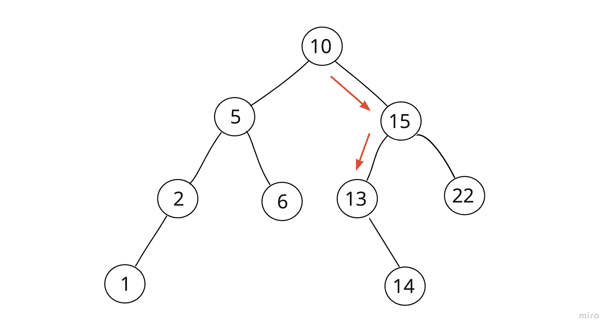

# 在二叉查找树中查找最接近的值

> 原文：<https://javascript.plainenglish.io/closest-value-in-binary-search-tree-3969bf8dfb03?source=collection_archive---------11----------------------->

## 解决 AlgoExpert 的实践问题:在二叉查找树中寻找最接近的值。

我坚持我的二叉树是棕榈树…

最近，我开始解决 AlgoExpert 的练习题，我真的很喜欢它。在我看来，提供的解决方案和界面的整体感觉比 LeetCode 更令人愉快。

今晚的问题是让我找出二叉查找树中最接近的值(目标值)。

**深思熟虑(天真的解决方案)**

首先，我将从树中收集所有的值。

然后遍历它们，检查它们与目标的接近程度。

返回离目标最近的一个。

**实施**

听起来很简单，就时间和空间复杂性值得怀疑的天真、简单的解决方案而言，它是可行的。

让我们从 BST 类开始:

现在伪代码是:

现在是完整的代码:

这是一种非常简单的方法，实现起来也很有趣，但是在时间和空间复杂度方面，我们肯定可以做得更好。

在这一点上，因为我们正在访问和存储每个值，我们正在寻找 O(n)的时间和空间复杂度。

**优化**

二叉查找树结构的一个最好的方面是它允许我们 O(log n)的搜索时间复杂度。所以我想尝试，至少尽可能接近这一点。

**通过**重新思考

这一次，我没有遍历树的整个 DFS，而是使用二叉树规则来标记具有最接近目标值的分支的路径:

我基本上将使用我的目标值(在本例中为 12)来指导我的遍历。我将沿途保存我访问过的节点，然后简单地遍历它们，并确定哪一个最接近 12。

现在，我已经有效地将遍历的时间复杂度缩小到 O(log n ),但是通过对以前访问过的节点进行额外的迭代，我实际上可能更接近 O(n log n)。

这是我想到的方法:

虽然它的工作，我很高兴对优化的尝试，我想听听其他人的想法，所以如果有什么突出了你，请随时给我发消息！

*更多内容请看*[***plain English . io***](https://plainenglish.io/)*。报名参加我们的* [***免费周报***](http://newsletter.plainenglish.io/) *。关注我们关于*[***Twitter***](https://twitter.com/inPlainEngHQ)*和*[***LinkedIn***](https://www.linkedin.com/company/inplainenglish/)*。查看我们的* [***社区不和谐***](https://discord.gg/GtDtUAvyhW) *加入我们的* [***人才集体***](https://inplainenglish.pallet.com/talent/welcome) *。*