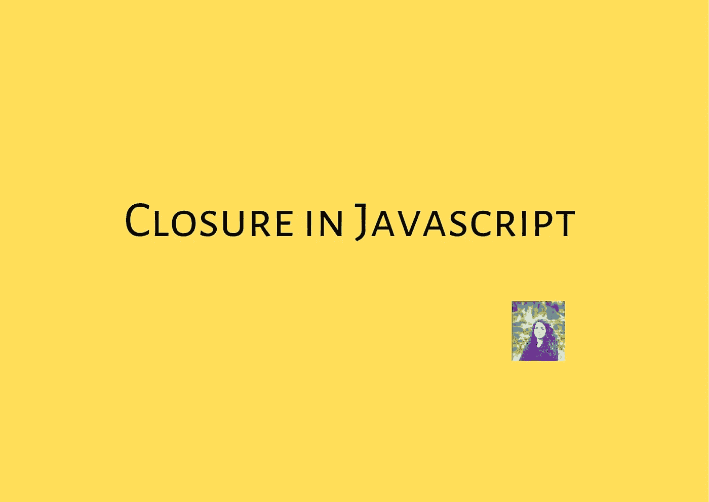
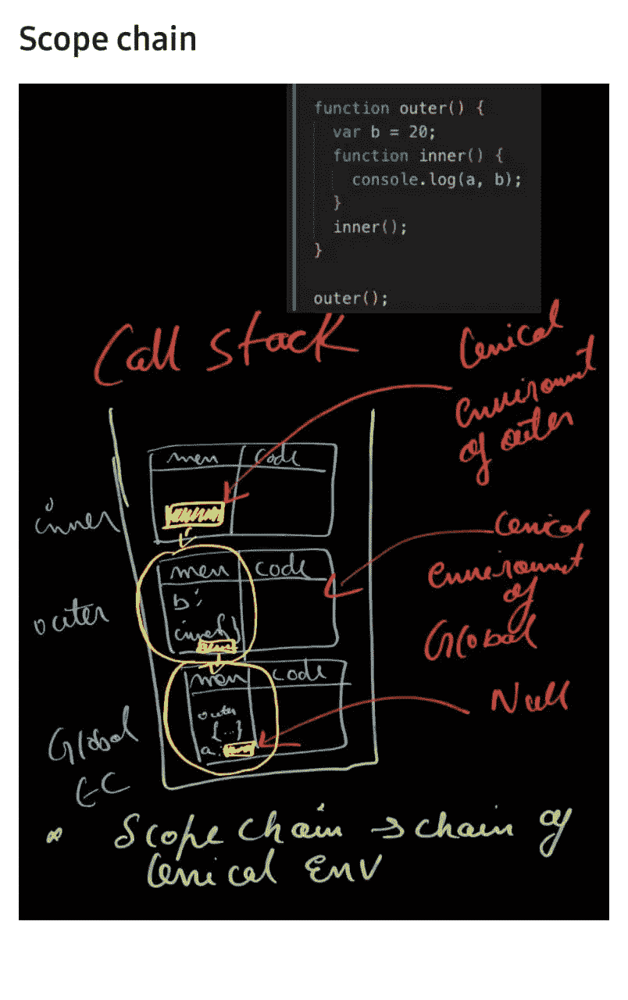
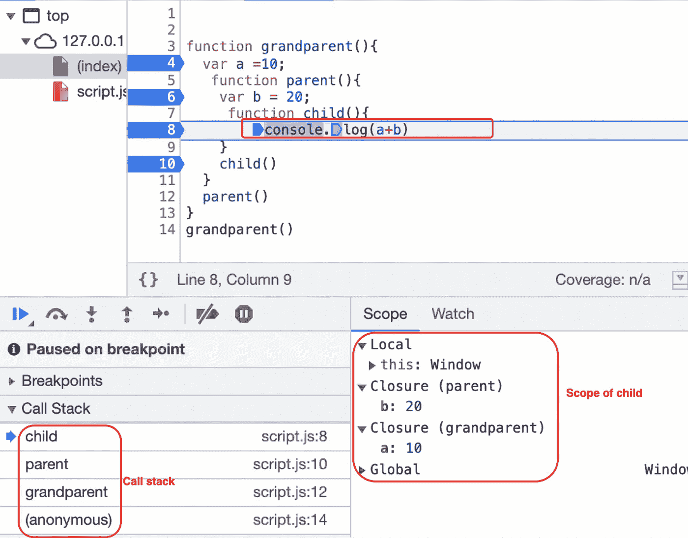
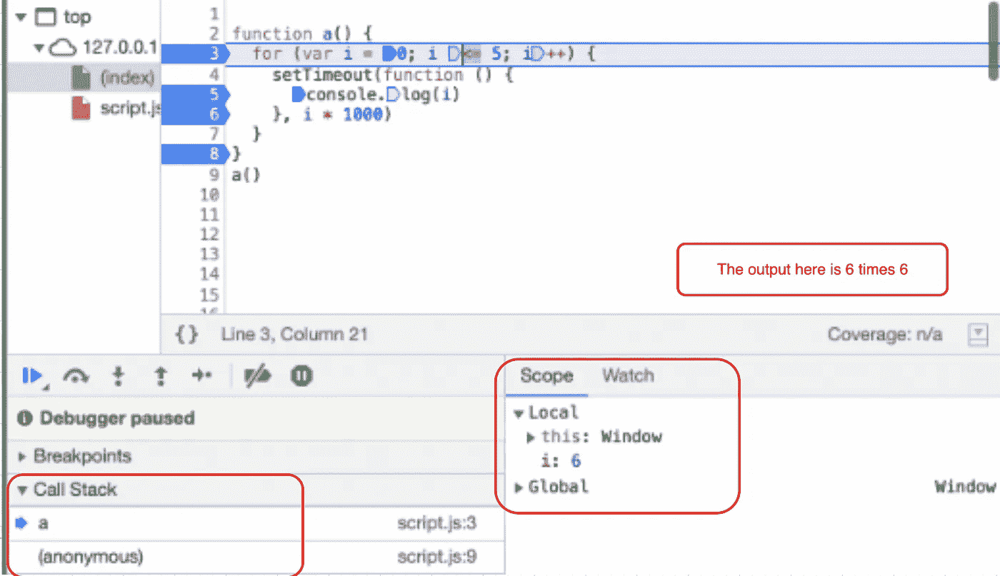
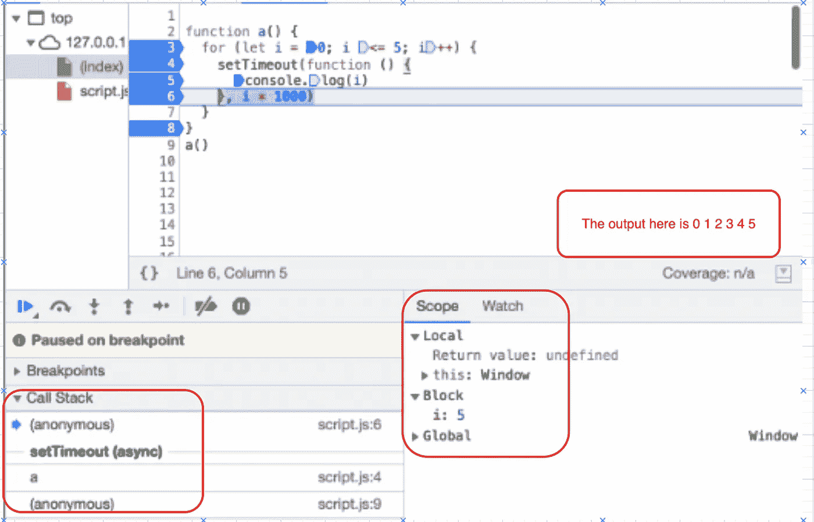
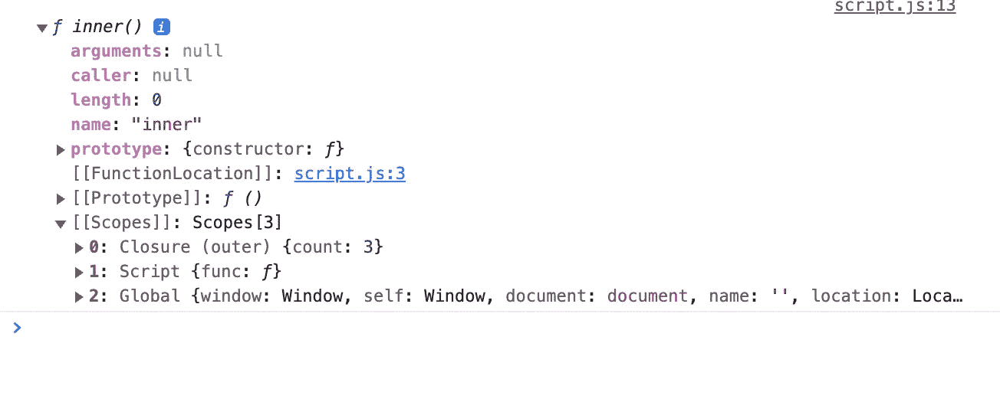

# JavaScript 中的闭包:详细指南

> 原文：<https://javascript.plainenglish.io/closure-in-javascript-7122f87759a?source=collection_archive---------9----------------------->



> 根据 [MDN](https://developer.mozilla.org/en-US/docs/Web/JavaScript/Closures) ，“一个*闭包是一个函数与对其周围状态(词法环境)的引用捆绑在一起(封闭)的组合。”*

为了简化，内部函数总是可以通过*闭包*访问外部函数。这里需要注意的一件重要事情是*词法环境。*由于**l*exic 环境，内部函数可以访问其父函数的所有变量。*

*下图中的黄色矩形是父函数的词法环境，所有函数都包含父函数的词法环境及其局部变量。词法环境的链是*范围链*。*

**

*让我们看看下图，这里我们有三个函数，一个在另一个里面。由于闭包，最里面的函数 child()可以访问祖父级()的所有变量。*

> *由于封闭性，函数即使在被返回后也会记住它们的作用域。*

**

## *闭包的用例*

*   *Currying*
*   *包装*
*   *像 memoize 和 once 这样的函数*
*   *设置超时*
*   *模块设计模式*

## *关于结束的常见面试问题*

*这段代码的输出会是什么*

```
*function a() { for (var i = 0; i <= 5; i++) { setTimeout(function () { console.log(i) }, i * 1000)}}a()*
```

**

*这里的输出是 6 乘以 6。由于闭包，函数总是记住在函数诞生期间声明的变量，因此 **i** 总是引用相同的内存位置(因为 I 是使用 var 声明的),我们每次都得到最终值 6 作为输出。*

*让我们做一个小小的改变，用 **let** 替换 **var***

```
*function a() { for (let i = 0; i <= 5; i++) { setTimeout(function () { console.log(i) }, i * 1000) }}a()*
```

**

**看看这两幅图像，你可以清楚地看到我说的* ***让*** *是一个遮挡范围的区别。**

*我们可以通过简单地使用 **let** 而不是 **var 来解决上述问题。let** 是一个块作用域，每次调用函数时，它都会创建一个新变量，因此引用不同的内存位置。*

*正如本文所解释的，总是推荐使用 **let** 或 **const** ，因为两者都是块范围的。*

*我们也可以不用 let 来解决上面的问题。解决方案是我们必须引用不同的内存位置，我们可以通过将 setTimeout 封装在不同的函数中来实现。现在，每次调用函数 b()时，都会创建一个新的 **j** 副本。*

```
*function a() {for (var i = 0; i <= 5; i++) { function b(j) { setTimeout(function () { console.log(j) }, j * 1000) }b(i)}}a()*
```

*记住闭包只是函数的内部属性，我们不能显式地访问它。如果您想查看任何函数的作用域，请尝试下面的代码。*

```
*function  outer(){let count = 0;return function inner(){count ++;console.log(count)}}const func = outer()func()func()func()console.dir(func)*
```

**

*我们可以看到[[Scopes]]包含闭包。这里的[[]]表示该属性不能从外部访问，是一个内部 JS 属性。*

# *结论*

*我希望在读完这篇文章后，闭包概念是清晰的，你将能够在面试中更好地解释它。*

> *如果我错过了什么，或者你有什么建议，请在评论区告诉我。*
> 
> **你也可以联系我* [*https://www.linkedin.com/in/akhatun/*](http://linkedin/)*
> 
> *[https://www.instagram.com/readwithamnah/](https://www.instagram.com/readwithamnah/)*
> 
> *[*https://github.com/amnahkhatun*](https://github.com/amnahkhatun)*

**链接到更多关于 JS 的文章**

*[](https://medium.com/front-end-weekly/debouncing-and-throttling-in-javascript-3c8f8cf5e645) [## Javascript 中的去抖动和节流

### 去抖动和节流都用于通过限制事件的次数来提高网站性能…

medium.com](https://medium.com/front-end-weekly/debouncing-and-throttling-in-javascript-3c8f8cf5e645) [](https://medium.com/front-end-weekly/debug-like-a-pro-7749db57b4b1) [## 像专家一样调试

### 作为一名 web 开发人员，你必须了解一些很棒的调试技术。老实说，我一直在使用…

medium.com](https://medium.com/front-end-weekly/debug-like-a-pro-7749db57b4b1) [](/execution-context-understanding-javascript-9f70302c50be) [## 执行上下文:理解 JavaScript

### 执行上下文是我们在使用 JavaScript 时需要了解的核心概念之一。了解执行力…

javascript.plainenglish.io](/execution-context-understanding-javascript-9f70302c50be) 

编码快乐！✌️

*更多内容看* [***说白了就是***](https://plainenglish.io/) *。报名参加我们的* [***免费每周简讯***](http://newsletter.plainenglish.io/) *。关注我们* [***推特***](https://twitter.com/inPlainEngHQ) *和*[***LinkedIn***](https://www.linkedin.com/company/inplainenglish/)*。查看我们的* [***社区不和谐***](https://discord.gg/GtDtUAvyhW) *加入我们的* [***人才集体***](https://inplainenglish.pallet.com/talent/welcome) *。**