# 码角 2022 道

> 原文：<https://javascript.plainenglish.io/code-angular-the-2022-way-make-the-change-and-be-ahead-8493224ac6ae?source=collection_archive---------1----------------------->

## 不要因为继续用老方法编码 Angular 而被 Angular 14 遗漏。立即升级您的应用程序，让您的代码更简洁、更快速。

Angular 14.0 出来了！🎉许多期待已久的特性终于出现了，更多的特性将在未来几个月陆续推出。这篇文章将主要讨论 2022 年 Angular 将会对你产生什么样的影响或者帮助你更好的编码。我们走吧！

# 严格类型形式

如果你看过我之前关于**棱角分明的严格打字形式**的文章，你对这种变化一定不陌生。可以参考我之前的文章 Angular 13 或更早版本中的严格类型化 Angular form。

 [## 角形类型支持每个开发人员需要的

### 你有没有想过为什么角反应形式没有智能感知支持？以下是您设置它们的方法…

javascript.plainenglish.io](/angular-form-typings-support-that-every-dev-needs-e198d4c1b63d) 

现在，在 Angular 14 中，没有我在上面的文章中经历的所有痛苦，你可以免费享受打字的形式。耶！🎉

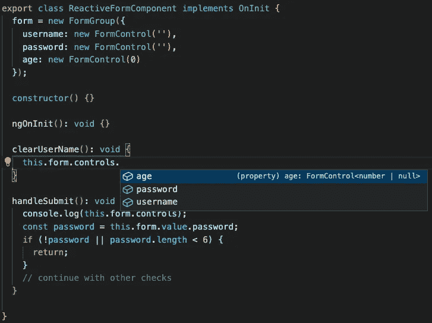

按照常规实现你的反应式，确保你的角度包是 14 版。

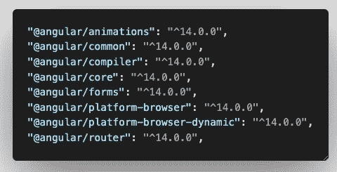

**类型的表单**将是 Angular 14 的默认表单，不需要额外的配置。表单变量的可访问性将有助于确保您不会将错误的值类型分配给不正确的表单变量。VS 代码会在那里捕捉它并让你知道。

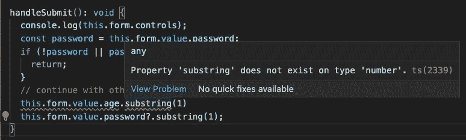

有了**类型化的表单**，您就可以确信错误的类型分配将会减少或不再出现。如果你想知道如何在 Angular 13 到 Angular 14 中缓慢平稳地迁移你所有的反应形式，而不中断你的应用程序，你会得到很好的帮助。执行`ng update`时，Angular 会将旧的反应式表单类更新为`UntypedForm`。

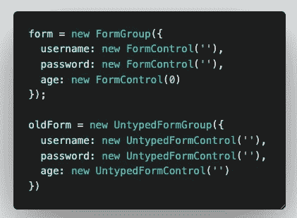

这是一个好消息，你所有的旧表单仍然可以工作，你可以慢慢地将你的旧`UntypedForm`更新为新的`FormGroup`，并利用它为反应表单提供的所有可访问性。

要了解有关这一变化的更多信息，您可以浏览此页面了解更多信息。

 [## 有角的

### Angular 是一个构建移动和桌面 web 应用程序的平台。加入数百万开发者的社区…

angular.io](https://angular.io/guide/typed-forms) 

# 每条路线的页面标题

大多数 Angular 开发者不关心的开发部分——应用程序的页面标题。

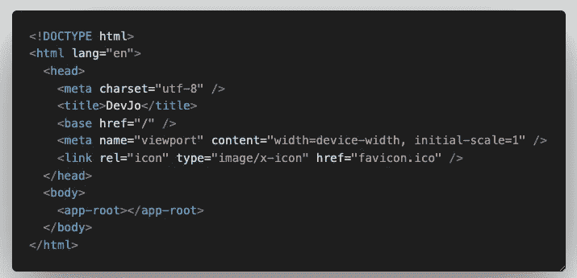

`index.html`中的这部分代码你看着眼熟吗？不，不是这样的，我也为此感到内疚。很多时候，尤其是当你在开发 PWAs 的时候，你的用户在手机上看到浏览器的页面标题时，并没有意识到他们在哪个页面上，因为所有的页面都显示默认的标题。否则，您将不得不在每个页面中实现额外的逻辑来显示页面的标题，这可能会很长。然而，现在在 Angular 14 中，他们让我们变得很容易，你可以轻松地定义你的浏览器的页面标题，只需在你的`Routes`中添加标题字段，就大功告成了！

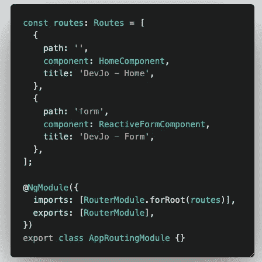

现在你的应用程序会在浏览器标题中准确显示你在哪个页面，而不是在`index.html`文件中默认的无聊标题标签。

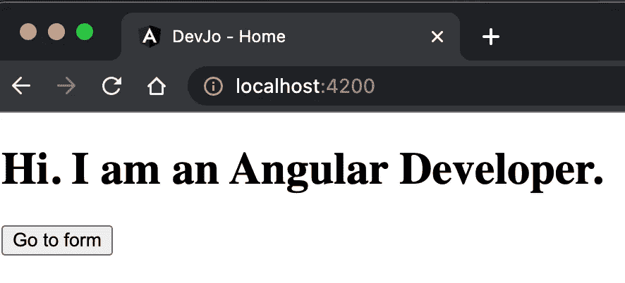

Home page of the application

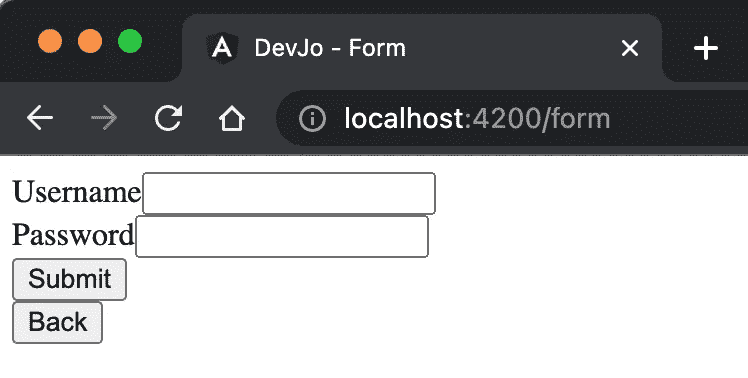

Form page of the application

# 双向绑定的“盒中香蕉”语法

你是否花了几个小时试图找出为什么你的双向绑定变量不能工作或更新？我有！有趣的是，大多数开发人员在使用双向绑定时都会遇到这个问题。他们不用`[(ngModel)]`，而是用`([ngModel])`。幸运的是，在 Angular 14 中，IDE 将向开发人员强调这个问题，并为您节省大量时间来调试为什么双向绑定不起作用。这是一个救命稻草，因为从技术上讲,`([ngModel])`是代码编辑器中可接受的语法。

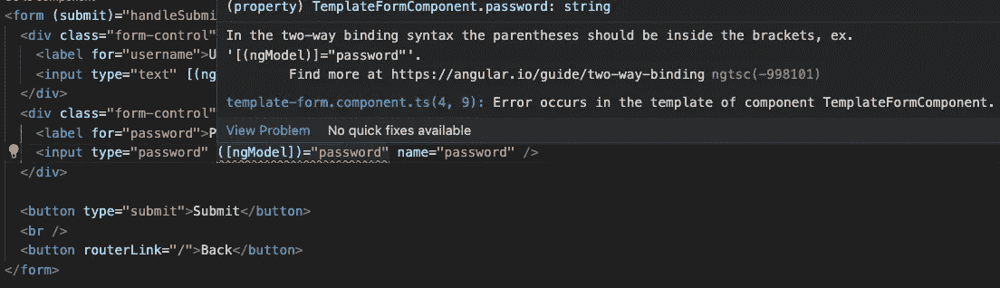

# 捕捉无用的无效合并运算符

你是否在不可空或未定义的变量上使用了**无效合并操作符**？虽然在异常情况下使用安全操作符是一种好的做法，但是应该正确使用它以使应用程序平稳运行。

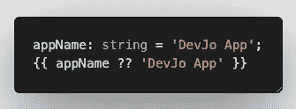

useless nullish coalescing operator being used

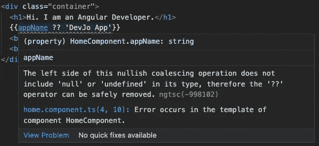

`appName`永远不会是`null`或`undefined`，因此对其使用**无效合并运算符**是多余的。因此，为了简化这种常见的对**无效合并操作符**的误用，Angular 14 实现了警告，让开发人员知道哪些**无效合并操作符**在他们的组件中是无用的，他们可以删除它，或者在必要时将`null | undefined`类型添加到他们的变量中，以便他们的应用程序可以再次变得更好。

对于上面提到的两点，**盒子里的香蕉**和**捕捉无效合并运算符**，如果您还没有准备好通过编辑`tsconfig.json`文件来修复它们，您可以在 Angular 14 中暂时禁用它们。

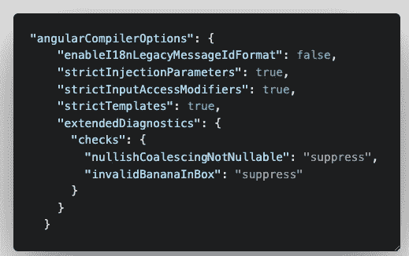

但是我的建议是你逐步修复这个警告，让 Angular 14 在检查中施展它的魔法，让你的应用程序干净快速。

# 摘要

希望这篇文章能给你一些动力，让你很快升级到 Angular 14，并让你在应用程序投入生产之前，充分利用严格检查的力量。这些小检查可能看起来像额外的工作或不必要的检查，但是它们将帮助您的应用程序避免愚蠢的错误，并为您节省大量调试明显错误的时间。

如果您对 Angular 14 感到兴奋，请在下面的评论中告诉我，您在迁移到 Angular 14 时会面临哪些挑战。我很想知道这件事，看看我们是否能互相帮助，让这个过渡更顺利。干杯！🍻

 [## 用我的推荐链接- DevJo 加入媒体

### 阅读 DevJo 的每一个故事(以及 Medium 上成千上万的其他作者)。你的会员费直接支持 DevJo 和…

medium.com](https://medium.com/@devjo/membership) 

*更多内容请看*[***plain English . io***](https://plainenglish.io/)*。报名参加我们的* [***免费周报***](http://newsletter.plainenglish.io/) *。关注我们关于*[***Twitter***](https://twitter.com/inPlainEngHQ)*和*[***LinkedIn***](https://www.linkedin.com/company/inplainenglish/)*。查看我们的* [***社区不和谐***](https://discord.gg/GtDtUAvyhW) *加入我们的* [***人才集体***](https://inplainenglish.pallet.com/talent/welcome) *。*