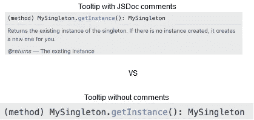
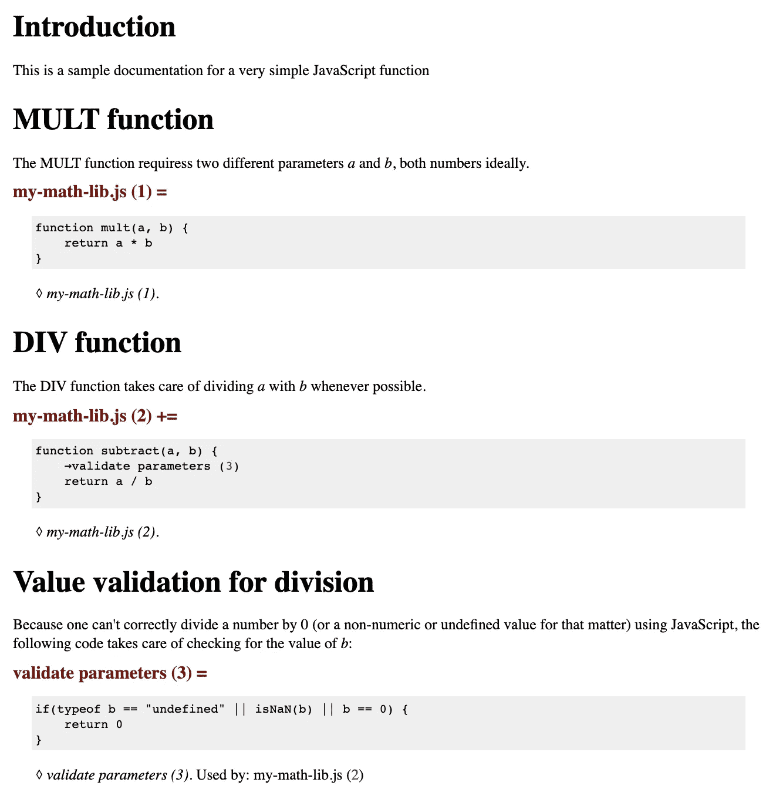

# 为人类而不是为机器编写代码——一瞥我的新书

> 原文：<https://javascript.plainenglish.io/code-for-people-not-for-machines-a-glimps-into-my-newest-book-a8b4084cad43?source=collection_archive---------16----------------------->

## 说到写代码，你的同事应该是你的目标，而不是编译器。


Photo by [Mapbox](https://unsplash.com/@mapbox?utm_source=unsplash&utm_medium=referral&utm_content=creditCopyText) on [Unsplash](https://unsplash.com/s/photos/discuss-developer?utm_source=unsplash&utm_medium=referral&utm_content=creditCopyText)

我知道这个建议听起来可能违反直觉，但是当你写代码时，你不能考虑解释器或编译器，或者它如何翻译成机器代码。这不关你的事，相反，你应该关注明天谁会去读它。

即使你认为除了你之外没有人会阅读你的代码，重点仍然必须是相同的。编码有时需要我们想出复杂的解决方案，相信我，即使是你写的，第二天它们也不总是有意义的。

让我们假设您的新功能 PoC 运行良好，并且您和您的团队现在面临着实现其完整版本的任务。

你要做两个月的编码工作，不仅仅是你，还有你的三个队友都将参与其中，这意味着四个开发人员为同一个特性编写代码。这导致人们相互交流，并在彼此的文件上写字；这是完全正常的，也是意料之中的。开始工作两天后，你发现你和你的团队每天都开会回顾彼此的工作，以了解你的逻辑是如何工作的。

结果，你们都花了很多时间去理解代码，而不是编写代码，你们的技术主管要求你们所有人在会议上提出替代解决方案。你们都可以做些什么来解决这个问题，现在和项目的剩余时间。

你有什么建议？

# 自我记录的代码不存在

一些开发人员对这个问题提出的一个可怕的解决方案是编写避免复杂逻辑解决方案的代码，使用 mnemotechnic 变量和函数名(也就是说，不使用 foo 和 bar，他们将使用`monthly_revenew`和`current_index`)。他们说代码将是干净和易读的，他们说代码本身可以是文档。请注意，这确实是一个很好的实践，也是你应该追求的目标，但是仅仅这样还不够。

我不敢说，但这就像向圣诞老人要独角兽一样。不管你怎么看，这都不现实。

你可能会坚持几天，然后当截止日期到来或周末临近，你想回家的时候，`user_with_too_many_logins`变成了`foo`，就这样，整个自我记录的计划消失了。

无论您提出什么样的解决方案，都需要随着代码密度而扩展，并且需要长时间保持工作状态。说你最终会记录它是行不通的，因为记录两个月的代码是一项巨大的任务。比编写代码花费更多时间的解决方案也是行不通的。你必须在两者之间找到平衡。

让我给你看几个选项，你选择一个最适合你和你的环境的。无论你选择使用哪一种，考虑以下几点:这都是为了减少阅读你代码的人的认知负荷。

换句话说，你需要记住代码是要被解析成机器代码的，它有一个特定的结构，但是人们不会像机器解析代码那样解析和思考。我们更慢，我们的记忆也有问题，当阅读大块的代码时，我们往往会迷失在逻辑中，忘记一段数据来自哪里。无论您选择实施哪种解决方案，都应该在这方面有所帮助。

# 注释您的代码

这是最明显的一个，99.99%的编程语言都支持注释(我不是 100%，因为我肯定有一些深奥的语言不需要注释)。

你不能满足于写它们，它们需要有意义、有用并保持更新。

看看清单 1 和我留给您的那一行注释。

清单 1:我们虚构的登录表单的示例登录函数

这可能是你正在开发的新功能的一部分逻辑。当然，这并不干净，这是一个非常简单的方法，但是看看顶部有用的评论。你认为通过阅读它，你能够理解如何使用这个功能吗？或者它的目的是什么？

这一行评论实际上没有任何意义，可悲的是我已经无数次看到这样的评论了(见鬼，我以前甚至也写过这样的评论)。

要让一个评论有用，并提供真正的帮助来减少我之前提到的认知负荷，它需要:

1.  **给读者增加价值。**什么是价值？任何读者通过查看函数的签名，或者通过查看注释要解释的代码行无法知道的事情。如果我们正在处理一个代码块的注释，解释内部逻辑并提及过程中涉及的步骤。为什么不添加额外的信息，比如 JavaScript 代码中变量的类型呢？你是在评论一个函数还是一个返回某个东西的方法？一定要提到返回值，是什么？是什么类型的？其他试图使用你的代码的人可能需要的任何东西都必须解释清楚，否则，就又回到了询问别人或者犯错的问题上。
2.  跟上时代。阅读一篇过时的评论，并希望它能帮助你找出代码，这就像看着夜空，想象你现在看到的星星就是那个样子一样现实。它们中的任何一个都可能已经变成超新星，而你在几千年后也不会发现。注释也是一样，如果它们在代码更新时没有更新，那么你看到的是一个旧版本的解释，这只会增加混乱和错误。如果你正在更新代码，确保你更新了相关的评论，将来你会为此感谢你的。

在编写注释时，可以使用一些格式标准，这些注释可以被其他工具获取，例如 IDE 或文档生成工具。这些工具将代码及其注释混合在一起，以便更好地理解代码。

看一下图 1。



*Figure 1: Comparing the effects properly formatted comments have on your IDE*

请注意，当一个格式正确的注释被添加到组合中时，由相同代码生成的工具提示是如何不同的。这是 JavaScript 代码，注释遵循 [JSDocs 标准](https://jsdoc.app/)。这些标准告诉你如何用一种机器可以解析并从中获取有用信息的结构来格式化你的评论。您清楚地标识了诸如变量类型和名称、返回类型、描述等内容，然后，在我们的例子中，IDE 解析它并显示信息性的工具提示。

其他语言也有类似的东西，不仅仅是 JavaScript。确保为你旅途中使用的任何语言寻找这些标准，并将它们应用到你的评论实践中。它们不会解决你所有的问题，但肯定会有很大帮助。

你现在可能不是，但最终，你会成为一个开发团队的一员，为同一个目标而努力。问题是，除非你们都被强迫，否则不是每个人的代码都会遵循相同的标准。

语言本身设定了你需要遵循的语法，也许你使用的框架迫使你在代码中使用一组特定的模式，但是你仍然有很大的回旋余地来添加你自己的编码风格。如果团队中的每个人都有相似的风格，这不是问题，但是许多方面会因开发人员的不同而不同，除非有人设定一个通用的标准来遵循，否则会变得混乱。

一些框架使用的一种编程范式(以前由 Ruby on Rails 流行)被称为“约定优于配置”,这意味着您应该期望拥有“合理的默认”行为，并且只关心在没有达到预期的默认时为您的逻辑部分创建特定的代码。例如，在您的代码中有一个表示数据库表的类，如果这个类叫做“Notes ”,那么您会希望表有相同的名称，并且您的类对表上的每个字段都有一个属性(同样，适当地命名和键入)。只有在由于某种原因没有达到预期的情况下，您才不得不跳进去编写所需的代码来映射值或使类在两个世界之间工作所需的任何内容(这是您的内部逻辑和数据库结构)。

为什么我突然开始谈论约定胜于配置？因为你应该期望你的团队和你的编码标准以同样的方式工作。阅读别人的代码应该像阅读自己的代码一样。这有助于减轻一些与在心理上解析代码以理解它试图做什么相关的认知负荷。

例如，有一套标准告诉你:
●如何命名你的变量(例如:总是使用英语单词和一个骆驼格符号，或者使用特定的前缀来标识它们的类型，而不必查找它们的定义)。这本身不足以记录您的代码，但这是一个很好的起点。
●如何执行特定的次要任务(比如比较两个值总是用===而不是有时用==来比较)。
●一行代码的最大长度(通常他们强制为 80 个字符，这对应于终端通常允许的 80 个字符)。
●如何给你的文件命名或者保存在哪里(比如有一个特定的文件夹，所有的常用代码都应该放在里面)。

我可以继续，但你明白了。这些标准是为了让你不去想那些微不足道的任务，而去担心解决问题的重要工作。请注意，这些标准可能是固执己见的，毕竟，它们可能来自一个人(您的技术主管)。这很好，因为你不必担心同意他们，但你必须使用他们，就像你在一起工作一段时间后加入团队一样。

好消息是有被称为“linters”的工具可以帮助你在你的代码中检查这些标准。它们通常包含在您的 IDE 中，或者可以配置为在预部署或预合并事件上运行，以确保您没有发送不符合正确约定的代码。

编码标准是编写更容易被团队中的其他人阅读的代码的好方法，即使这个人比你晚了几年，而你已经不在公司工作了。当然，标准本身不会使你的代码可读，但它们相当于找到三种用英语写的不同笔记，一种来自 1300 年，一种来自 1920 年，一种来自去年。它们都是用英语写的，但风格略有不同；通过将它们翻译成现代版本的语言(也就是说，对这三种语言强制使用相同的标准)，你(以及从今天开始的其他人)将会更容易阅读它们。

# 识字编程的一个例子

还记得我之前说过没有自文档化代码这种东西吗？好吧，拿着我的啤酒，因为我要违背我自己的话了。

文化编程是一种编程范式，它允许你同时编写代码和文档。

你看，通常发生的是你首先写你的代码，然后写基于它的文档。你可以，潜在地，走另一条路，用写好的文档作为开发蓝图来创建代码。

有了有文化的编程，你可以同时写两者。你围绕你的逻辑创建一个解释，并展示你的代码片段。该结果文档被处理，工作代码被创建并保存到一个位置，同时，该文档的动态版本(即，通常为 HTML 版本)被保存到其他地方。

给你一个简单的例子，假设你正在构建一个 JavaScript 库，它将为你提供两个函数:`mult`和`div`(乘法和除法)。遵循有文化的编程，您可以编写如清单 2 所示的文档。

清单 2:我们的文档/源代码的标记版本

```
 ..    include:: <isoamsa.txt>                            
    ..    include:: <isopub.txt>

    Introduction
    -------------
    This is a sample documentation for a very simple JavaScript function

    MULT function
    --------------
    The MULT function requires two different parameters `a` and `b`, both numbers ideally.

    @o my-math-lib.js
    @{
    function mult(a, b) {
       return a * b
    }
    @}

    DIV function
    -------------
    The DIV function takes care of dividing `a` with `b` whenever possible.

    @o my-math-lib.js
    @{
    function subtract(a, b) {
        @<validate parameters@>
        return a / b
    }
    @}

    Value validation for the division
    ------------------------------
    Because one can't correctly divide a number by 0 (or a non-numeric or undefined value for that matter) using JavaScript, the following
    code takes care of checking for the value of `b`:

    @d validate...
    @{if(typeof b == "undefined" || isNaN(b) || b == 0) {
        return 0
    }@}
```

正如您所理解的，没有一个地方可以将我们的代码放在一起并组织起来；我把代码分成三个不同的部分。其中两个被标记为输出到同一个文件(my-math-lib.js ),第三个被标记为包含在其他部分中的代码片段。

这种工作方式的主要好处是，你需要从只写代码(或只写文档)的状态转变过来，需要同时考虑这两者。如果处理得当，最终结果将是充满示例的更加丰富的文档，并且代码不容易出错，因为您已经彻底解释了它的意图。

最初是由 Donald Knuth 在 1984 年左右提出的，这种编程范式非常适合小型编码项目。通常情况下，您会希望创建详细的文档，其中包含一些示例，例如供其他开发人员使用的库和工具。这些项目通常比创建整个公司的内部内部网要小。

它的工作方式是:

1.  你用一种标记语言把所有东西都写在一起(根据实现的不同，它可以是 Markdown、LeX 或类似的语言)。
2.  您需要在整个文本中使用特定的自定义标记来表示元素，如代码片段、导入语句(将您的写作拆分为多个文件)以及允许您在不同位置重用文本块的其他元素。
3.  您将把所有片段编织到最终的源代码中。
4.  最后，您将把代码片段和书面文档合并成一个 HTML 文件，作为面向用户的文档。

不要太担心编织和缠结阶段(最后两步)，因为它们会被 [pyWeb](https://github.com/slott56/py-web-tool) 处理，我们将使用这个工具来解析清单 2 中的代码。

使用它的结果是，我们得到两个文件:my-math-lib.js，正如您在清单 3 中看到的，它是完整的 JavaScript，没有任何额外的文档，my-math-lib.html 是动态文档。

清单 3:我们代码的最终版本，没有任何额外的文档

图 2 显示了同一文件的复杂版本，这次呈现为交互式 HTML。



Figure 2: The tangled version of the documentation, mixing code and comments

默认情况下，HTML 是预先格式化的，但是您可以编辑它和它的样式表，使它看起来像您喜欢的任何样子。这里的要点是，最难的部分，也就是编写要在某处发布的 HTML 已经为您完成了。相比之下，改变风格让它看起来更好是一件小事。

这就是我们所有文档问题的答案吗？这种编程范式改变了我们工作和编写代码的方式吗？我不认为是这样，因为更大的项目仍然需要专注于代码和文件夹结构，这是文化编程所不能提供的。但是较小的，比如库和小框架，可以利用它，而不会看到它们的编码工作流有太大的变化。这绝对是一个兼容所有编程语言的有趣选择，如果您希望节省一些编写文档的时间，这是一个很好的选择。

# 可读代码>>一行程序

尽管各种形式的文档对于帮助人们理解代码如何工作是至关重要的，但是关于你写代码的方式还是有一些要说的。有时一行代码可能需要几段文档，因为它过于优化和精简，以至于精神上解析它需要太长时间。这在大多数情况下是无法接受的。

除非你正在为资源受限的设备编写嵌入式代码，否则保存字符和编写代码不会产生巨大的好处。相反，考虑为人类和机器编写相同的解决方案(即代码可以工作，但是更容易阅读)。清单 4 中的例子说明了我的意思。

清单 4:可读与优化的代码

清单 4 中相同函数的两个版本产生相同的结果，但是一个版本只需要一行代码，而另一个版本需要 11 行代码。V2 比原著更好吗？这是一个需要回答的主观问题。一个拥有多年经验的专业 Python 开发人员团队不需要花太多时间来阅读这个一行程序函数，但是当新来的人打算对它进行编辑或扩展时，这个人就会面临一些问题。这不仅仅是因为这个函数很难理解，而是因为它已经被简化为一行，但功能却不变，这意味着复杂性已经被打包到特定的结构中。

在本例中，嵌套了两个列表理解表达式和一个对 max 函数的调用。如果我们想继续在代码中添加逻辑，例如，大写姓名并从返回值中删除名字，我们需要扩展我们的单行函数，使其更难阅读，并为没有姓氏的场景添加内嵌检查。清单 5 展示了新功能是如何基于增加的复杂性而增长的:

清单 5:清单 4 中的例子增加了逻辑

您可以看到，原始函数的代码仍然更容易进行心理分析。你有一个明确的地方，你可以检查是否有姓氏使用，如果没有该怎么办。对于一行程序，我们求助于使用 index -1，如果您不知道它的意思，它引用从列表末尾开始的第一个元素(最后一个)。这是可行的，但是在数组上使用负索引并不是每个人都能接受的，这需要您理解 Python 是如何具体处理它们的。

同样，这两个函数做同样的事情，但是通过这个基本的例子，您可以看到我们仍然手动翻译打包的逻辑，而不是让您阅读它。

当然，较长的函数也可以被简化，并且仍然保持比 V2 更好的可读性，但是这里的要点是向您展示两个极端。您不应该以任何一个为目标，您应该以介于两者之间的东西为目标，比如下面的清单 6。

清单 6:一个新版本，集两者之长

我们去掉了第一个`for`循环，因为已经有一个函数为我们做了这件事:max。我们保持了逻辑中“复杂”的部分不变，并且进行了扩展，因为这样更容易阅读。

说了这么多，你需要记住一件事:可读的代码不能代替文档，它们是相辅相成的。你仍然需要记录你的算法，并解释你为什么要这么做。编写可读的代码可以帮助您避免详细记录某些部分，从而节省一点时间。

可理解的代码不是解决方案过于复杂的借口。当你试图使你的代码易于阅读时，考虑一下这一点——你也可能落入一个常见的陷阱:过度工程化。

本文到此为止。如果你想了解这本书的更多信息，可以在曼宁的 liveBook 平台上查看[这里](https://livebook.manning.com/book/skills-of-a-software-developer?origin=product-look-inside&utm_source=blog&utm_medium=organic&utm_campaign=book_doglio_skills_6_21_21&utm_content=author)。

摘自 [*一个成功软件工程师的技能*](https://www.manning.com/books/skills-of-a-software-developer?utm_source=blog&utm_medium=organic&utm_campaign=book_doglio_skills_6_21_21&utm_content=author) by me
*写代码的时候，你需要把人(而不是机器)放在心上来写。如果没有好的注释和文档，其他阅读您的代码的人在开始使用它之前可能不得不花费大量的时间去理解它。*

通过在[manning.com](https://www.manning.com/?utm_source=blog&utm_medium=organic&utm_campaign=book_doglio_skills_6_21_21&utm_content=author)的结账处将 **fccdoglio** 输入折扣代码框，获得成功软件工程师 技能的 35%折扣。

*原载于 2022 年 1 月 19 日*[*https://dev . to*](https://dev.to/deleteman123/code-for-people-not-for-machines-a-glimps-into-my-newest-book-2n58)*。*

*更多内容请看*[***plain English . io***](http://plainenglish.io/)*。报名参加我们的* [***免费周报***](http://newsletter.plainenglish.io/) *。在我们的* [***社区***](https://discord.gg/GtDtUAvyhW) *获得独家获得写作机会和建议。*