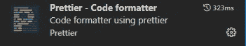

# 代码质量:提交前林挺

> 原文：<https://javascript.plainenglish.io/code-quality-pre-commit-linting-848eb87a4b88?source=collection_archive---------15----------------------->

## 为什么代码格式化和林挺是必要的，尤其是对于大型项目。


Photo by [Joshua Woroniecki](https://unsplash.com/@joshua_j_woroniecki?utm_source=medium&utm_medium=referral) on [Unsplash](https://unsplash.com?utm_source=medium&utm_medium=referral)

2012 年，我开始尝试开发网络应用。作为第一个项目，我选择了做网站建造师。这种软件需要大量的客户端交互。从那时起，我知道只有一个图书馆能够帮助我完成这个任务。这就是传说中的 jQuery。我全力以赴实现互动目标。最终结果相当不错。即使现在，我仍然为此感到自豪。这是我第一个真正的项目。尽管从那以后我对代码质量和架构模式一无所知。

**“代码有效，不要碰”**

当我完成构建初始阶段，包括后端和前端部分时，我开始提到我对自己构建的代码感到不太舒服。

jQuery 给了我很大的自由来组织文件和文件夹。我不得不说这是糟糕的自由。所以我的代码看起来像是你把你的狗一个人留在家里。所有的物品都乱七八糟，一切都乱七八糟。这并不是完全的混乱，而是对应用程序的每个组件进行了全新的排序。

起初，一切都很顺利和清晰。我把所有的代码都记在了脑子里。过了一段时间，它变大了，问题就开始了。每次我需要某个组件时，我都必须找出所有的代码来找到这个组件。虽然这是另一个话题。

代码的主要问题是我用不同的代码风格编写代码。有一次我用制表符，下一次我用空格。变量、方法和常量是用不同的情况编写的，不遵循任何代码风格。

一方面，我不知道编码最佳实践是我的问题。另一方面，初级开发人员不可能知道所有这些细微差别。

## **问题**

每个程序员在如何编写代码上都有自己的偏好。不同编码者的编码风格可能不同。事实上没什么不好。我们都是人，都有自己的感知。然而，通常，软件工程师是团队工作的。这就是问题开始的地方。

假设您被分配了一项任务，进行代码审查。你试图阅读代码，但是过了一会儿，你意识到你什么也看不懂，主要问题出在代码风格上。变量是以不寻常的情况编写的，函数也是如此。线条太长，超出了屏幕边框。缩进没有对齐。一旦有一条线的空间，另一次没有线。

代码风格不是唯一的也是最大的问题。代码本身的正确使用对性能和可读性都很重要。

我什么意思？例如，let 用于具有单一赋值的变量。如果不会改变，为什么不用 const 呢？或者另一个案子。您已经将一些库导入到一个文件中，但是后来决定不使用它们。如果它没有被使用，应该把它从文件中删除，否则应用程序的大小会超过它所需要的大小。

## **例子**

让我们比较一下经过修饰和美化的代码和没有林挺的代码。为此，我们将采用角代码。

无绒毛和无格式:

```
import { CrudService } from 'src/app/services/crud.service';
import { Component, OnInit } from '[@angular/core](http://twitter.com/angular/core)';[@Component](http://twitter.com/Component)({
  selector: 'app-example',
  templateUrl: './example.component.html',
  styleUrls: ['./example.component.scss']
})
export class ExampleComponent implements OnInit {constructor( ) { }ngOnInit(): void {
  }public someMethod() {
    let rabbitName = 'Walter'; return rabbitName;
  }public anotherMethod(){
    let one = 1;
 let two = 2;return one+two;
  }
}
```

Lin 测试和格式化:

```
import { Component} from '[@angular/core](http://twitter.com/angular/core)';[@Component](http://twitter.com/Component)({
  selector: 'app-example',
  templateUrl: './example.component.html',
  styleUrls: ['./example.component.scss']
})
export class ExampleComponent{ constructor( ) { } public someMethod() {
        return 'Walter';
    } public anotherMethod() {
        const one = 1;
        const two = 2; return one+two;
    }}
```

如你所见，第二个例子没有多余的内容，可读性更好。这只是一个小小的演示。想象一下，一个应用程序包含几十个文件和几千行代码。

## **棉绒是解决办法**

把所有的最佳实践都记在脑子里是有好处的。然而，即使是高级开发人员也可能会无意中遗漏一些东西。有一些工具可以帮助开发人员保持代码的整洁和结构化。

## **Eslint**


Linter 是帮助解决代码风格和语法问题的主要工具。如果你正在处理 vs 代码，你可能想要使用 eslint 扩展。它在实时模式下分析代码，并提出改进建议。

## **更漂亮**



对于开发者来说，还有一个有用的工具叫做**更漂亮的**。它也可以用作 vscode 扩展。该工具的主要目的是以一种视觉上漂亮的方式格式化代码。它对齐所有空格和缩进，为开发人员提供漂亮的代码格式。

仅仅在 IDE 中拥有这些扩展并不能保证团队中的所有开发人员都足够负责并且会使用这些工具。

我们如何确保 git 存储库中不会出现未打印或未格式化的代码？不幸的是，没有一个大型前端库/框架支持强代码林挺。它们中的大多数都有 lint cmd 命令，这些命令运行 linter 并验证遵循标准的代码。

不管怎样，有 npm 软件包可以帮助完成这个任务。

## [哈士奇 ](https://www.npmjs.com/package/husky)

即将推出一个 npm 包来帮助我们确保不会有不干净的提交进入我们的 git 树。叫哈士奇。这个包的主要目的是为 git 操作创建钩子。这样就有可能在预提交钩子上绑定 Eslint 和更漂亮的动作。

请参考这个 [StackOverflow 问题](https://stackoverflow.com/questions/67176520/how-can-i-run-ng-lint-and-detect-errors-on-pre-commit#fromHistory)。那里有哈士奇的基本设置。此外，它还解释了如何使用预提交挂钩。

## **重述**

本文讨论了代码格式化和林挺的必要性。关注代码质量至关重要，尤其是在容易出错的大型项目中。

**Lint** —当代码违反标准时，负责警告开发人员的脚本。

代码**格式化/美化**——一种使代码更易于阅读的操作。

*更多内容看* [***说白了就是***](http://plainenglish.io/) *。报名参加我们的* [***免费周报***](http://newsletter.plainenglish.io/) *。在我们的* [***社区获得独家访问写作机会和建议***](https://discord.gg/GtDtUAvyhW) *。*