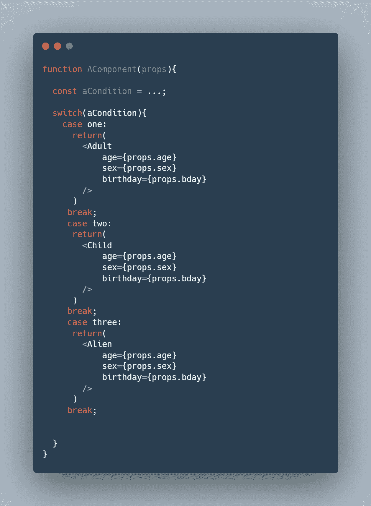

# 代码可重用性:每个初学者都不应该避免的实践

> 原文：<https://javascript.plainenglish.io/code-reusability-the-practice-every-beginner-shouldnt-avoid-4a9a24d58588?source=collection_archive---------6----------------------->

## 什么是代码可重用性，它的好处是什么？

Photo By [**Irvan Smith**](https://www.instagram.com/mr_vero)

早上好，朋友们，我的工程师同事们，

今天标志着我在 FAANG 的第五周的结束。到目前为止，我已经开发了三个不同的特性。我已经提交了如此多的代码修订，我不断收到的最高评论之一是，反馈总是围绕着代码可重用性的想法。

每当我看到这些评论，我总是打自己的头，因为它是如此明显，但我总是出错。这绝对是我的一个问题领域。我完全拥有它。我希望我能从中吸取教训。在我下一次提交代码时，我希望看到更少的关于代码可重用性的反馈，这是成长的标志。

只有时间能证明一切。

但同时，我想和你谈谈这件事。当你开始你的职业生涯时，我希望你有一个更好的开端。从我的错误中吸取教训，在你的游戏中处于领先地位。所以就来说说吧。

# 什么是代码重用？

代码可重用性听起来确实如此。这是一门重用代码的艺术——不管是你以前写的，还是来自一个库或框架——来为你的软件创造新的软件或新的功能。

你不应该一遍又一遍地写同一块代码。在你的代码中应该有最少的重复。如果您确实看到代码中到处都是重复，这是实现可重用代码的好机会。如果您看到某些功能在代码的不同位置重复出现，请创建一个可重用的函数。如果你看到 React props 甚至简单的变量作为一个单元一起被重用，那么把它放在一个 JavaScript 对象中，使它可重用。显然，如果您看到一个值被重复硬编码，您肯定也不希望这样。

这里有一个例子:

在这里，道具年龄、性别和生日被一次又一次地重复使用，并且它们都被赋予了相同的值。这是编写可重用代码的好机会。

或者，如果你看到整个文件中有五行(任意数目)连续重复，可以把它转换成一个函数并重用它。并确保函数名是可读的和不言自明的。你的团队成员不需要阅读实际的函数来理解你的函数的目的。

这很公平，对吧？

# 但是可重用代码不仅仅是一个文件。

您完全可以重用存储库、库和框架中其他文件的代码。它采用导入函数、组件和变量的形式。这实际上是受到鼓励的。可重用性使得维护代码库变得更加容易。

关于可重用代码的有趣之处在于，它必须从一开始就被考虑到。代码必须以可重用的方式设计。意图必须从一开始就存在；否则，代码可能无法重用，也无法适应各种不同的用例。

这很有趣，因为可重用代码显然应该满足某种目的，但它也应该足够灵活，可以适应和扩展到其他用例。您的团队可能已经创建了它并将其用于一个特定的用例。但是对于另一个团队来说，他们应该能够获取你的可重用代码并重新利用它。他们应该能够添加到它创造一些新的东西。

因此，可重用代码应该像构建软件的通用构件一样。它不应该如此严格和僵化，只能用于这一个特定的场景。

除此之外，还有一点需要补充的是，您创建的函数应该实现一个特定的目标。在您打算使之可重用的单个函数下，不要执行十亿个不同的操作，这些操作对您的情况来说是唯一的。例如，如果函数的目标是过滤掉一个数组，只选择姓氏以某个字母开头的人，那么该函数应该单独返回一个数组，其中包含姓氏以该字母开头的人。不要继续以只对您的特定用例有益的方式操纵数据。

这听起来显而易见，但令人惊讶的是事实并非如此。

# 有什么好处？

这有减少时间和劳动的好处。您可以使用现有的代码，而不是自己编写代码。

这是可维护性的好处。当重复少了，未来就更容易做出改变。如果您需要进行更改，而不是必须在十几个不同的地方手动进行更改，这些地方说的都是相同的事情，您可以在一个地方进行更改。

但我认为最重要的是，可重用的代码大多是可靠的。它将是可靠、高效和安全的。还是那句话，我在一家大公司上班。在我加入团队之前，我正在开发的产品已经开发了多年。自然，代码库很大——至少对于像我这样的新手来说是这样——并且有大量的单元测试。单元测试确保在我提出我的代码变更并提交审查之前，我的变更不会破坏任何东西。

因此，当我执行代码更改时，最好是回收或模仿已经完成的工作。最好尽可能重用代码，因为代码已经通过了所有的单元测试。官方存储库中的代码已经通过了单元测试，并由更高级别的工程师进行了审查。他们确实可以出发了。这应该会省去很多麻烦。

不幸的是，我不擅长重用代码。但如果我没有，那就省去了很多麻烦。

要了解更多关于代码可重用性的知识，我认为另一个很好的方法是查看其他工程师提交的 CRs(代码评审)，查看 GitHub 或 GitHub 等价物中的提交历史并查看更改，甚至只是阅读整个代码库。观察代码是如何编写的。

至少现在你知道了。为你干杯。我希望这是很有见地的…也许对经验丰富的专业人士来说不算多，但对新开发人员来说很有希望。

此外，我刚刚开始我在硅谷的科技之旅。跟着我才能跟上我。当我还是一个没有经验的大学生时，我开始了这个博客。我当时连 JavaScript 和 React 都不懂。这个博客见证了我向大科技的转变。我希望你留下来看看接下来会发生什么。

此外，我们将深入研究 TypeScript，并很快做出反应。你需要了解的关于 React 生命周期的一切肯定会继续下去，所以请继续关注我。

干杯

*更多内容看* [***说白了。报名参加我们的***](https://plainenglish.io/) **[***免费周报***](http://newsletter.plainenglish.io/) *。关注我们关于* [***推特***](https://twitter.com/inPlainEngHQ)[***LinkedIn***](https://www.linkedin.com/company/inplainenglish/)*[***YouTube***](https://www.youtube.com/channel/UCtipWUghju290NWcn8jhyAw)*[***不和***](https://discord.gg/GtDtUAvyhW) *。*****