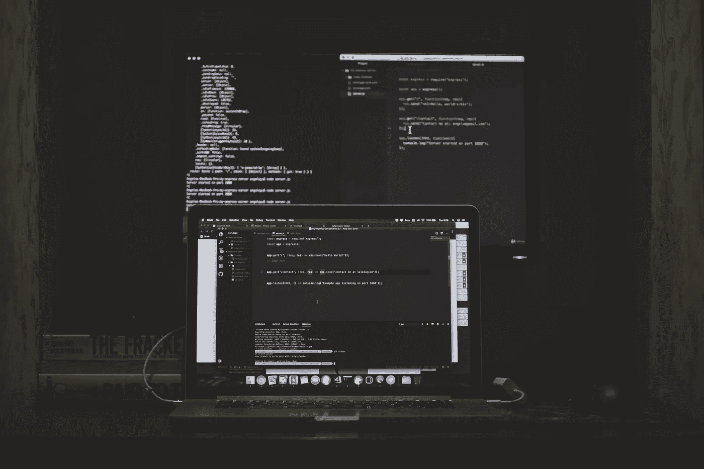

# “code wars . com”——磨练你的 JavaScript 或其他语言技能

> 原文：<https://javascript.plainenglish.io/codewars-com-hone-your-javascripts-other-languages-skill-24ec65c0a291?source=collection_archive---------8----------------------->

Photo by [Safar Safarov](https://unsplash.com/@safarslife?utm_source=unsplash&utm_medium=referral&utm_content=creditCopyText) on [Unsplash](https://unsplash.com/photos/LKsHwgzyk7c?utm_source=unsplash&utm_medium=referral&utm_content=creditCopyText)

首先，我要感谢你们所有人的大力支持。我在没有“**JavaScript In Plain English”**出版物的情况下发表了我的上一篇文章。尽管如此，多亏了你，它的第一天就出现了大约 30 次浏览。对我来说，甚至 30 岁也是一个不错的数字。尽管如此，请接受我诚挚的谢意。让我们开始写文章吧。

# 什么是 Codewars.com？

我想你们很多人都知道 codewars.com，对于其他人，让我来解释一下。如果你想看的话，我在以前的文章中提到过。Codewars.com 绝对是一个精炼你的 JavaScript 和许多其他语言技能的炸弹网站，包括最近出现的语言和旧语言。

在网站上，它会给你一些被称为“形”的问题，你必须制作它的程序。它将测试你的程序，首先是预定义的测试输入，然后是随机输入。如果任何输入没有产生预期的输出，它将显示该输入的输出和真实输出。

# 我为什么推荐它？

部分原因是我没有查看过其他类似的网站，但这没关系。对我来说，它起作用了，我开始学习新的东西，因为它迫使我去寻找那些东西来完成这个项目。这也增加了我发现问题和解决问题的能力。

我喜欢这个网站的一点是，它的问题非常有创意，不同寻常。它们不像传统的初学者项目，比如制作计算器、井字游戏、石头、剪刀、布等等。这就是为什么我绝对推荐你这个网站。结果是绝对的。除此之外，如果你还想检查其他网站，你是绝对受欢迎的，但首先检查这个网站。

有我想说的网站推荐给你。再次感谢你的支持。另一件事，我已经想不出你想读的主题了，所以如果你有时间，在下面留下一些建议，如果你喜欢我的文章，我会很感激你的提示。

谢谢你，

再见。

*更多内容看* [***说白了。***](https://plainenglish.io/)

*报名参加我们的* [***免费周报***](http://newsletter.plainenglish.io/) *。关注我们上* [***推特***](https://twitter.com/inPlainEngHQ) ， [***领英***](https://www.linkedin.com/company/inplainenglish/) ***，***[***YouTube***](https://www.youtube.com/channel/UCtipWUghju290NWcn8jhyAw)***，以及****[***不和***](https://discord.gg/GtDtUAvyhW) *

****用*** [***电路***](https://circuit.ooo/?utm=publication-post-cta) *为你的科技创业建立认知和采用。**