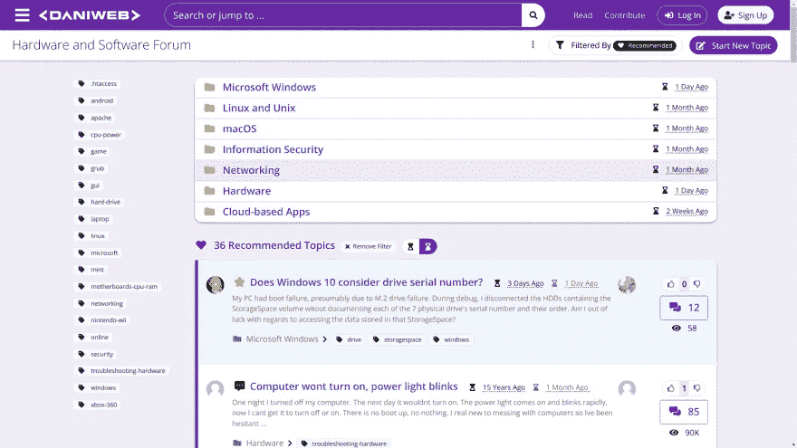

# 面向初学者的 5 个编码论坛

> 原文：<https://javascript.plainenglish.io/coding-forums-for-beginners-cc23cc4c1972?source=collection_archive---------11----------------------->

## 一些有用的编码社区可能会对您的开发人员工作流有所帮助

编码技术和社区每天都在发展，许多初学者都在为他们的疑问、问题和错误修复而奋斗。

Coding, Programming Forums for beginners

我精心挑选了一些有用的编码论坛社区，它们可能会对您的开发人员工作流有所帮助，并且可以非常快速地修复问题。

这些社区包括你作为程序员工作时可能需要的一切。

这些论坛大多与 web 开发、app 开发、API 开发、独立开发、自由职业者开发以及通过 web/app dev 获得被动收入有关。

每个论坛将包括一个直接链接，描述以及图像预览。

# 初学者的 5 个最佳编码论坛

以下是针对初学者的 5 大编码论坛。我真的建议你加入这些论坛。

# 网络矩阵论坛

这个论坛是自由职业者和独立开发者 T2 的天堂。Webmatrices 最近被列为通过 web/app 开发学习自由职业开发和被动收入的最佳场所之一。
用户大多在这里谈论网页/应用程序开发、博客/搜索引擎优化、游戏开发以及相关的东西。

这个论坛也发展得非常快。如果你想了解网络开发框架(Django，Vue.js，Svelte)，独立开发，通过开发被动创收，网络抓取，自动化，游戏开发和博客/SEO，建议你加入这个论坛。

链接:

 [## 编程；编排

### 在编写程序时，粘贴你的挫折、技能、代码片段和想法。

webmatrices.com](https://webmatrices.com/t/programming) 

# 代码项目

这个论坛不知何故在网上很受欢迎。根据 Alexa rank，每位访问者每天有 1.53 次页面浏览量，网站每天有 1.50 分钟的时间。它的排名比网络矩阵略低。内容、问题和答案的数量也相当不错。人们通常在这里谈论 Python、C++和 AI 相关的东西。

链接:

 [## code project——面向编码人员

### 面向软件开发人员和架构师的免费源代码和教程。；更新日期:2022 年 4 月 12 日

www.codeproject.com](https://www.codeproject.com/) 

# 代码大师

这个网站对于学习操作系统相关的东西来说真是太棒了。每个访问者每天有 1.3 次页面浏览量，每天在网站上的时间是 1:26。大家讨论 C 编程，洋葱架构，。NET、VB.NET 和其他与操作系统相关的东西。如果你想了解操作系统，加入这个论坛会很棒。虽然这个论坛网站的 Alexa 排名有一个下降率，但我猜这个下降率很快就会改变。

链接:

 [## 代码大师论坛

### 有力的文章、讨论、资源等等，都聚焦于现实世界中的真正开发者。

forums.codeguru.com](https://forums.codeguru.com/) 

# DaniWeb

这个网站也在某种程度上与硬件和操作系统相关的东西。每位访问者的日浏览量和每日在网站上的时间分别为 1.3 和 1:34。成员们通常讨论 VB.NET、计算机硬件、Python 和操作系统相关的东西。
如果你真的想深入操作系统、硬件开发和 C 编程，我建议你加入这个论坛。

链接:

 [## DaniWeb 社区

### 面向 IT 专业人员和程序员的论坛。获得免费的计算机帮助和支持。我们涵盖了…的所有方面

www.daniweb.com](https://www.daniweb.com/) 

# 编码论坛

这个论坛是这里提到的所有论坛中最小的一个，但是发展得非常好。1.4 日均访客浏览量和网站每日 0:57 是这个网站的 Alexa 报告。这里的人们谈论 Python GUI、Tkinter、HTML、CSS 和 Java。如果你是编程世界的新手，我建议你加入这个论坛。

链接:

 [## 编码论坛

### 编码论坛是寻找编码和编程问题帮助的地方。我们是一个友好的社区…

www.thecodingforums.com](https://www.thecodingforums.com/) 

Take A Coffee Break

正如我提到的，这些都是成长中的论坛，你将是这些论坛中的另一个成长因素。

所以，这些是初学者的 5 大编码论坛。

谢谢你陪着我。

*更多内容请看*[***plain English . io***](https://plainenglish.io/)*。报名参加我们的* [***免费周报***](http://newsletter.plainenglish.io/) *。关注我们关于*[***Twitter***](https://twitter.com/inPlainEngHQ)*和*[***LinkedIn***](https://www.linkedin.com/company/inplainenglish/)*。加入我们的* [***社区不和谐***](https://discord.gg/GtDtUAvyhW) *。*