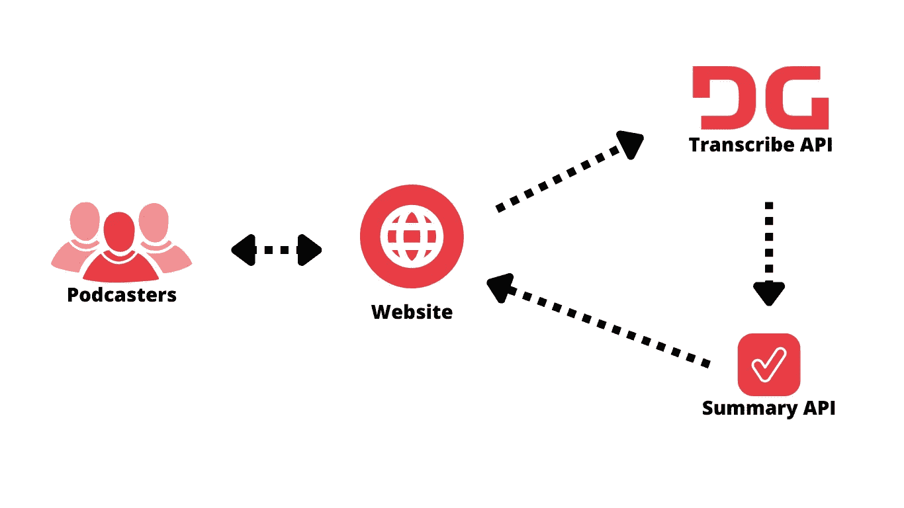
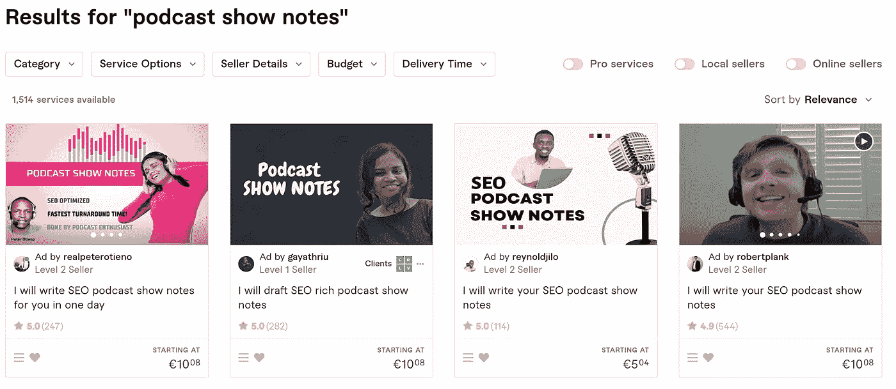
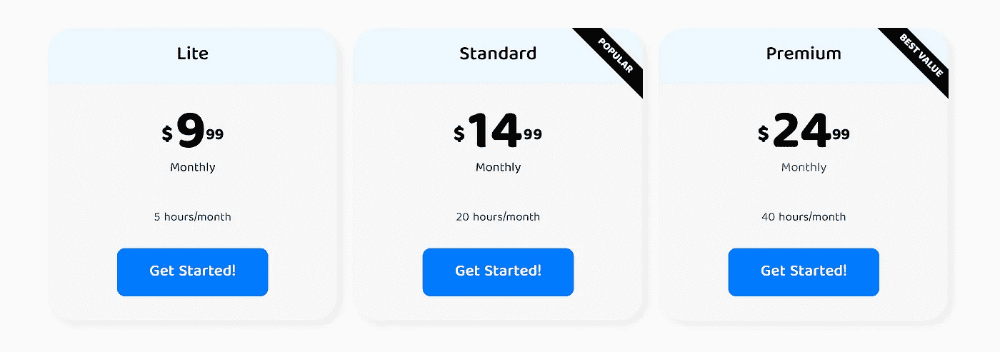
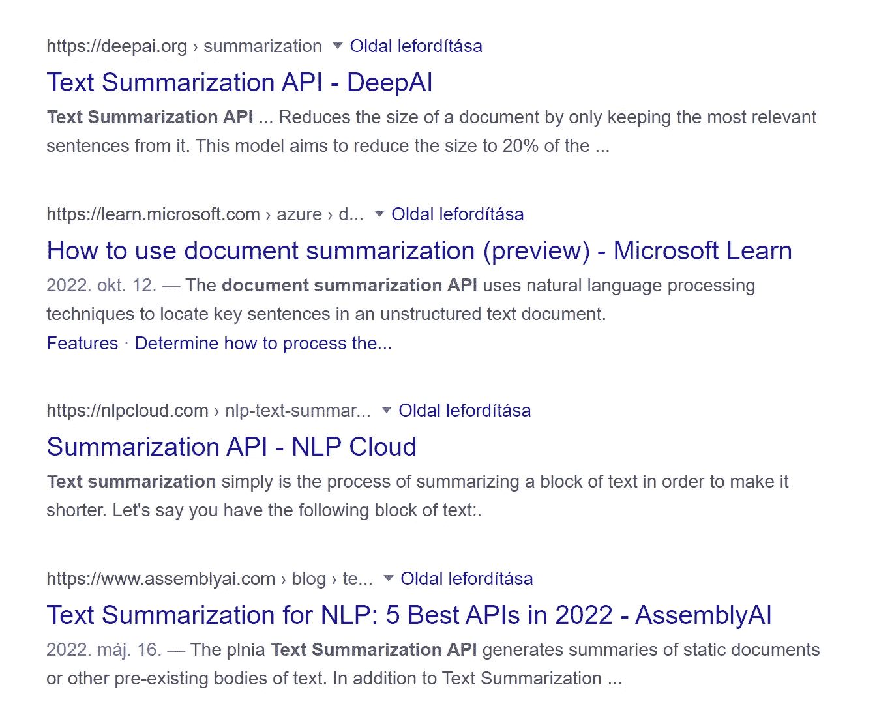

# 赚钱的编码项目——播客转录

> 原文：<https://javascript.plainenglish.io/coding-project-that-makes-money-podcast-transcriptions-6400efe663bf?source=collection_archive---------3----------------------->

## 这个简单的编码项目可以让你获得被动收入

Author: [Meruyert Gonullu](https://www.pexels.com/sk-sk/photo/roztomily-bosy-mlady-telo-8214192/)

你想建立下一个独角兽创业公司，赚几十亿美元吗？

那你可能来错地方了！我没有什么十亿美元的想法。

我有一个简单的想法，可以很容易地做到(即使是一个开发人员)，并有可能使你每月数千美元。

如果你准备好了，让我们听听。

# SaaS 创意:播客转录

你喜欢听播客吗？

那你会喜欢这个主意的。

想象一下，有一个工具可以将你的播客记录转化成文字(转录)。

Diagram of the application

只有文本对播客来说非常有用。原因是该文本可以在以后重新用于:

*   *博文*
*   *添加字幕*
*   *播客描述*
*   *播客节目备注*

使用文本的应用是无止境的。但是真正引起我注意的是播客节目笔记。

尤其是因为我从来没有见过一个工具可以做到这一点。

我见过很多提供播客转录的工具，能赚很多钱。但我从没见过能生成播客节目笔记的。

举几个这样的工具:

*   [转运蛋白](https://transkriptor.com/)
*   [快乐脚本](https://www.happyscribe.com/)
*   [Rev](https://rev.com/)

播客转录并不是一个新的想法。而看到很多工具专注于这个市场，只能说明这个服务的需求很高。但最重要的是，有钱可赚。

想要在竞争中脱颖而出，我们需要的只是有一个好的定位。在这种情况下，定位可以是提供播客节目笔记的自动生成。

# 让我们验证这个想法

许多人会高兴地坐在屏幕前，开始编码。

但在此之前，我们必须验证这个想法。

在这种情况下，我们不必。竞争已经帮我们做到了。

Photo by [Courtney Hedger](https://unsplash.com/@cmhedger?utm_source=medium&utm_medium=referral) on [Unsplash](https://unsplash.com?utm_source=medium&utm_medium=referral)

作为额外的验证步骤，我们可以尝试验证我们的定位。

我研究了播客们目前是如何写节目笔记的，结果如下。

*   有些人自己写
*   他们中的一些人使用 Fiverr

正如你在下图中看到的，很多人都在使用 Fiverr。我们还可以看到，最受欢迎的演出中有“SEO”这个词。

我们也可以利用这些信息来提高我们的定位，并提供 SEO 优化的播客节目笔记。

Results from Fiverr when searching for “podcast show notes”

# 让我们算算价格

你和我都很好奇。

这个产品能让我赚多少？我应该在车库里腾出空间来放一辆全新的蓝宝吗？

好吧，让我们看看我们的一个潜在竞争对手 Transkriptor 的定价来搞清楚。

Transkriptor pricing

如你所见，标准计划花费 15 美元。让我们用这些信息做一个简单的计算。

*   10 个用户= 150 美元/月= 1，800 美元/年
*   100 名用户= 1.500 美元/月= 18，000 美元/年
*   1000 名用户= 15.000 美元/月= 180，000 美元/年
*   6000 名用户= 90，000 美元/月= 1，080，000 美元/年

需要 1000 个用户每年赚 18 万美元，或者 6000 个用户每年赚 100 万美元。

我不知道你怎么想，但我喜欢这些数字。

但我更喜欢接下来的部分。在下一部分，我们将看看如何构建它。

# 让我们建造它

现在是时候把这个令人兴奋的想法变成现实了。

## 语音转文本

有许多人工智能驱动的 API 可以用来做这项工作。我试过很多，但 DeepGram 是我的赢家。

使用 [DeepGram](https://deepgram.com/) ，你可以非常轻松地转录音频或视频。你可以通过两种方式做到:

*   将视频或音频转录成文本
*   实时转录为文本(录制播客时)

为了让这个产品成功，我们应该提供两种选择。播客可以开始录音，他们的话会被即时转录。如果他们忘记这样做，他们可以选择以后手动进行。

当播客变成文本时，我们需要对其进行总结。

## 创建摘要

获取一大块文本，并将其转化为结构良好、经过 SEO 优化的摘要，这似乎是一项艰巨的任务。

但是，我们可以使用许多 API 来完成这项工作。

我从未使用过任何 API 来做这件事，所以我不能给出我的建议。但是，如果你只是谷歌“文本摘要 API”你会得到大量的结果。

Google resuts from “text summarization API”

一旦摘要写好了，我们的用户就可以看到它，并和他们的播客一起发布。

对于最后一部分，我们需要一种管理订阅的方法。

## 网络界面

要为用户构建 web 界面，您可以使用任何您最熟悉的 web 堆栈。

该网站将为用户创建帐户，记录他们的播客，并做转录。最重要的是，它应该管理订阅和支付。

如果我正在构建这个项目，我将使用 [React](https://reactjs.org/) ，TypeScript，和 [NextJS](https://nextjs.org/) ，因为我最熟悉这个堆栈。

我已经有了一个[启动模板](https://payhoy.cc/pg/clatbsx5v014908mnd16g6uug)，我可以用它来启动一个新的付费订阅项目。

一旦网络界面准备好了，我们就准备发布产品，并开始接触播客来试用它。

# 最后的话

兼职制作 SaaS 产品很有趣。这是学习新技能的好方法。但最重要的是，这是赚取额外收入的好方法。

你不需要建立一个新的脸书或谷歌来获得成功。

你所要做的就是建立一个解决特定问题的微型创业公司。然后把它推销给它的用户，每个月赚几千美元。

***准备好了吗？使用我的***[***【SaaS】入门模板***](https://payhoy.cc/pg/clatbsx5v014908mnd16g6uug) ***节省几个小时的辛苦工作。***

*更多内容看* [***说白了就是***](https://plainenglish.io/) *。报名参加我们的* [***免费周报***](http://newsletter.plainenglish.io/) *。关注我们* [***推特***](https://twitter.com/inPlainEngHQ) ，[***LinkedIn***](https://www.linkedin.com/company/inplainenglish/)*，*[***YouTube***](https://www.youtube.com/channel/UCtipWUghju290NWcn8jhyAw)*，*[*不和*](https://discord.gg/GtDtUAvyhW) *。对增长黑客感兴趣？检查出* [***电路***](https://circuit.ooo/) *。*