# 作为 JavaScript 开发人员，您必须了解的常见编程概念

> 原文：<https://javascript.plainenglish.io/common-programming-concepts-you-must-know-as-a-javascript-developer-dc216fd6768e?source=collection_archive---------12----------------------->

## 使用 JavaScript 解释最常见的编程概念。


# 介绍

截至 2022 年，我们无法想象没有计算机的世界，编程语言是与我们的计算机进行交互的唯一方式，就像我们在日常生活中使用的每个应用程序或功能基本上都是我们使用编程语言为计算机或设备定义的一组指令。

假设在使用计算器时，如果你想将两个数字(比如 2 和 3)相加，我们使用一个`+`操作符来得到结果(5)，这意味着制造计算器的人已经定义了，如果用户使用“+”操作符，计算器将通过它理解的语言向他们返回输入相加的结果。

在这篇文章中，我将解释每一种编程语言中最常见的概念。我将用 JavaScript 来解释所有的概念。

# 变量和常数

假设我让你给我东西吃或者给我东西喝，那么你肯定会给我盘子里的东西吃，或者说给我瓶子里或者杯子里的水喝，也就是说，食物和水是装在一个容器里的，类似于在编程语言里，我们把值存储在变量里。就像在数学中你经常听说的问题，如果 a=3，b = 5 ,( a+b)的值是多少，其中 a 和 b 分别是包含值 3，5 的变量。

常数也和变量一样，事实是我们不能改变常数的值。

在 JavaScript 中，我们使用`var`或`let`T3 定义变量，使用`const`定义常量。

```
var radius = 3 //this is a global variable
const PI = 3.14 //this is a constant
/*Area of a circle*/
var area = PI * radius * radius
```

# 标识符和关键字

我问你一个问题，你叫什么名字？说约翰，这意味着你是一个人，你的身份是约翰。同样，我有一只宠物，它的名字叫史酷比，所以史酷比是我名字的标识符。在编程中，当定义变量时，我们需要一个类似于`var a = 5`的标识符，这里`a`是标识符，或者如果我说`var hello =" I am a string "`，这里`hello`是标识符。关键字基本上是保留字，不能用作标识符。像`const, if , else , var, let`这些都是关键词。

# 评论

想象一下，你正在做一个包含 1000 行代码的项目，这些代码包含 100 个变量、常量和函数，然后很难找出哪一个用于什么。为了避免这种情况，程序员在上面的例子中用注释来解释`var`和`const`。在 JavaScript 中，可以使用`//comment ere`进行单行注释，使用`\*comment here *\`进行多行注释。我想分享的另一个事实是，如果在调试时经常发生，你可以对几行代码进行注释，而不是删除它们并重新编写。

```
// Hello I am a single line comment
var hello = "Hello World";
/* I am a multiline comment
Lorem ipsum dolor sit amet, consectetur adipiscing elit, 
sed do eiusmod tempor incididunt ut labore et dolore magna aliqua. 
Ut enim ad minim veniam, quis nostrud exercitation ullamco laboris
 nisi ut aliquip ex ea commodo consequat. Duis aute irure dolor in
 reprehenderit in voluptate velit esse cillum dolore eu fugiat nulla pariatur. Excepteur sint occaecat cupidatat non proident, 
sunt in culpa qui officia deserunt mollit anim id est laborum.*/
/*I am commented code 
var a = 5
*/
```

# 打印

print 语句基本上是一个内置函数，它让我们有机会在屏幕上显示一些东西，比如两个数相加的结果。在 JavaScript 中，我们使用`document.write("output here ")`或`console.log("output here ")`来显示输出。前者我用来在 HTML 页面上显示一些东西，后者用来在你的浏览器控制台上显示一些东西

```
document.write("Helllo World");
console.log("Hello World");
var a = 5;
var b = 10;
console.log(a+b);
```

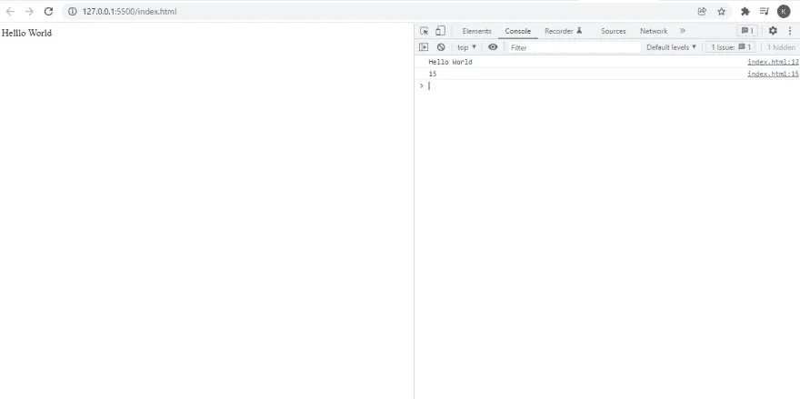

# 输入

在我们的日常生活中，我们使用的每一个应用程序或网站都需要一些输入来显示用户所需的数据，假设你正在 Google 或 Bing 上搜索一些东西，你需要在搜索栏中输入一些东西，以便 Google 或 Bing 可以根据你的需要显示结果。在 JavaScript 中，我们使用`prompt()`接受用户的输入，或者如果使用 HTML，我们可以使用表单。

```
prompt('Enter your name');
```

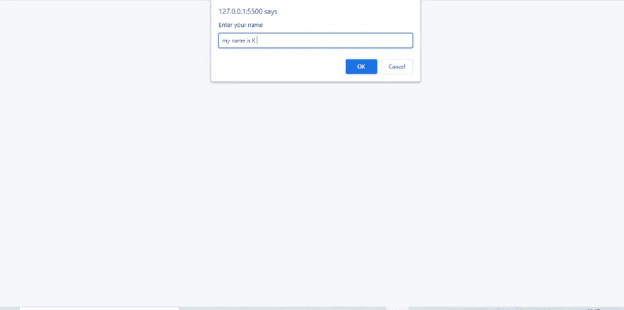

# 数据类型

还记得当我们还是孩子的时候，我们被教导像辣、咸、甜、苦这样的味道。同样，编程语言必须知道它要处理哪种类型的数据，比如数据可以是`String`或`Number`或`Decimal`或`Boolean`等。在 JavaScript 中，我们有两种类型的数据，即`primitive type` & `Object type`前者是不可变的，即它的值不能改变，而后者基本上是内存中的一个值，由一个标识符引用。

```
var a = 5;
var b = 6.0000;
var d = 2n ** 53n;
var e = true;
var s = null;
var s = 'string';
var person = { name: "John", age: 34, isMarried: false };
console.log(typeof a);
console.log(typeof b);
console.log(typeof d);
console.log(typeof e);
console.log(typeof s);
console.log(typeof person);
console.log(typeof undefined);
console.log(typeof null);
console.log(typeof NaN);
console.log(typeof Infinity);
console.log(typeof -Infinity);
console.log(typeof true);
```

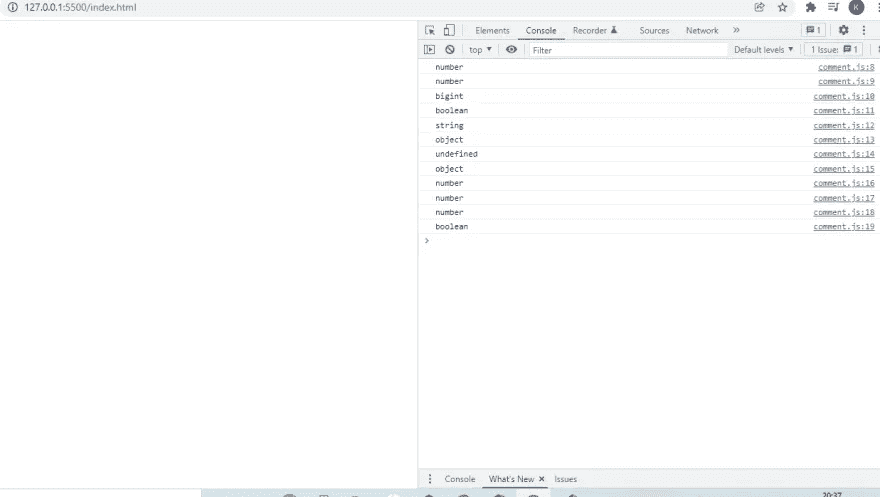

# 数组和字符串

考虑一个书架，我们可以在一个地方存放很多书。类似地，在编程中，我们使用一个数组在一个易感染的内存位置存储一组相似类型的数据元素，字符串可以被认为是一个字符数组。在 JavaScript 中，我们可以使用`var`或`let`关键字定义数组或字符串。

```
let hello = "I am a string";
let arr = [1, 2, 3, 4, 5];
/*using constructors*/
let arr2 = new Array(1, 2, 3, 4, 5);
let str = new String("I am a string");
console.log(hello);
console.log(arr);
console.log(arr2);
console.log(str);
```

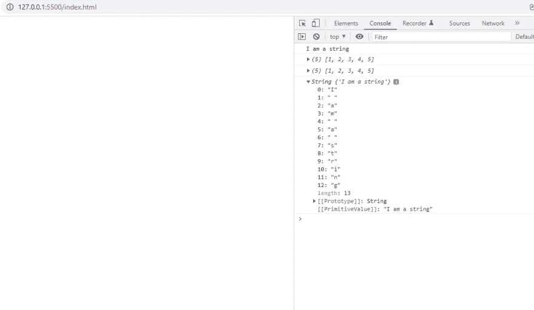

# 条件式

想象一下这样一种情况，你已经进行了一次考试，现在有两种可能性，要么你通过，要么你失败，如果你通过了，你就可以升到下一级，如果你失败了，你就必须重新完成之前的课程。

在编程中，我们也会遇到一些情况，我们不得不使用条件，比如当你登录 Instagram 帐户时，它会要求你输入用户 id 和密码，如果你输入了正确的凭据，它会将你重定向到你的个人资料，或者它会显示一个错误，或者它会建议你更改密码，如果你忘记了，这些事情都是因为条件而发生的。在 JavaScript 中，我们有`if`、`else`和`elseif`语句来应用条件。

```
var userid = prompt("Enter your userid");
var password = prompt("Enter your password");
if (userid == "admin" && password == "password") {
    alert("Welcome Admin!");
}
else if (userid == "user" && password != "pass") {
    alert("Welcome User!");
}
else {
    alert("Wrong userid or password");
}
```

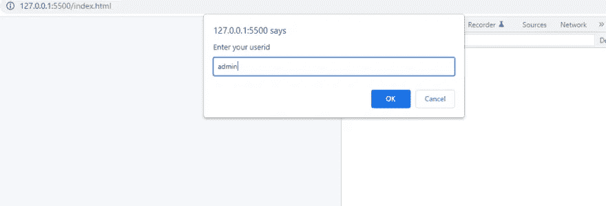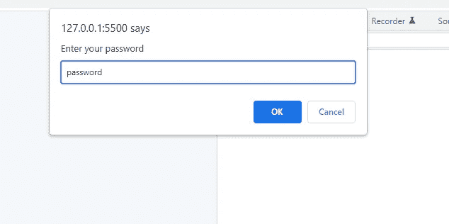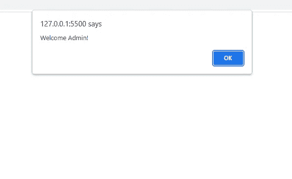

# 控制流程

假设你的作业是写`I am a good boy` 100 遍，那么你要做的就是开始写这个句子，直到你重复 100 遍。也就是说，你在重复一个特定的任务，直到达到一个条件。在编程中，我们也经常会遇到一些场景，在这些场景中，我们需要重复一个特定的任务，直到达到一个条件，为此，我们使用控制语句流，或者用通俗的英语来说，我们称之为循环。在 JavaScript 中，我们有几个控制语句流

```
var arr = [1, 2, 3, 4, 5];
var n = 0;
console.log("Using for loop");
for (var i = 0; i < arr.length; i++) {
    console.log(arr[i]);
}
console.log("Using foreach loop");
arr.forEach(element => {
    console.log(element);
})
console.log("Using while loop");
while (n < 5) {
    console.log(n);
    n = n + 1;
}
var k = 0
console.log("Using do while loop");
do {
    console.log(k);
    k = k + 1;
}
while (k < 5);
```

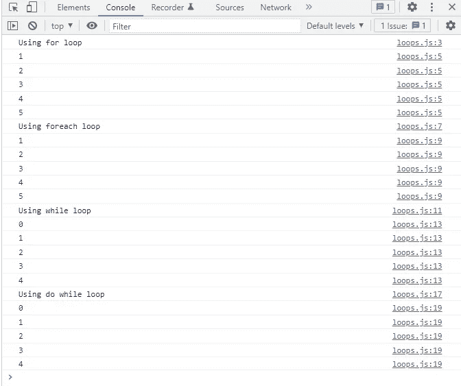

# 操作

现在运算符基本上是在两个操作数之间执行运算的符号，比如 a +b 这里`+`是一个运算符。在 JavaScript 中，我们有以下内容:

# -算术运算符

完成像加法、除法等数学任务。

```
/*Arithmetic operators*/
var a = 10;
var b = 20;
console.log(a + b);
console.log(a - b);
console.log(a * b);
console.log(a / b);
console.log(a % b);
```

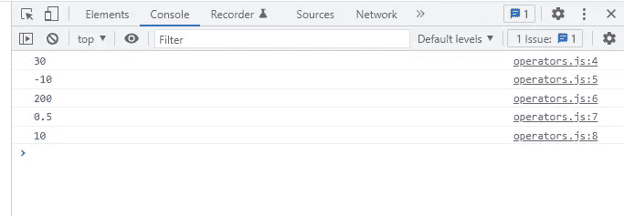

# -赋值运算符

用于赋值

```
/*Assignment operators*/
var c = 10;
console.log(c += 10);
console.log(c -= 10);
console.log(c *= 10);
```

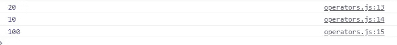

# -比较运算符

用于比较两个操作数

```
/*Comparison operators*/
var d = 10;
var e = 20;
console.log(d > e);
console.log(d < e);
console.log(d >= e);
console.log(d <= e);
```

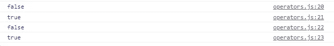

# -逻辑运算符

做出合乎逻辑的决定

```
/*Logical operators*/
var x = true
var y = false
console.log(x && y);
console.log(x || y);
console.log(!x);
```

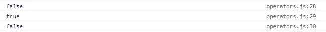

# -按位运算符

执行按位运算

```
/*Bitwise operators*/var p = true
var q = false
console.log(p & q);//and
console.log(p | q);//or
console.log(p ^ q);//xor
console.log(~p);//not
```

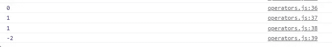

# 功能

我们经常需要多次实现一个特定的任务，我想说的是，在我的上一个例子中，我举了一个用户登录的例子，现在 Instagram 经常要求输入你的密码，如果你想改变任何个人信息，所以我们可以定义一个函数，并根据需要使用，而不是多次重写相同的代码行，也就是说，基本上是重用我们的代码。在 JavaScript 中，我们使用 function 关键字来定义函数。

```
//defining a function 
function sayHello(name) {
    console.log("Hello" + name);
}sayHello("user ")//calling a function
```

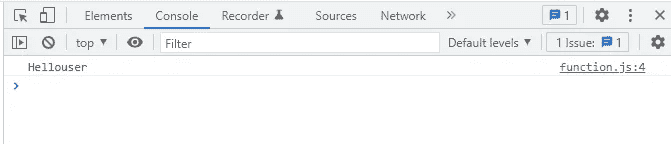

# 结尾部分

恭喜你已经读完了这篇文章。这就是你需要了解的最常见的编程概念。我想强调的一点是，在阅读本文时，请在浏览器中运行代码片段，以便更清楚地理解。如果您有任何疑问，请随时发表评论。如果你觉得这篇文章有帮助的话，就和你的同事分享吧。保持快乐和安全。

连接

[推特](https://twitter.com/kumarkalyan_)

[LinkedIn](https://www.linkedin.com/in/kumar009/)

*更多内容请看*[***plain English . io***](http://plainenglish.io/)*。报名参加我们的**[***免费周报***](http://newsletter.plainenglish.io/) *。在我们的* [***社区获得独家访问写作机会和建议***](https://discord.gg/GtDtUAvyhW) *。**