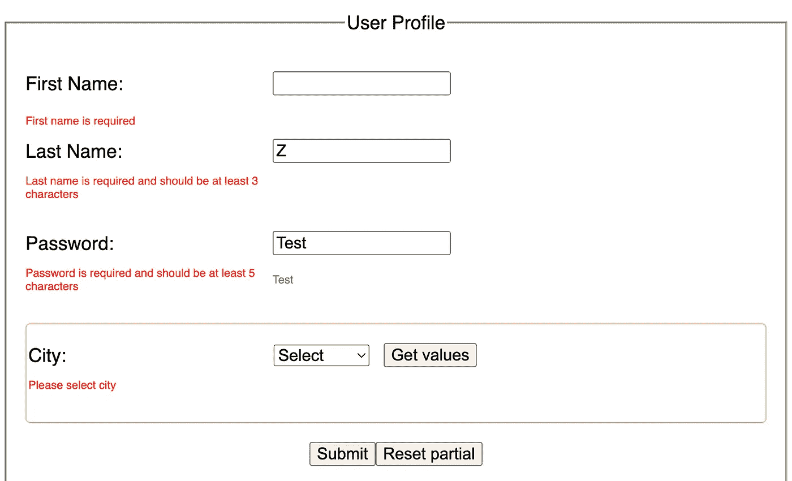
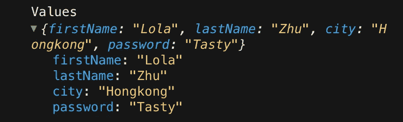
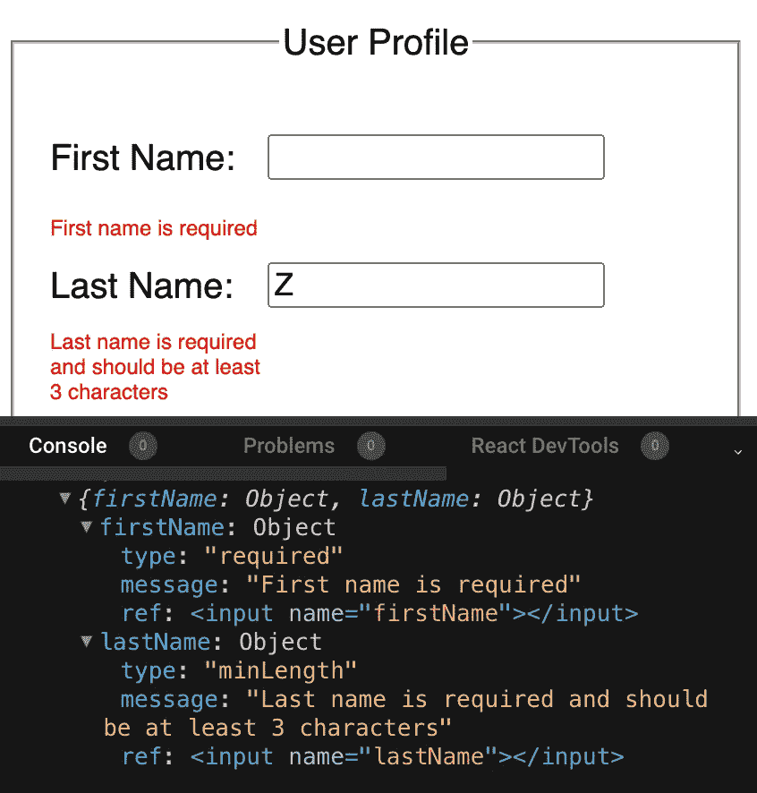
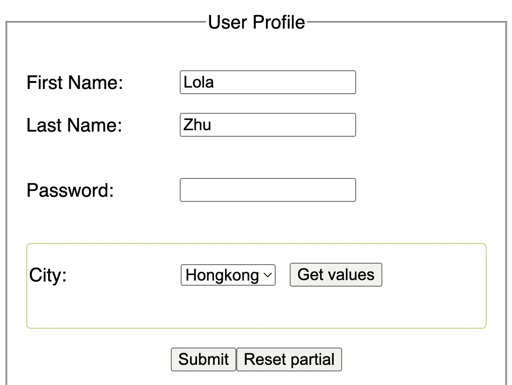
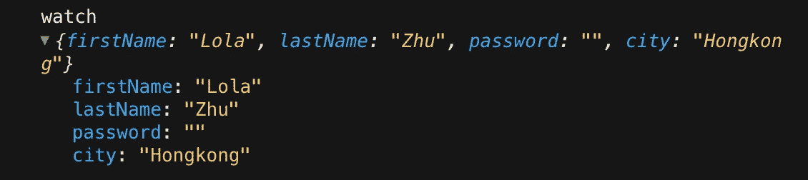
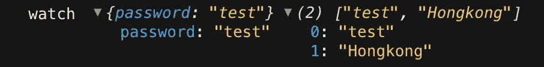

# React-Hook-Form 库|常见用例

> 原文：<https://javascript.plainenglish.io/common-use-cases-of-react-hook-form-b7cf961a42f6?source=collection_archive---------5----------------------->

## 因为绝对没有人喜欢创建和重建带有验证的复杂表单


失败是成功之母 — — failure is the mother of success

表单状态管理一直让我头疼，错误处理，验证规则，表单重置。。。好在这几年有很多好的解决方案，比如[*Formik*](https://formik.org/)[*react-hook-form*](https://react-hook-form.com/)[*react-final-form*](https://final-form.org/react)[*Reakit*](https://reakit.io/)等等。

因为最近有人问我是否知道 React-Hook-Form，而且因为我从未使用过它，所以我决定从这个钩子开始，创建一个简单的表单，这样我就可以更好地理解它，当然，我会像我的其他文章一样与您分享本文中的步骤🙌

让我先展示一下最终结果应该是什么样子，这样我们心中就有了一个清晰的想法。对于该表单，我将提供用户名和密码作为输入字段，城市作为选择字段:



end result form with validation

首先，让我们创建所有没有功能的输入字段和按钮。应用程序结构相当简单，父组件 **App** 包含子组件 **Country** (用黄色标出)。

```
// **App**
import Country from "./Country";
import ...export default function **App**() {
    return (
     <div className="App">
         <form onSubmit={...} >
           <fieldset>
             <legend>User Profile</legend>
             <div className="...">
              <label>First Name: </label>
              <input .../>
             </div>
             <div className="...">
              <label>Last Name: </label>
              <input ... />
             </div>
             <div className="...">
              <label>Password: </label>
              <input ... />
             </div>
             <div className="...">
               <**Country** />
             </div> <input type="submit" value="Submit" />
             <button onClick={...}>Reset partial</button>
           </fieldset>
         </form>
    </div>
)} // **Country**
const Country = () => {
   return (
    <>
     <label>City: </label>
     <div>
      <select>
        <option value="">Select</option>
        <option value="Hongkong">Hongkong</option>
        <option value="Shenzhen">Shenzhen</option>
        <option value="Shanghai">Shanghai</option>
      </select> <button type="button" onClick={...}>Get values</button>
     </div>
    </>
  )};export default Country;
```

当用 React 开发时，我们通常创建一个**受控表单**，这意味着我们使用 React 直接处理数据，而不是让 React 隐式处理数据。

例如，我们可以使用一些 React **内置的**钩子，比如 *useState* 来存储每个字段的值。当用户输入时，我们需要获取更新，并通过捕获一些事件处理程序将它们应用到字段值，这就是受控表单的用武之地。

```
const [**password**, setPassword] = useState("");
const handlePasswordChange = (e) => **setPassword**(e.target.value);<input type="password" name="password" value={**password**} onChange={handlePasswordChange} />
```

形式简单就可以了。但是，如果我们遇到复杂的表单，比如有几个步骤的表单、联动效果、多层结构等。，这意味着我们需要更多的 useState、useEffect 等。钩子，以及更多的 onChange，onClick 等。经手人。需要添加到表单中的字段越多，需要创建的处理程序和状态就越多。这将增加我们代码的长度，增加它的不可读性。

为了防止类似的事情发生，我们可以使用 React Hook 表单库，这将帮助我们创建轻便、强大、灵活、可采用和可扩展的表单，并具有用户友好的验证，直观、功能完整的 API 在构建表单时提供无缝体验。

> React Hook Form 是一个没有任何依赖关系的微型库，它最大限度地减少了验证计算，减少了您需要编写的代码量，同时删除了不必要的重新渲染，并且可以在没有其他依赖关系的情况下轻松采用。

要使用 react-hook-form，我们需要**导入**和**调用*****使用 Form*** 钩子。当我们这样做时，目的是设置表单管理和状态，它们将在链接到表单的所有字段之间共享。useForm 返回一个**对象**，其中包含有用的函数( ***register*** ， *setValue* ， *getValues* ， *handleSubmit 等。*)。

👉我们将首先析构并试用**寄存器**。

**** Register****是一个回调函数，它返回一些* ***道具*** *并将它们注入到输入中，以便我们可以控制和读取输入，它允许我们将一个输入连接到由* ***useForm()定义的表单，*** *它返回 4 个重要属性:*

`*onChange*` *道具订阅输入变更事件。*

`*onBlur*` *道具订阅输入模糊事件。*

`*ref*` *为钩形登记输入参考。*

`*name*` *输入正在注册的名称。*

现在让我们更新输入字段并添加一个提交处理程序，调用 register 函数并提供输入的名称:

```
import { **useForm** } from "react-hook-form";export default function App() {
  const { **register, handleSubmit** } = useForm();
  return (
       ...
      <form onSubmit={**handleSubmit**((values) => console.log("Values",    values))}
        <input {...**register**("firstName")} />
        <input {...register("lastName")}/>
        <input {...register("password")}/>
        <input {...register("city")}/> <input type="submit" value="Submit" />
      </form>
       ...  
)}
```

现在，当我们提交表单时，我们将在控制台中看到所有的值，如下所示，将它集成到我们的表单中真的很容易。



register Input values

下一步，我们可以对输入字段执行**验证**，验证可以通过**将带有**所需规则**的** **对象**作为**参数**传递给寄存器函数来定义。

```
// firstName validation
<input {...register("**firstName**", 
  {
    **required**: "First name is required"
  })} />// lastName validation
<input {...register("**lastName**", 
  { 
    **required**: true,
    **minLength**: { 
        **value**: 3, 
        **message**: "Last name is required and should be at least 3 characters" }
  })} />
```

现在刷新页面，将 firstName 字段留空，在 lastName 字段中只键入一个字符，然后提交表单。在此过程中，将首先执行验证，这包括检查寄存器函数中定义的**验证规则**。(在我们的例子中:必需的*消息*，*最小长度* …)

🎈请注意，根本没有**的** **重新呈现**，但是我们在提交后关注了正确的输入(**名字**输入字段)，这实际上导致了验证错误。

👉这是因为 react-hook-form 中的渲染处理得相当好，如果我们不订阅错误状态，它不会触发重新渲染！

为了查看错误消息，我们可以简单地订阅错误，使用 [**formState**](https://react-hook-form.com/api/useform/formstate) 并在适当的输入下呈现它们。

```
const { register**,** handleSubmit, **formState: { errors }**} = useForm();<input {...register("**lastName**", {...})} />
<p>{**errors**.**lastName**?.**message**}</p>
```



reading and rendering errors with formState

但是，建议在 useForm 中提供**默认值**，输入的默认值在用户与组件交互前首次呈现组件时用作初始值。

```
const defaultValues = {
   firstName: “Lola”,
   lastName: “Zhu”,
   password: “”,
   **city: “Hongkong”**
};const {...} = **useForm**({ **defaultValues** });
```

现在刷新页面，我们应该看到:



default values provided

我们还可以设置表单的**模式**，该模式可以控制触发验证的时机。如果我们希望用户尽快察觉到错误，我们可以使用“ **all** ”:

```
const {...} = useForm({ 
  defaultValues**,** 
  **mode**: "all" *// 👉 onChange | onBlur | onSubmit | onTouched | all* });
```

到目前为止一切看起来都很好，但是如果我们想多次订阅某个特定的输入值呢？比如我们想使用指定的输入，并用它做一些事情……我们可以使用 **watch** API。

> 该方法将监视指定的输入并返回它们的值。这对于呈现输入值以及根据条件确定要呈现的内容非常有用。

```
const { ..., **watch** } = useForm({ ... });
```

默认情况下，当你在输入字段中输入一些东西时，react-hook-form 不会触发任何重新呈现，但是通过调用 **watch** 函数，我们可以订阅输入，当我们 *console.log* watch 时，我们会看到所有的值。

```
console.log(“watch”, watch());
```



console.log(“watch”, watch())

我们还可以“**观察**指定的输入并返回它们的值:

```
const password_value = { password: watch(“password”)};const watchFields = watch([“password”, “city”]);console.log(“watch”, password_value, watchFields);
```



console.log watch values

👀注意:

*   *Watch 将在应用程序或表单的根目录下触发重新呈现，如果遇到性能问题，请考虑使用回调或*[*use Watch*](https://react-hook-form.com/api/usewatch)*API。*
*   *还有一个****get values****helper API 用于读取输入值，* `*watch*` *和* `*getValues*` *的区别在于* `*getValues*` ***不会触发*** *重新渲染或订阅输入变化。*

```
*// {firstName:"Lola",lastName:"Zhu",password:"...",city:"Hongkong"}* const values = **getValues()**;*// "Hongkong"* const singleValue = **getValues("city")**; *// ["Lola","Zhu","Hongkong"]* const multipleValues = **getValues(["firstName", "lastName", "city"])**;
```

还记得上面我们将 **Country** 组件作为子组件吗？为了从子组件中访问表单方法和状态，我们可以像往常一样传递 props，但是由于 react 中有一个 **useContext** 钩子，我们在 react-hook-form 库中也有一个钩子: [*useFormContext*](https://react-hook-form.com/api/useformcontext) ，它的行为与 React 的 useContext 非常相似。

useFormContext 旨在用于**深度嵌套结构**中，在这种情况下传递 props 变得不方便，它允许我们访问表单上下文，并获得 **useForm** 提供的表单方法和状态，而不必再次调用钩子。

为了使用 useFormContext，我们在将表单数据发送给子代和孙代的级别使用***form provider****包装器，并使用***useFormContext***钩子访问它们。*

*   *在应用程序组件中导入 FormProvider:*

```
*import { useForm, **FormProvider** } from "react-hook-form";export default function App() {
  const { register**,** getValues, ...} = useForm();
  return (
       ...
        <**FormProvider** {...{register, getValues}}> 
          <form onSubmit={handleSubmit(...)}>
            <Country />
          </form>
        </**FormProvider**>
  )}*
```

*   *在子组件 **Country:** 中检索所有带有 **useFormContext** 的钩子方法*

```
*import { **useFormContext** } from "react-hook-form";const Country = () => {
     *// retrieve hook methods*   
   const {**register**, **getValues**} = useFormContext();
   return (
     <>
       <label>City: </label>
       <div>
          <select {...**register**("city", { required: "Please select city" })}>
           <option value="">Select</option>
           <option value="Hongkong">Hongkong</option>
           <option value="Shenzhen">Shenzhen</option>
           <option value="Shanghai">Shanghai</option>
          </select>
         <button type="button" onClick={() => {
           const values = **getValues**(); const singleValue = getValues("city");const multipleValues = getValues(
["password", "lastName","city"]);
           // console.log(values, singleValue, multipleValues);
          }}>Get values</button>
       </div>
     </>
)};export default Country;*
```

*不错！最后一个有用的 API 是 [**reset**](https://react-hook-form.com/api/useform/reset) ，它重置所有表单状态、字段引用和订阅。*

*🍭Reset 听起来可能很简单，但实际上，用户希望如何重置表单有很多不同的情况。比如有时候我们想把表单重置到初始状态或者重置/更新状态，或者用一些部分值重置表单等等。*

*在我们的示例中，App 组件中有一个重置按钮，我将尝试实现其中一些情况:*

```
*<button onClick={...}>Reset partial</button>*
```

*   *第一种情况:将表单复位到**初始**状态。**reset 提供的第一个参数实际上是可选的*，这意味着如果我们执行不带任何参数的函数(reset())，react-hook-form 会将表单重置回您提供的默认值。当未提供 defaultValues 时，将调用 HTML 原生[重置](https://developer.mozilla.org/en-US/docs/Web/API/HTMLFormElement/reset) API 来恢复表单。*

```
*const { ...,reset } = useForm();const resetForm = () => **reset**();
<button onClick={resetForm}>Reset</button>*
```

*   *第二种情况:重置和更新表单值。* *如果我们想将整个表单重置为不同的值，而且还要更新默认值，那么我们可以供给* ***值。*** 当值被提供后，点击 reset 按钮，**不仅 UI 中的**值会被更新，而且存储在 react-hook-form 中的我们的 defaultValue 也会被反映出来，在我们下面的代码中，重置后，城市将是“上海”而不是默认的“香港”。*

```
*const resetForm = () => {
 reset((formValues) => ({
 …formValues,
 city: “Shanghai”
 }));
}
<button onClick={resetForm}>Reset partial</button>*
```

*   *第三种情况:抓取所有东西**部分**重置形态。* *我们可以将上面解释的 getValues API 与 Reset API* 结合起来。这意味着我们可以对表单中当前的内容进行*浅层合并*并合并我们想要应用的值。*

*👉*在这种情况下，其他输入值保持不变，但* ***名*** *被重置为“迷你”。**

```
*const resetForm = () => {
    reset({
        ...getValues,
        **firstName**: "**Mini**",
     });
}
<button onClick={resetForm}>Reset partial</button>*
```

*不错！到目前为止，我想我已经介绍了一些常用的 API，还有更多我正在不断学习的定制钩子(例如， [useController](https://react-hook-form.com/api/usecontroller) 、 [useWatch](https://react-hook-form.com/api/usewatch) 、 [useFormState](https://react-hook-form.com/api/useformstate) 、 [useFieldArray](https://react-hook-form.com/api/usefieldarray) )，以及更多的方法(例如， [setFocus](https://react-hook-form.com/api/useform/setfocus) 、 [getFieldState](https://react-hook-form.com/api/useform/getfieldstate) 、 [resetField](https://react-hook-form.com/api/useform/resetfield) 、 [setValue)但是希望这个例子能激发您尝试这个库🙌](https://react-hook-form.com/api/useform/setvalue)*

*就是这样！你可以在这里找到完整的代码，玩玩吧:)感谢你的时间！⏰*

*如果你也对我的其他文章感兴趣，这里有一些链接:*

*[](/a-shopping-list-with-react-hook-usereducer-310a3b6578) [## 用 React Hook useReducer 创建购物清单

### 带有 useReducer React 挂钩的购物清单——一个让 useReducer 更容易理解的小练习。

javascript.plainenglish.io](/a-shopping-list-with-react-hook-usereducer-310a3b6578) [](/create-a-simple-react-custom-hook-fc733d7b977a) [## 创建一个简单的 React 自定义挂钩

### 关于如何创建一个简单的 React 自定义钩子的教程

javascript.plainenglish.io](/create-a-simple-react-custom-hook-fc733d7b977a) [](/create-a-simple-express-server-node-js-for-react-application-e2b2bd0c7e93) [## 为 React 应用程序创建一个简单的 Express 服务器(Node.js)

### 关于如何创建一个简单的 Express 服务器(Node.js)、将其连接到 React 应用程序以及解决错误的教程…

javascript.plainenglish.io](/create-a-simple-express-server-node-js-for-react-application-e2b2bd0c7e93) [](https://xiaominzhu.medium.com/react-functional-components-using-refs-a5ad1d2817d4) [## 使用引用对功能组件进行反应

### forwardRef 和 useImperativeHandle 的示例

xiaominzhu.medium.com](https://xiaominzhu.medium.com/react-functional-components-using-refs-a5ad1d2817d4) [](https://medium.com/geekculture/update-parent-state-from-child-component-with-react-context-api-a56cf3742428) [## 用 React 上下文将状态从子节点更新到父节点

### — React Context 提供了一种通过组件树传递数据的方法，而不必在…

medium.com](https://medium.com/geekculture/update-parent-state-from-child-component-with-react-context-api-a56cf3742428) 

*更多内容请看*[***plain English . io***](https://plainenglish.io/)*。报名参加我们的* [***免费周报***](http://newsletter.plainenglish.io/) *。关注我们关于*[***Twitter***](https://twitter.com/inPlainEngHQ)[***LinkedIn***](https://www.linkedin.com/company/inplainenglish/)*[***YouTube***](https://www.youtube.com/channel/UCtipWUghju290NWcn8jhyAw)*[***不和***](https://discord.gg/GtDtUAvyhW) *。对增长黑客感兴趣？检查* [***电路***](https://circuit.ooo/) *。****