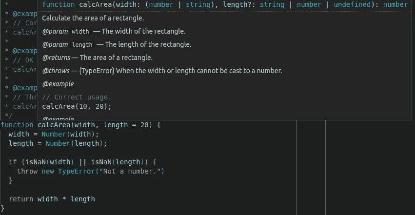
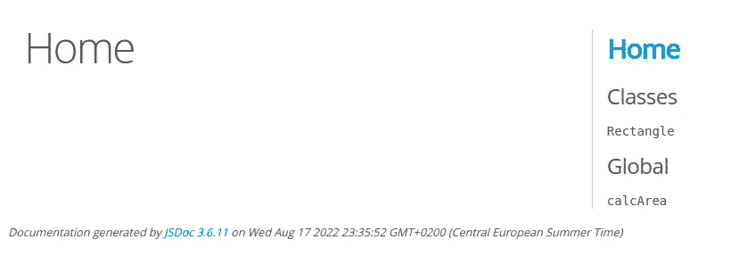
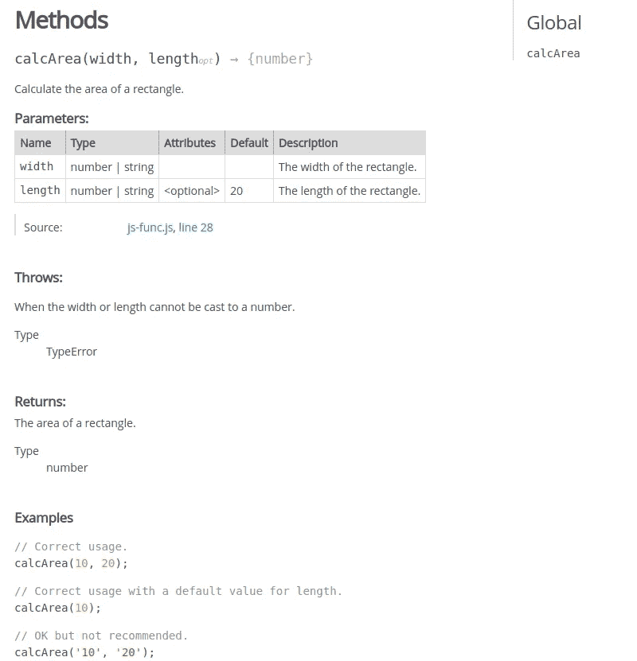
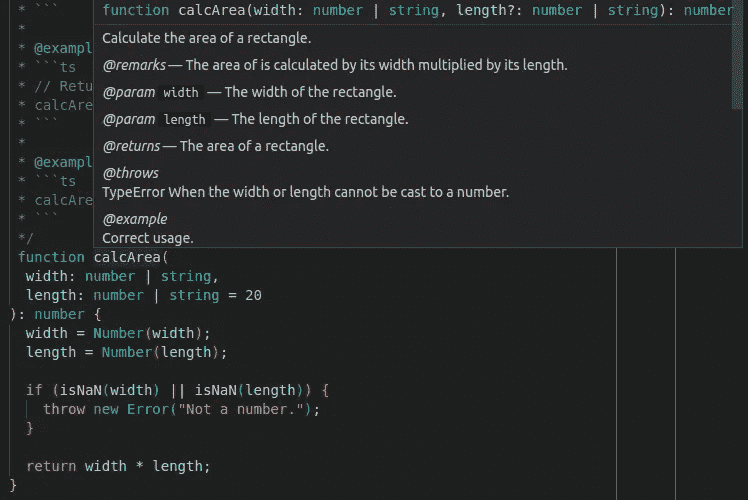
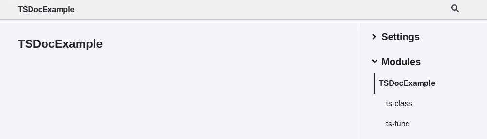
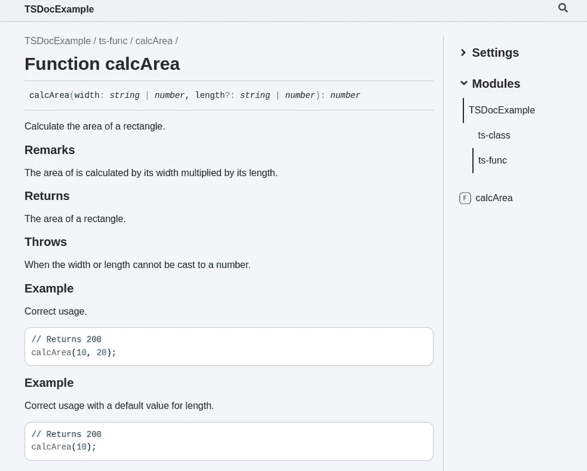
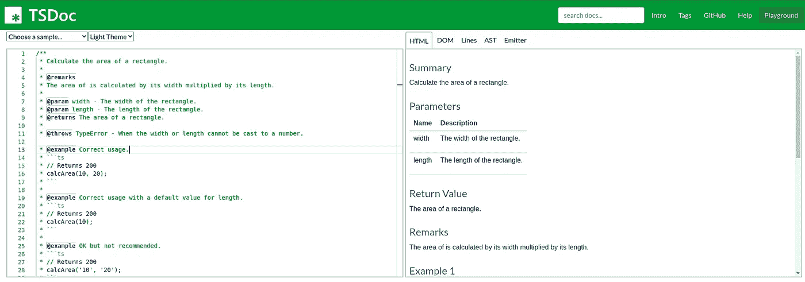

# 比较 JavaScript JSDoc 和 TypeScript TSDoc 的文档

> 原文：<https://javascript.plainenglish.io/compare-javascript-jsdoc-with-typescript-tsdoc-for-documentation-a6984de1f2c5?source=collection_archive---------2----------------------->

## 了解向 JavaScript/TypeScript 代码添加文档的标准方法


[Image by Aymanejed in Pixabay](https://pixabay.com/photos/laptop-office-hand-writing-3196481/)

[JSDoc](https://jsdoc.app/about-getting-started.html) 和 [TSDoc](https://tsdoc.org/) 注释不同于常规注释，常规注释也被称为实现注释。实现注释通常是解释变量或代码块的含义或逻辑的简短注释。它们没有固定的格式，是自由文本。另一方面，JSDoc 和 TSDoc 注释用于向我们的 JavaScript/TypeScript 代码添加文档，具有良好建立的格式。它们可以被 ide 识别，并且可以被一些工具提取和呈现，从而为我们的代码自动生成网页。

在这篇文章中，我们将介绍 JSDoc 和 TSDoc 的基础知识，并用简单易懂的例子解释它们的主要区别。您将对 JSDoc 和 TSDoc 有一个清晰的理解，并可以开始将它们添加到您的代码中。

## 为 JavaScript 代码添加 JSDoc 注释

JSDoc 注释的各种标签有相当多的细节。通读[官方文档](https://jsdoc.app/index.html)时，你可能会不知所措。但是，在我们的日常开发中，尤其是作为一个初学者，我们只需要使用其中的极少数。学习 JSDoc 最好的方法是从例子开始。让我们看看下面的例子，看看如何将 JSDoc 注释添加到一个简单的函数中，之后我们将解释技术细节。

关于上面添加的 JSDoc 的要点:

*   与以`//`或`/*`开头的实现注释不同，JSDoc 以`/**`开头。JSDoc 注释中可能有一些以`@`符号开头的特殊 JSDoc 标签，用于为代码的不同部分提供特殊的含义。其中一些在本例中使用，将在下面解释。
*   第一部分是功能的总结或描述。可以用`[@description](https://jsdoc.app/tags-description.html)`标签显式地指定它，如果它在文档的最开始就可以省略，如本例所示。但是，如果放在其他标签之后，它必须存在。
*   `[@param](https://jsdoc.app/tags-param.html)`标签用于指定函数的参数。`@param`标签是一个块标签，这意味着它必须独立使用，不能放在其他标签中。每个函数参数必须单独指定，在单独的一行上有自己的`@param`标签。
    参数的类型在`@param`标签后的花括号中指定。如果是联合类型，必须放在括号中。
    参数名在类型后指定。如果参数是可选的，那么它被放在方括号中。如果参数有默认值，它会在括号内用等号表示。
    在参数描述前加一个连字符(`-`)以提高可读性。
*   `[@returns](https://jsdoc.app/tags-returns.html)`标签用于指定返回类型和结果描述。
*   [@throws](https://jsdoc.app/tags-throws.html) 标签用于指定函数可能抛出的错误。错误的类型在花括号中指定，并且是可选的。应该提供一个描述，说明何时或为何抛出错误。如果同一个函数需要抛出不同类型的错误，可以有多个`@throws`标签。
*   标签`[@example](https://jsdoc.app/tags-example.html)`用于提供函数用法的例子。注意，对于 JSDoc 来说，`@example`标签后面的文本是普通代码，因此不应该放在三个反斜线(`````)中，这与后面将要介绍的 TSDoc 中的不同。代码片段将在 ide 中显示为突出显示的代码，如 VS 代码，以及稍后生成的 HTML 网页。同一个函数可以有多个例子，由单独的`@example`标签指定。

如果您将鼠标悬停在函数名上，您可以看到弹出的漂亮文档，这非常酷，是实现注释无法实现的。



为了完整起见，让我们创建一个执行面积计算的类，如上所示。向类添加 JSDoc 注释非常类似于向函数添加注释。下面是为该类添加的 JSDoc 注释。为简单起见，仅指定了一个示例:

正如我们看到的，类方法的 JSDoc 注释与函数的注释是一样的。此外，对于班级，有两点需要注意:

*   应该给类添加一个描述，我们不需要像[官网](https://jsdoc.app/howto-es2015-classes.html)上显示的那样添加`@class`和`@constructor`标签。
*   我们应该添加一个描述，并用`@type`标签指定类属性的类型。`@type`标签与`@param`标签的语法相似，但是不接受描述。

现在让我们使用`[jsdoc](https://github.com/jsdoc/jsdoc)`工具将 JSDoc 文档转换成 HTML 网页。我们需要先安装`jsdoc`:

```
$ **npm install -g jsdoc**
```

然后，它可以用来将 JavaScript 文件转换成 HTML 页面:

```
$ **jsdoc src/**
```

该命令将在当前工作目录中创建一个名为`out/`的目录。如果您在浏览器中打开`index.html`文件，您将会看到您的代码的网页:



老实说，网页不太好看。但是，您可以添加更多的 CSS 类来自定义显示，使它看起来更好。您很快就会发现，默认情况下，从 TSDoc 文档生成的网页要好看得多。

## 为 TypeScript 代码添加 TSDoc 批注

总的来说，TSDoc 的语法和 JSDoc 非常相似。然而，存在一些重要的差异。让我们先展示代码，然后解释主要的区别，这样就更容易理解了。我们将把 TSDoc 注释添加到与 JSDoc 相同的函数和类中。下面显示了该函数的 TSDoc 注释:

TSDoc 看起来确实和 JSDoc 很像。因此，如果你知道如何编写 JSDoc，那么编写 TSDoc 应该是相当容易的。然而，有一些值得注意的差异:

*   与 JSDoc 类似，TSDoc 的第一行也是摘要行。然而，这只是一个简短的描述，应该限制在少于 80 个字符的一行。如果需要更多的描述，应该加上`[@remarks](https://tsdoc.org/pages/tags/remarks/)`标签。JSDoc 中不存在此标记。它用于指定一个更详细的描述，该描述将显示在一个单独的“备注”部分，如后面所示。
*   类型和默认值不应在`[@param](https://tsdoc.org/pages/tags/param/)`标签中指定，因为它们已经在函数参数中指定。这就是 TypeScript 和 TSDoc 大放异彩的地方，也是我喜欢它们的原因。将类型和缺省值放在函数参数中比放在 TSDoc 注释中感觉更自然，因为 TSDoc 注释毕竟是注释，不能被像 [ESLint](https://betterprogramming.pub/use-eslint-to-make-your-javascript-typesript-code-more-professional-1170bbdff32b) 和[appellite](/create-a-pre-commit-git-hook-to-check-and-fix-your-javascript-typescript-code-b04de61834bd)这样的 linters 正确格式化和检查(没有专门的插件)。
*   我们也不需要为 [@returns](https://tsdoc.org/pages/tags/returns/) 标签指定返回类型。
*   我们不能像在 JSDoc 中那样在`[@throws](https://tsdoc.org/pages/tags/throws/)` 标签中指定错误类型。错误类型应该在标签后直接指定为纯文本，或者使用`[@link](https://tsdoc.org/pages/tags/link/)`内嵌标签。
*   最后，`[@example](https://tsdoc.org/pages/tags/example/)`标签的语法是不同的。在 JSDoc 中，`@example`标签后面是普通代码。然而，在 TSDoc 中，它后面是一个描述行，然后是一个 markdown 块，其中依次包括普通代码。

这是 TSDoc 注释在 VS 代码中的显示方式:



为了完整起见，让我们也检查一个类的 TSDoc 注释:

现在，根据我们对上述函数的 JSDoc 和 TSDoc 的了解，阅读一个类的 TSDoc 应该非常简单。需要注意的一点是，我们必须在类体中的构造函数之外声明类属性，这不是 JavaScript 所要求的。我们可以为属性添加简单的 TSDoc 注释，不需要指定类型和默认值(如果有的话)。

最后，让我们使用`[typedoc](https://coryrylan.com/blog/intro-to-typescript-documentation-with-tsdoc)`工具为我们的类型脚本代码生成 HTML 页面。我们需要先安装它:

```
$ **npm install -g typedoc**
```

您需要有一个`tsconfig.json`文件来运行`typedoc`命令。如果你还没有，你可以用`tsc`生成它:

```
$ **tsc --init**
```

现在我们可以运行`typedoc`:

```
$ **typedoc src/*.ts --name TSDocExample**
```

该命令将在当前工作目录下创建一个名为`docs/`的目录。如果您在浏览器中打开`index.html`文件，您将会看到您的代码的网页:



事实上，它看起来比前面显示的由`jsdoc`生成的网页要好得多。

如果您只想检查您的 TSDoc 注释并快速浏览一下显示，您可以将您的代码粘贴到 [TSDoc playground](https://tsdoc.org/play) 中，它将在线检查并呈现您的 TSDoc 注释:



在这篇文章中，我们介绍了 JSDoc 和 TSDoc 是什么，以及如何将它们添加到 JavaScript 和 TypeScript 代码中。通过简单的例子介绍了一些关键的区别，这些例子很容易理解。我们可以在像 VS Code 这样的 ide 中或者在可以自动生成的网页中检查我们代码的 JSDoc/TSDoc 注释。前者便于本地开发，因为您可以在任何使用的地方检查类/函数/属性的 JSDoc，而后者便于基于 JSDoc/TSDoc 注释自动生成 API 文档。

## 相关文章

*   [如何使用 ESLint 在 JavaScript 和 TypeScript 中编写优雅的代码](https://betterprogramming.pub/use-eslint-to-make-your-javascript-typesript-code-more-professional-1170bbdff32b)
*   [创建一个预提交 Git 挂钩来自动检查和修复您的 JavaScript/TypeScript 代码](/create-a-pre-commit-git-hook-to-check-and-fix-your-javascript-typescript-code-b04de61834bd)

*更多内容请看*[***plain English . io***](https://plainenglish.io/)*。报名参加我们的* [***免费周报***](http://newsletter.plainenglish.io/) *。关注我们关于*[***Twitter***](https://twitter.com/inPlainEngHQ)[***LinkedIn***](https://www.linkedin.com/company/inplainenglish/)*[***YouTube***](https://www.youtube.com/channel/UCtipWUghju290NWcn8jhyAw)*[***不和***](https://discord.gg/GtDtUAvyhW) *。***