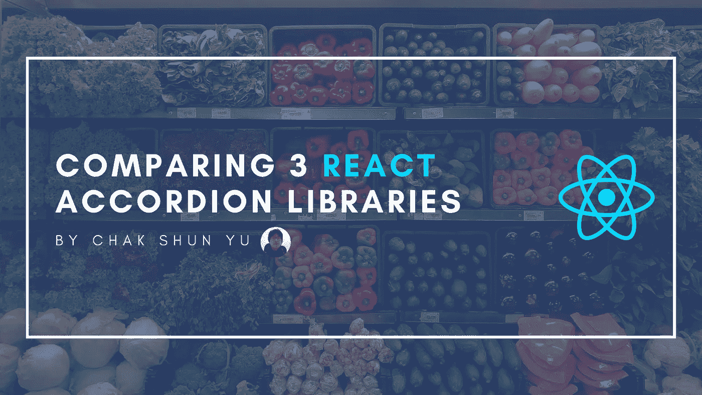

# 比较 3 个 React Accordion 库

> 原文：<https://javascript.plainenglish.io/comparing-3-react-accordion-libraries-1187bc644f2d?source=collection_archive---------22----------------------->

## 3 个 React 手风琴库的比较研究。



最近，为了我的工作，我必须创建一组 React 组件来实现我们项目的 accordion。其中一个选择是从头开始实现一切，另一个选择是研究现有的组件库并加以利用。

起初，我觉得没有必要让第三方库参与这项任务。自己拉手风琴会有多难？它只需要一个可点击的标题，可以使用标题切换的内容，它应该可以有多个组。然而，为了确保万无一失，我潜入了几个图书馆，看看他们在做什么。

最后，我们选择使用其中的一个库。然而，导致这一决定的途径非常有趣。特别是，看到这些第三方库之间的相似之处和不同之处是非常有趣的。我翻遍了多个库，做了一个彻底的对比，并向团队提出。

虽然结果不一定有趣，但我认为这种比较本身对某些 React 开发人员来说是有用的，有教育意义的。因此，我们将研究这种比较，我必须满足的要求，以及与这种比较相关的所有不同因素。

# 要求

显然，对于手风琴，我必须实现几个要求。

*   因为我要使用一个库，所以我必须小心它的包的大小。虽然没有具体的大小限制，但将它保持在一个合理的数量仍然是有意义的。没有理由仅仅为了一个手风琴而包含一个极其臃肿的库，但是使用一个极其小的库也是适得其反的，因为它缺少想要的特性，因此需要我们自己来实现。
*   由于我们代码库的可组合性，我们需要一个库来实现这种风格的手风琴。我们想要一组可组合的 React 组件，而不是一个可以配置一切的大组件。这将允许最高的灵活性和长期可调性。
*   虽然我们不打算在手风琴上添加非常花哨的动画，但一些简单的手风琴组的关闭和打开动画是设计所需要的。
*   虽然可访问性功能肯定很重要，但在这个故事中，它们的优先级并不高。将来能够简单地实现它们是很好的，但是现在唯一与可访问性相关的需求是它应该是键盘用户可以控制的。

# 图书馆

最终，最有希望的库归结为以下 3 个， [rc-collapse](https://github.com/react-component/collapse) 、[react-collapse](https://github.com/glennflanagan/react-collapsible)和[react-accessible-accordion](https://github.com/springload/react-accessible-accordion)。这些是在 NPM 注册中心发现的，是根据它们的活动、受欢迎程度、与 React 和 TypeScript 的集成程度以及文档选择的。在这一节中，我们将深入探讨所有这些问题。

# RC-崩溃

到目前为止，这三个库中最受欢迎的是`rc-collapse`。在 NPM 的注册表上，该图书馆记录了惊人的每周下载量，超过 84 万次。根据 NPM，库的大小为 46.4kB，根据 Bundlephobia，库的大小为 21kB，库的大小为 7.2kB。

然而，该库的组件并没有针对可组合结构进行优化。虽然容器和组都有组件，它们接受组件作为它们的子组件，但是配置头部必须通过这些组组件来完成。

使用这个库实现动画非常简单。在幕后，accordion 组组件利用了`rc-motion`库。这为配置动画提供了许多选项，并为开发人员抽象了许多手动 CSS 工作。

这个库最大的缺点是可访问特性的数量有限。根据 W3C 标准[和](https://www.w3.org/WAI/ARIA/apg/patterns/accordion/)，一个完全无障碍的手风琴有很多方面。在这些库中，`rc-collapse`实现的最少。基本上，他们实现的唯一一个是用于手风琴组的`aria-expanded`，它与屏幕阅读器相关。

# 可折叠的

我们在这里考虑的三个库中最不受欢迎和更新的是`react-collapsible`。它的每周下载量最少，略低于 100k，并且 8 个月没有收到任何更新。就大小而言，NPM 报告的大小与之前的 43kB 图书馆相似，而 Bundlephobia 说它的大小更小，即 10.3kB minified 和 3.3kB gzipped。

和`rc-collapse`类似，这个库的可组合性是有限的。accordion 组内容是通过组件的子组件指定的，但是标题也是通过 prop 指定的。这使得它在可组合性方面遇到了同样的问题。

对于动画，有一些选项可用于配置。虽然这些都不是极其精细的，但是高度动画似乎有一个内置的选项。由于这是我们在这方面的主要要求，因此可以忽略这些限制。

这个库实现了相当多的可访问性特性。它不仅有`aria-expanded`，而且还有以`aria-disabled`、`aria-controls`和`aria-labelledby`形式实现的更大的`aria`属性家族。除此之外，它还实现了与屏幕阅读器和键盘控制相关的`tabIndex`和`role`属性。

对于这个库，我遇到了两个缺点。首先，我无法运行他们的示例项目。这是一个很小的缺点，但它让我更难理解它们的组件看起来、感觉起来和工作起来是怎样的。

另一个更重要的缺点是，该库的组件只负责呈现一个组。由于整个事情没有封装组件，这使得实现 accordion 有点不方便。特别是，由于其分离性，在不同的组之间获得可访问性特性和适当的键盘控制将需要相当多的手工工作。

# react-可访问-手风琴

到目前为止，这个比较中最大的库是`react-accessible-accordion`。根据 NPM 的说法，它配有 100kB 的资产，而根据 Bundlephobia 的说法，minified 和 gzipped 分别配有 13.6kB 和 4.1kB 的资产。如果后两个不适用于你，那么你必须满足于两倍于其他库的大小。这可能是一个相当大的障碍，即使它只有大约 50kB。

主要优势之一是库组件的可组合性。基本上，这个库已经提供了一组现成的可组合组件来构建一个 accordion。这完全符合我们的需求，因为它允许我一对一地重用它们。我需要实现的唯一一件事是基于我们想要在代码库中公开的 API 包装那些组件。

这个库的另一个好处是提供了大量现成的可访问性特性。与其他库相比，`react-accessible-accordion`已经最精心和勤奋地实现了它们。它包含适当的角色、标签、`aria`属性族、键盘可控性和`aria-level`属性。

这个库的主要缺点是缺乏动画支持。虽然其他库允许您配置切换折叠项的动画，但这个库不提供任何类似的功能。他们提供的动画的唯一例子与不透明度有关，这与我们无关。因此，切换可见性和高度的动画必须由我们自己实现，这并不总是微不足道的。

# 最后的想法

在 JavaScript 开发领域，求助于第三方库并不罕见。然而，它们数量巨大，而且质量和功能各不相同。因此，在决定使用哪个库时很容易迷失。

因此，本文讨论了这样一个场景，在 3 个不同的库之间决定实现一个 accordion。虽然结果不是最重要的部分，但比较本身更有趣，更有教育意义。它深入到需求、库需要考虑的不同方面，以及如何将它们结合在一起。

虽然结果不一定有趣，但我认为这种比较本身对某些 React 开发人员来说是有用的，有教育意义的。因此，我们将研究这种比较，我必须满足的要求，以及与这种比较相关的所有不同因素。

```
**Want to Connect?**If you liked this article, consider checking out the other entries in the [Uncommon React](https://www.getrevue.co/profile/chakshunyu) newsletter and my [Twitter](https://twitter.com/keraito) for future updates.
```

*更多内容请看*[***plain English . io***](https://plainenglish.io/)*。报名参加我们的* [***免费周报***](http://newsletter.plainenglish.io/) *。关注我们关于*[***Twitter***](https://twitter.com/inPlainEngHQ)*和*[***LinkedIn***](https://www.linkedin.com/company/inplainenglish/)*。查看我们的* [***社区不和谐***](https://discord.gg/GtDtUAvyhW) *加入我们的* [***人才集体***](https://inplainenglish.pallet.com/talent/welcome) *。*