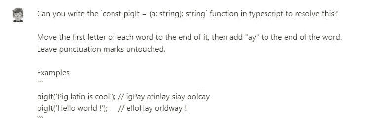
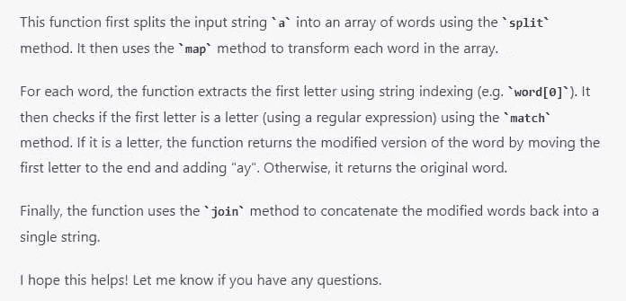
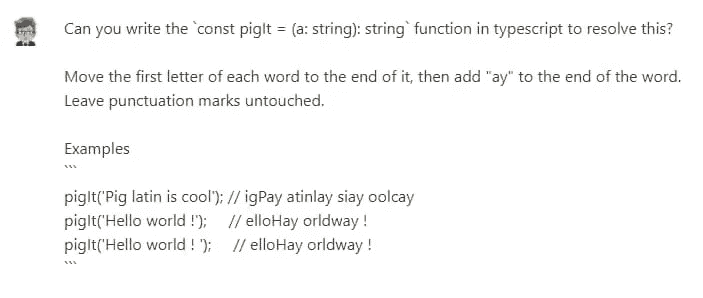
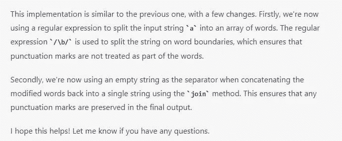

# JavaScript 中 Pig 拉丁文翻译方法的比较

> 原文：<https://javascript.plainenglish.io/comparing-approaches-to-pig-latin-translation-in-javascript-f90b9cffcad5?source=collection_archive---------14----------------------->

## 毁灭 2022

## 探索正则表达式、我的解决方案和人工智能解决方案


今天《毁灭 2022》的问题是关于[猪拉丁语](https://en.wikipedia.org/wiki/Pig_Latin)。但是什么是猪拉丁语呢？这是一种有趣的语言，在说英语的儿童中使用。对我这个母语为意大利语的人来说，这是法尔法利诺字母表的简化版。但是除了童年的游戏，这个问题有趣的地方在于需要处理句子中的单个单词。句子不一定要连贯。不过还是从问题的正文开始吧。

# 理解猪拉丁文翻译规则

链接到[形](https://www.codewars.com/kata/520b9d2ad5c005041100000f)

将每个单词的第一个字母移动到它的末尾，然后在单词的末尾加上`ay`。保持标点符号不变。

```
pigIt('Pig latin is cool'); // igPay atinlay siay oolcay
pigIt('Hello world !');     // elloHay orldway !
```

# 我的解决方案:分裂和重组猪拉丁翻译的话


在这种情况下，最佳解决方案也涉及到正则表达式的使用。同样在这种情况下，我的一知半解迫使我找到一种方法来规避这个问题，至少是部分规避。

我可以把这个问题分成三部分来解决:

1.  首先，我将句子转换成单词数组(我使用空格作为分隔符)
2.  然后我修改每个单词，把第一个字母移到最后一个位置，加上 ay
3.  最后，我将数组的各个元素连接起来，以获得一个文本字符串

这样我得到了一个(错误的)类似于这样的函数:

```
export const pigIt = (a: string): string =>
  a
    .split(" ")
    .map((w) => w.slice(1, w.length) + w[0] + "ay")
    .join(" ");
```

这个函数转换每个单词，包括那些仅由标点符号组成的单词。在问题的要求中规定不要变换标点符号。因此，我可以使用 regex `/\W+/`来检查单词是否包含非字母数字符号。

加了这个条件后，就有问题了。虽然问题的正文没有解释，但是在测试中有一些特殊情况。一个是相当模糊的，当句子以空格结束时，会导致函数失败。为了解决这个特殊情况，我增加了第二个条件，`w == ''`。

我承认我对这种变通方法不满意，但是现在这个函数完成了它的工作。

```
export const pigIt = (a: string): string =>
  a
    .split(" ")
    .map((w) =>
      !!w.match(/\W+/) || w == "" ? w : w.slice(1, w.length) + w[0] + "ay"
    )
    .join(" ");
```

幸运的是，在解决方案中，有人找到了一种更优雅的方法来解决这个问题。

# 用最佳解决方案替换句子中的所有单词


最佳解决方案是这样的:

```
export const pigIt = (a: string) => a.replace(/(\w)(\w+)*/g, "$2$1ay");
```

看完之后，我意识到我的解决方案是多么的幼稚和脱离轨道。与其把字符串当成数组，不如把它当成…字符串更聪明！

这个解决方案背后的想法是在正则表达式中使用[组。在实践中，我使用表达式`/(\w)/`来捕获一个组中的第一个字母，它会自动用数字`1`来标识。](https://developer.mozilla.org/en-US/docs/Web/JavaScript/Guide/Regular_Expressions/Groups_and_Backreferences)

然后我添加了第二组`/(\w+)/`，它标识了所有后续的字母(单词)。这个第二组成为数字`2`。

最后，我将这个表达式与 String.replace()方法一起使用。我可以用他们的名字把这两个组颠倒过来:`$2$1`。如果我加上`ay`，我会得到猪字母表中的完整单词。

如果我最终在正则表达式中添加一个星号(`*`)，我可以自动对一个句子中的所有单词执行相同的操作。

这确实是一个简单而优雅的解决方案，我真的希望能够自己发现它。但是我很高兴学到了新的东西。

# 比较人类和人工智能翻译猪拉丁文的方法


这些天我在测试 ChatGPT，一个能够解决各种问题的人工智能。于是我试着向 ChatGPT 请教问题的解决方法。

这是它的回应:



```
function pigIt(a: string): string {
  return a
    .split(" ")
    .map((word) => {
      const firstLetter = word[0];
      if (firstLetter.match(/[a-zA-Z]/)) {
        return word.slice(1) + firstLetter + "ay";
      } else {
        return word;
      }
    })
    .join(" ");
}
```



但是解决方法是错误的。

我试着通过增加边界情况来重新表述这个问题。ChatGPT 是这样回应的:



```
function pigIt(a: string): string {
  return a
    .split(/\b/)
    .map((word) => {
      const firstLetter = word[0];
      if (firstLetter.match(/[a-zA-Z]/)) {
        return word.slice(1) + firstLetter + "ay";
      } else {
        return word;
      }
    })
    .join("");
}
```



在第二次尝试时，解决方案是正确的。我不认为这是最好的解决方案，但它仍然是一个正确的答案。

感谢阅读！敬请关注更多内容。

***不要错过我的下一篇文章—报名参加我的*** [***中邮箱列表***](https://medium.com/subscribe/@el3um4s)

[](https://el3um4s.medium.com/membership) [## 通过我的推荐链接加入 Medium—Samuele

### 阅读萨缪尔的每一个故事(以及媒体上成千上万的其他作家)。不是中等会员？在这里加入一块…

el3um4s.medium.com](https://el3um4s.medium.com/membership) 

## 更多内容请访问 [PlainEnglish.io](https://plainenglish.io/) 。

报名参加我们的 [**免费周报**](http://newsletter.plainenglish.io/) 。关注我们关于 [**推特**](https://twitter.com/inPlainEngHQ)[**LinkedIn**](https://www.linkedin.com/company/inplainenglish/)**[**YouTube**](https://www.youtube.com/channel/UCtipWUghju290NWcn8jhyAw)**[**不和**](https://discord.gg/GtDtUAvyhW) **。******

## ****对扩展您的软件启动感兴趣吗？检查[电路](https://circuit.ooo/?utm=publication-post-cta)。****

****我们提供免费的专家建议和定制解决方案，帮助您建立对您的技术产品或服务的认知和采用。****