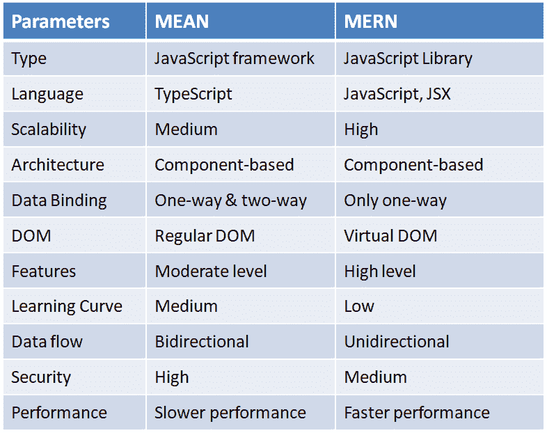
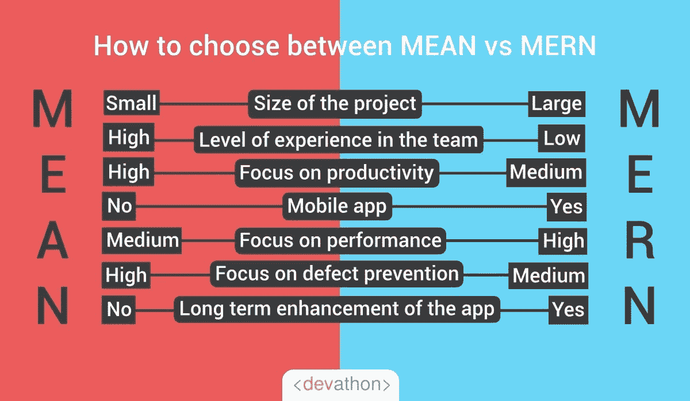

# 平均叠加与 MERN 叠加的比较

> 原文：<https://javascript.plainenglish.io/comparison-of-mean-stack-mern-stack-fb08feff7c36?source=collection_archive---------23----------------------->

## 为您的 web 开发目标选择正确的技术组合。

Photo by [James Harrison](https://unsplash.com/@jstrippa?utm_source=medium&utm_medium=referral) on [Unsplash](https://unsplash.com?utm_source=medium&utm_medium=referral)

在瞬息万变的数字世界中，每天都有大量的技术进步和新的市场需求。因此，这个数字时代使得拥有一个网站或应用程序，而不是发展业务的唯一选择。为了实现您的业务目标，您必须部署合适的技术。

无论你是公司的 IT 专家，还是想要推出[网站](https://www.wingstechsolutions.com/service/web-development/)或[手机应用](https://www.wingstechsolutions.com/service/mobile-app-development/)的企业家，选择[合适的技术组合](https://about.me/wingstechsolutions)都是一个挑战。在这种情况下，你可能听说过均值叠加和 MERN 叠加之间的比较。

您对技术堆栈的选择将影响您未来的发展。你应该选择哪种技术？这将扩大你的业务潜力？要找到这些问题的答案，你需要了解两者的区别、相似之处和好处。

让我们先介绍一下平均堆栈和 MERN 堆栈！

## 什么是均值叠加？

Mean 是一个 JavaScript 软件栈，用于开发动态网站和 web 应用程序。MEAN 栈支持的所有组件都是用 JavaScript 编写的，允许 MEAN 应用程序在服务器端和客户端都可以运行。

MEAN 代表:

M — MongoDB

电子快递

A —有角度

N — Node.js

使用这个堆栈可以更快地开发和部署 Web 应用程序。前端用 Angular 这样的前端开发框架，后端用 Node.js、Express、MongoDB 这样的后端开发框架。

## 什么是 MERN 堆栈？

MERN 栈是一个 JavaScript 栈，它使得构建和部署全栈 web 应用程序更加容易和快速。MERN 堆栈包括四种技术，即 MongoDB、Express、React 和 Node.js。它们简化了开发过程。

这四种强大技术中的每一种都为开发人员提供了一个端到端的工作框架，并且在开发 web 应用程序中扮演着重要的角色。

MongoDB —文档数据库

快递(。js) — Node.js web 框架

反应(。js)——一个客户端 JavaScript 框架

节点(。js)——首屈一指的 JavaScript web 服务器

中间(应用)层是 Express 和 Node。Node.js 是一个流行且强大的 JavaScript 服务器平台，构建于 Express.js 之上。无论您选择哪种变体，ME(RVA)N 都提供了使用 JavaScript 和 JSON 的最完整、最强大的方式。

## **均值叠加比较& MERN 叠加**

## 结论

由于平均堆栈和 MERN 堆栈的竞争性质，选择一个或证明两者都是不简单的。这两种技术的能力和特性都是非凡的。要创建动态应用程序，请根据您的业务需求选择均值或 MERN 堆栈。

*更多内容请看*[***plain English . io***](http://plainenglish.io/)*。报名参加我们的* [***免费周报***](http://newsletter.plainenglish.io/) *。在我们的* [***社区***](https://discord.gg/GtDtUAvyhW) *获得独家获得写作机会和建议。*