# 基于组件的动态 HTML 网站体系结构

> 原文：<https://javascript.plainenglish.io/component-based-architecture-for-dynamic-html-websites-857c21f0c95a?source=collection_archive---------8----------------------->

## 使用 JavaScript Web 组件

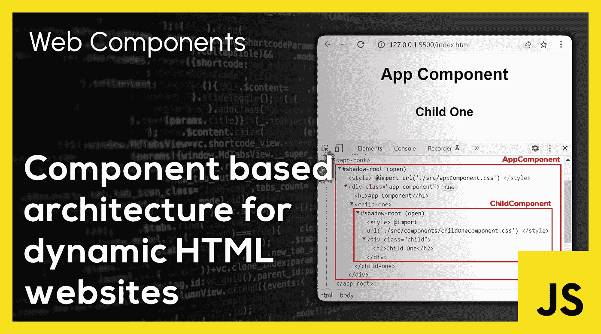

[**Web 组件**](https://developer.mozilla.org/en-US/docs/Web/Web_Components) 允许我们创建可重用的定制 HTML 元素，将它们的功能封装在代码的其余部分之外。这可以与 ES 模块相结合，为使用 HTML、CSS 和普通 JavaScript 的网站创建一个基于组件的架构。

按照这种方法，无需使用任何 JavaScript 框架或库就可以编写一个 [**单页面应用程序**](https://en.wikipedia.org/wiki/Single-page_application) 。本文将帮助您理解如何实现这一点。

> 完整代码可在 [**GitHub**](https://github.com/savinuvijay/single-page-app) 上获得。
> 
> 在 [**StackBlitz**](https://stackblitz.com/edit/web-platform-xxuyv2) 上试用这个架构。

# **架构**

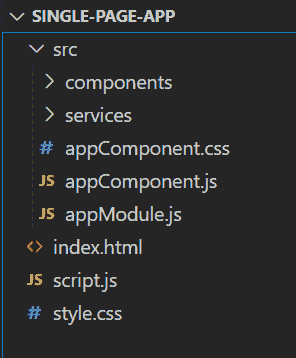

应用基础文件夹由`index.html`、`script.js`和`style.css`组成。这三个文件主要包含[样板代码](https://en.wikipedia.org/wiki/Boilerplate_code)，这些代码对于使用这种架构的任何应用程序都是一样的。基本文件夹还包含一个**‘src’**文件夹，其中存放了所有特定于应用程序的源代码。该文件夹包含`AppModule`、`AppComponent` — *(基础组件*)、所有子组件和服务。`AppModule`和`AppComponent`是构成定制入口点的必需文件。这些文件还包含一些样板代码。

# **浏览基础文件夹**

基本文件夹中的三个文件(`index.html`、`script.js`、`style.css`)构成了应用程序的起点。

## **Index.html**

这是一个样本 HTML 文件，其中的`<head>`部分定义了`script.js`文件并链接了`style.css`文件。`script.js`文件指定了`type='module'`来启用 ES 模块。它也被标记为`'defer'`，以便在 HTML 加载后加载它。

`index.html`的主体只包含对`<app-root>`的引用。这个文件是整个应用程序中唯一的 HTML 文件。

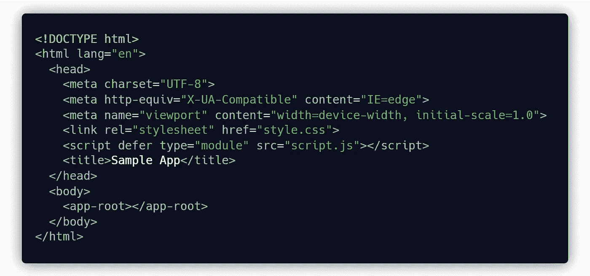

## **script.js**

`script.js`文件包含了`AppModule`的定义，它构成了应用程序其余部分的入口点。

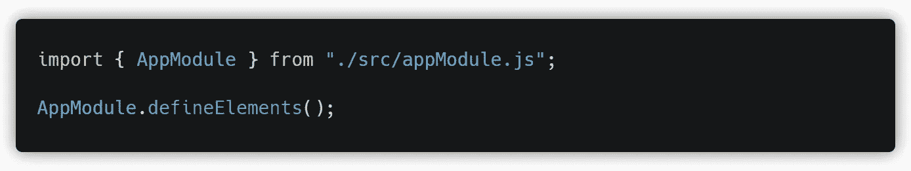

`style.css`文件包含应用程序的整体样式，也链接到`index.html`文件。

# **探索** `**src'**` **文件夹**

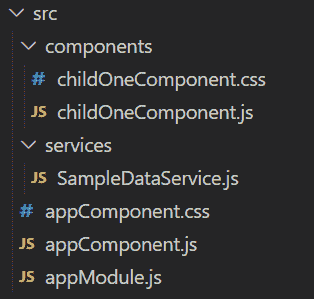

应用程序的核心部分存在于 **src** 文件夹中。

## **模块**

它从唯一在' **src'** 文件夹外引用的文件`appModule.js`开始。它被导入到如上所示的`script.js`文件中。`appModule.js`包含一个名为`'AppModule'`的导出类，它包含了`defineElements()`方法的定义。该方法从`script.js`文件中调用。应用程序中的所有组件，包括基本组件和所有子组件，都在该方法的主体中定义。

在下面的例子中，我们看到`AppComponent`被定义为`app-root`，而`childOneComponent`被定义为`child-one`。

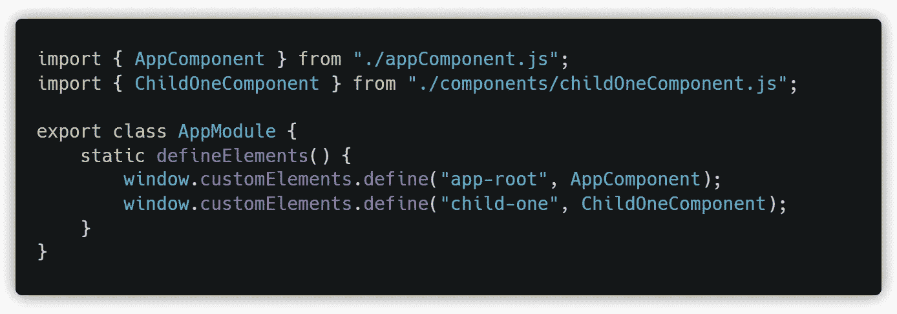

## **组件**

该架构中的每个组件都由两部分组成。**第一个**是定义组件的 HTML 模板和方法的 JavaScript 文件。**第二个**是 CSS 文件，它定义了组件的样式并导入到模板中。

组件 JavaScript 文件由 HTML `template`定义和组件类定义组成。组件类是从`HTMLElement`基类扩展而来的。该类定义了组件的一个构造函数和两个生命周期方法。一旦组件连接(加载)到 DOM，就运行`connectedCallback()`生命周期方法，而一旦组件从 DOM 断开连接(移除)，就运行`disconnectedCallback()`。

## **底座组件**

`appComponent.js`是一个 JavaScript Web 组件，它构成了应用程序的基础组件。这可以被认为是架构的强制部分，因为它是作为`<app-root>`暴露给`index.html`文件的唯一组件。

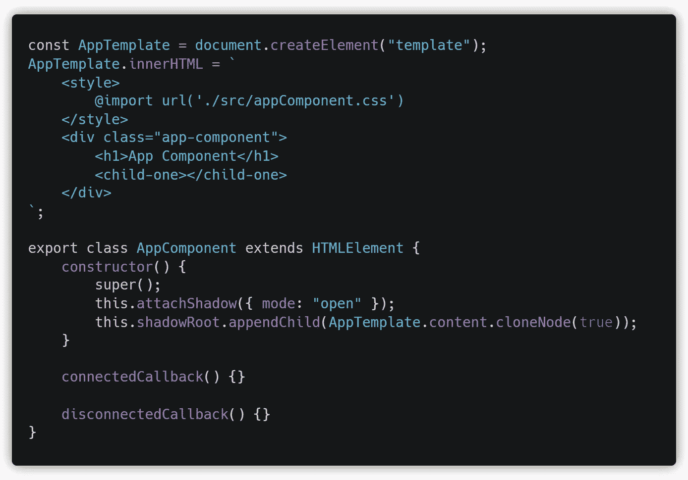

在上面的例子中，`appComponent`的模板包含一个导入`appComponent.css`的`<style>`标签和一个构成组件主体的`<div>`标签。在组件体内，有一个标题为`'App Component'`的`<h1>`标签和一个`<child-one>`标签。

`AppComponent`类包含应用程序正常运行所需的基本 web 组件样板代码。

## **子组件**

子组件放在**‘组件’**文件夹中。所有创建的子组件需要在`AppModule`中定义，并直接或间接连接到`appComponent`。

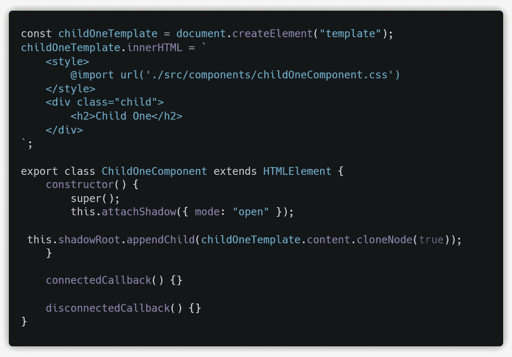

在上面的例子中，`childOneComponent`的模板包含一个导入`childOneComponent.css`的`<style>`标签和一个构成组件主体的`<div>`标签。在它的主体内有一个标题为`'Child One'`的`<h2>`标签。

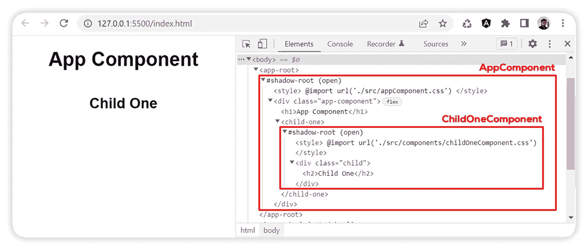

这个应用程序在运行时形成了上面的 DOM 结构。`<app-root>`包含了`AppComponent`的正文内有 [**的影子根**](https://developer.mozilla.org/en-US/docs/Web/API/ShadowRoot) 。类似地，`<child-one>`组件的主体包含在嵌套的影子根中。

## **服务**

服务是包含一组静态函数的类，这些函数帮助应用程序与外部服务、API 或数据库进行交互。这些用于将引用外部资源的代码与组件隔离开来。服务放在嵌套在**‘src’**文件夹中的**‘services’**文件夹中。

可以从应用程序中的任何地方访问服务。需要将它导入到将要使用它的相应文件中。

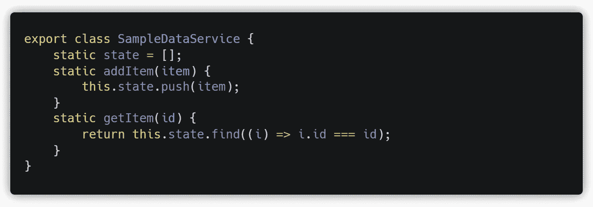

上面的`SampleDataService`示例包含一个静态`state`数组和另外两个静态方法来操作`state`。`addItem()`方法将一个项目推入`state`中，`getItem()`方法通过`id`从`state`中获取一个项目。这些方法可以从应用程序中的任何地方调用。

```
import { **SampleDataService** } from **"./services/SampleDataService.js"**;
```

`SampleDataService`被导入到将被使用的相应文件中。如果我们想在`AppComponent`加载后添加一两个项目到状态中，我们从`AppComponent`的`connectedCallback`调用`SampleDataService.addItem()`。

```
connectedCallback() {
    **SampleDataService**.addItem({ id: 1, value: “Item 1” });
    **SampleDataService**.addItem({ id: 2, value: “Item 2” });
}
```

如果我们想在`ChildOneComponent`加载后打印一个特定的项目到控制台，我们通过从`ChildOneComponent`的`connectedCallback` 传递项目 id 给它来调用`SampleDataService.getItem(id)`。然后，我们可以使用`console.log()`将该值打印到控制台。

```
connectedCallback() {
   let item = SampleDataService.getItem(1);
   console.log("Child One: ", item);
}
```

> 由于可变的状态变量，上述状态管理方法是不安全的。使用**冗余**模式，可以将**状态**与服务隔离，以提高安全性。

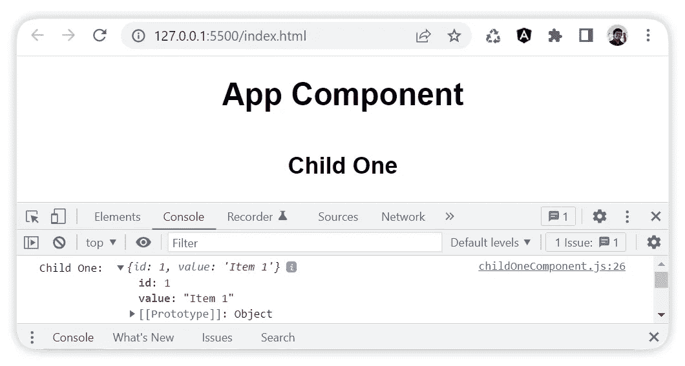

# **结论**

最后，我们看了如何使用 web 组件和 JavaScript ES 模块创建单页面应用程序。我们探索了为这种方法创建的架构和文件夹结构。我们还研究了作为应用程序样板所需的所有文件，并了解了如何对其进行定制。

这个架构的代码可以在 [**GitHub**](https://github.com/savinuvijay/single-page-app) 上获得。

你可以在 [**StackBlitz**](https://stackblitz.com/edit/web-platform-xxuyv2) 上试用这个架构。

*更多内容看* [***说白了。报名参加我们的***](https://plainenglish.io/) **[***免费周报***](http://newsletter.plainenglish.io/) *。关注我们关于*[***Twitter***](https://twitter.com/inPlainEngHQ)*和*[***LinkedIn***](https://www.linkedin.com/company/inplainenglish/)*。加入我们的* [***社区***](https://discord.gg/GtDtUAvyhW) *。***