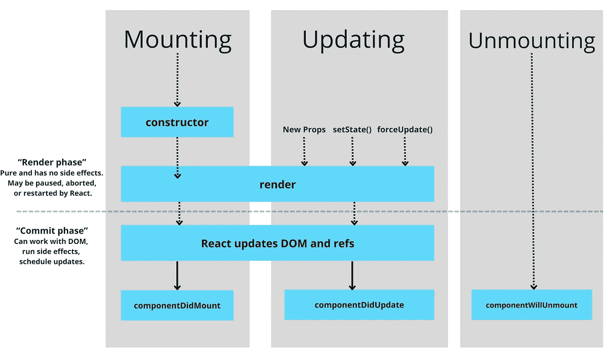

# React 中组件的生命周期方法——用例子详细说明

> 原文：<https://javascript.plainenglish.io/components-lifecycle-methods-in-react-detailed-clarification-with-examples-c3c72b04f735?source=collection_archive---------3----------------------->

## 了解在 React 组件生命周期的不同阶段提供的不同生命周期方法。



Image created by the author on [Canva](http://canva.com)

React 为每个组件提供了几个“生命周期方法”，我们可以在整个过程中的特定时间覆盖这些方法来运行我们的代码。根据 React 的默认特性，它自动调用 React 组件当前所在的特定阶段的负责方法。我们可以操纵每种方法来更好地控制我们的组件。

组件的生命周期分为以下三个部分:

*   增加
*   更新
*   卸载

每个部分都有自己的方法，以特定的顺序调用。让我们了解一下在这些不同阶段可用的不同方法。

# 增加

这是 React 中每个组件的第一个也是最重要的阶段。 ***挂载*** 这个名字很容易理解。这是初始化、创建 React 组件并将其插入 DOM 的阶段。我在下面按照调用的顺序解释了这个阶段的每个方法。

## 1.构造函数()

实际上，构造函数是通过设置状态来初始化组件的旅程。React 组件的构造函数在挂载之前被调用。*根据 React 文档，* *如果没有初始化状态，也没有绑定方法，就不需要为 React 组件实现构造函数。*

在实现构造函数时，我们需要在任何其他语句之前调用`super(props)`。不这样做将会声明`this.props`未定义，并且会产生 bug。我们只能在构造函数中直接使用`this.state`。在所有其他方法中，我们需要使用 this.setState()来代替。除了初始化本地状态，我们还可以将事件处理程序方法绑定到构造函数中的实例。请看下面的构造函数示例:

```
class ContructorDemo extends React.Component {
    constructor(props) {
       super(props);
       this.state = { counter: 0 }; 
       ***// Note:*** *Don't call this.setState() in constructor!*
       this.handleClick = this.handleClick.bind(this);
    }
```

## 2.静态 getDerivedStateFromProps()

getDerivedStateFromProps 方法在 render 方法被调用之前被调用。它在初始装载和每次更新时都会调用。它将状态作为参数，并返回一个包含状态更改的对象，或者返回 null 不更新任何内容。下面的示例演示了静态 getDerivedStateFromProps()方法:

```
static getDerivedStateFromProps(props, state) {
    return {counter: props.count };
}
```

## 3.渲染()

render 方法是类组件中唯一的强制方法，也是将 HTML 实际输出到 DOM 的方法。当它被调用时，它检查`this.props`和`this.state`并返回其中一个——React 元素、数组&片段、门户、字符串&数字、布尔值或 null。请看 render 方法的给定示例:

```
render() {
    return (
      <p>Current count is {this.state.counter}</p>
    );
}
```

## 4.componentDidMount()

组件呈现后将立即调用 componentDidMount 方法。这些语句需要在运行之前安装一个组件，它们将被放置在此方法中。例如，从远程端点加载数据，设置任何订阅，或者希望在组件呈现后立即更改状态。请看下面给出的例子:

```
componentDidMount() {
    document.addEventListener("click", this.handleClick);
}
```

# 更新

组件生命周期的更新阶段是由属性或状态的变化引起的。顾名思义，在这个阶段中，React 组件重新呈现，下面的方法将按照给定的顺序被调用。

## 1.静态 getDerivedStateFromProps()

*这与安装中排在第二位的方法相同。*然而，当一个组件重新渲染时，它是第一个被调用的方法。它将使用道具的更新值，并根据它更新状态。其他的都一样。

## 2.shouldComponentUpdate()

当接收到新的道具或状态时，在呈现之前调用 shouldComponentUpdate 方法。初始呈现时不调用此方法。*shouldcomponentdupdate*方法用于通过仅在传递给组件的属性改变时更新组件来提高性能。它返回一个布尔值，指定 React 是否应该继续渲染。该方法返回的默认值是 *true* ，但是，使其为 *false* 将会阻止 React 将更改重新呈现到状态和道具中。请参见下面的示例来更改默认行为:

```
shouldComponentUpdate(nextProps) {
    if (nextProps.value !== this.props.value) {
        return true;
    } 
    else {
        return false;
    }
}
```

## 3.渲染()

render 方法将在更新阶段的第三个地方被调用。调用它来将 HTML 更新到 DOM。该方法的其余行为和用法将保持与安装阶段相同。

## 4.getSnapshotBeforeUpdate()

getSnapshotBeforeUpdate 方法在最近呈现的输出提交到 DOM 之前被调用。它使组件能够捕捉一些以前的信息，如属性和状态，然后再进行更改。如果使用这种方法，还应该考虑使用***componentDidUpdate()****方法。不这样做可能会导致错误，此生命周期方法返回的任何值都将作为参数传递给 componentDidUpdate()。应返回一个 ***快照值*** 或 ***空值*** 。参见下面的代码来理解我们如何从 DOM 中获取信息。*

```
*getSnapshotBeforeUpdate(prevProps, prevState) {    
    if (prevState.counter !== this.state.counter)
        return prevState.counter;
    return null;
}*
```

## *5.componentDidUpdate()*

*componentDidUpdate 方法在更新发生后被直接调用。初始呈现时不调用此方法。在组件被重新渲染/更新后，我们可以使用这个方法对 DOM 进行操作。例如，假设我们正在逐个获取每个用户的数据。我们可以比较当前的用户标识和以前的用户标识，如果用户标识已经改变，我们可以获取新用户的数据，否则什么也不做。在这种方法中使用条件时，始终将我们的操作包装在条件中是一个好习惯，否则，它会导致无限循环。请参见 React 文档中提到的以下示例:*

```
*componentDidUpdate(prevProps) {
  // Good Practice remember???
  if (this.props.userID !== prevProps.userID) {
    this.fetchData(this.props.userID);
  }
}*
```

# *卸载*

*卸载是任何 React 组件的第三个也是最后一个阶段。在生命周期的这个阶段，React 组件将从 DOM 中删除。此阶段只有一种组件生命周期方法，即:*

## *componentWillUnmount()*

*在卸载和销毁组件之前，将立即调用此方法。此方法对于执行任何清理活动都很有用，例如取消网络请求或取消订阅在*componentidmount()*中创建的任何订阅。请看下面的例子，我们正在删除 componentDidMount 方法中添加的事件侦听器。*

```
*componentWillUnmount() {
    document.removeEventListener("click", this.handleClick);
}*
```

# *结论*

*本文的目的是理解 React 组件的生命周期。文章还详细阐述了其生命各个阶段的不同方法。此外，我试图解释每种方法的用例，这将有助于操作 React 的组件。我希望你喜欢这篇文章，并跟随我学习更多有趣的东西，保持更新。*

*[](https://medium.com/@kardaniyagnik/membership) [## 通过我的推荐链接加入 Medium-Yagnik Kardani

### 作为一个媒体会员，你的会员费的一部分会给你阅读的作家，你可以完全接触到每一个故事…

medium.com](https://medium.com/@kardaniyagnik/membership) [](https://www.buymeacoffee.com/kardaniyagnik) [## Yagnik Kardani 正在创建帮助他人成长的技术学习材料。

### 你好👋，我是一名媒体方面的技术作家。我喜欢学习并帮助他人在软件开发和云计算方面成长…

www.buymeacoffee.com](https://www.buymeacoffee.com/kardaniyagnik) 

*更多内容请看*[***plain English . io***](https://plainenglish.io/)*。报名参加我们的* [***免费周报***](http://newsletter.plainenglish.io/) *。关注我们关于*[***Twitter***](https://twitter.com/inPlainEngHQ)*和*[***LinkedIn***](https://www.linkedin.com/company/inplainenglish/)*。查看我们的* [***社区不和谐***](https://discord.gg/GtDtUAvyhW) *加入我们的* [***人才集体***](https://inplainenglish.pallet.com/talent/welcome) *。**