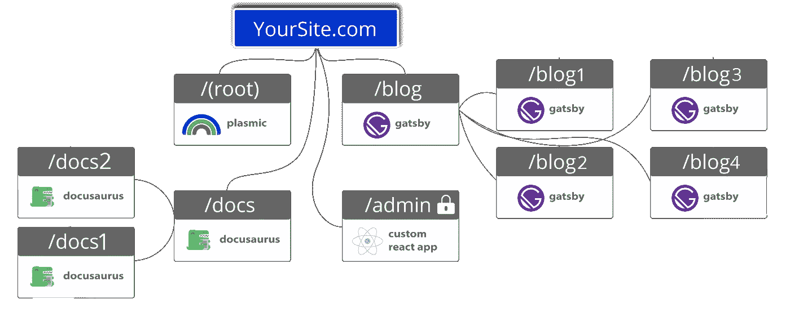
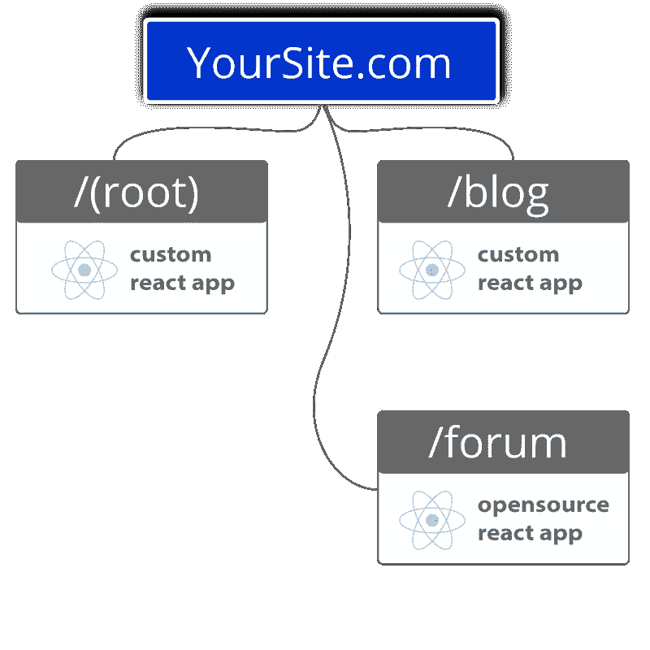
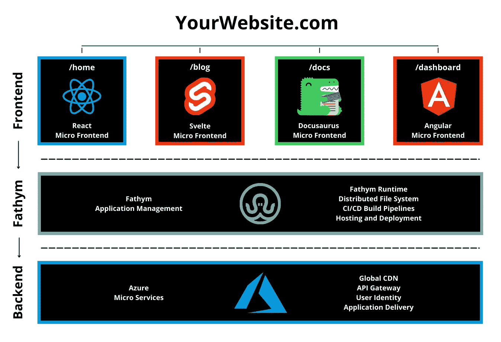

# 可组合前端与模块化前端以及它们如何协同工作

> 原文：<https://javascript.plainenglish.io/composable-vs-modular-frontends-and-how-they-work-together-3faa7ab619bf?source=collection_archive---------11----------------------->

**在这一块**

*   定义模块化前端架构
*   定义可组合前端
*   解释他们如何一起工作
*   通过使用无代码工具，可组合前端可以节省公司一个数量级

对于开发人员来说——无论是单独工作还是在企业内部工作——在构建 web 应用程序或网站时，决定使用整体式或更小的模块化前端是一个坚实的起点。

许多企业都有整体架构，带有遗留代码。这使得随着公司的发展，进行改变、更新和扩展变得极其困难。因此，一些人可能希望[从整体式方法一步一步地过渡到模块化方法。](https://www.fathym.com/blog/articles/2022/may/2022-05-31-modularize-your-monolith-one-page)

或者，管理人员可能决定坚持使用遗留代码。好消息是，所有这些选项都可以在 Fathym 上使用我们的 Microsoft Azure 供应的云托管。

虽然我们支持这两种方式，但还是让我们深入了解如何使用 Fathym 轻松组装具有模块化架构和可组合前端的应用程序。

# 什么是模块化架构？

在模块化方法中，Fathym 使用“路线”，允许你在每条路线下运行尽可能多的微应用或页面。把路由想象成一个网站的子路径。由于它是模块化的，每个应用程序/页面都可以由一个开发人员或一个独立的团队创建。

例如，对于/blog 路径，您可以将多个不同的博客页面放在其内部/下面。比如:博客主页、blog1、blog2、blog3、另一个页面上的内容链接列表，甚至另一个页面上的照片库——都在/blog 路径下。

“一条路线下的每个应用/页面都是它自己的 NPM 包或 GitHub repo，”工程总监杰里米·汤姆林森解释道。“这意味着你可以使用不同的团队。也意味着不再堵！”

我们在您的域上独立托管每个路由、应用程序/页面。我们将每个路由作为您的域中的子目录独立托管。这意味着不再有子域，或者笨拙的代理和重定向来映射子域到你的主站点。

对终端用户来说，所有的途径(博客、定价、文档等。)看起来好像所有东西都是用同一个整体代码库编写的。然而，它不是，这意味着代码库更小，因此更容易更新，替换，改变，缩放和修复错误！

# 它看起来像什么

把模块化前端想象成一种*方式*来构建前端、ui 和 UX。是建筑风格。

这是使用模块化前端架构的简化网站的外观:

# 想象模块化前端类似于模块化外壳

模块化前端是 web 开发世界的一个重大变化，就像模块化家庭是家庭建筑的世界一样。

模块化房屋由较小的部件组成，这些部件组合在一起形成整个房屋。它们是一种新的、创新的方式来简化房屋建造过程；每一个零件都是在工厂里制造的，然后被运到现场进行快速组装。

与之相对的是传统的住宅建筑，从头开始。在那种建筑方式中，地基被铺好，然后等待晾干。然后，在添加绝缘材料、窗户、壁板和屋顶之前，一切都被框起来。在这一点上，重点转向内部，地板和固定装置完成。

现在，如果我们把传统的房子想象成整体建筑，我们可以看到一个东西的改变会如何影响整个结构。如果门道在承重墙里，就不能随便移动。但是在一个模块化的房子里，你有更多的自由来改变房子的一部分，而不会破坏其他部分。

这也是模块化前端的一个好处；开发人员可以更改网站或应用程序的一部分，而不用担心破坏另一部分的代码。但是，让我们来看看模块化体系结构的其他好处。

# 模块化架构优势

*   个体的、独立的、较小的前端。
*   更小、更有凝聚力的代码库。这也使得它们更容易维护和更改。
*   多个团队或多个个人同时从事他们自己的项目。
*   这意味着更小的增量部署。一个团队不会等待另一个团队发布他们的更新。
*   允许根据需要扩展团队。
*   给予重写的能力，改变或更新前端递增部分。这意味着修复漏洞或改变网站的部分功能不会迫使整个网站停机维护。

# 那么，什么是可组合前端呢？

在可组合应用程序的现代世界中，大多数可组合性通常出现在无头的 API 层。Fathym 促进了这一点，但也相信在前端、表示层也应该有真正的可组合性。

它们是 GitHub repos、NPM 包、zip 文件等。它们以开发者或者公民开发者想要使用的任何组合放在一起。这意味着同时使用高代码、低代码或无代码，或者选择使用首选策略的自由。

正如你所看到的，企业可以为他们的网站或应用程序的每一部分选择最佳的方法。

你可能需要使用 React，它是健壮的，来使用高级代码创建主页。然后，由于它的轻量级设计，Svelte 可能是博客的一个很好的解决方案。为你的文档使用像 Docusaurus 这样的低代码工具。然后，在本例中，将 Angular 用于幕后仪表板。

实际上，对于如何构建您的前端，选项是无限的，并且使用无代码工具——如 plasic——允许您将像构建博客这样的项目分配给没有编程经验的人。这不仅在开发人员的工作量方面节省了资源，而且还节省了时间，因为由于模板及其拖放工作流，无代码工具允许快速创建项目。

# 模块化和可组合前端如何协同工作

这就是模块化和可组合前端协同工作的方式。模块化指的是开发者可以在 Fathym 之上构建前端的架构。[模块化前端](https://www.fathym.com/blog/articles/2022/october/2022-10-04-five-reasons-to-use-modular-frontends)是更小的前端和更小的代码库，使开发人员能够更容易地修改代码库，更快地部署和更简单地修复错误。

在 [Fathym 的可组合前端架构中，](https://www.fathym.com/blog/articles/2022/september/2022-09-01-explaining-composable-frontend-architecture-as-simply-as-possible)你可以使用任何 JavaScript 框架(甚至一些其他框架)来构建你网站的一个方面。然后，如果你愿意，使用不同的框架，或者高代码、低代码和无代码构建器的组合来构建网站或应用程序的其他部分。

# 加入可组合前端革命

“将一系列无代码工具组合在一起制作一个应用程序，会使您的应用程序总成本从 10 万美元到 100 美元不等。这太疯狂了，”Fathym 首席执行官马特·史密斯最近解释道。“这是技术世界的崩溃。这是一场革命。”

没错。

在可组合前端中，企业可以选择在他们的新网站或应用中只使用无代码工具。这意味着团队成员之间更多的合作，它给予所有权和能力来为“公民开发者”推进项目，并最终节省时间和金钱。

“可组合的前端和无代码工具——再加上 fat hym——允许你没有一个 DevOps 团队，”Smith 继续说道。“它们让您能够以更低的成本更快地完成更多工作。我们说的不是少 5 美元。我们谈论的是一个数量级。”

【https://www.fathym.com】最初发表于**。**

**更多内容请看*[***plain English . io***](https://plainenglish.io/)*。报名参加我们的* [***免费周报***](http://newsletter.plainenglish.io/) *。关注我们关于*[***Twitter***](https://twitter.com/inPlainEngHQ)[***LinkedIn***](https://www.linkedin.com/company/inplainenglish/)*[***YouTube***](https://www.youtube.com/channel/UCtipWUghju290NWcn8jhyAw)*[***不和***](https://discord.gg/GtDtUAvyhW) *。对增长黑客感兴趣？检查* [***电路***](https://circuit.ooo/) *。****