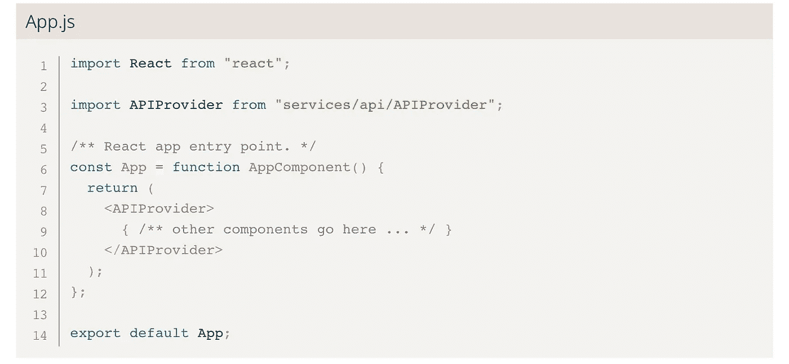

# 以正确的方式使用 API

> 原文：<https://javascript.plainenglish.io/connect-react-application-to-your-api-backend-18fb76172b36?source=collection_archive---------5----------------------->

## 在 React 应用程序中发出 API 请求的一种可靠且可伸缩的方式是连接到您的(REST) API 后端。

在构建 React 应用程序时，您很可能希望连接到(REST) API 后端来获取和更新数据。这可以通过在正确的生命周期方法中调用“fetch()”来轻松实现。但是以可伸缩和易于使用的方式集成 API 是另一回事。

例如，在执行身份验证时，经常需要为每个请求传递一个 API 令牌。不得不手动构造每个请求、设置报头等。，并且传递 API 令牌，可能是一件很麻烦的事情。此外，您需要一遍又一遍地编写相同的代码。

这篇文章将教你如何构建连接到 API 后端的可扩展前端基础设施，包括以集中的方式处理认证和翻译错误(后者将在以后的文章中讨论)。

为了让您对我们正在构建的东西有一些直觉，我们将从一个如何使用后端连接的例子开始。下面，我们将构建一个 StartPage 组件，如果用户通过了身份验证，它将显示一条欢迎消息以及所有用户的博客文章，否则将显示登录页面的链接。博客文章在这里将由一些简单的文本模拟。

注意:要与代码互动，请阅读我主页上的文章:[https://schneider-lukas.com/blog/react-connect-rest-api](https://schneider-lukas.com/blog/react-connect-rest-api)。

在[的第 8 行](https://schneider-lukas.com/blog/react-connect-rest-api#code-intro.8)中，我们使用自定义的 *useAPI()* 钩子来访问用户对象和 *fetchPosts()* 函数。我们可以使用用户对象来检查用户是否被认证(就像在[第 11 行](https://schneider-lukas.com/blog/react-connect-rest-api#code-intro.11)和[第 27 行](https://schneider-lukas.com/blog/react-connect-rest-api#code-intro.27)中所做的那样)。再往下，在[行的第 15](https://schneider-lukas.com/blog/react-connect-rest-api#code-intro.15) 行，我们使用 *fetchPosts()* 函数为用户获取文章列表。如果出现错误，只需显示翻译后的错误消息即可。

现在，首先，我们将创建一个 React 上下文对象。上下文允许我们通过组件树传递数据，并在 React 应用程序中的任何地方访问它。你可以在 https://reactjs.org/docs/context.html 阅读更多关于 React 的内容。

接下来，我们将创建一个自定义上下文提供程序。提供者保存所需的应用程序状态，并执行初始化和清理。出于我们的目的，我们存储一个访问令牌来根据 API 进行身份验证，并存储一个用户对象来保存关于当前已通过身份验证的用户的一些基本信息。访问令牌稍后可以由某个登录组件来设置(这里我们不会构建)。

为了向 API 发出请求，我们构建了一个定制的 *makeRequest()* 函数。该函数处理设置所有正确的请求参数、发出请求以及处理一些基本错误。为了提出请求，我们将使用 Axios 库，你可以在 https://axios-http.com 的[了解更多信息。](https://axios-http.com)

我们首先在[的第 16 行到第 18 行](https://schneider-lukas.com/blog/react-connect-rest-api#code-makeRequest.16-18)中构建请求 URI，方法是将路由(例如“/user”)附加到基本 URI。这样，我们就有了一个集中的 URI 基地。然后我们在第 20 到 25 行中设置请求头。这包括授权头，我们通过它将访问令牌传递给 API。如果您的 API 中的身份验证工作方式不同，那么您可以在 *makeRequest* 函数中配置所需的行为。在[第 27 行](https://schneider-lukas.com/blog/react-connect-rest-api#code-makeRequest.27)中，我们构造了要传递给 axios 的 options 对象，在[第 31 行](https://schneider-lukas.com/blog/react-connect-rest-api#code-makeRequest.31)中，我们最终发出了 API 请求。如果 API 请求失败，我们可以处理第 33 到 39 行中的错误。这也是我们稍后将为 API 错误添加翻译的地方。

一旦我们创建了 *makeRequest()* 函数，我们就可以开始创建查询 API 端点的函数了。我们从一个针对 API 进行身份验证的函数开始。这个函数应该向 API 发送一个用户名和密码，如果它们有效，则返回一个用于进一步请求的访问令牌以及一些关于已验证用户的数据。实现非常简单，更像是对之前定义的 *makeRequest()* 函数的包装。我们希望为我们的每个 API 端点创建这样的包装器。

我们还创建了一个函数来获取给定用户的一些帖子。注意我们如何在[第 10 行](https://schneider-lukas.com/blog/react-connect-rest-api#code-fetchPosts.10)中使用*参数*而不是*数据*。这是因为我们正在发出一个 GET 请求，并且必须相应地指定要传递的数据。在用于 React Native 的 IOS 设备上，这是一个常见的错误来源，因为在 GET 请求上指定主体是无效的，并且会导致操作系统中止请求。

需要的最后一个功能是上下文消费者。这个函数确保所有的请求函数都连接到 API 上下文，因此可以访问访问令牌、用户以及您想要添加的任何内容。

最后，不要忘记将提供者组件添加到组件树中。

就这样，现在你有了一个到后端的工作连接，你可以使用它，如介绍性示例中的[所示。如果您希望在未来对基础架构进行更改，添加功能或更改端点，这将非常容易，因为所有代码都是集中的。](https://schneider-lukas.com/blog/react-connect-rest-api#code-intro)

*最初发表于*[*https://schneider-lukas.com*](https://schneider-lukas.com/blog/react-connect-rest-api)*。*

*更多内容请看* [***说白了就是***](https://plainenglish.io/) *。报名参加我们的* [***免费每周简讯***](http://newsletter.plainenglish.io/) *。关注我们关于* [***推特***](https://twitter.com/inPlainEngHQ) ，[***LinkedIn***](https://www.linkedin.com/company/inplainenglish/)*，*[***YouTube***](https://www.youtube.com/channel/UCtipWUghju290NWcn8jhyAw)*[***不和***](https://discord.gg/GtDtUAvyhW) *。**