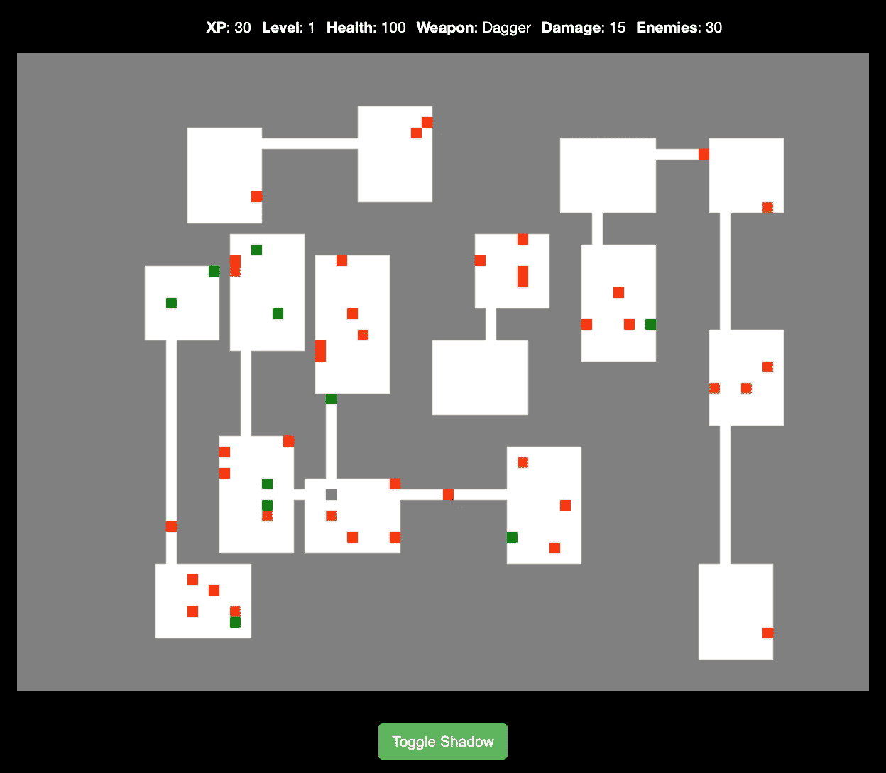

# 用 JavaScript 语言连接房间

> 原文：<https://javascript.plainenglish.io/connecting-rooms-in-a-javascript-roguelike-8e6212c54c9?source=collection_archive---------7----------------------->


Image by [Louisetheanimator](https://www.deviantart.com/louisetheanimator) on [Deviantart](https://www.deviantart.com/louisetheanimator/art/Door-to-the-Dungeon-759562325)

几个星期以来，我一直在使用 JavaScript 构建 Roguelikes，它以程序化生成的地图而闻名。

我之前写的一篇文章分解了用随机漫步算法构建洞穴状地牢爬虫的过程。


A roguelike level was created with a random walk process.

然后，我被为互联房间编写算法的想法迷住了——所以在大量的构建和测试之后，我用它编写了一个完整的游戏，并开始了一个新的系列教程。系列的[第一个教程](/rendering-roguelike-rooms-with-javascript-8a2dc58f3b63)涵盖了程序生成的房间，如下所示。


An algorithm for creating dungeon rooms.

在本教程中，我们将继续这个算法，用一个走廊连接直接面对的房间，并打开其余的游戏逻辑。



正如你在上面的图表中看到的，这通常不会创建一个完整的网络，但这是创建完整游戏的重要一步。


可以在这个[演示页面](https://stellular-biscuit-6757a3.netlify.app/solution/index.html)上玩的完整游戏，有着和随机漫步版本一样的机制，但是有一个由房间和走廊组成的关卡，而不是一个洞穴。

# 整体流程

整个教程系列包括编写一个算法，该算法执行以下操作，我们正在处理的步骤以粗体显示。

*   生成房间。
*   **尝试将每个房间与直接面对它的一个或多个房间连接起来。**
*   尝试将每个房间与附近的另一个房间连接起来，该房间可以面向它，也可以与它成对角线。
*   连接其他房间无法到达的剩余房间。

让我们开始吧。

# 教程资源

在本文中，我将带您了解如何将房间连接逻辑添加到可以从 Github 克隆的[代码库中。下面是我们将涵盖的内容的简要概述。](https://github.com/nevkatz/js-roguelike-rooms)

1.  [文件结构](#bacf)
2.  [整体流程](#5856)
3.  [班级](#262d)
4.  [游戏方法](#e236)
5.  [发电机房](#c124)
6.  如何找到面对面的房间
7.  [用线连接房间](#13cd)

# 项目文件

要下载项目目录，可以去这个 [Git repo](https://github.com/nevkatz/js-roguelike-rooms) ，点击*代码*，点击*下载 ZIP。*或者，您可以从命令行克隆它:

```
git clone [https://github.com/nevkatz/js-roguelike-rooms.git](https://github.com/nevkatz/js-roguelike-rooms.git)
```

在下载的 repo 中，有一个`phase-2-paths`目录，您可以使用下面的结构在其中工作。

```
phase-2-paths
  |
  *--index.html
  |
  *--css 
  |   |
  |   *--style.css
  |
  |
  *--js 
      |
      *--room.js
      |
      *--path.js
      |
      *--game.js
      |
      *--script.js
```

下一个教程的目录`phase-3-corners`，从我们将在这里完成的所有代码开始。还有一个`solution`目录，里面有完整的游戏，你可以参考比较。

在`phase-2-paths`目录中有一些你不必接触的文件，比如`index.html`和`style.css`。主要工作将发生在四个 JavaScript 文件中:

*   `script.js`，运行游戏
*   `room.js`，其中包含了`Room`类
*   `game.js`，它包含了`Game`类
*   `path.js`，包含`Path`类

在每个 JavaScript 文件中，您会看到如下所示的方法。


如果你克隆了回购协议，转到`phase-2-paths`并在浏览器中打开`index.html`文件，你会看到一个相当荒谬的场景，穿蓝色衣服的玩家被困在一个房间里，可能还有一个敌人。


Not a good situation.

所以，是的，我们真的需要增加那些走廊。

到本教程结束时，你的算法应该能够用一条直线连接彼此面对的房间，如下所示。


Each of these rooms faces at least one other room.

# 上层社会

在编写更多代码之前，让我们先来看看我们将为其构建方法的三个类:`Game`、`Room`和`Path`。

## 游戏课

存储游戏属性的 game 类有一个房间对象数组。当它创建一个新房间时，它给它分配`curRoomId`然后递增。

The game class

它也有一个`map` 2D 阵。为了让游戏地图可见，它使用它的`context`绘制它的`<canvas>`元素。

## 房间类

下面是我们的`room`班。

每个房间都有一个`id`和三组坐标:

*   `start`，代表左上角
*   `end`，代表右下角
*   `center`，代表房间的中心。

每个房间都有一个和`id`以及一个`neighbors`的数组，这是游戏地图上它连接到的房间。

## 路径类

该课程有助于创建房间之间的线条。

你可以看到`start`和`end`坐标被定义并有默认值。

```
this.start = points.start || {x:0,y:0};this.end = points.end || {x:0,y:0};
```

这样，我可以很容易地声明一个新路径，而不必马上设置具体的坐标。

```
let path = new Path();
```

还有一个以`false`开始的`allowed`属性，但是只要该路径不与其他路径长时间相邻，它就会变为`TRUE`。

# 游戏方法

先从`game.js`开始，写三个方法:`resetMap`、`carveRoom`、`addPath`。所有这些函数改变了`game`对象的`map` 2D 数组。

## 重置地图

第一种方法，`resetMap()`，通过在 2D 阵列中的每个空间添加一个`WALL_CODE`或`0`，使房间成为一个实体墙。

当我们添加房间和路径时，我们将凿穿这堵墙，并向代表地砖的数组的每个部分添加一个`FLOOR_CODE` of `1`。

## 添加房间

第二种方法，`carveRoom`，基于传入的`room`对象在地图中挖空一个矩形的`FLOOR_CODE`图块。

*   房间的`start`是它的左上角。
*   房间的`end`是它的右下角。

## 添加路径

第三种方法是`addPath`，在游戏中创建一条直线路径，宽度为一个方块。

当你在`game.js`中完成这些方法后，让我们转到`script.js`并展开`generateMapRooms`，创建房间并连接它们的“大图”功能。

# 发电机房

当游戏第一次加载时，`generateMapRooms`的初始版本只是创建房间。

The initial function you will see in script.js.

房间的添加将在本教程的[中介绍。它是这样工作的:](/rendering-roguelike-rooms-with-javascript-8a2dc58f3b63)

*   生成房间尺寸和中心坐标。
*   创建一个房间对象，并测试它是否与其他房间重叠。
*   如果它不与其他房间重叠，请添加该房间。

## 建立联系

我们的目标是通过让每个房间尝试连接到另外两个房间来建立一个房间网络:一个房间直接面对它，另一个房间在它附近。然后，我们将尝试连接网络之外的任何房间。

让我们从第一步开始:遍历每个房间，并尝试将其连接到另一个面对的房间。在`generateMapRooms`中，让我们创建一个`success`变量、一个`min`常量和一个`for...of`循环，如下所示。

```
let success = false;const min = 3;for (var room of game.rooms) { success = room.findFacingRooms(min);

     console.log(`Room${room.id} findFacing: ${success}`);
}
```

`min`常数是一个房间应该与面对它的另一个房间共享的`x`或`y`坐标的最小数量。

下面是迄今为止完整的`generateMapRooms`函数。

我们最终会添加其他方法来连接房间，但现在，让我们编写`findFacingRooms`及其助手方法。

# 如何找到面对面的房间

每个`Room`对象都可以调用`findFacingRooms`方法来找到一个正对着它的房间。下面是我们如何开始这个方法。

The start to the findFacingRooms function.

在我们尝试连接之前，我们必须找到可供连接的潜在房间。

```
let rooms = this.findPotentialRooms();
```

让我们也在`room.js`中为此编写方法。

## 寻找潜在的房间

每个`room`对象都有一个`neighbors`数组，或者说它已经连接的房间。每当我们搜索新的连接时，我们都不想包含现有的邻居。

我们可以像这样过滤掉调用该方法的房间:

```
Room.prototype.findPotentialRooms = function() { let rooms = game.rooms.filter(x => x.id != this.id);
}
```

我们可以用类似的方式填写邻居:

```
if (this.neighbors.length > 0) {

     rooms = rooms.filter(x => !this.neighbors.includes(x));
}
```

下面是完整的`findPotentialRooms`方法。

## 开始循环

好吧，回到`findFacingRooms`。找到潜在的房间后，我们开始遍历它们以找到一个要连接的房间。

```
let rooms = this.findPotentialRooms();for (var room of rooms) {}
```

## 如何定义“面子”

为了让一个房间面对另一个房间，这两个房间必须共享足够的 x 或 y 坐标，并且它们之间不能有另一个房间。

例如，下面的房间共享共同的`x`值，并且几乎对齐。


Two rooms sharing x coordinates

因为这两个房间有共同的价值观，它们可以很容易地形成一条直线。


Two rooms sharing y coordinates

让我们看一下“中间没有房间”的情况。在下图中，房间 1 和房间 2 不会面对，因为中间有一个房间。


为了检查这些条件，让我们在我们的循环中添加两个新方法— `roomBetween`，它检查两个房间之间没有其他房间，和`sharesCoordsWith`，它检查房间是否共享足够的`x`或`y`坐标。

如果潜在的房间通过了这些测试，方法调用房间就试图与它连接。

```
success = this.connectRoom(room, min);
```

如果它连接的房间数量超过最大值，请添加下面的逻辑来打破循环。

```
 success = this.connectRoom(room, min);
}  
**if (this.neighbors.length >= maxRooms) {** **break;
}**
```

在方法参数中，我通常将`maxRooms`设置为`1`作为默认值。

```
Room.prototype.findFacingRooms = function(min=1, **maxRooms=1)** {
```

现在我们已经接触了`connectRoom`函数和`maxRooms`，我们现在有两个方法可以写:`sharesCoordsWith`和`roomBetween`，都在`room.js`中。

## 测试共享坐标

出于美观的原因，我不喜欢让小路碰到房间的角落。


This is not desired.

相反，我只希望房间能够直接连接，如果它们至少有三个共同的坐标，那么它们应该有以下之一:

*   如果一个在另一个之上，至少三个`x`坐标相同，
*   或者如果并排，至少有三个`y`坐标相同。

鉴于上述限制，下面的房间没有共享足够的`x`坐标来直接连接。


These two rooms only share one x coordinate.

相比之下，下面的房间共享三个瓷砖的坐标空间，因此它们被认为是相互面对的。


These rooms share three x coordinates.

因此，我们可以用一条直线将它们连接起来。


Now we can connect them.

让我们编写`sharesCoordsWith`方法，帮助我们确定两个房间是否共享足够的`x`或`y`坐标。

方法开始如下。

```
Room.prototype.sharesCoordsWith = function(room, coord, min=1) {}
```

关于参数:

*   `room`是我们正在测试的相邻房间。
*   `coord`变量可以是`x`或`y`。
*   `min`参数，我经常以`3`的形式传入，表示房间应该共享的最小坐标数。它有一个默认的`1`，如果你不介意走廊接触房间角落，你可以使用它。

下面是我们在函数中添加的内容。注意，我们在`end`和`start`坐标之间的差值上加上了`1`。

```
return room.end[coord] - this.start[coord] + 1 >= min &&
       this.end[coord] - room.start[coord] + 1 >= min;
```

这是因为找到最接近的`start`和`end`坐标值之间的差值——在本例中为`11 — 9`——总是比共享的图块数少 1。


Three tiles shared with a start/end difference of 2.

下面的完整方法很短，但从概念上讲，它有很多内容。

The full sharesCoordsWith method.

现在，坐标共享条件已涵盖。

## 检查中间的房间

现在让我们从下面的代码开始写一个测试一个房间是否在两个房间之间的方法。

```
Room.prototype.roomBetween = function(room) {}
```

请记住以下几点:

*   `this`是方法调用室在尝试连接。
*   `room`是`this`可能连接也可能不连接的房间。

为了获得一个有效的`testRooms`数组，我们使用`filter`方法移除这些房间。

Filtering out the method caller and the room facing it.

现在我们有了`testRooms`，我们必须测试两种可能性:

`testRoom`水平位于……


Horizontal case

…或者在垂直方向上介于两者之间。


Vertical case

所以当我们迭代`testRooms`时，让我们调用两个新方法:`betweenVert`和`betweenHoriz`。

```
for (var testRoom of testRooms) {if (testRoom.betweenVert(this,room) || 
       testRoom.betweenHoriz(this,room)) {

         return true;
     }
}
return false;
```

下面是测试过滤数组中每个房间的完整的`roomBetween`方法。

The complete roomBetween method.

现在我们来写它的两个 helper 方法。

## 横向检查

下面的部分方法测试每个房间是否在它的两个同伴之间水平。

```
Room.prototype.betweenHoriz = function(room1,room2) { return this.sharesCoordsWith(room1,'y') && 
          this.sharesCoordsWith(room2,'y') &&
         room1.sharesCoordsWith(room2,'y') &&}
```

*   参数`room1`和`room2`是试图连接的两个房间。
*   因为被测房间在调用方法，所以引用为`this`。

这三个房间共用一个坐标并不意味着测试室就在另外两个房间之间，所以现在我们必须检查房间的顺序。

## 检查序列

如果这些房间共享`y`坐标，则需要关注的场景是测试房间是否在一个房间之后和另一个房间之前。


Scenario 1.

为了确定是否是这种情况，下面的代码测试 `room1`是否在测试室的左边(如`this`所示)以及`room2`是否在右边。

```
**this**.center.x **> room1**.center.x && **this**.center.x **< room2**.center.x
```

然后我们测试相反的:左边的`room2`和右边的`room1`。


Scenario 2.

代码几乎相同，只是交换了`room1`和`room2`。

```
**this**.center.x > **room2**.center.x && **this**.center.x < **room1**.center.x
```

下面是完整的`betweenHoriz`方法，包括坐标共享测试和相对位置测试。

The complete betweenHoriz method.

## 垂直检查

为了测试一个房间是否垂直位于两个可能相连的房间之间，我们使用了一个`betweenVert`方法，它使用了相同的方法。

您可以在下面看到`betweenVert`测试的两个场景。


Is the test room below room1 and above room2?


How about vice-versa?

让我们回顾一下。

*   我们编写了`shareCoordsWith`方法来测试水平或垂直空间的共享。
*   我们创建了`roomBetween`方法来测试一个房间是否在中间。
*   然后我们精心制作了它的两个助手:`betweenHoriz`和`betweenVert`。

下面是现在使用`sharesCoordsWith`和`roomBetween`的`findFacingRooms`方法。

The find facing rooms method

下面是`findFacingRooms`中的大致流程。

*   遍历潜在的房间。
*   找一个有足够垂直或水平坐标的房间。
*   验证在方法调用房间和潜在房间之间没有其他房间。
*   如果通过验证，呼叫室会立即尝试连接。
*   一旦呼叫房间有足够多的邻居，它就跳出循环并返回。

## 快速测试

如果您想测试您的逻辑，请转到`findFacingRooms`并注释掉下面的行。

```
// success = this.connectRoom(room, min);
```

然后，加上这一行。

```
console.log(`${this.id} is connected to ${room.id}!`);
```

然后，在继续下一步之前，您可以测试您寻找面对面房间的逻辑是否可行。

# 用线连接房间

现在两个面对的房间可以找到对方，让我们从下面的`connectRoom`方法开始连接它们。

```
Room.prototype.connectRoom = function(room, min=3) { 
   let success = false; return success;
}
```

因为这种方法也将连接对角非面对的房间，我们将最终尝试以两种方式连接房间:

*   用一条直线，
*   或者两条线在一个角上相交。

## 单线连接

如果房间共享足够的水平或垂直空间，我们尝试使用一种新的`directConnect`方法将它们直接连接起来，这将产生一条如下所示的路径:


Two rooms connecting directly with a straight-line path.

为了查看直接连接是否可行，我们通过对`sharesCoordsWith`方法的两次调用来检查`x`或`y`坐标的共享。如果两个房间在`x`或`y`轴上有三个或更多的共同坐标，我们尝试`directConnect`并返回努力的`success`。

This implementation only connects rooms directly.

## 编写直接连接方法

下面是`directConnect`法，专门连接对向房间。我们很快就会写出它的助手:`addVertPath`和`addHorizPath`。

在方法的开始，我们首先声明一个新的 path 对象。

```
let path = new Path();
```

为了避免在房间角落创建房间出口，我们基于`min`初始化一个`wall`常数，这是房间应该共享的最小数量的`x`或`y`坐标。

```
const wall = parseInt((min-1)/2);
```

如果`x`坐标共享，我们创建一个垂直路径；如果`y`坐标共享，我们创建一个水平路径。

```
if (this.sharesCoordsWith(room, 'x', min)) { path = this.addVertPath(room,path,wall);  
}
else {
      path = this.addHorizPath(room,path,wall);
}
```

最后，我们返回`path.allowed`，这是一个布尔值，表明路径是否被允许放置。这成为`connectRoom`将看到的`success`标志。

```
return path.allowed;
```

## 添加垂直路径的起点

让我们启动`directConnect`使用的`addVertPath` helper 方法。

```
Room.prototype.addVertPath = function(room, path, wall) {}
```

我们的`game`对象的`drawPath`方法总是向下绘制垂直路径，并且`y`值随着它的下降而增加。鉴于此，基于较小的`end.y`坐标开始路径是可行的方法。


The bottom edge of the top room is the place to start.

下面我们使用`Math.min`根据哪个房间的`end.y`坐标较少来确定路径的起始图块。

```
Room.prototype.addVertPath = function(room, path, wall) { path.start.y = **Math.min**(this.end.y,room.end.y) + 1;
}
```

我们添加了`1`,所以路径从房间下面的一个瓷砖开始。

## 添加垂直路径的终点

该路径应该正好在较低房间的顶部边缘结束，因此底部房间的`start.y`坐标是要抓取的坐标。


因此，为了找到路径的终点，我们使用`Math.max`来找到两个`start.y`坐标中较大的一个。

```
path.end.y = Math.max(this.start.y,room.start.y) - 1;
```

我们减去一块瓷砖，所以路径在进入房间之前停止。

## 水平定位垂直路径

现在我们有了垂直路径的起点和终点，我们必须水平放置它。为此，有一个名为`possibleExits`的函数会有所帮助，它可以找到最右边和最左边可能的`x`值。让我们先看看这个方法，稍后我会告诉你在哪里调用它。

## 寻找可能的路径

`possibleExits`方法可用于垂直和水平路径。它的第二个参数`axis`，可以是`x`也可以是`y`。

The code for finding possible paths that exit out of the room.

在垂直路径的情况下，`possibleExits`找到代表垂直路径可能放置的可能的`x`坐标范围的`start`和`end`值。

为了找到这个，它使用房间之间共享的`x`坐标范围，以及`wall`值。

在下图中，三个允许的路径位置是蓝色的。红色的位置是不允许的，因为它们离边缘太近了。


The X positions that are allowed are in blue; those that are not are in red.

请看下面的片段，其中`axis`代表`x`。


How Math.max() and Math.min() are used to find the possible range of coordinates.

*   `Math.max()`用于查找最右边房间的左边缘，或`start.x`。
*   `Math.min()`用于查找最左边房间的右边缘，或`end.x`。


Here is how Math.max() and Math.min() look in the diagram.

`start`和`end`值然后在一个对象中返回到`placePath`。

```
return {start, end};
```

现在让我们编写一个名为`placePath`的助手，它调用`possibleExits`来查找最左边和最右边的`x`值。

我们首先调用`possibleExits`得到两个房间共享的最左边和最右边允许的`x`值。

```
let {start, end} = this.possibleExits(room, axis, wall);
```

然后，我们找到最左边和最右边值的平均值，并得出路径的开始和结束`x`值。

```
`path.start[axis] = path.end[axis] = Math.round((start+end)/2);
```

我们最终批准了这条路，并返回。

```
path.allowed = true; return path;
```

`possibleExits`和`placePath`都完成后，我们现在可以在`addVertPath`里面调用`placePath`来得到垂直线的`x`坐标。

```
Room.prototype.addVertPath = function(room, path, wall) {       path.start.y = Math.min(this.end.y,room.end.y) + 1;   

     path.end.y = Math.max(this.start.y,room.start.y) - 1;     ** path = this.placePath(room,path,wall,'x')**
}
```

然后，我们检查路径是否被允许。如果是这样，我们将其添加到游戏地图中，并使房间成为邻居。

```
 path = this.placePathX(room,path,wall);

 **if (path.allowed) {** **game.addPath(path);** **this.addNeighbor(room);
   }
   return path;**}
```

`addPath`法较早被覆盖，以下为`addNeighbor`法。

```
Room.prototype.addNeighbor = function(room) {
   this.neighbors.push(room);
   room.neighbors.push(this);
}
```

下面是完整的`addVertPath`一体法。

The complete addVertPath method.

干得好。我们现在有了在两个相对的房间之间添加垂直路径所需的所有逻辑。

## 添加水平路径

让我们以类似的方式开始`addHorizPath`方法。

```
Room.prototype.addHorizPath = function(room, path, wall) {}
```

我们根据左边的房间来确定路径的起始瓦片。我们找到两个`end.x`坐标中较小的一个，并添加一个图块。

```
path.start.y = Math.min(this.end.y,room.end.y) + 1;
```

为了计算路径的终点，我们找到两个`start.x`坐标中较大的一个并减去一个图块。

```
path.end.x = Math.max(this.start.x,room.start.x) - 1;
```

然后我们称`placePath`为`y`坐标。

```
path = this.placePath(room,path,wall,'y');
```

其余与`addVertPath`相同。

```
if (path.allowed) { game.addPath(path); this.addNeighbor(room);
}
return path;
```

这些都是用一条线连接路径所需的方法。

## 测试你的游戏

在这一点上，你的游戏应该是功能性的，所以这是一个测试的好时机。下面是一个代码笔，供你比较你的工作。

The completed phase 2 where rooms can connect with straight lines.

# 建议的后续步骤

要微调您的路径，使它们不能彼此相邻，请尝试下面的教程。

[](https://nevkatz.medium.com/tuning-passage-placement-algorithm-in-a-javascript-roguelike-ae6273d9366f) [## 调整 JavaScript 脚本中的段落位置

### 让我们用更好的算法来减少混乱。

nevkatz.medium.com](https://nevkatz.medium.com/tuning-passage-placement-algorithm-in-a-javascript-roguelike-ae6273d9366f) 

你的玩家可能无法到达每个房间，但不要担心——在下面的文章中，我们将通过连接彼此对角的房间来创建一个更加统一的地牢。

[](/javascript-roguelikes-connecting-diagonal-dungeon-rooms-using-corners-79f460f96615) [## 用 JavaScript 的 Roguelike 构建带角的段落

### 让我们用两条在拐角处相交的小路把对角交叉的房间连接起来。

javascript.plainenglish.io](/javascript-roguelikes-connecting-diagonal-dungeon-rooms-using-corners-79f460f96615) 

无论你是通读了这篇文章，还是正在构建游戏，我希望这篇文章能增强你对 JavaScript、算法以及 roguelike 游戏如何工作的理解。日安！

*更多内容看* [***说白了就是***](https://plainenglish.io/) *。报名参加我们的* [***免费周报***](http://newsletter.plainenglish.io/) *。关注我们关于*[***Twitter***](https://twitter.com/inPlainEngHQ)*和*[***LinkedIn***](https://www.linkedin.com/company/inplainenglish/)*。加入我们的* [***社区***](https://discord.gg/GtDtUAvyhW) *。*

*并考虑注册*[***Medium***](https://medium.com/@nevkatz/membership)*无限制访问我以及其他作家的文章。*