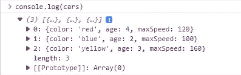

# 10 多种很少使用的 JavaScript 控制台方法

> 原文：<https://javascript.plainenglish.io/console-methods-c49bb9ff2ae8?source=collection_archive---------2----------------------->


你听说过`console.log()`并且可能一直在使用它。它非常受欢迎，在 IDE 中键入时，像 Visual Studio Intellicode 这样的工具通常会在任何其他控制台方法之前推荐它:


但是你知道还有多少人？你知道他们已经 20 岁了吗？在本文中，我们将探索一些最有用的控制台方法，以及它们在数据可视化、调试等方面的用途。

# 1.表格()

当您需要获得代码中一组可以用表格形式表示的对象(比如一个对象数组)的视觉效果时，`console.table()`方法就派上了用场。以这份汽车清单为例:

```
const cars = [
  {
    color: 'red',
    age: 4,
    maxSpeed: 120,
  },
  {
    color: 'blue',
    age: 2,
    maxSpeed: 100,
  },
  {
    color: 'yellow',
    age: 3,
    maxSpeed: 160,
  },
];
```

你如何在控制台中检查它们？`console.log()`是一种典型的做法:

```
console.log(cars);
```

在 Chrome 开发人员控制台中，我们可以检查我们记录的对象的各种属性，达到我们想要的层次。



我们可以在 Node.js 终端中查看属性，并获得颜色:


这是一个可以接受的方法，但是`console.table()`方法提供了一个更好的替代方法:

```
console.table(cars);
```


console.table() in the Chrome developer console


console.table() in Node.js

顾名思义，它以易于理解的表格格式显示数据，就像电子表格一样。

`table()`也适用于数组的数组:

```
const arr = [
  [1, 3, 5],
  [2, 4, 6],
  [10, 20, 30],
];
console.table(arr);
```


# 2.断言()

对于调试目的来说，`console.assert()`接受一个断言，如果断言是`false`，就向控制台写入一条错误消息。但如果是`true`，什么都不会发生。

```
const num = 13;
console.assert(num > 10, 'Number must be greater than 10');
console.assert(num > 20, 'Number must be greater than 20');
```

第一个断言通过，因为`num`大于`10`，所以控制台中只显示第二个:


# 3.跟踪()

`console.trace()`帮助您在调用堆栈跟踪的位置输出当前堆栈跟踪。例如:

```
function a() {
  b();
}function b() {
  c();
}function c() {
  console.trace();
}a();
```


# 4.错误()

`error()`可能是第二流行的`Console`方法。在 Chrome 控制台中，它以独特的红色显示错误信息。

```
console.error('This is an error message.');
console.log('This is a log message.');
```


不过在 Node.js 中你不会得到这种颜色分离:


但是，消息被写入内部的不同位置。`console.error()`写入`stderr`流，而`console.log()`写入 stdout 流。您可以使用`process.stderr`和`process.stdout`访问这些流。这对于将错误消息和信息性消息重定向到不同的文件非常有用，就像我们在下面的代码示例中所做的那样。

```
const fs = require('fs');const errorFs = fs.createWriteStream('./error-log.txt');
process.stderr.write = errorFs.write.bind(errorFs);const infoFs = fs.createWriteStream('./info-log.txt');
process.stdout.write = infoFs.write.bind(infoFs);console.error('This is an error message.');
console.log('This is a log message.');
```

当您运行这段代码时，传递给`error()`和`log()`的消息将被输出到各自的文件，而不是控制台。

# 5.警告()

`console.warn()`在 Chrome 控制台输出黄色信息，表示警告。

```
console.warn('This is a warning message');
```


在 Node.js 中，消息像`console.error()`一样被写入`stderr`流。

# 6.count()和 countReset()

`console.count()`记录当前对`count()`的调用被执行的次数。另一个有用的调试工具。

```
function shout(message) {
  console.count();
  return message.toUpperCase() + '!!!';
}shout('hey');
shout('hi');
shout('hello');
```


显示的标签是`default`，因为我们没有为指定标签。我们可以通过向`count()`传递一个字符串参数来做到这一点。

```
function shout(message) {
  console.count(message);
  return message.toUpperCase() + '!!!';
}shout('hey');
shout('hi');
shout('hello');
shout('hi');
shout('hi');
shout('hello');
```


现在我们对每条消息都有不同的计数。

`countReset()`方法将标签的计数设回零。

```
function shout(message) {
  console.count(message);
  return message.toUpperCase() + '!!!';
}shout('hi');
shout('hello');
shout('hi');
shout('hi');
shout('hello');
console.countReset('hi');
shout('hi');
```


# 7.time()、timeEnd()和 timeLog()

我们可以一起使用这些方法来测量程序中一个特定的操作需要多长时间。

```
const arr = [...Array(10)];const doubles1 = [];
console.time('for of');
let i = 0;
for (; i < 1000; i++) {
  for (const item of arr);
}
console.timeLog('for of');
for (; i < 1000000; i++) {
  for (const item of arr);
}
console.timeEnd('for of');console.time('forEach');
i = 0;
for (; i < 1000; i++) {
  arr.forEach(() => {});
}
console.timeLog('forEach');
for (; i < 1000000; i++) {
  arr.forEach(() => {});
}
console.timeEnd('forEach');
```


在这里，我们正在对`for of`和`forEach`循环进行性能比较。`time()`为传递给它的标签所指定的操作启动定时器。`timeLog()`在不停止定时器的情况下记录当前持续时间，我们用它来显示一千次迭代后经过的时间。`timeEnd()`记录当前持续时间并停止定时器。我们称之为一百万次迭代之后。

貌似`forEach()`比`for of`快。

# 8.清除()

`console.clear()`通过清除日志来清除控制台中的杂物。

```
console.log('A log message.');
console.clear();
```


# 9.group()、groupCollapsed()和 groupEnd()

`console.group()`向其后的任何控制台消息添加缩进级别。`console.groupEnd()`将缩进复位到调用前一个`console.group()`之前的水平。

```
console.log('This is the outer level');
console.group();
console.log('Level 2');
console.group();
console.log('Level 3');
console.warn('More of level 3');
console.groupEnd();
console.log('Back to level 2');
console.groupEnd();
console.log('Back to the outer level');
```


`console.groupCollapsed()`创建了一个类似于`console.group()`的组，但是该组是折叠的，直到用户用旁边的显示按钮将其展开。

```
console.log('This is the outer level');
console.group();
console.log('Level 2');
console.groupCollapsed();
console.log('Level 3 ');
console.warn('More of level 3');
console.groupEnd();
console.log('Back to level 2');
console.groupEnd();
console.log('Back to the outer level');
```


# 10.目录()

`console.dir()`的工作方式与`console.log()`类似，除了将`HTMLElement`s .`console.log()`logs a`HTMLElement`作为 HTML，我们可以在控制台中遍历:


但是`console.dir()`会把它作为一个对象记录下来，显示一个交互式的属性列表:


# 结论

正如您在本文中看到的，除了`console.log()`，还有很多控制台方法。其中一些只是用颜色和更好的可视化来增加控制台 UI 的趣味性，其他的可以作为调试和性能测试的强大工具。

【更新于:【codingbeautydev.com】

# **JavaScript 做的每一件疯狂的事情**

**一本关于 JavaScript 微妙的警告和鲜为人知的部分的迷人指南。**

****

**[**报名**](https://cbdev.link/d3c4eb) 立即免费领取一份。**