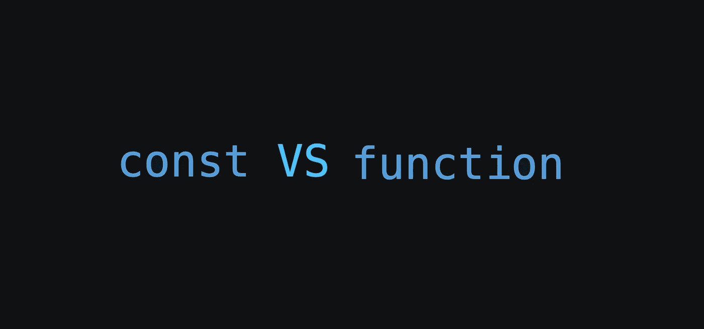
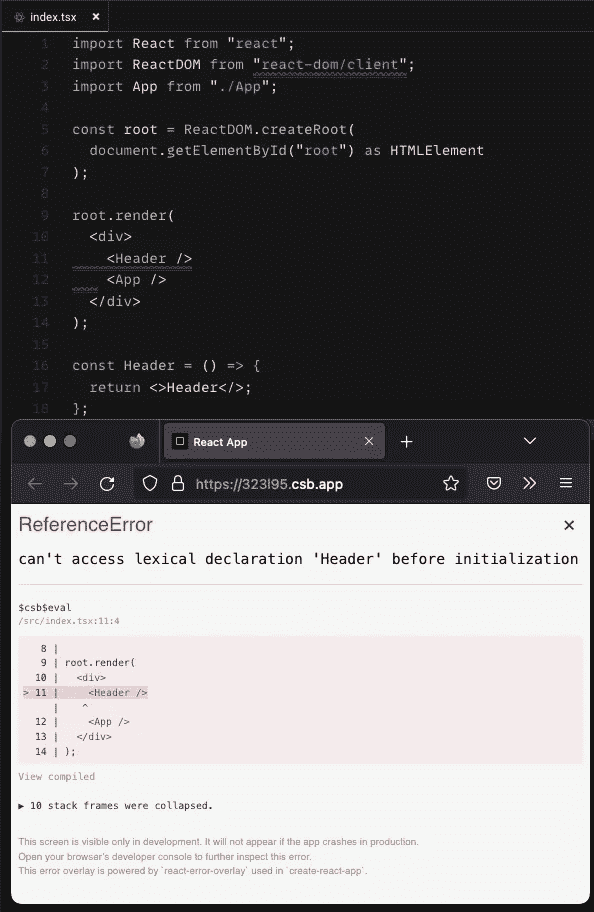
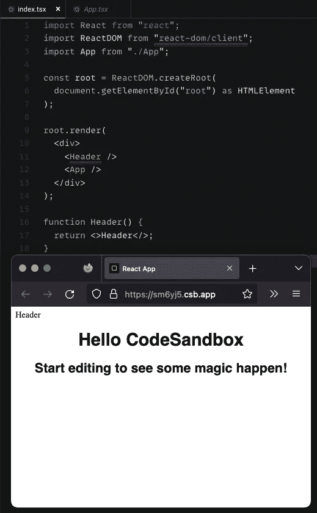
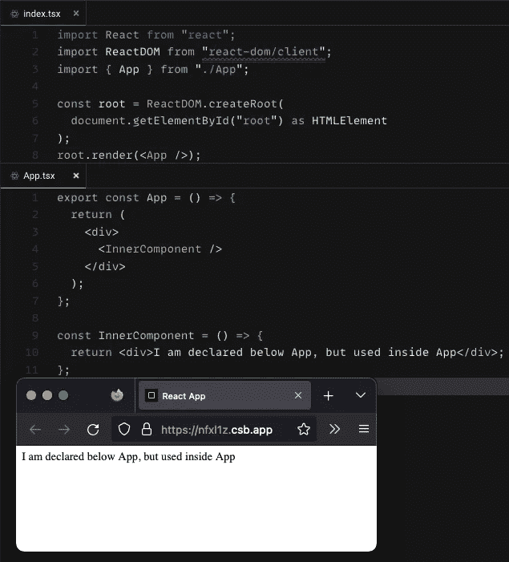
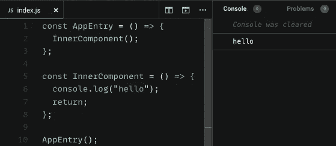
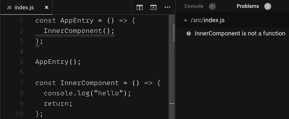
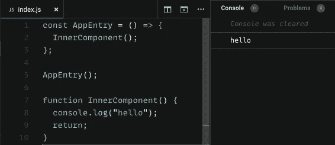
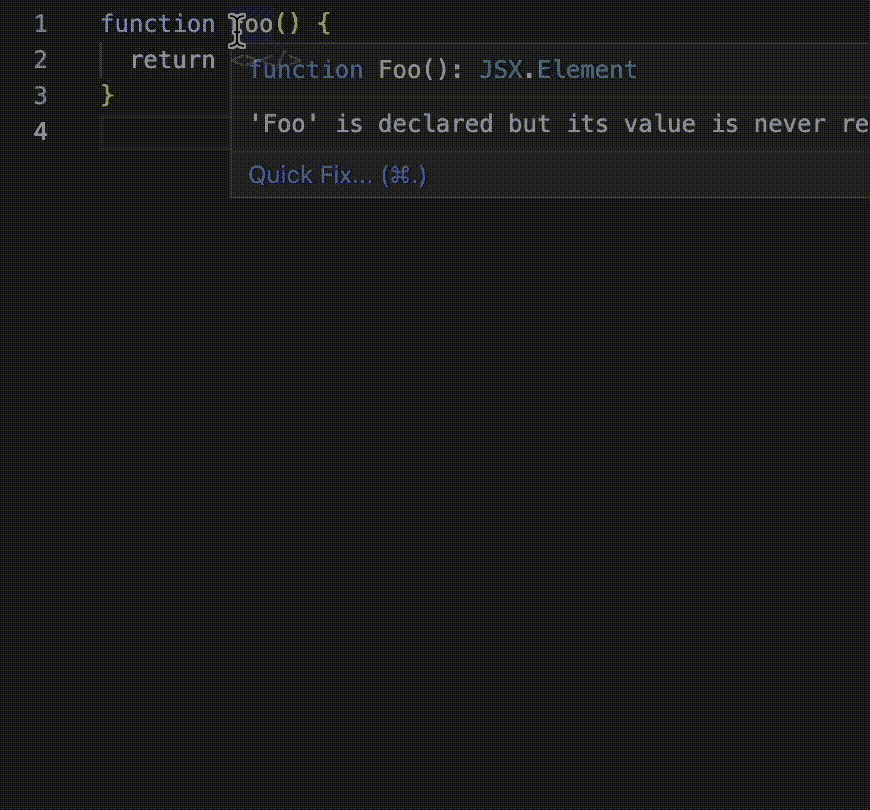
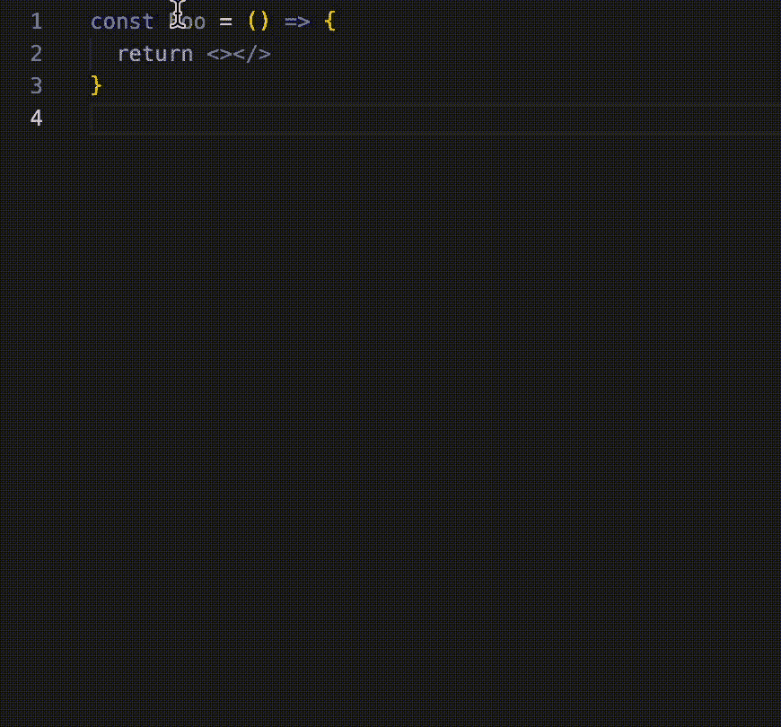

# 反应功能组分的常数与函数

> 原文：<https://javascript.plainenglish.io/const-vs-function-for-react-functional-components-23e70fd0d4e0?source=collection_archive---------2----------------------->

## 好奇的 React 开发者的一点研究

一段时间以来，我一直想知道在声明功能组件时使用`function`而不是`const`是否有好处，反之亦然。所以，我决定做一点研究，我会在这篇文章中为你总结。

## TLDR

无论你使用哪一个都没有关系。最重要的*技术*区别在于使用`function`定义的功能部件被**提升**而使用`const`的功能部件则没有。然而，只要您在单独的文件中定义组件，并在需要它们的地方将它们导入到文件的顶部，这并没有什么实际的后果。这很可能是你组织文件的方式，这也是为什么它没有真正的区别

**我发现使用`function`语法的最大好处是当使用 Visual Studio 代码作为编辑器时。这是因为 VSC 让您可以选择将`function`重构为一个新文件，但是如果您使用了`const`语法，则该选项不可用。**

此外，有些人因为可读性而偏爱其中之一。然而，这是主观的，你可以自己决定你喜欢什么。

最后，在 React 中声明功能组件时，正是由于与 VSC 在实用性上的不同，我更喜欢使用`function`而不是`const`。除此之外，我没有发现两者之间有任何实际的区别。

出于好奇，你可以在下面找到更多的细节。

## 技术差异——吊装

JavaScript 有一个叫做提升的概念，它允许在使用变量和函数的行下面的行上声明变量和函数。这有点复杂，需要更多的解释才能完全理解，我不想在这里介绍。因此，我将向您展示它对我们的组件意味着什么。

下面的代码要点包含两个修改过的`index.tsx`文件，它们通常是 React 应用程序的入口点。**第一个是** **无效**会出错，而**第二个是** **有效**。它们之间唯一的区别是`Header`组件在哪里初始化。在第一个文件中，它在第 9 行下面的第 14 行被初始化。在第二个文件中，它在第 7 行被初始化，在第 13 行被使用之前。

Gist with example files of an invalid const usage and a valid const usage

这个[代码沙箱](https://codesandbox.io/s/constvsfunction-323l95?file=/src/index.tsx)的截图显示了当`const`函数在初始化之前被使用时将会发生的错误。*(不要介意第二行的红色曲线)*

Code sandbox showing an invalid use of the const keyword

现在让我们看一下相同的代码，只是使用了`Header`组件的`function`关键字。

Code sandbox showing a valid use of the keyword function

上面的[代码沙箱](https://codesandbox.io/s/constvsfunctionworking-sm6yj5?file=/src/index.tsx)显示了使用`function`语法时代码运行正确。*(第 11 行出现弯弯曲曲的红线是因为当前的林挺规则不允许在定义函数之前使用它，然而这只是林挺的情况。)*

这表明使用`function`代替`const`可能有潜在的技术优势。

***但是这在现实世界的项目中真的重要吗……***

Photo by [Juan Rumimpunu](https://unsplash.com/@earbiscuits?utm_source=medium&utm_medium=referral) on [Unsplash](https://unsplash.com?utm_source=medium&utm_medium=referral)

我认为没有。

这是因为我几乎总是在单独的文件中定义我的组件，然后将它们导入到我想要呈现它们的文件中。我的导入语句总是在文件的顶部。正因为如此，我的`const`组件总是被定义在实际运行它们的代码行之上。

这意味着即使在以下情况下，它也不会成为问题。

Code sandbox showing that defining components with const, is not really a problem even though they are not hoisted

但是等一下，上面的例子是如何工作的？为什么在`App`内部使用`InnerComponent`没有问题？即使在`App`下面定义。

我的理论是，决定因素是运行时代码的顺序，而不是编译/解释时的顺序。运行时呈现应用程序的入口点是对第 8 行的`root.render(<App />);`的调用，这发生在`index.tsx`中第 3 行的 import 语句之后。同样地，`InnerComponent`的初始化在`root.render(<App />);`之上，因此一旦`App`组件需要它，它就已经被初始化。

让我们来看一个纯 JavaScript 的小玩具示例，以便更容易理解。

Working example with call to later defined function after its definition

在[代码沙箱](https://codesandbox.io/s/constvsfunctionworking-sm6yj5?file=/src/index.tsx)的截图中，上面的`InnerComponent`定义在函数表达式`AppEntry`的定义下面。然而，对`AppEntry`的调用发生在`InnerComponent`被初始化之后，因此在运行时没有问题，尽管它是使用`const`创建的函数。(这类似于 React 中的大多数用例)

Example showing how InnerComponent cannot be used before its initialization at runtime

相反，如果我们将`AppEntry`调用移到`InnerComponent`之前，那么我们会看到问题的发生，因为`const`函数表达式没有被提升。(但我认为这永远不会发生在你身上，因为你的应用程序的入口点最有可能在`index.tsx`中，所有其他组件将在初始渲染函数之上导入)

最后，如果我们使用`function`关键字来声明`InnerComponent`，那么提升就开始了，它的工作如下面的截图所示。

Example showing that the function keyword causes the function to be hoisted

## Visual Studio 代码差异

现在我们已经解决了技术上的差异，我认为这几乎是不存在的，让我们来看看我在使用 VSC 时注意到的效用差异。

如果你已经使用`function`声明了功能组件，VSC 允许你将它们重构到新的单独的文件中，但是如果你已经使用`const`则不允许。

gif showing refactoring options of function in VSC

刚刚使用`const`声明的相同功能。

gif showing refactoring options of const in VSC

对我来说，这其实是用`function`代替`const`最重要的好处。因为它消除了创建新文件和编写样板代码的繁琐步骤。

尽管如此，重构选项(如第二个 gif 所示)允许您将`const`函数表达式转换为命名函数，因此您可以快速进行切换，尤其是在使用键盘快捷键的情况下。

## 主观利益(可读性)

最后要考虑的是语法的可读性。这当然是一个主观的问题，一些人更喜欢`function`语法，而另一些人更喜欢`const`语法。

我喜欢的一个论点是，函数语法最类似于其他编程语言的函数声明，因此与粗箭头语法相比，非 JavaScript 开发人员更容易理解该语法。

## 最后的话

我对这个问题的结论是，使用哪种语法并不重要。就用你喜欢的那个吧。也许和我一样，VSC 的不同可能是你的决定性因素。也许是可读性帮你做到了？

如果你对此有任何补充或知识(也许我错过了一些重要的东西)，请在评论中分享。

感谢您的阅读，祝您愉快！

*更多内容看* [***说白了。报名参加我们的***](https://plainenglish.io/) **[***免费周报***](http://newsletter.plainenglish.io/) *。关注我们关于* [***推特***](https://twitter.com/inPlainEngHQ)[***LinkedIn***](https://www.linkedin.com/company/inplainenglish/)*[***YouTube***](https://www.youtube.com/channel/UCtipWUghju290NWcn8jhyAw)*[***不和***](https://discord.gg/GtDtUAvyhW) *。对增长黑客感兴趣？检查* [***电路***](https://circuit.ooo/) *。*****