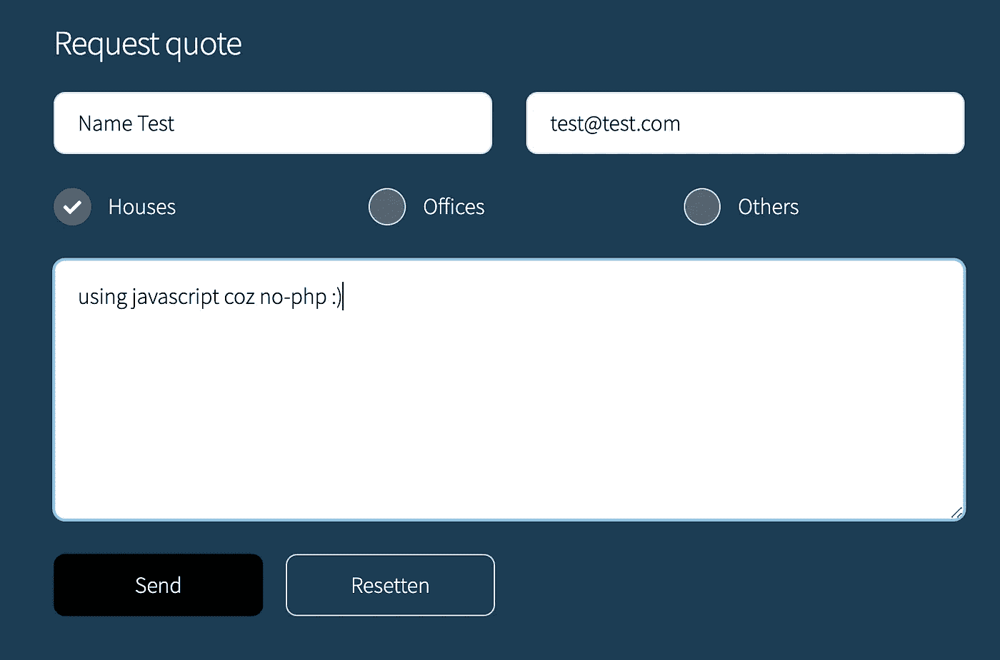
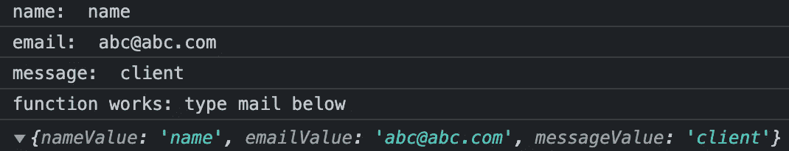

# 如何使用 JavaScript、Node.js、Express 和 Nodemailer 构建一个功能完整的 HTML 表单

> 原文：<https://javascript.plainenglish.io/contact-form-using-javascript-6bfb562d382d?source=collection_archive---------3----------------------->

## 第 1 部分:关于如何使用 JavaScript、Node.js、Express 和 Nodemailer 构建功能完整的 HTML 表单的指南。

**先决条件**:带有所需字段的 HTML 表单，并使用 CSS 或任何选择的样式框架/库对其进行样式化以弹出它。



Form written with html & css

我将跳过 HTML & CSS 部分，直接进入我们需要完成的步骤。我们走吧！

**甲方:客户端**

*   从输入字段和选定字段读取值— JavaScript(客户端)。— *如果未填写必填字段，提示用户填写— HTML 现在通过使用* `*required*` *属性来处理此问题。通过检查输入的格式来验证它，例如电子邮件应该有* `*@*` *— HTML 通过使用* `*type=email*`来处理它
*   检测用户动作，即点击按钮
*   将数据从客户端表单发送到服务器

B 部分:服务器端

*   从客户端接收数据
*   将数据从服务器发送到电子邮件
*   在客户端显示成功消息

*链接代码文件:*

因为我们使用的是 javascript，所以让我们将脚本移动到一个单独的文件夹，并拥有脚本文件，以便分离关注点。`js/script.js`

链接这个脚本文件和它在 body 标签中的完整路径，在`contact.html`文件 body 标签关闭之前的底部。

`<script src="assets/js/script.js"></script>`

**A 部分—客户端:从浏览器读取字段中键入的值**

我们如何使用 JavaScript 与浏览器交互？

浏览器是窗口对象。我们需要从表单对象访问 HTML 输入。

我们还希望在用户提交表单时，在单击发送按钮时获取输入值。

1.*在按钮标签*上创建一个函数 `*sendQuote*` *，在按钮点击时触发。该函数还将使用 Fetch Web API 将邮件发送到表单元素的 action 属性中的 URL `send`。*

2.*为`contact.html`文件中联系表*中的每个值赋予 id，我们需要使用 id 属性访问这些值:

`id="contact-form", id="name", id="email", etc`

示例:

```
<input type="text" name="name" id="name" value="" placeholder="Naam" required/>
```

3.*在输入元素*中添加 `*name*` *属性。这些表现为键，而`value`作为 javascript 要获取的属性将是属性。我们的数据存储在从 DOM 读取的对象中。*

4.*添加表单标签属性* `method='post'`，`action='send'`是我们要发送数据到的 ***URL*** ，`enctype='multipart/form-data'`是要发送数据的格式。

**注意**:这个“发送”将被提供给获取 web API 的基本 URL `https://website.com`。

属性值执行以下操作:

`action`属性将指示向何处(URL/route)发送(张贴)您提交的数据。

`post`是**匿名发送**数据(即数据不会在浏览器 URL 中显示为查询字符串)的默认方法，因为`post`请求要求服务器在提交网站表单时接受请求正文中包含的数据。`get`方法使用查询字符串。`get`在**获取**数据时使用，不发送。

`enctype`是默认的[类型的内容](https://developer.mozilla.org/en-US/docs/Web/API/HTMLFormElement/enctype)向服务器提交表单。

5.*创建一个按钮作为输入*，它位于表单元素内部，带有用于提交表单的`type='submit'`和作为该输入值的`value='Versturen'`。

6.*为提交类型输入/按钮*制作 2 个属性:

I .来自全局 EventHandler 的`onclick`属性，用于处理按钮元素上的`click`事件，在`contact.html`文件中。当用户提交表单时会发生此事件。

```
<li><input type="submit" value="Versturen" class="primary" onclick="sendQuote();" /></li>
```

二。从类型文本输入的名称属性中读取 id 值的`value`属性。这是它在脚本文件中的使用方式:

```
let nameElement = document.getElementById("name");
let nameValue = nameElement.value;
console.log(nameValue);
```

因此，onclick 函数使用`names`属性收集`input`值。

在`contact.html`中，你的表单元素应该是这样的:

```
<form id="contact-form" method="post" action="send" enctype="multipart/form-data"><input type="text" name="name" id="name" value="" placeholder="Naam" required/><input type="email" name="email" id="email" value="" placeholder="E-mail" required/><textarea name="message" id="message" placeholder="Voer uw bericht in" rows="6"></textarea><ul class="actions">
<li><input type="submit" value="Versturen" class="primary" onclick="sendQuote();" /></li>
<li><input type="reset" value="Resetten" /></li>
</ul></form>
```

7.*处理 POST 请求—* 发出一个 HTTP 调用请求，从表单向服务器发送(POST)数据，这样服务器就能够从后端的客户机接收(获取)数据。

*   可以用 JavaScript 做出[不同类型的 HTTP 请求:用 ajax 配合 JavaScript 或 jquery，fetch web API，axios 库，](https://www.freecodecamp.org/news/here-is-the-most-popular-ways-to-make-an-http-request-in-javascript-954ce8c95aaa/)
*   这里，我们将使用 fetch API 向服务器发送数据。所以在`script.js`函数中添加这个，以便将表单值发送到我们的服务器

```
fetch(url, { // returns a promise
method: "post", // specify method as post
body: mail, // specify body as mail to send to request
})
.then(*response* *=>* response.json()) // converting promise to JSON
.then(*res* *=>* console.log(res)) // view the response from server
.catch(*error=>*console.log(error))
```

8.*在脚本文件中创建一个名为* `*mail*`的对象，存储不同的值，这样我们就可以将它们打包发送到服务器。

在`script.js`中，你的函数应该是这样的:

```
# Listen to event on form when user clicks SendQuote*function* sendQuote() {
*let* formElement = document.getElementById("contact-form");# Get values from the form
*let* nameElement = document.getElementById("name");
*let* nameValue = nameElement.value;console.log('name: ', nameValue);*let* emailElement = document.getElementById("email");
*let* emailValue = emailElement.value;console.log('email: ', emailValue);*let* gebouwElement = document.getElementById("gebouw"); // error reading value using value property*let* messageElement = document.getElementById("message");
*let* messageValue = messageElement.value;console.log('message: ', messageValue);# Store input values in an object
*const* mail = { nameValue, emailValue, messageValue };
console.log('function works: type mail below ');console.log(mail);// send data from form to server using base url localhost:3000 
// or https://gloriousclean.be/contact.html// const url = 'https://gloriousclean.be/contact.html/send';
*const* url = 'http://localhost:3000/contact.html/send'// const otherPara = {
//   headers: {
//     "content-type":"application/json"; charset=UTF-8
//   },
//   body: data,
//   method: "POST"
// };fetch(url, { // returns a promise
method: "post", // specify method as post
body: mail, // specify body as mail to send to request
}).then(*response* *=>* response.json()) // converting promise to JSON
.then(*res* *=>* console.log(res)) // view the response from server, later after our express server is set
.catch(*error=>*console.log(error))
}
```

现在，我们将只发送文本类型的`input`元素和`textarea` 元素的值(即姓名、电子邮件和消息)。“类型”复选框的输入元素有不同的读法。我们稍后会看到。

客户端完成了。通过填写表格并点击提交/发送，尝试看看它是如何工作的。

提交表单后，您应该会在控制台上看到以下内容



console.log

***

**你可能还在想我们如何用 JavaScript 来做这件事，因为 JavaScript 既适用于客户端也适用于服务器端。对于服务器端，我们切换到服务器端 JavaScript—node . js。node . js 将处理我们的`post`请求。**

****NB**:node . js 也可以用于客户端，它不仅是服务器端语言，也可以用于客户端。**

****注意**:你可能想用其他服务器语言代替`nodejs`的有:PHP、Python、Perl 等。**

****B 部分—服务器端:在服务器中接收来自客户端的表单数据****

**现在让我们设置 node-express 服务器来接收表单，并使用 Nodemailer 发送电子邮件。**

****先决条件**:您的机器上已经安装了`npm`和`[node](https://nodejs.org/en/)`。**

**对于 npm，您需要在您的终端中运行`npm install`。您可能希望通过在终端中键入`npm -v`或`npm -version`或`npm --version`来确认安装。**

**对于 node，请在链接中查看他们的[官方文档](https://nodejs.org/en/)，并安装最新的 LTS 版本。在终端中输入`node -v`或`node --version`进行确认。**

1.  ***初始化项目根目录下的 package.json***

```
npm init -y
```

**2.安装依赖项 `express, nodemon, nodemailer, dotenv, multiparty, nodemailer-mailgun-transport`并将它们保存为依赖项。**

**`express`是一个 web 应用框架**

**`[nodemon](https://www.npmjs.com/package/nodemon)`是一个 Node.js 模块，在你更新文件时自动重启你的节点应用。而不是在每次对节点项目进行更改时停止并重新运行服务器**

**`nodemailer`是一个发送邮件的 Node.js 模块**

**`dotenv`是一个 Node.js 模块，用于访问我们应用程序上的环境变量**

**`multiparty`是 Node.js 应用程序的 Node.js 模块多部分/表单数据解析器**

**`nodemailer-mailgun-transport`是 Node.js 应用内发送邮件的节点模块。它是一个传输插件，与 Nodemailer 一起使用 Mailgun 发送电子邮件。**

```
npm install express nodemon nodemailer dotenv multiparty nodemailer-mailgun-transport -S
```

**3.*在你的根目录下创建* `*server.js*` *文件*，或者`app.js`，随便你怎么叫。您可以在您的终端中键入`touch server.js`这里是我们的服务器 JavaScript 代码将被编写的地方。**

**4.*在您的 express app 中导入依赖关系*:**

```
*const* express = require('express');
*const* nodemailer = require('nodemailer');
*const* multiparty = require('multiparty');
require('dotenv').config();
```

**5.*在 server.js 中初始化您的 express app***

```
*const* app = express();
```

**6.*测试服务器*看它是否在一个端口上工作，通过回调来定义和监听端口。**

```
# define port
*const* port = 3000;
*const* PORT = process.env.PORT || port;
*const* log = console.log;# listen to port
app.listen(PORT, () *=>* log(`Server app is starting at http://localhost:${PORT}`));
```

**7.*使用 Nodemon `nodemon server.js`在您的终端中运行服务器***

**8.*配置路径*来渲染你的 HTML，使用`path`如果你希望我现在在这里。**

***处理 GET 请求—* Node.js，Express。**

```
# get express module and other dependencies
*const* express = require('express');
*const* nodemailer = require('nodemailer');
*const* multiparty = require('multiparty');
require('dotenv').config();# define express app
const app = express();const port = 3000;
const log = console.log;# define path
const path = require('path');# create route to send the html(index) into it
# app.get('/', (req, res) => { res.sendFile(path.join(__dirname, 'index.html'))});# listen to port
app.listen(port, () => log(`Server app is starting at http://localhost:${port}/contact`));
```

**用`ctrl + C`停止服务器，然后用`node server.js`重新运行**

**9.[通过解析来准备传入数据，以便能够发布它](https://stackoverflow.com/questions/23259168/what-are-express-json-and-express-urlencoded)。**

```
# Parse data for processing
app.use(express.urlencoded)({ extended: false})});
app.use(express.json());
```

**10.将数据从 HTML 发送到我们的服务器。**

```
# send email
app.post('/email', (*req*, *res*) *=>* { 
# access the incoming data and display it
console.log('Data: ', req.body);
# send msg back to client
res.json({message: 'Message received !!'})});// !!! Encounter type error: cant read property 'headersSent' of undefined
```

**9.从我们的服务器获取数据并将其发送到电子邮件——接下来！**

****PS** :我是边编码边写这篇文章，为了更好的叙述步骤。所以它现在是不完整的…我会在编码时完成它。**

****资源** : [JavaScript](https://developer.mozilla.org/en-US/docs/Web/JavaScript) ，W3- JavaScript，&codebrainer.com， [Node.js](https://nodejs.org/en/) ， [Nodemailer](https://nodemailer.com/usage/) 。**

***更多内容看* [***说白了。报名参加我们的***](http://plainenglish.io/) **[***免费周报***](http://newsletter.plainenglish.io/) *。在我们的* [***社区不和谐***](https://discord.gg/GtDtUAvyhW) *获得独家获取写作机会和建议。*****