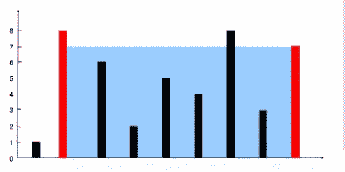

# 数据结构与算法问题:装水最多的容器

> 原文：<https://javascript.plainenglish.io/container-with-most-water-3517f51364cd?source=collection_archive---------13----------------------->

## LeetCode 问题#11 的最快解决方案:计算装水最多的容器。


Photo by [Jonathan Chng](https://unsplash.com/@jon_chng?utm_source=medium&utm_medium=referral) on [Unsplash](https://unsplash.com?utm_source=medium&utm_medium=referral)

# LeetCode #11 的最快解决方案

[](https://leetcode.com/problems/container-with-most-water/) [## 装水最多的容器

### 给你一个长度为 n 的整数数组高度，画了 n 条垂直线，使得数组的两个端点…

leetcode.com](https://leetcode.com/problems/container-with-most-water/) 

在这篇文章中，我们将看到如何计算一个容器中最多的水，并有详细的解释。

# 问题陈述

给你一个长度为`n`的整数数组`height`。有`n`画垂直线，线的两个端点是`(i, 0)`和`(i, height[i])`。

找出与 x 轴一起形成一个容器的两条线，这样容器中的水最多。

Return *一个容器可以储存的最大水量*。

**注意**不要倾斜容器。

# 例子

## 示例 1



```
**Input:** height = [1,8,6,2,5,4,8,3,7]**Output:** 49**Explanation:** The above vertical lines are represented by array [1,8,6,2,5,4,8,3,7]. In this case, the max area of water (blue section) the container can contain is 49.
```

## 示例 2

```
**Input:** height = [1,1]**Output:** 1
```

# 解决办法

# 方法 1:暴力

在这种情况下，我们将检查所有可能的垂直线对，以找到最大面积。所以这里我们将使用两个 for 循环来检查所有可能的对。

## 履行

```
/**
 * @param {number[]} height
 * @return {number}
 */
var maxArea = *function*(height) {
    var maxArea=0;
    for(let left=0;left<height.length;left++){
        for(let right=left+1;right<height.length;right++){
            let width=right-left;
            let minHeight=Math.min(height[left],height[right]);
            maxArea=Math.max(maxArea,(minHeight*width));
        }
    }
    return maxArea;
};
```

# 方法 2:双指针方法

让我们看看两个指针的方法，这里我们需要首先理解问题，然后需要检查我们可以从哪里开始指针，以及如何移动它们。

为了计算最大含水量，我们需要将宽度视为两条垂直线之间的 x 轴距离，将高度视为两条垂直线的最小高度。

现在，为了获得最大面积，我们需要最大化宽度或最大化高度，因为我们将通过乘以宽度和高度来获得最大面积。

这里我们将从最宽的容器开始，意思是左边是 0，右边是(height.length-1 ),随着我们的进展，宽度会变短，所以获得最大面积的唯一方法是，我们需要找出最大高度。

**让我们看看步骤:**

1.  我们将从最左边的竖线开始，左边和最右边的竖线，右边的两个指针。这是最宽的容器。
2.  我们计算面积，并以此作为最大蓄水量的初始值
3.  我们检查哪条垂直线是最短的，我们将相应的指针移近另一个指针——这样，即使我们使容器*变得不那么宽*，我们也有更好的机会使容器*变得更高*
4.  当左指针小于右指针时，我们重复这个过程，同时一直跟踪我们看到的最大面积。
5.  我们返回跟踪的最大值。

## 履行

**JavaScript**

```
/**
 * @param {number[]} height
 * @return {number}
 */
var maxArea = *function*(height) {
   let maxArea= 0;
   let left= 0;
   let right = height.length-1;
    // we will keep moving till we cross the right
    while(left<right){
        let width= right-left;
        let minHeight= Math.min(height[left],height[right]);
        maxArea = Math.max(maxArea,(width*minHeight));

        // the logic is we will keep going closer to the max height either from left or right
        if(height[left]<height[right]){
            left++;
        }else{
            right--;
        }
    }
    return maxArea;
};
```

## Java 语言(一种计算机语言，尤用于创建网站)

```
public class Solution {
    public int maxArea(int[] height) {
        int maxarea = 0;
        int left = 0; 
        int right = height.length - 1;
        while (left < right) {
            int width = right - left;
            maxarea = Math.max(maxarea, Math.min(height[left], height[right]) * width);
            if (height[left] <= height[right]) {
                left++;
            } else {
                right--;
            }
        }
        return maxarea;
    }
}
```

# 复杂性分析

**蛮力**

*   时间复杂度:O(n)。
*   空间复杂度:O(1)。

**两个指针接近**

*   时间复杂度:O(n)。
*   空间复杂度:O(1) *。*

*原载于 2022 年 5 月 10 日*[](https://coderfact.com/data-structures/container-with-most-water-leetcode-11-fastest-solution/)**。**

**更多内容看* [***说白了。报名参加我们的***](https://plainenglish.io/) **[***免费周报***](http://newsletter.plainenglish.io/) *。关注我们关于*[***Twitter***](https://twitter.com/inPlainEngHQ)*和*[***LinkedIn***](https://www.linkedin.com/company/inplainenglish/)*。查看我们的* [***社区不和谐***](https://discord.gg/GtDtUAvyhW) *加入我们的* [***人才集体***](https://inplainenglish.pallet.com/talent/welcome) *。****