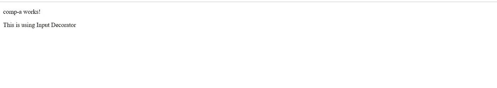
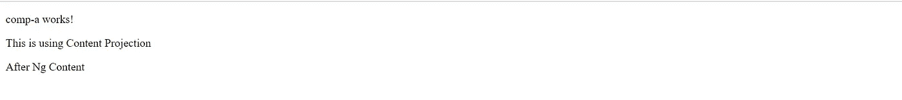

# 含 Ng 内容的角度内容投影

> 原文：<https://javascript.plainenglish.io/content-projection-in-angular-with-ng-content-b8119f3f7360?source=collection_archive---------6----------------------->


Photo by [Pim Chu](https://unsplash.com/@pimchu?utm_source=medium&utm_medium=referral) on [Unsplash](https://unsplash.com?utm_source=medium&utm_medium=referral)

在将动态内容从父节点传递到子节点时，您是否经常不得不使用不必要的输入属性，然后在属性绑定中发送一个字符串来完成需求？很艰难，对吧？这种解决方案非常简单，但它不是最佳实践，而且也有一些缺点。

今天，我们将看到如何以更好的方式实现同样的要求。

首先，如果你还没有理解上述内容，我们来看看问题陈述。

看看下面的例子:

```
export class AppComponent {passToChildren: string = 'This is using Input Decorator';}
```

在这里，在我们的 **app.component** 中，我们声明了一个字符串，然后利用它将值传递给子组件，如下所示:

```
<app-comp-a [dynamicContent]="passToChildren"></app-comp-a>
```

这里，`dynamicContent`是一个输入装饰器，然后在子组件中声明为:

```
export class CompAComponent implements OnInit {@Input() dynamicContent: string;constructor() {}ngOnInit(): void {}}
```

在 HTML 中也是如此:

```
<p>comp-a works!</p><p>{{dynamicContent}}</p>
```

我们得到的预期输出是:



Without Content Projection

很简单，对吧？

但是这种方法有一些限制:

1.从子组件的模板(HTML)中可以明显看出，我们必须在那里使用`<p>`标签。让我们假设一些其他组件使用相同的子组件，并且需要在 span 中显示不同的内容——那么这就变成了一种开销。

***这里有一点需要注意，如果你想通过输入装饰器传递完整的 HTML，那么很不幸，输入装饰器不支持它。***

2.如果我们必须传入多个字符串值，这些值需要在 HTML 上显示，那么输入属性的数量将不断增加。

上述问题的解决方案是 ***内容投射*** *，*也就是说，我们将投射或发送来自父节点的完整内容，同样可以使用 ***ng-content*** 指令在子节点中显示。

让我们看一个例子。

我们将把我们的**app.component.html**改为:

```
<app-comp-a><p>This is using Content Projection</p></app-comp-a>
```

这里，我们没有发送输入属性，而是发送了一个完整的 HTML 标记，我们需要将它显示在子组件中。

为了在子组件中显示相同的内容，我们将使用如下所示的<ng-content>指令:</ng-content>

```
<p>comp-a works!</p><ng-content></ng-content><p>After Ng Content</p>
```

ng-内容将充当占位符，其中投影内容将显示为:



上面是一个**单槽内容投影**的例子，其中我们发送了一个标签。

同样，多个 HTML 标签可以从父节点发送到子节点，并且可以被呈现。

让我们看看如何实现同样的目标。

我们已将**app.component.html**改为:

```
<app-comp-a><span id="multiSlotId">This is the new content to be projected based on id.</span><p>This is using Content Projection</p><span class="multiSlotClass">This is the new content to be projected based on class.</span></app-comp-a>
```

这里，我们添加了一个带有 id 属性的 span 和另一个带有 class 属性的 span。基本上，这些有助于确定它们需要在子组件中呈现的位置。

子组件将类似于:

```
<ng-content select="#multiSlotId"></ng-content><p>comp-a works!</p><ng-content></ng-content><p>After Ng Content</p><ng-content select=".multiSlotClass"></ng-content>
```

ng-content 与 select 属性一起使用，并将使用 CSS 选择器中使用的 name 来设置带有相关标识符的占位符。

简而言之，这就是如何在 Angular 中使用内容投影。

让我知道在回应，如果你有任何疑问或关注，或希望我在一些其他主题的权利。

关于我——我是一个编程爱好者，喜欢阅读和写作前端设计、JavaScript 和 UI/UX 相关的东西。点击[这里](https://medium.com/@avinash.dev21987)阅读我所有的文章，并让我知道你的反馈。

*更多内容看* [***说白了。报名参加我们的***](https://plainenglish.io/) **[***免费周报***](http://newsletter.plainenglish.io/) *。关注我们关于*[***Twitter***](https://twitter.com/inPlainEngHQ)*和*[***LinkedIn***](https://www.linkedin.com/company/inplainenglish/)*。查看我们的* [***社区不和谐***](https://discord.gg/GtDtUAvyhW) *，加入我们的* [***人才集体***](https://inplainenglish.pallet.com/talent/welcome) *。***