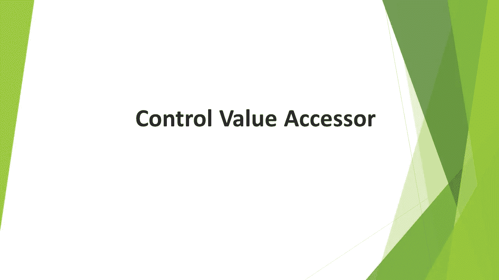
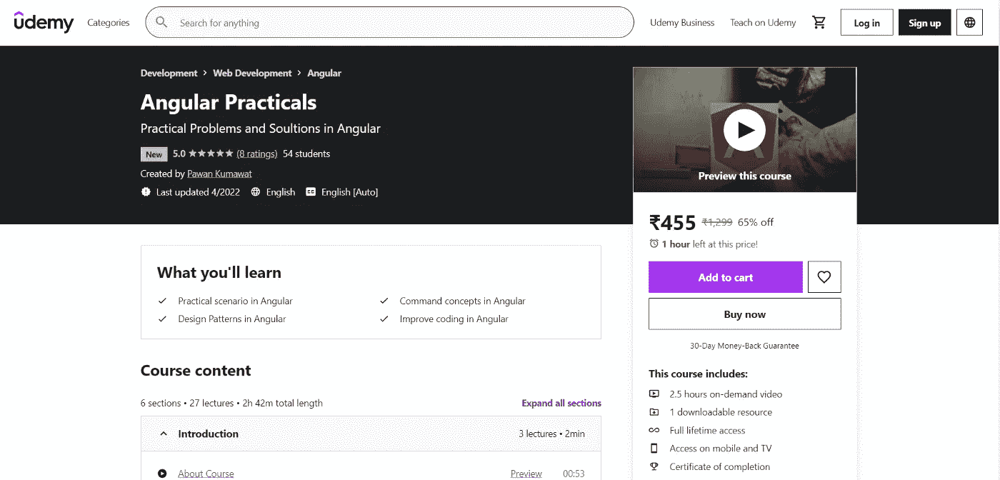

# 控制值存取器-以角度形式控制的组件

> 原文：<https://javascript.plainenglish.io/control-value-accessor-component-as-formcontrol-in-angular-251c949915a2?source=collection_archive---------10----------------------->

有时我们想使用组件作为表单控件，但是由于缺乏控件值访问器的知识，我们以一种低效的方式实现它。

Control Value Accessor

我制作了一个视频来解释这个概念。请过一遍。

我希望你学到了有用的东西。

我在 Udemy 上创建了一个 Angular 课程，涵盖了 Angular 中的许多实际问题和解决方案，包括这个。这可能是你职业生涯的垫脚石。 [***请看一看。***](https://www.udemy.com/course/angular-practicals/?couponCode=F48E50E6ECF6D99AD500)

Angular-Practicals

也可以观看/订阅我的免费 [**YouTube 频道**](https://www.youtube.com/channel/UC30-Z9Lz8DWe_Vq93dOs-Gw) **。**

请订阅/关注/喜欢/鼓掌。

*更多内容看* [***说白了就是***](https://plainenglish.io/) *。报名参加我们的* [***免费周报***](http://newsletter.plainenglish.io/) *。关注我们* [***推特***](https://twitter.com/inPlainEngHQ) *和*[***LinkedIn***](https://www.linkedin.com/company/inplainenglish/)*。加入我们的* [***社区不和谐***](https://discord.gg/GtDtUAvyhW) *。*