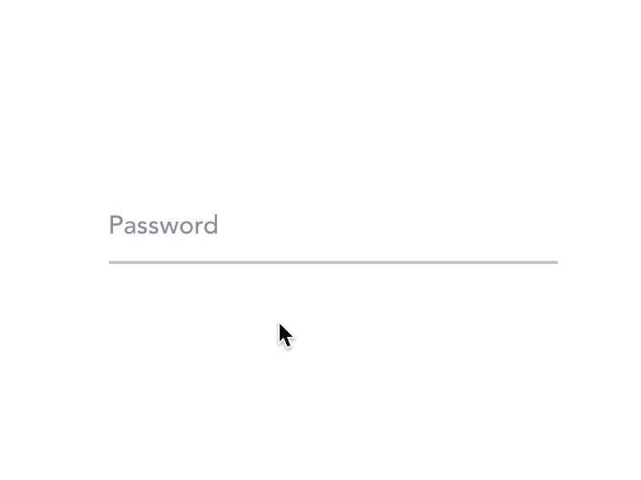

# React 中的受控和非受控组件

> 原文：<https://javascript.plainenglish.io/controlled-and-uncontrolled-components-in-react-d5ddf4158bf8?source=collection_archive---------14----------------------->

Photo by [Jakub Sisulak](https://unsplash.com/@jakub_si?utm_source=medium&utm_medium=referral) on [Unsplash](https://unsplash.com?utm_source=medium&utm_medium=referral)

如果您使用 React，您可能听说过受控组件和非受控组件。如果不是，你将会了解它们到底是什么，以及为什么一个比另一个更受欢迎。

# 受控组件

受控组件是一种反应式组件，其中组件内的数据由状态更改/控制。

让我们看一下登录组件:

在这里，我们有一个`username`和`password`作为输入字段。这些字段有一个绑定到状态变量的值属性，比如`creds.username`和`creds.password`。当用户在用户名或密码字段上输入时，输入字段的 onChange 函数被触发。

我们刚刚描述了什么是受控组件。

等等，什么？这些输入字段如何使组件成为受控组件？

让我们试着去理解什么是受控组件。

受控组件包含表单数据，如 input 和 textarea，其中的数据以 React 状态的形式维护。

嗯。那是什么意思？

这意味着，如果我们有绑定到状态变量(`creds.username`)的输入字段，当我们输入值时，状态的值会反映在输入字段中。

# 不受控制的组件

对于不受控制的组件，来自输入字段的数据存储在 dom 中，而不是由状态维护。换句话说，我们使用 ref 从 DOM 中检索值。如果我们保存任何值，我们也直接修改 DOM 来存储这些值。

让我们看看下面的例子:

在这里，我们在构造组件时创建一个 ref。在初始渲染时，创建的 ref 将被附加到输入标签上。当用户输入内容时，我们可以简单地解析`handleChange`回调中的输入值。请注意，我们没有在状态中存储值或设置输入的值。相反，我们创建一个 ref 并保存在 HTML DOM 中。任何值的变化都要经过 DOM。

Photo by [Tachina Lee](https://unsplash.com/@chne_?utm_source=medium&utm_medium=referral) on [Unsplash](https://unsplash.com?utm_source=medium&utm_medium=referral)

有人会问:使用受控组件相对于非受控组件的真正优势是什么？

受控组件的优点:

*   对状态变量的即时访问
*   由于易于访问状态变量，因此易于验证检查
*   易于测试组件，因为一切都保持在一个状态。

受控部件的缺点:

*   需要维护表单中每个输入字段的附加状态。

非受控组件的优点:

*   可以为 refs 使用更多的自定义行为(直接改变输入，onBlur 或者甚至关注 refs)
*   可以扩展或开发任何组件，而不用担心维护多种状态。
*   很容易与其他用不同语言编写的应用程序集成

不受控制的组件的缺点:

*   很难测试，因为没有真正要测试的状态。
*   与只使用反应状态相比，共享组件的状态更加困难。

每种方法都有利弊。如果你在寻找可读性更强、更容易测试的东西，那就选择受控组件。如果你想构建一些更加定制的东西，那么就使用不受控制的组件。

就是这样！当您尝试不同的方法时，请随意控制您的编码世界。

*更多内容看* [*说白了。报名参加我们的*](http://plainenglish.io/) [*免费每周简讯*](http://newsletter.plainenglish.io/) *。在我们的* [*社区*](https://discord.gg/GtDtUAvyhW) *获得独家写作机会和建议。*