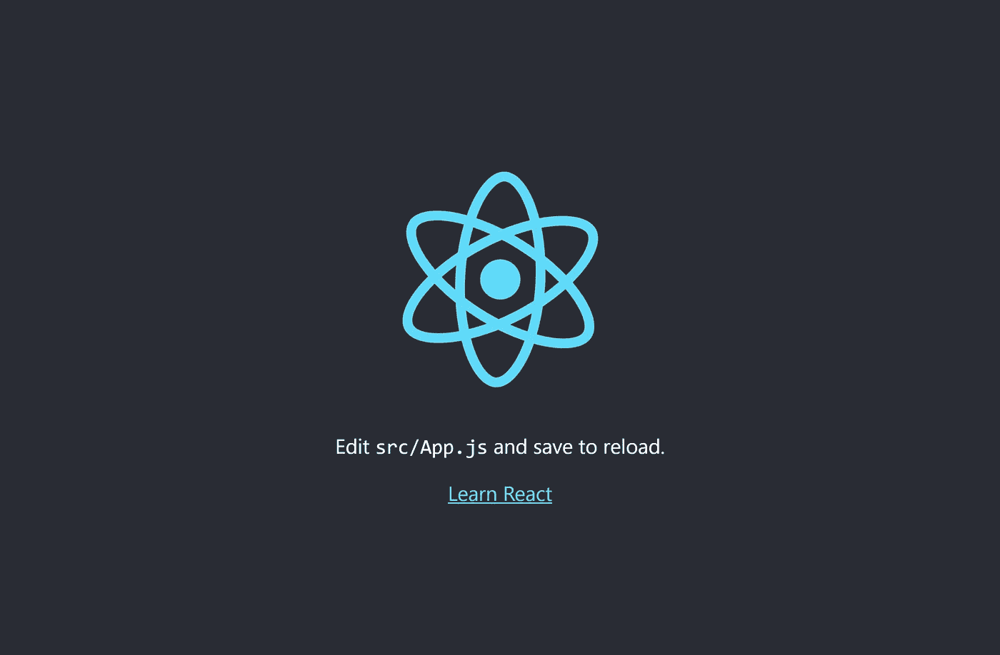
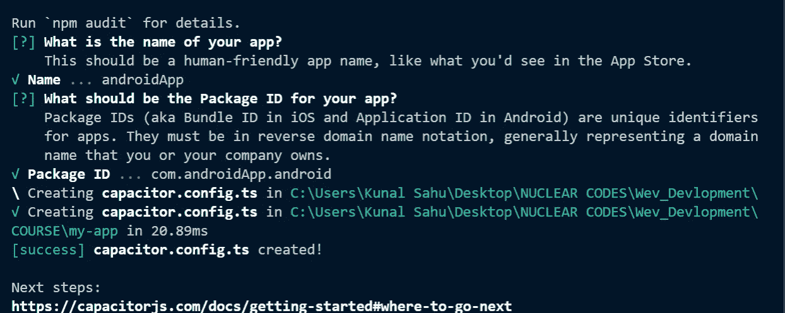
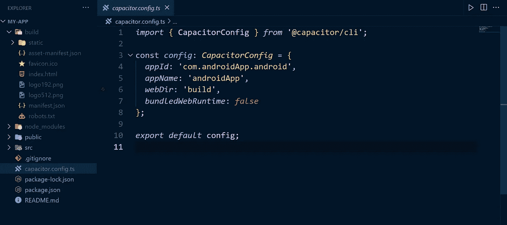
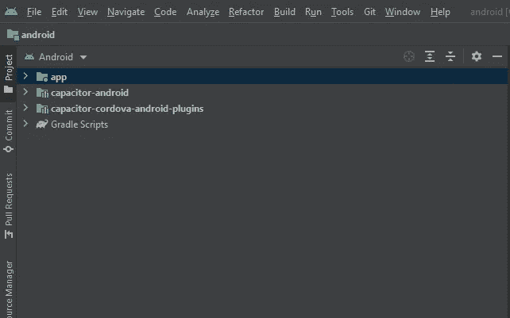
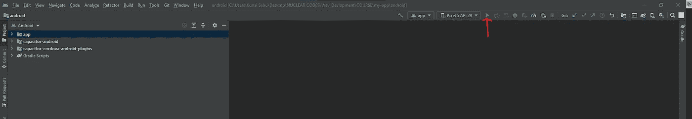
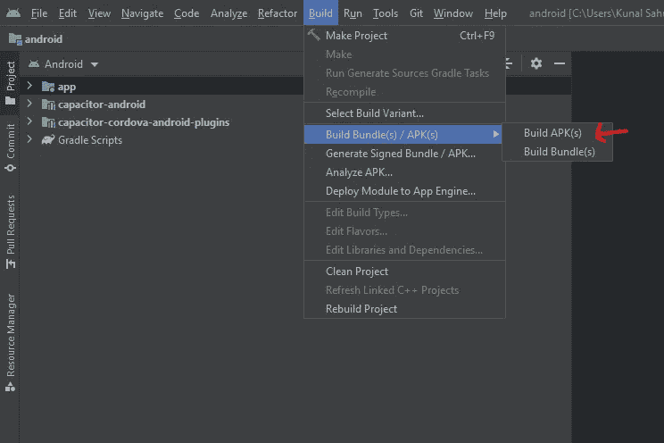
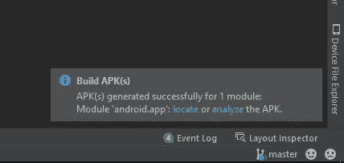
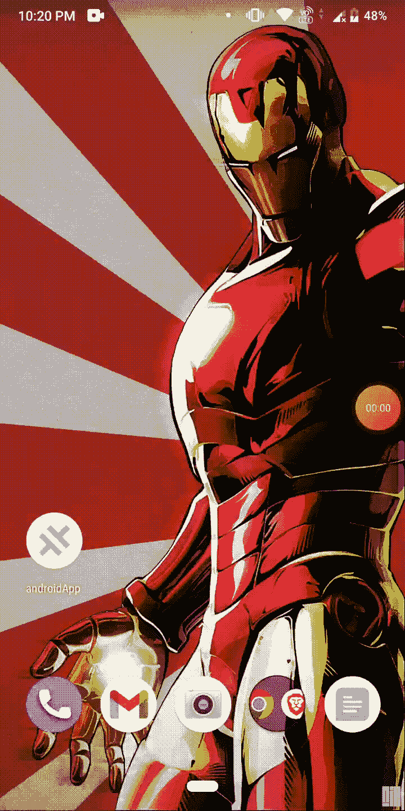
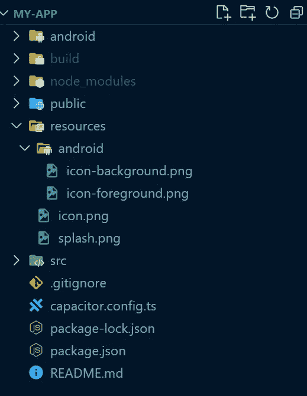
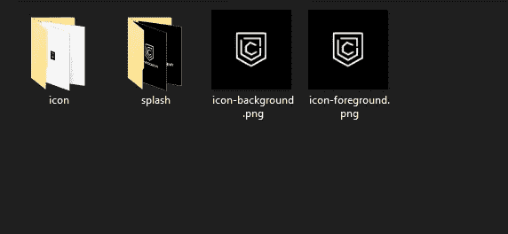

# 使用 Capacitor 将您的网站转换为 Android 应用程序

> 原文：<https://javascript.plainenglish.io/convert-your-website-into-an-android-app-using-capacitor-8d3ff7e84566?source=collection_archive---------13----------------------->

## 关于如何将网站或 web 应用程序转换为可以在 Android Play 商店上部署的 Android 应用程序的教程。


根据阿特伍德定律，“任何可以用 JavaScript 编写的应用程序，最终都会用 JavaScript 编写。”

在本文中，我们将学习如何使用 Ionic 的一个名为 Capacitor 的库，将网站或 web 应用程序转换为可以部署在 android play 商店或安装在移动设备上的 Android 应用程序。在这个演示中，我将使用 React，但是您可以使用任何其他框架，甚至是普通的旧 JavaScript。

# 先决条件

*   生产生成文件夹。大多数框架都有一个 build 命令来为您创建一个构建文件夹。如果您使用的是普通 JavaScript，请将您的所有资源和文件添加到一个文件夹中。
*   安卓工作室

# 步骤 1:创建一个 React 应用程序。

我们将首先使用以下命令创建一个 React 应用程序。如果您已经有一个现有的项目和构建文件夹，可以跳过步骤 1 和 2。

```
npx create-react-app my-app 
cd my-app
```

现在，为了运行 React 应用程序，我们使用下面的命令:

```
npm start
```

我们的演示应用程序将如下所示:



Demo App

# 步骤 2:为您的应用程序创建一个构建文件夹。

在将 React 应用程序转换为 Android 应用程序的过程中，构建文件夹至关重要。我们使用下面的命令为 React 应用程序创建一个构建文件夹。如果您正在使用另一个框架，它可能有不同的命令，所以我建议阅读您正在使用的框架的文档。如果您使用普通 JavaScript，请创建一个包含所有文件和资源的文件夹。

```
npm run build
```

# 第三步:安装电容器

要创建我们的 android 应用程序，让我们首先安装 capacitor CLI 及其核心库。

```
npm install @capacitor/cli @capacitor/core 
npx cap init
```

第一个问题是输入应用程序的名称，第二个问题是输入应用程序 com.yourAppName.android 的包 id。



Capacitor CLI

现在，在 webDir 中打开 capacitor.config.ts 文件，并输入您的构建文件夹的名称(如果它不同的话)。



capacitor.config.ts

# 步骤 4:创建您的 Android 应用程序

要创建 Android 应用程序，请确保您已经正确安装和配置了 android studio。

假设上面的一切都已设置好，运行以下命令:

```
npm install @capacitor/android 
npx cap add android
```

使用第一个命令，我们将把 Capacitor Android 库下载到我们的项目中，使用第二个命令，我们将生成 Android 代码。
现在，是时候使用以下命令打开 Android studio 了:

```
npx cap open android
```

或者，可以打开 Android Studio，将 Android 目录作为 Android Studio 项目导入。
您的应用程序需要一些时间才能打开，但一旦准备就绪，它应该看起来像这样:



Android studio

通过点击 Android studio 中的播放按钮，您现在可以运行您的 Android 应用程序。



出于某种原因，我的土豆笔记本电脑上的模拟器屏幕完全黑了。然而，如果你有和我一样的问题，创建一个 APK，然后在 Android 模拟器上运行它，比如 Noxplayer for Windows，或者在实际的 Android 设备上运行它。



点击 Build > > Build Bundle(s)/APK(s)> > Build APK(s)，生成一个可安装的调试 APK 文件。

要将应用提交到 Play Store，我们需要创建一个签名包，但现在我们将创建一个调试应用进行测试。
如果成功建造，它会在右下角显示类似的消息。



点击定位文件夹或导航至 android\app\build\outputs\apk。现在你可以在你的 Android 手机或者像 Noxplayer 这样的 Android 模拟器上运行你的应用。



Our Demo App

万岁！这在🥳🥳🥳.行得通

# 奖励部分:为你的 Android 应用程序创建一个自定义的闪屏

没有定制的闪屏和图标，一个应用程序是不完整的。如果我们想创建一个闪屏和自定义图标，我们必须先安装电容插件。

```
npm install -g cordova-res
```

`cordova-res`期望一个类似 Cordova 的结构:将一个图标和一个闪屏文件放在项目的顶层`resources`文件夹中，如下所示:

```
resources/
├── android/
	└── icon-background.png
	└── icon-foreground.png
├── icon.png
└── splash.png
```



我正在使用我工作了两个月的项目中的图标和水花。通过我的新项目，新手加密货币投资者将能够毫无风险地尝试投资加密货币。如果你有兴趣了解更多，请订阅我的时事通讯，了解关于[https://blog.webdrip.in/](https://blog.webdrip.in/)的最新消息

接下来，运行以下程序，为您的应用程序生成不同大小的图标和闪屏:

```
cordova-res android --skip-config --copy
```

该命令应该生成两个文件夹图标和一个 splash。您不需要配置任何东西，因为在这个文件夹中生成的所有资产都将被复制到您的 Android 代码文件夹中。



Folder structure of icon

现在，再次按照步骤 4 测试我们的闪屏。


# 参考

1> [电容器文件](https://capacitorjs.com/docs)


我希望这篇文章是有益的。💪🏾如果您有任何问题，请随时评论或联系我。在下一篇博客中，我们将在我们的电容器应用程序中添加推送通知功能。

如果你想支持我的工作，你可以给我买杯❤️❤️.咖啡

更多这样的见解，请查看我的博客网站 [blog.webdrip.in](http://blog.webdrip.in/)

*原载于 2022 年 6 月 9 日*[*https://dev . to*](https://dev.to/narottam04/convert-your-website-into-an-android-app-using-capacitor--5bh2)*。*

*更多内容请看*[***plain English . io***](https://plainenglish.io/)*。报名参加我们的* [***免费周报***](http://newsletter.plainenglish.io/) *。关注我们关于*[***Twitter***](https://twitter.com/inPlainEngHQ)*和*[***LinkedIn***](https://www.linkedin.com/company/inplainenglish/)*。查看我们的* [***社区不和谐***](https://discord.gg/GtDtUAvyhW) *加入我们的* [***人才集体***](https://inplainenglish.pallet.com/talent/welcome) *。*